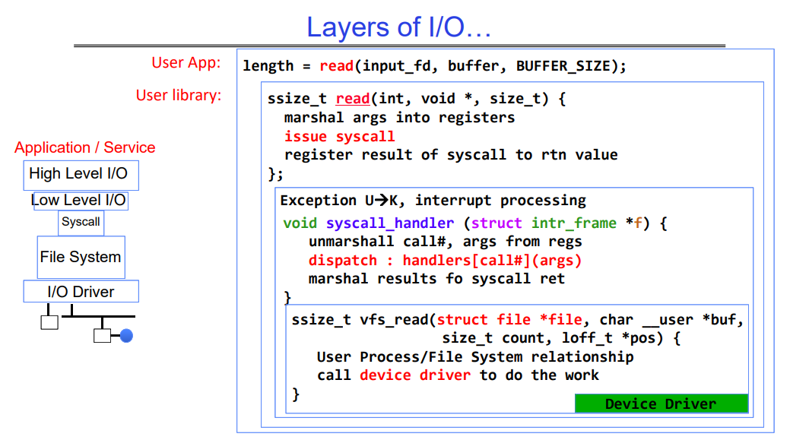
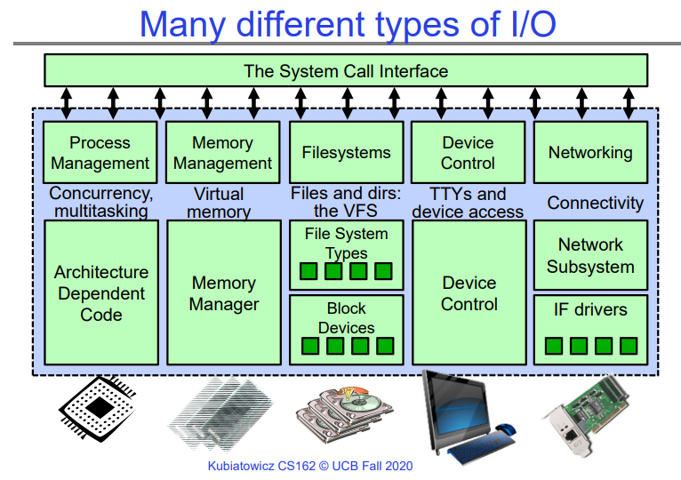
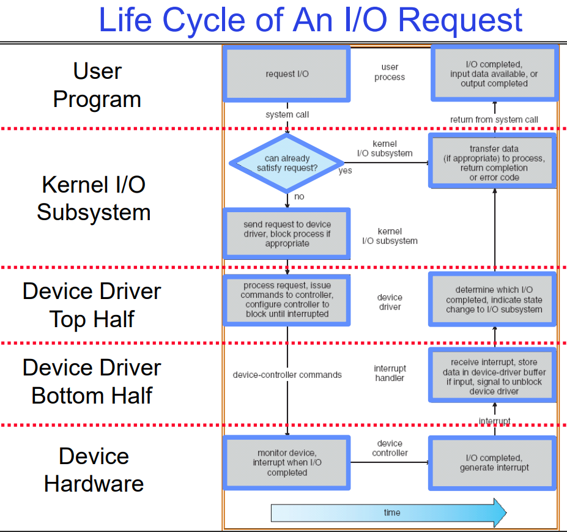

# Scheduling 1: I/O system,Concepts and Classic Policies

# I/O and Storage Layers

下图以c语言中的read函数为例，说明了操作是如何一步步的从用户态到内核态，最后通过驱动程序读取位于存储设备中的内容的。

## Internal(Kernal) OS File Description

内部数据结构描述文件的所有内容
- 它所在的位置
- 其状态
- 如何访问它

指针：`struct file *file`
- 使用文件描述符访问的所有内容都有一个这样的指针

结构体 `file_operations *f_op`：描述了此特定设备实现其操作的方式
- 对于磁盘：指向文件操作
- 对于管道：指向管道操作
- 对于套接字：指向套接字操作

从上图可知，OS有很多种类型的I/O，如CPU、内存、硬盘、键盘鼠标、网卡等类型的I/O，与这些设备的交互都可以被抽象为与一个文件的交互。

## Device Drivers

设备驱动程序：内核中与设备硬件直接交互的设备特定代码
- 支持标准的内部接口
- 同一内核I/O系统可以轻松地与不同的设备驱动程序进行交互
- 通过ioctl()系统调用支持特殊的设备特定配置

设备驱动程序通常分为两个部分：

- `Top Half`：在从系统调用的调用路径中访问
  - 实现一组标准的跨设备调用，如open()、close()、read()、write()、ioctl()、strategy()
  - 这是内核与设备驱动程序之间的接口
  - 顶层将开始向设备发出I/O，可能会将线程置于睡眠状态，直到完成
  - 正在运行的进程或线程可以一直到Top half，若I/O已经不需要发生，那么程序可以直接从Top Half返回给用户。一般来说这是因为内存中已经有这部分数据了。
- `Bottom Half`：作为中断例程运行，在Read I/O进行时，Top Half向上的部分(包括Top Half本身)的线程或进程会进入休眠状态（还有其对应的内核线程会一起休眠），此时调度器会调度别的程序运行，直到底层驱动程序读完数据后，会发出I/O中断以让上层正在休眠的进程或线程读取数据：
  - 获取输入或传输下一个输出块
  - 如果I/O现在完成，可能会唤醒睡眠的线程

## Life Cycle of An I/O Request

下图形象的说明了从用户态发起一个I/O操作，该操作经过USER->kernel->Device Driver->Device Hardware之后，再用相反的路径返回，最终用户态的buffer中被填充这个数据的整个过程，十分形象。

- 当Device Driver在I/O时，相关的等待线程（用户线程对应的内核线程都会休眠）会休眠，直到I/O完成后，硬件设备会发出一个中断消息提醒设备驱动程序I/O完成，之后就会唤醒在休眠的线程。

  > 如果采用的1对多的内核线程<->用户线程的机制，那么当某个内核线程休眠时，其对饮的所有用户线程都会休眠，因此绝大多数系统采用的都是1对1的内核线程<->用户线程机制。

- 此外，当硬件设备从设备驱动程序获取到一系列的读请求后，他会用例如电梯算法对这些读请求排序，以期望可以做最少的磁头移动，这是硬件相关的。这里简单提一下。

# Scheduling

## Recall：Scheduling

操作系统决定从队列中选择哪个任务执行的决策是调度（Scheduling）的核心内容。调度是指在任意时刻决定哪些线程或进程可以访问系统资源，以及在何时、何地、以何种方式分配这些资源的过程。

通常情况下，调度涉及到以下方面：

1. **CPU 时间调度**：最常见的调度方式是决定哪个线程或进程可以在 CPU 上执行。这种调度方式通常根据优先级、调度策略（如先来先服务、最短作业优先、轮转调度、优先级调度等）来决定。
2. **其他资源的调度**：除了 CPU 时间外，操作系统还可能需要考虑其他资源的调度，如网络带宽（Network Bandwidth）和磁盘访问（Disk Access）等。例如，操作系统可能需要决定哪个进程可以获得网络传输的带宽，或者如何管理磁盘的访问以确保公平性和效率。

## Scheduling Policy Goals/Criteria

调度策略的目标/标准通常包括以下几个方面：

**最小化响应时间**：

- 最小化完成操作（或作业）所需的时间。
- 响应时间是用户感知到的时间，如编辑器中回显按键的时间、编译程序所需的时间等。
- 对于实时任务而言，必须满足由外界设置的截止时间。
  - 比如，汽车中的OS，我们踩刹车，那么OS及时处理刹车任务就是一个实时任务。

**最大化吞吐量**：

- 最大化单位时间内完成的操作（或作业）数量。
- 吞吐量与响应时间相关，但并不完全相同。尽管最小化响应时间会增加上下文切换的次数，但只关注最大化吞吐量则可能导致响应时间增加。
- 响应时间和吞吐量在多线程、阻塞任务的场景下是两个冲突的指标，即二者总体上是此消彼长的关系。
- 最大化吞吐量有两个方面：
  - 减少开销（例如，上下文切换的次数）。
  - 高效利用资源（CPU、磁盘、内存等）。

**公平性**：

- 在某种公平的方式下分享 CPU 资源给不同的用户。
- 公平性并不意味着最小化平均响应时间。有时为了提高平均响应时间，可能会使系统变得不那么公平。

这些标准通常是调度策略设计中考虑的关键因素，不同的应用场景和系统需求可能会对这些标准产生不同的重视程度。因此，在选择和设计调度策略时，需要综合考虑这些标准，并根据实际情况进行权衡和调整。

### 响应时间和吞吐量

响应时间和吞吐量通常被认为是两个矛盾的指标，因为它们之间存在一种权衡关系：

**响应时间（Response Time）**：
- 响应时间是指完成单个任务所需的时间，或者用户感知到的操作执行时间。通常，较低的响应时间意味着系统更快地响应用户请求，用户体验更好。因此，最小化响应时间是提高系统交互性和用户满意度的重要目标。

**吞吐量（Throughput）**：
- 吞吐量是指在单位时间内完成的任务数量，或者系统处理能力的度量。较高的吞吐量表示系统能够处理更多的任务，提高了系统的效率和性能。因此，最大化吞吐量是提高系统整体效率和资源利用率的重要目标。

然而，响应时间和吞吐量之间存在一种权衡关系：
- **增加系统吞吐量可能会导致响应时间增加**：为了实现更高的吞吐量，系统可能需要更多的并发处理和资源共享，这可能会增加资源竞争和调度延迟，从而导致响应时间增加。
- **最小化响应时间可能会降低系统吞吐量**：为了提高响应时间，系统可能会采取降低并发度、增加资源分配和调度优先级等策略，这可能会降低系统的并行性和资源利用率，从而影响系统的吞吐量。

因此，设计和优化操作系统时，需要根据具体应用场景和用户需求，综合考虑响应时间和吞吐量，并在二者之间进行权衡取舍，以实现系统的最佳性能。

一般来说，操作系统的资源利用率越高，系统的吞吐量也往往越大。资源利用率指的是系统中各种资源的有效利用程度，包括 CPU、内存、磁盘等。当资源得到充分利用时，系统可以更快地处理任务，从而提高吞吐量。然而，这并不是绝对的，因为资源利用率的提高可能会导致资源竞争和调度延迟，从而影响系统的响应时间。因此，在实践中需要综合考虑资源利用率和系统的性能指标，以实现最佳的系统性能。

下面开始介绍几种OS的内核线程的调度算法。为什么是OS内核线程，因为之前讲进程的时候提到过，本质上调度做的工作是调度内核中的线程，每个内核线程有一个对应的用户态线程（大多数OS的选择）。

### 进程和线程的关系

在计算机科学中，**进程**和**线程**是操作系统中的基本概念，用于管理并发执行的任务。让我们来详细了解一下它们之间的关系和特点。

**进程**：
- 进程是资源分配的最小单位。
- 每个进程至少要执行一项任务，因此至少包含一个线程。
- 进程拥有独立的内存空间，包括代码、数据和堆栈。
- 进程之间相互隔离，不共享内存。
- 进程的切换开销较大，因为需要切换整个上下文。

**线程**：
- 线程是CPU调度的最小单位。
- 一个进程可以包含多个线程。
- 线程共享进程的内存空间，包括代码段和数据段。
- 线程之间的切换开销较小，因为它们共享相同的地址空间。
- 线程之间可以并发执行，提高了程序的效率。

总之，一个程序至少有一个进程，一个进程至少有一个线程。线程的划分尺度较小，使得多线程程序具有更高的并发性。进程在执行过程中拥有独立的内存单元，而多个线程共享内存，从而提高了程序的运行效率.

# First-Come, First-Served (FCFS) Scheduling

FCFS（First-Come, First-Served，先来先服务）又称为 FIFO（First In, First Out，先进先出）或者“运行直至完成”，是一种简单的调度算法，其特点是任务按照到达的顺序依次执行，即先到达的任务先被执行，后到达的任务则按照到达的顺序排队等待执行。

- 在早期的系统中，FCFS 意味着一个程序一直执行直到完成（包括 I/O 操作），这样的系统称为 FCFS 系统。

- 而在现代操作系统中，FCFS 通常指的是将 CPU 分配给一个线程直到该线程阻塞（例如等待 I/O 操作完成）。在此期间，CPU 不会被剥夺，即使有其他线程已经就绪。只有当当前线程阻塞时，才会将 CPU 分配给下一个处于就绪状态的线程。

## FIFO pros and cons

FIFO（First-In, First-Out）调度算法具有以下优点和缺点：

**优点**：

1. **简单易懂**：FIFO 调度算法非常简单，易于实现和理解。
2. **公平性**：任务按照到达的顺序执行，具有公平性，每个任务都有机会得到处理。

**缺点**：
1. **长任务阻塞短任务**：长任务可能会占用 CPU 较长时间，导致短任务需要等待较长时间才能得到执行。这可能会导致短任务的响应时间变长，或者称为“饥饿”现象。
2. **效率低下**：由于长任务的存在，短任务可能需要等待很长时间才能执行，导致系统的整体效率较低。
3. **不适用于实时性要求高的场景**：对于实时性要求高的任务，FIFO 调度算法无法保证其在规定时间内得到执行，可能会影响系统的实时性能。

举个例子，假设在超市购物时，每位顾客都按照到达的顺序排队结账（FIFO 调度），那么如果前面有顾客购物车装满了商品，那么后面的顾客就需要等待较长时间才能结账。尽管这种方法公平简单，但是对于购买少量商品的顾客来说，可能会感到不便，而且可能会耽误他们的时间。

# Round Robin (RR) Scheduling（轮询调度算法）

FCFS（First-Come, First-Served）调度方案对短作业可能不利：

- 这取决于作业的提交顺序。
- 在超市购物的例子中，如果你是第一个排队结账并且只买了一瓶牛奶，你可能不在乎后面有多少人排队。然而，如果有人排在你前面，购物车装满了商品，你可能需要等待很长时间才能结账。

与此相反，Round Robin（循环调度）方案采用了抢占式调度（`preemption`）。

- 在这种方案中，每个进程被分配一个小单位的 CPU 时间（时间片），通常是 10 到 100 毫秒。
- 当时间片到期时，进程被抢占，并被添加到就绪队列的末尾。
- 如果就绪队列中有 n 个进程，并且时间片为 q，则每个进程会获得 CPU 时间的 1/n，每个进程执行的时间段最多为 q 单位。因此，没有进程需要等待超过 (n-1)q 的时间单位。

## RR pros and cons

Round-Robin（循环调度）方案具有以下优点和缺点：

**优点**：
1. **适合短作业**：Round-Robin 方案更有利于短作业，因为每个作业都会在规定的时间片内得到执行，避免了长作业长时间占用 CPU 导致短作业等待的问题。这提高了系统对短作业的响应速度，使得系统更加灵活和公平。
2. **公平性**：Round-Robin 方案采用了抢占式调度，每个作业都有机会在规定的时间片内执行，从而保证了系统资源的公平分配。

**缺点**：
1. **上下文切换开销**：对于长时间运行的作业，上下文切换的开销会逐渐累积，导致系统的开销增加。由于每个作业都会在时间片结束时被抢占，并且需要保存和恢复其上下文信息，因此当作业的数量增多或时间片过短时，上下文切换的开销可能会成为系统性能的瓶颈。

综上所述，Round-Robin 方案在适用于短作业和保证公平性方面具有明显优势，但对于长时间运行的作业可能会存在上下文切换开销较大的问题。因此，在选择调度方案时，需要综合考虑系统的特点、作业的性质以及用户的需求，以达到最佳的系统性能和用户体验。

## How to Implement RR in the Kernel?

在内核中实现Round-Robin（RR）调度算法的主要步骤如下：

1. **使用 FIFO 队列**：与 FCFS 调度算法类似，首先需要使用 FIFO 队列来管理就绪队列中的进程。这样可以确保按照进程的到达顺序进行调度。

2. **时间片到期的抢占**：为了实现时间片到期时的抢占，需要利用定时器中断。内核会设置一个定时器，用来触发时间片的到期事件。当时间片到期时，内核会捕获定时器中断，并执行相应的处理程序来抢占当前正在执行的进程。

3. **将进程移动到队列末尾**：抢占发生后，内核需要将当前正在执行的进程移动到队列的末尾，以确保其他就绪进程有机会执行。这可以通过将当前进程从队列头部移动到队列尾部来实现。

4. **谨慎的同步**：在实现 RR 调度算法时，需要特别注意并发访问就绪队列的同步问题。由于多个进程可能同时访问就绪队列，因此必须确保对队列的访问是原子的，以避免竞态条件和数据一致性问题。

综上所述，实现 RR 调度算法涉及到利用定时器中断实现时间片的到期抢占，并在内核中进行就绪队列的管理和进程的调度。同时，需要特别关注并发访问的同步问题，以确保系统的稳定性和正确性。

## Round-Robin Discussion

选择时间片的大小是实现 Round-Robin（RR）调度算法时的一个重要考虑因素。以下是关于选择时间片大小的一些考虑和实际选择：

**时间片太大会怎样？**
- 如果时间片太大，会导致响应时间变长。因为长时间运行的作业可能会占用 CPU 较长时间，导致其他作业需要等待较长时间才能执行。这会降低系统对短作业的响应速度。

**时间片无限大（无穷大）会怎样？**
- 如果时间片无限大，那么就会回到 FIFO 调度方案，即一个作业一直执行直到完成。这种情况下，系统无法保证对所有作业的公平性和及时性。

**时间片太小会怎样？**
- 如果时间片太小，会导致吞吐量下降。因为频繁的上下文切换会增加系统的开销，从而降低系统的整体效率和吞吐量。

**实际选择的时间片大小**：
- 在早期 UNIX 系统中，时间片通常设置为一秒。这在 UNIX 只被一两个用户使用时效果还不错，但是如果有多个用户进行编译等长时间操作时，响应时间会变长。
- 如今，典型的时间片大小通常在 10 毫秒到 100 毫秒之间。这种选择能够平衡短作业的性能和长作业的吞吐量。
- 典型的上下文切换开销通常在 0.1 毫秒到 1 毫秒之间，因此时间片大小应该远大于上下文切换的开销，以最大限度地减少上下文切换对系统性能的影响。

综上所述，选择合适的时间片大小需要平衡短作业的性能和长作业的吞吐量，并考虑系统的实际情况和资源利用率。通常情况下，时间片大小在 10 毫秒到 100 毫秒之间是一个合理的选择。

## Handling Differences in Importance: Strict Priority Scheduling

执行计划通常包括以下几个方面：

1. **始终执行最高优先级的可运行作业**：
   - 系统会始终优先执行具有最高优先级的可运行作业，直至完成为止。这确保了高优先级任务能够及时得到执行，提高了系统对紧急任务的响应速度。
   - 如果有高优先级任务出现，且系统当前在执行低优先级任务，原则上系统会马上放弃低优先级任务的执行，转而去执行高优先级任务。
   
2. **每个队列采用 RR 调度**：
   - 每个优先级队列内的作业通常采用 Round-Robin（RR）调度算法，以确保每个队列中的作业都有机会得到执行。每个队列的作业都会被分配一定的时间片，以平衡短作业的响应时间和长作业的吞吐量。

在执行计划中可能会遇到以下问题：

1. **饥饿（Starvation）**：
   - 低优先级的作业可能因为高优先级作业的持续执行而得不到运行的机会。这会导致低优先级作业长时间等待，无法及时得到处理。

2. **死锁（Deadlock）：优先级反转**：
   - 当一个低优先级的任务持有一个高优先级任务所需的锁时，可能会发生优先级反转的死锁情况。通常情况下，第三个中间优先级的任务会阻止高优先级任务执行，从而导致死锁。
   - 这里可以通过**优先级捐赠**策略解决问题：当低优先级任务正在运行且持有锁，而突然出现的高优先级任务需要这个锁，此时终止该低优先级任务会发生死锁的问题，因此我们可以动态的将低优先级任务的优先级调至最高，待其执行完毕并释放锁后，再让新的高优先级任务执行。

解决这些问题的方法包括：

- **动态优先级调整**：根据任务的交互性、锁定情况、突发行为等启发式调整任务的基本优先级。通过动态调整优先级，可以更好地平衡系统的响应速度和资源利用率，减少饥饿和死锁的发生。

### Scheduling Fairness

公平性是一个重要考虑因素：
- 严格的固定优先级调度队列之间的调度是不公平的（按优先级依次运行最高的，然后是下一个，以此类推）：
  - 长时间运行的作业可能永远得不到CPU资源。
  - 有一个关于 Multics 的都市传说，说是在关闭机器后，发现了一个运行了10年的作业。尽管这可能并不是真的...
- 即使有更短的作业要运行，也必须给长时间运行的作业分配一部分CPU资源。
- 折衷之处在于，通过牺牲平均响应时间来获得公平性！

如何实现公平性？
- 可以给每个队列分配一定比例的CPU资源
  - 如果有一个长时间运行的作业和100个短时间运行的作业怎么办？
  - 就像超市里的快速通道一样——有时候快速通道排得太长，选择其他通道反而会得到更好的服务。
- 可以提高没有得到服务的作业的优先级
  - 这是一些UNIX变种中采取的做法。
  - 这种做法是临时的——应该增加多少速率来提高优先级？
  - 当系统过载时，没有作业会获得CPU时间，因此每个作业的优先级都会提高，导致交互式作业遭受损失。

# Shortest Job First &  Shortest Remaining Time First

我们能否始终采用最佳的先来先服务（FCFS）呢？如果我们预先知道了每个作业期望的运行时间：

最短作业优先（SJF）：

- 运行具有最少计算量的作业
- 有时称为“最短完成时间优先”（STCF）

最短剩余时间优先（SRTF）-仅在进程不断到达期间有效，进程都到达后它会退化为SJF：

- SJF的**抢占式**版本：如果作业**到达**并且其完成时间比当前正在运行作业的剩余完成时间短，则立即抢占CPU。
- 有时称为“最短剩余时间到完成时间优先”（SRTCF）
- 注意，这里说的是到达时会执行抢占版本，当所有进程都到达后，那么算法将会退化为SJF。

这些方法可以应用于整个程序或当前的CPU时间片

- 思想是将短作业尽快移出系统
- 对短作业有很大影响，对长作业影响较小
- 结果是更好的平均响应时间

## Discussion

SJF/SRTF 是最大限度减小平均响应时间的最佳方法
- 可证明的最优解（SJF在非抢占式中，SRTF在抢占式中）
- 由于SRTF总是至少与SJF一样好，因此重点放在SRTF上

对比SRTF与FCFS

- 如果所有作业的长度都相同会怎样？
  - SRTF变成与FCFS相同（即如果所有作业长度相同，则FCFS是最好的，因为时间都一样，那么无论优先运行哪个作业都是无所谓的）
- 如果作业长度不同会怎样？
  - SRTF：短作业不会被长作业所阻塞

## SRTF Further discussion

饥饿
- 如果有很多小作业，SRTF可能会导致饥饿现象！
- 大作业永远无法运行

一定程度上需要预测未来

- 我们如何做到这一点？
- 一些系统会询问用户
  - 当您提交作业时，必须说明需要多长时间
  - 为防止作弊，系统会在超时时终止作业
- 但是：即使对于非恶意用户，也很难预测作业的运行时间

实际上，我们无法确切知道作业需要多长时间

- 但是，可以将SRTF用作衡量其他策略的标准
- 这是最佳策略，因此无法找到更好的选择

SRTF的优缺点

- 最佳（平均响应时间）(+)
- 难以预测未来(-)
- 不公平(-)

## Predicting the Length of the Next CPU Burst

自适应：基于过去行为改变策略
- CPU调度、虚拟内存、文件系统等
- 这有效是因为程序有可预测的行为
  - 如果程序过去是I/O密集型，未来也可能是
  - 如果计算机行为是随机的，那就没用了

例如：估计爆炸长度的SRTF
- 使用先前爆炸的估算函数：
  让t_n-1, t_n-2, t_n-3等表示以前的CPU爆炸长度。
  估算下一个爆炸 τ_n = f(t_n-1, t_n-2, t_n-3, …)
- 函数f可以是许多不同的时间序列估算方案（卡尔曼滤波器等）

# Lottery Scheduling（抽签调度）

另一种选择：抽奖调度
- 给每个作业一定数量的抽奖票
- 在每个时间片上，随机选择一个中奖票
- 平均而言，CPU时间与每个作业获得的抽奖票数量成比例

如何分配抽奖票？

- 为了近似SRTF，短执行时间的作业获得更多票，长执行时间的作业获得较少票
- 为了避免饥饿，每个作业至少获得一张票（每个人都有进展）

相对于严格的优先级调度的优势：在负载变化时表现得更加优雅

- 添加或删除作业会按比例影响所有作业，与每个作业拥有的票数无关

# Conclusion

循环轮询调度（round-robin）：
- 当执行时，为每个线程分配少量的CPU时间；在所有准备就绪的线程之间循环。
- 优点：适合短任务。

最短作业优先（SJF）/最短剩余时间优先（SRTF）：
- 运行需要执行最少计算量/最少剩余计算量的任务。
- 优点：最优（平均响应时间）。
- 缺点：难以预测未来，不公平，长作业可能会饿死。

多级反馈调度（下节课讲）：
- 使用不同优先级和调度算法的多个队列。
- 自动提升/降低进程优先级以近似SJF/SRTF。

抽签调度：
- 为每个线程分配依赖于优先级的令牌数量（短任务意味着更多令牌）.
- 因为我们目的是近似SJF/SRTF

