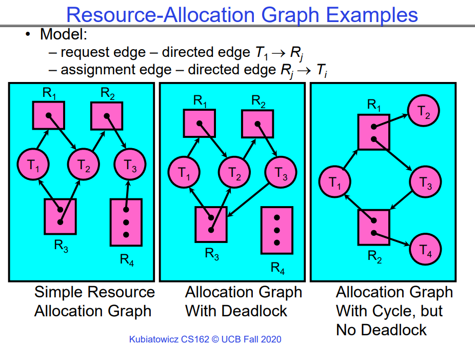
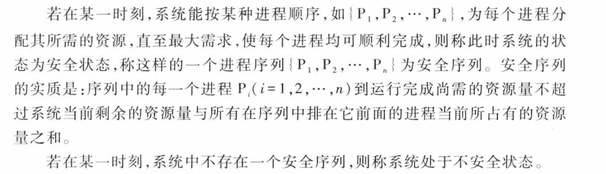
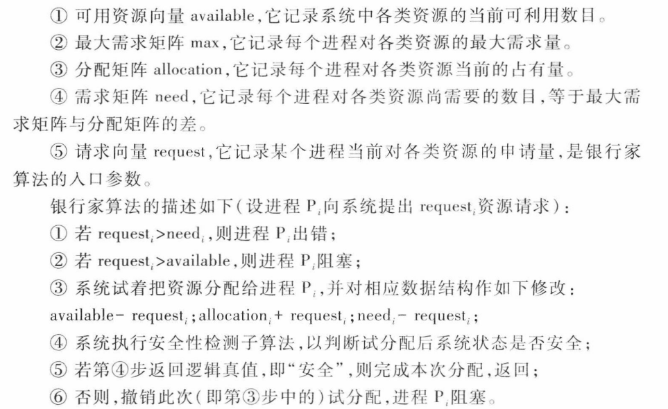
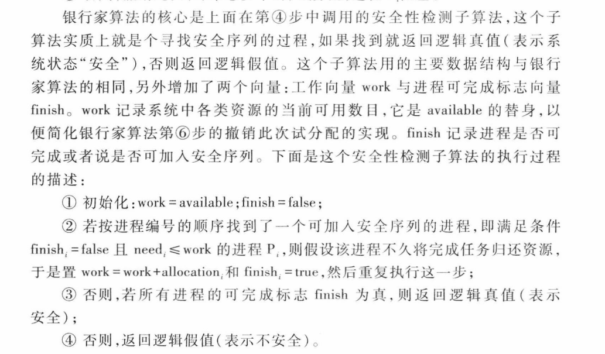

# Lecture 12 Scheduling 3: Deadlock

# Recall

这部分回忆了一下，Real-Time Scheduling实时调度需要的是可预测性和必须在ddl之前完成，吞吐量和响应时间并不是优先考虑的。

之后从高层面讲了一下Linux系统现在采用的CFS调度算法（Completeness Fairness Scheduling），核心思想保证每个**线程**都得到**大致相同的CPU Quantum**（可以认为是虚拟运行时间 ）数量，采用红黑树管理当前的调度队列，在队列首的一定是当前得到CPU Quantum数量最少的。O(1)调度器中所有复杂的启发式规则都被这个虚拟调度时间的思想所取代，太妙了。

注意这里我们用了CPU Quantum数量这个概念，每个CPU Quantum代表了一定长度的执行时间，至于为什么没有用具体时间，下面讲到比例份额的时候就明白了，在此基础上，加入了以下机制，从而形成了了CFS算法：

1. 并在此基础上添加机制（RR调度、规定最小时间片），从而在一定程度上兼顾了响应时间和吞吐量，因为频繁的上下文切换会导致吞吐量降低。
   - 比如说，我们设定Target Latency=20ms，一共有4个线程，那么在没有权重的情况下，20ms的CPU时间会平均分给4个线程，即每个线程的CPU Quantum都是4ms。
2. 在上述基础上加入了优先级的支持，高优先级的线程会得到更多的执行机会，但每次执行的时间会少；低优先级的线程的执行机会较少，但是每次的执行时间较长。因此线程之间的总CPU Quantum数量总是相同的。

到此，CFS算法的虚拟运行时间=物理运行时间，之后，我们加入了权重思想，那么虚拟运行时间代表的实际物理运行时间就不同了，权重高的线程，一个Vruntime Quantum意味着更多物理执行时间，权重低的线程，一个Vrumtime quantum意味着更少的物理执行时间：

1. 支持按照比例分配CPU时间，在上面的描述中，我们认为每个线程得到的CPU Quantum数量都是相同的，这时我们重用nice值为每个线程分配权重（nice值越高，得到的权重越低），之后根据每个线程的权重值的比例，为其分配CPU Quantum值，即每次执行实际上会执行多少时间。
2. CFS的核心调度思想仍然是让每个线程可以得到大致相同的CPU Quantum-虚拟运行时间单位，但是实际上优先级高的线程会得到更多的实际运行时间。

# Deadlock: A Deadly type of Starvation

这段内容讨论了两种多线程编程中常见的问题：

1. **饥饿（Starvation）**：当一个线程无限期地等待资源时发生。例如，低优先级的线程可能一直等待资源，但这些资源一直被高优先级线程占用。饥饿可能会导致低优先级线程无法获得所需的资源，从而无法执行，但高优先级线程可以继续执行。

2. **死锁（Deadlock）**：当线程之间循环等待资源时发生。例如，线程A拥有资源1并等待资源2，而线程B拥有资源2并等待资源1。这种情况下，两个线程都无法继续执行，因为它们都在等待对方释放资源。死锁是一种更严重的问题，因为它会导致所有涉及的线程都无法继续执行。

关于这两种问题的关系：

- **死锁可能导致饥饿，但饥饿不一定导致死锁**：死锁情况下，线程可能永远无法获得所需资源，从而导致饥饿。但即使没有死锁，低优先级线程也可能由于资源被高优先级线程占用而处于饥饿状态。换句话说，死锁是饥饿的一种可能原因，但饥饿不一定与死锁有关。
  
- **饥饿可能会结束，但死锁不会自动结束**：饥饿状态可能会在某一时刻结束，例如当高优先级线程释放资源时，低优先级线程可以获得资源并继续执行。但死锁情况下，线程之间形成的循环等待是无法自行解决的，需要外部干预来打破死锁。

## Four requirements for occurrence of DeadLock

这段内容描述了死锁发生的**必要**条件，即死锁的四个条件：

1. **互斥（Mutual Exclusion）**：每个资源只能被一个线程占用，如果资源被一个线程占用，其他线程就无法同时访问该资源。

2. **持有和等待（Hold and Wait）**：线程在持有至少一个资源的情况下等待获取其他线程持有的资源。这意味着即使线程已经持有一些资源，但仍然在等待获取其他资源。

3. **非抢占（No Preemption）**：线程只能在自愿放弃资源后才能释放资源，其他线程无法强制剥夺线程所持有的资源。

4. **循环等待（Circular Wait）**：存在一个线程集合{T1, …, Tn}，其中T1正在等待由T2持有的资源，T2正在等待由T3持有的资源，依此类推，直到Tn正在等待由T1持有的资源，形成一个闭环。

注意这只是必要条件，具有这些条件的执行集合不一定存在死锁，但是存在死锁的执行集合一定有这些条件。



如上图所示，第三个图中存在环，但是没有死锁，最多是饥饿，因为只要T2或T4运行完毕并释放资源，那么程序就可以执行完毕。

# How should a system deal with deadlock

有四种处理死锁问题的不同方法以及现代操作系统对待死锁问题的方式：

1. **死锁预防（Deadlock Prevention）**：通过编写代码的方式，确保系统不容易陷入死锁状态。这可以通过避免死锁条件的发生来实现，例如避免循环等待或者限制资源的持有和等待。从根源上避免。

2. **死锁恢复（Deadlock Recovery）**：允许死锁发生，然后尝试从死锁中恢复。这可能涉及到终止一些死锁的线程或者回滚一些操作，以解除死锁状态。

3. **死锁避免（Deadlock Avoidance）**：通过动态地延迟资源请求来避免死锁的发生。系统会在分配资源时考虑当前的系统状态以及未来的资源请求，以确保不会出现死锁。原则上可能发生死锁，但是我们通过资源的合理分配来避免死锁。

4. **死锁否认（Deadlock Denial）**：忽视死锁的可能性，假设死锁永远不会发生。这种方法可能会导致系统出现死锁，但在某些情况下，可以通过重新启动系统或者其他手段来解决死锁问题。

在现代操作系统中，通常采取以下方法处理死锁问题：

- 确保系统不会陷入任何死锁状态。
- 在应用程序中忽视死锁问题，也就是采用“鸵鸟算法”，即将头埋进沙子里，不去面对死锁问题。这种方法可能会使得系统在出现死锁时表现得更加稳定，但也可能导致死锁发生时系统无法自动恢复。
- 即现代OS设计可以确保系统部分不会发生死锁，但是有时候用户会写出具有死锁的代码，这是没办法的。现代OS多采用的是死锁否认和鸵鸟算法。

## Techniques for Preventing Deadlock

本质上是破坏了死锁发生的任意一个必要条件：

1. **无限资源（Infinite Resources）**：包含足够多的资源，以确保系统中的线程永远不会因为资源不足而发生死锁。这种方法并不需要真正的无限资源，只需要足够大的资源量。例如，使用虚拟内存技术可以给出无限的内存空间的假象。

2. **资源不共享（No Sharing of Resources）**：使每个线程都拥有独立的资源，不需要与其他线程共享资源。这种方法在实际应用中并不太现实，因为大多数情况下，线程需要共享资源才能完成任务。

3. **不允许等待（Don't Allow Waiting）**：通过不允许线程等待资源的方式来避免死锁。例如，电话公司避免死锁的方法是，如果呼叫被阻塞，会立即收到忙音。在以太网和某些多处理器网络中，当发生冲突时，所有的节点都会尝试重新发送信息，避免了等待和死锁的发生。然而，这种方法效率低下，因为需要不断地重试。

这些方法有时候可能会在特定的环境中有所作用，但并不是普遍适用的解决方案。例如，在现实世界中，即使给出足够多的资源，也会因为资源分配不合理而导致效率低下。

下面列举出一些相对于上面的方案、可行性较高的预防死锁的技术：

1. **一开始就请求所有需要的资源**：让所有线程在开始时一次性请求它们可能需要的所有资源。但是这种方法存在一个问题，就是很难准确预测未来所需的资源，可能会导致过度估计资源的使用（即在一定程度上降低并发性）。
   - 例如，如果一个线程需要使用两根筷子，那么它可以一次性请求这两根筷子，而不是分两次请求。或者，在驾车出行时，可以在确认没有其他车辆通过交叉路口时才离开家，以避免交通拥堵。

2. **强制所有线程按照特定顺序请求资源**：通过约束所有线程按照特定顺序请求资源，从而防止资源的循环使用，进而防止死锁的发生。
   - 例如，可以规定所有线程必须按照请求磁盘资源、然后请求内存资源等的顺序进行请求。又如，在旧金山周围的高速公路上，可以规定所有车辆必须顺时针行驶，以防止发生死锁。


## Techniques for Recovering from Deadlock

那么我们发生死锁之后，应该如何从死锁中恢复呢？

1. **终止线程，强制释放资源**：通过终止引发死锁的线程来解决死锁。
   - 例如，在桥梁的例子中，如果发生了死锁，可以让“哥斯拉”将一辆车抛入河中，从而解决了死锁。但是，这种方法并不总是可行的，因为终止持有互斥锁的线程可能会导致系统状态不一致。

2. **抢占资源而不终止线程**：暂时性地从线程中抢占资源，而不是立即终止线程。这种方法可能会与计算语义不符，因为可能会打断线程正在进行的计算过程。

3. **回滚死锁线程的操作**：通过回滚死锁线程的操作来解决死锁。
   - 例如，在桥梁的例子中，可以让一辆车倒车，以便其他车辆通过，然后重新安排它们的行进顺序。
   - 这种方法在数据库中很常见，用于回滚事务的操作。然而，如果以完全相同的方式重新启动，可能会再次陷入死锁状态。


许多操作系统使用的其他选项来处理死锁，具体选择取决于系统的需求和实现。

### Another view of virtual memory: Pre-empting Resources

在具有虚拟内存的情况下，我们拥有了“无限”空间，因此所有操作都会成功，这样上面的例子就不会发生死锁。

- 虽然实际上虚拟内存并不是无限的，但绝对比起只有2MB的物理内存要大得多！

另一种观点是：当将内存页面调出到磁盘时，我们正在“抢占”内存，并在将页面调入内存时将其归还。这将是下节课中讨论的内存部分：

- 这种方法的原理在于，当内存页面被调出到磁盘时，线程无法使用它，因此不会导致死锁。
- 联想一下上节课的调度：当线程发生I/O操作时，会释放持有资源并睡眠。

## Techniques for Deadlock Avoidance：Banker’s Algorithm for Avoiding Deadlock

Dijkstra在1965年提出的银行家算法是著名的死锁避免算法，这个用于一个银行家给多个顾客贷款的算法可以直接用于操作系统给进程分配资源，这时只要把银行家换成操作系统，把顾客换成进程，把资金换成资源，把银行家决定是否放贷时所用的判断过程（即判断顾客是否有信誉和偿还能力）换成操作系统决定是否分配资源时所用的判断过程（即判断进程是否能及时归还资源）即可。

银行家算法是一种用于避免死锁的资源分配算法，最初由 Edsger Dijkstra 提出。它的基本思想是在分配资源之前，通过检查分配资源后是否存在安全序列来确保系统不会进入死锁状态。

以下是银行家算法的基本原理：

1. **系统状态**：
   - 系统中有一定数量的资源，包括各种类型的资源（例如，内存、CPU时间等）。
   - 对于每种资源，系统都有一个最大可用量，以及当前已分配给进程和尚未分配的数量。

2. **进程请求资源**：
   - 当进程请求资源时，系统会检查是否有足够的资源可用。
   - 如果有足够的资源可用，并且分配给进程后系统仍然处于安全状态，则分配资源给进程；否则，进程必须等待。

3. **安全性检查**：
   - 在分配资源之前，系统会**模拟分配资源**，并检查系统是否仍然能够找到一个安全序列。
   - 安全序列是指一系列进程的执行顺序，使得每个进程在执行期间都不会导致系统进入死锁状态。
   - 如果找不到安全序列，则拒绝分配资源，直到系统重新处于安全状态。

4. **资源释放**：
   - 当进程完成任务并释放其所持有的资源时，系统将这些资源重新分配给其他进程。

银行家算法通过动态地分配资源，以确保系统在分配资源的同时能够避免死锁。它要求系统在每次资源请求之前都进行安全性检查，以确保分配资源后系统仍然处于安全状态。这种方法能够有效地管理资源，提高系统的资源利用率，并确保系统的稳定性。

### StrawMan:dumb method

StrawMan：当一个线程请求资源，OS会检查这次申请是否会导致死锁：

- 若不会，则马上授予资源。
- 若会，等待其他线程授予资源。

很明显这种方法是不可行的，考虑之前我们谈到的：

```pseudocode
Thread A{
	AcquireX
	AcquireY
}
Thread B{
	AcquireY
	AcquireX
}
```

这种情况下，当A获得了X，B获得了Y后，再一次的申请OS才能发现死锁，但是这种情况下系统已经处于一个死锁的状态，已经无解了，很明显这种方法没用。

### DeadLock Avoidance:Three States

因此，为了能够预见死锁，从而将任何会发生死锁的路径扼杀于起源之处，我们规定了三种状态：

1. **安全状态（Safe State）**：系统可以延迟资源分配，以防止死锁的发生。在安全状态下，系统可以根据资源请求的情况动态地分配资源，确保不会发生死锁。

2. **不安全状态（Unsafe State）**：尚未发生死锁，但线程的资源请求模式可能会不可避免地导致死锁的发生。在不安全状态下，系统可能处于潜在的死锁风险中。
   - 比如，strawman中，A先获取X，那么B尝试获取Y的行为会导致系统处于Unsate 状态。

3. **死锁状态（Deadlocked State）**：系统中存在死锁。在死锁状态下，多个线程之间存在循环等待资源的情况，导致系统无法继续执行。死锁状态也被认为是不安全(Unsafe State)的，因为系统无法继续正常运行。

基于此，我们对strawman进行修改：OS会判断分配操作是否会使得执行进入unsate state状态，如果不会，则执行分配操作，否则不作为。

### 安全序列



- 系统在某一时刻的安全状态可能不唯一，但这不影响对系统安全性的判断。
- 安全状态是非死锁状态，而不安全状态并不一定是死锁状态。即系统处于安全状态一定可以避免死锁，而系统处于不安全状态则仅仅可能进入死锁状态。

### 银行家算法

银行家算法的实质就是要设法保证系统动态分配资源后总是处于`Saft State`，以避免可能产生的死锁。即每当进程提出资源请求且系统的资源能够满足该请求时，系统将判断满足此次资源请求后系统状态是否安全，如果判断结果为安全，则给该进程分配资源，否则不分配资源，申请资源的进程将阻塞。

> 本质上是预分配资源，尝试每种资源是否会阻塞。

下图是银行家算法的主要流程：



上图中的第④步提到了一个安全性检测子算法，下面我们描述一下这个算法的流程：



需要注意的是，银行家算法并不能解决所有问题，如果某个程序获得资源后一直在无限循环，那么还是会死锁。

# Summary

避免死锁的四个条件：
   - 互斥
   - 持有并等待
   - 无法抢占
   - 循环等待

解决死锁的技术：

   - 死锁预防：编写代码时避免死锁的发生，从根源上避免死锁发生，破坏死锁的4个必要条件之一即可。
   - 死锁恢复：允许死锁发生，然后想办法从中恢复；比如直接杀死导致死锁的线程、或者采用类似于数据库的rollback操作。
   - 死锁避免：动态延迟资源请求，以防止死锁的发生，银行家算法提供了一种算法化的方法来实现这一点。
   - 死锁否认：忽略死锁的可能性，大多数OS使用的这种方法，不关心应用程序是否会发生死锁。
