# Memory 2: Virtual Memory (Con’t), Caching and TLBs

## OS何时触发Address Translation

操作系统和硬件协同工作，确保每次程序尝试访问内存时都会进行地址转换。地址转换不仅仅在加载（Load）和存储（Store）指令时发生，还涉及到任何需要访问内存的操作。这些包括：

1. **Load操作**：当程序读取内存中的数据时。
2. **Store操作**：当程序向内存写入数据时。
3. **指令取址**：当CPU从内存中读取下一条要执行的指令时。
4. **堆栈操作**：比如函数调用、返回、push和pop指令等堆栈操作。
5. **内存映射I/O**：某些I/O操作可能通过内存映射到特定的地址，这些地址也会经过地址转换。
6. **上下文切换时的页表更改**：当操作系统切换到另一个进程时，也涉及到页表的更改，这需要对新进程的地址空间进行地址转换。

在现代操作系统中，几乎所有的内存访问都需要通过MMU（内存管理单元）进行地址转换，这确保了虚拟内存系统的一致性和安全性。MMU是硬件级别的支持，它自动进行虚拟地址到物理地址的转换，无需操作系统的直接介入，从而保证了这一过程的高效性。

## What about Sharing?

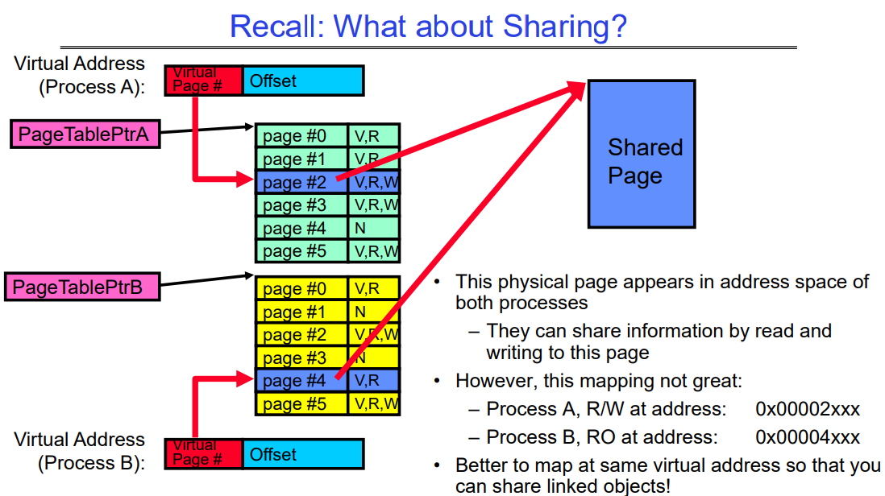

这张图解释了两个不同进程（进程A和进程B）是如何通过页表共享同一个物理页的。每个进程都有自己的虚拟地址空间，它们通过页表条目（PTE）映射到物理内存中的页。共享的物理页出现在两个进程的地址空间中，但是它们可能在不同的虚拟地址上映射这个共享页。

在这个例子中：

- **进程A** 有一个指向共享物理页的PTE，该页在其虚拟地址 `0x00002xxx` 上有读写权限（R/W）。
- **进程B** 也有一个指向同一个物理页的PTE，但是在不同的虚拟地址 `0x00004xxx` 上，它只有读权限（R/O）。

这张图中还指出，这种映射方法可能并不是最佳的。文中提到：“**Better to map at same virtual address so that you can share linked objects**”，**意味着如果两个进程能将共享的物理页映射到各自地址空间中的同一个虚拟地址，这样的映射可以让不同的进程共享相同的linked obj对象**。

共享库的共享本质在于它的指令或代码段，这部分是只读的，并且被映射到每个使用它的进程的虚拟地址空间内。这就是为什么多个进程可以同时访问相同的物理内存页，但它们的执行状态和结果却保持独立。

每个进程在自己的堆栈和数据段中维护执行状态和结果。这些部分不是共享的，确保了即使它们运行相同的代码，进程间也不会相互干扰。

而虚拟地址（VA）的相同性确实依赖于系统是否启用了地址空间布局随机化（ASLR）。如果启用了ASLR，同一个共享库可能会被加载到进程地址空间中的不同虚拟地址，提高了安全性，但可能需要额外的重定位操作。如果没有启用ASLR，共享库更可能在所有进程中映射到相同的虚拟地址，简化了内存管理。

### 如果映射到不同进程的相同VA

当一个共享库在不同进程的相同虚拟地址（VA）被加载时，多个进程可以共享同一个页表条目（PTE），前提是这些进程的页表条目指向相同的物理内存页。

这是怎样工作的：

- **共享只读数据**：共享库通常包含的代码段（text section）是只读的，这意味着不同的进程可以安全地共享同一物理内存页，因为它们不会尝试修改它。
  
- **页表的共享条目**：当库被加载到相同的虚拟地址时，每个进程的页表中对应的条目（PTEs）可以设置为指向相同的物理页（页框号或PFN）。这样，不需要为每个进程创建单独的物理页，减少了内存的使用和页表条目的数量。
  
- **引用计数**：操作系统通常对这些共享的物理页实行引用计数，以追踪有多少进程正在使用它们。当一个进程结束或者不再需要库时，它的页表条目会被更新，而物理页的引用计数会减少。只有当最后一个引用被移除时，物理页才会被回收。

例如，如果进程A和进程B都加载了相同的共享库到虚拟地址`0x400000`，它们的页表将包含指向同一物理内存页的条目，操作系统确保这一物理页只被加载一次，然后被两个进程共享。

如果启用了ASLR，情况会稍有不同。每个进程可能会将库加载到不同的虚拟地址。即使如此，操作系统和CPU仍然可以共享相同的物理内存页，只是每个进程的页表现在包含不同的虚拟地址映射到同一物理地址。这时，页表条目（PTEs）不再是共享的，但物理页仍然是共享的。这种方式涉及到更多的内存管理工作，因为必须维护更多的页表条目，但这提高了系统的安全性。

## Recall: Some simple security measures

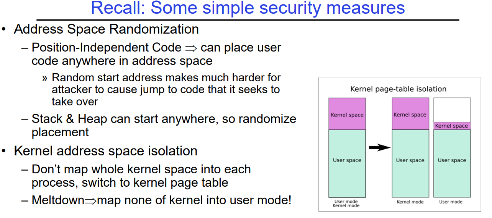

这幅图是关于计算机安全的一些基本措施的。特别是，它讨论了两种安全技术：地址空间随机化（ASR）和内核地址空间隔离。

1. 地址空间随机化（ASR）：这是一种安全技术，通过随机化程序组件的地址，使攻击者难以预测和利用系统内存中的特定位置。它具体提到了：
   - 位置独立代码（PIC）：这种代码可以被放置在地址空间的任何地方，不依赖于具体位置。这样做的结果是，即使攻击者能够执行代码，他们也很难找到并跳转到特定的攻击代码段。
   - 栈（Stack）和堆（Heap）也可以从任何位置开始：通过随机化栈和堆的起始地址，可以增加攻击者利用这些结构的难度。

2. 内核地址空间隔离：这是一种防御措施，旨在防止攻击者通过普通用户模式访问或修改内核模式下的地址空间。
   - 不要将整个内核空间映射到每个进程：这意味着每个用户模式下的进程不能直接访问内核地址空间，只有内核模式下的代码才可以。
   - 切换到内核页表：当进程需要执行内核级别的操作时，系统会切换到一个只有内核才能访问的特殊页表。
   - Meltdown漏洞的应对措施：在用户模式下，不将内核的任何部分映射到地址空间中，以响应Meltdown这类漏洞。

图中的右侧展示了内核页表隔离的概念图，展示了在没有和有隔离措施时，用户空间和内核空间的映射关系。左侧是用户空间，右侧是内核空间，箭头表示了由于内核地址空间隔离措施，内核空间相对于用户空间是如何被隔离开的。在隔离之前，用户空间和内核空间在同一个页表中，而隔离之后，内核空间有了独立的页表，增加了安全性。

## Summary: Paging

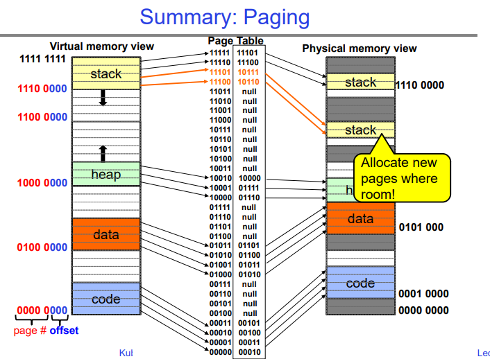

这幅图展示的是计算机内存管理中的分页（Paging）机制，它是虚拟内存管理的一个重要部分。图中主要包含了三个部分：虚拟内存视图、页表和物理内存视图。

1. **虚拟内存视图**：这个区域展示了程序的虚拟地址空间，它被分成几个部分，通常包括代码段、数据段、堆和栈。每个部分的起始地址由二进制表示，如`0000 0000`表示代码段的开始，而`1111 1111`可能表示虚拟地址空间的顶端。

2. **页表**：它是一个数据结构，用来跟踪虚拟地址空间到物理地址空间的映射。在页表中，每个条目关联一个虚拟页和一个物理页的映射。如果某个虚拟页当前没有映射到物理内存，对应条目会是`null`。

3. **物理内存视图**：这个区域显示了物理内存中的实际页，它们存储虚拟内存中的数据。物理内存同样分为不同的区域，存放着代码、数据、堆栈等。每个区域的起始地址用二进制表示。

图中用彩色高亮显示的“Allocate new pages where room!”指示说明了内存分配的过程。在物理内存中，可以看到不同的内存块被分配给了代码、数据、堆栈等。这些分配是通过页表中的映射来完成的。

箭头展示了从虚拟地址到物理地址的映射关系，它是通过页表来查找的。这种映射机制使得物理内存可以非连续地分配给程序，同时给操作系统和应用程序提供了一个连续的、线性的地址空间的错觉。

我们可以看到虚拟地址空间中有很多未分配的洞，并且页表中的条目也没有完全的被用到，下面我们会讲述如何解决这种问题。

## How big do things get?

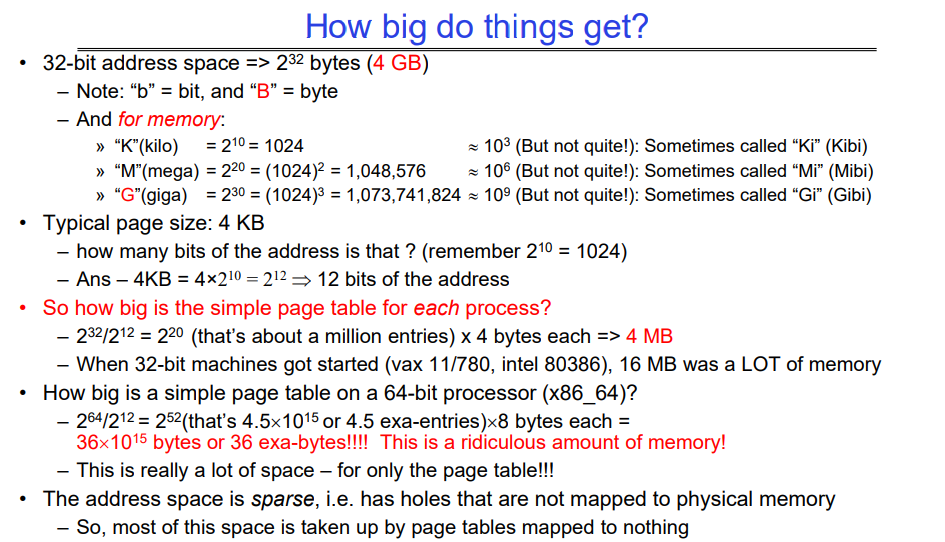

这张图是关于计算机内存和地址空间大小的解释说明：

1. **32位地址空间**：它等于2^32字节，即4GB（Gigabytes）。这里区分了位（b）和字节（B）的不同，1字节等于8位。

2. **内存单位**：
   - K（千字节）等于2^10或者1024字节。
   - M（兆字节）等于2^20或者1,048,576字节。
   - G（吉字节）等于2^30或者1,073,741,824字节。
   这些单位在二进制计算中常用，但有时候也会有专门的二进制前缀，比如Ki（kibi）、Mi（mebi）、Gi（gibi）。

3. **典型页面大小**：在内存管理中，常见的页面（Page）大小是4KB（千字节）。图中提到的4KB转换成位是2^12位。

4. **每个进程的简单页表大小**：基于32位地址空间和4KB的页面大小，一个简单的页表大约需要2^20个条目，每个条目4字节，因此大约需要4MB（兆字节）来存储整个页表。在32位计算机刚开始普及的时代（例如vax 11/780, intel 80386），16MB的内存被认为是很大的。

5. **64位地址空间的页表大小**：对于64位处理器（例如x86_64），一个简单的页表大小会是2^52个条目，每个条目8字节，总共是36 x 10^15字节或36 exabytes（艾字节），这是一个非常庞大的数值，甚至被称为“荒谬的内存量”。

6. **地址空间的稀疏性**：虽然理论上地址空间很大，但实际上许多地址是“空洞的”，并没有映射到物理内存上。这意味着实际使用的内存通常只是理论上地址空间大小的一小部分。

这张图的重点是强调随着计算机架构从32位到64位的演进，理论上的地址空间和管理这个空间所需的资源数量急剧增加，但实际上，物理内存并没有这么快地增长，因此造成了很多虚拟内存地址并不会用到。这就要求操作系统和处理器需要更加高效地管理这些庞大的地址空间。

## Page Table Discussion

讨论了一个关于页表管理和上下文切换时页表处理的讨论概要：

1. **上下文切换时需要切换什么**：
   - 需要切换页表指针和限制。这是因为每个进程在内存中都有其自己的地址空间，上下文切换时，操作系统需要更新到当前进程的页表。
2. **保护机制**：
   - 每个进程的地址转换和双模式（用户模式和内核模式）提供保护。这确保了进程不能修改自己的页表，增加了系统的安全性。
   - 
   - 页表通常由硬件中的一个部件——内存管理单元（Memory Management Unit, MMU）来处理转换。MMU是计算机处理器中的一部分，负责虚拟地址到物理地址的转换。当程序尝试访问一个虚拟地址时，MMU会使用当前活跃的页表来查找对应的物理地址。如果所需的地址信息在页表中（即一个有效的映射），MMU将转换地址，然后访问物理内存。如果映射不存在，这通常会触发一个缺页中断（page fault），操作系统将介入，处理这个异常情况。
3. **分析优缺点**：
   - 优点包括简单的内存分配和容易共享内存。
   - 缺点是如果地址空间稀疏（即许多地址空间未被使用），就会造成效率低下。例如，在UNIX系统中，代码从0开始，而栈从2^31-1开始，这可能意味着需要多达200万个页表条目。
4. **页表大小的问题**：
   - 如果页表太大，就不可能全部放在内存中，因为并非所有页面都会被一直使用。最好的情况是将当前使用的页表集保留在内存中。
5. **简化页表大小的方法**：
   - 人们可能会问是否所有页表条目都需要常驻内存。为了解决这个问题，可以使用多级分页（multi-level paging）或者结合分页和分段（segmentation）的方法来减小所需内存大小，同时提高内存管理的效率。

总的来说，这个讨论概要强调了在设计和实施分页机制时需要考虑的不同因素，包括内存保护、地址空间管理以及性能优化。

### Process Switch along with Page Table Switch(at mmu)

当进程切换发生时，操作系统的内核负责更新内存管理单元（MMU）以指向新进程的页表。这个切换过程通常被称为上下文切换。

上下文切换通常涉及以下步骤：

1. 保存当前进程的上下文，包括寄存器、程序计数器和当前页表的位置。
2. 加载新进程的上下文，这包括恢复寄存器状态、程序计数器和其他关键信息。
3. 更新MMU中的页表基址寄存器（或相应的寄存器），这样新的进程就可以使用其自己的页表了。

这些步骤通常由操作系统内核在响应中断或系统调用时自动执行。具体的实现细节可能因不同的硬件架构和操作系统而异。在多任务操作系统中，这个过程高度优化，以减少切换的开销，确保即使在频繁切换进程的情况下，系统的性能也不会受到太大影响。

## How to Structure a Page Table

**页表结构**：页表是从虚拟页号（VPN）到物理页号（PPN）的映射（函数）。它的基本作用是将虚拟地址转换为物理地址。

**简单页表**：一个简单的页表相当于一个非常大的查找表，其中虚拟页号作为索引，每个条目包含相应的物理页号。

**其他映射结构**：还可以使用什么其他类型的映射结构来实现页表的功能？包括：

- 树（Trees）：特别是平衡树，如红黑树，可以用于维持有序的映射，并允许较快的搜索、插入和删除操作。
- 散列表（Hash Tables）：提供了快速的查找时间，尤其是当页表条目数量非常大时。

这些结构可以用于优化页表的性能，特别是在页表条目数量巨大或者内存访问模式非常不规律的情况下。散列表可能在查找速度上有优势，而树结构可以提供有序访问，这可能在某些特定的内存访问模式中非常有用。选择哪种数据结构取决于系统设计的需求，包括内存的大小、页表的大小、内存访问模式、硬件支持等因素。

# How to fix sparse address: The Two Level page table

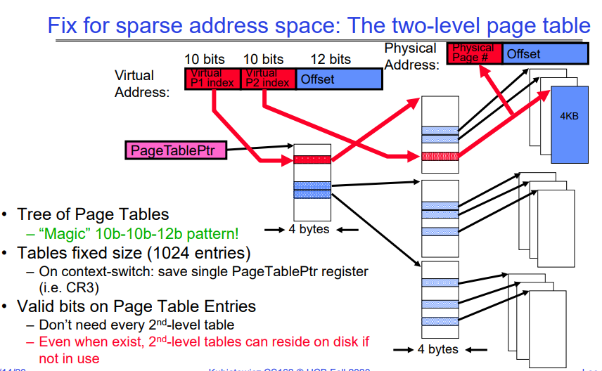

这张幻灯片展示了如何通过使用两级页表来解决稀疏地址空间问题。

1. **虚拟地址结构**：它被分为三部分：
   - 第一级页表索引（P1 index）：10位
   - 第二级页表索引（P2 index）：10位
   - 偏移量（Offset）：12位

这种分割意味着虚拟地址被分成页面和页内偏移。这里的“偏移量”是在4KB大小的页面内定位具体字节的部分。

2. **物理地址结构**：包括物理页号和偏移量。

3. **两级页表**：
   - 第一级页表（有时被称为页目录）包含指向第二级页表的指针。
   - 第二级页表包含实际的物理页号。

4. **页表指针（PageTablePtr）**：这是一个寄存器，包含了指向当前活跃的第一级页表的指针。

5. **树形结构的页表**：
   - 通过树形结构来表示多级页表，使得对稀疏地址空间的处理更加有效率。
   - 这种结构避免了为不使用的地址空间分配内存。

6. **固定大小的页表**：
   - 每个页表的大小是固定的，有1024个条目，因为每个索引占用10位。

7. **上下文切换时**：
   - 只需保存和恢复PageTablePtr寄存器的值。

8. **有效位**：
   - 页表条目中的有效位（Valid bits）表明条目是否指向有效的物理内存页。
   - 不是每个二级页表都需要驻留在内存中。如果它们没有被使用，它们可以存储在磁盘上，只有在需要时才被调入内存。

这种方法提高了内存使用的灵活性，并降低了内存需求，因为它避免了为整个虚拟地址空间分配连续物理内存的需要。当虚拟空间很大但实际使用相对较少时，这种结构尤其有用。

## Example: x86 classic 32-bit address translation

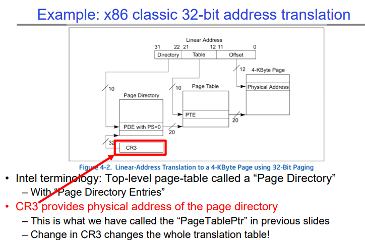

本图介绍了x86架构下经典的32位地址转换机制，特别强调了控制寄存器3（CR3）的使用和页目录的概念：

1. **x86 32位地址转换**：指的是在32位地址系统中将线性（虚拟）地址转换成物理地址的过程。

2. **线性地址结构**：展示了线性地址由三部分组成：
   - 目录（Directory）：最高的10位，用于索引页目录。
   - 表（Table）：接下来的10位，用于索引页表。
   - 偏移量（Offset）：最低的12位，在4KB页面内作为偏移。

3. **页目录和页表**：这是转换过程中使用的两级数据结构：
   - 页目录包含指向页表的条目（PDE）。
   - 每个页表包含指向实际物理内存页的条目（PTE）。

4. **CR3寄存器**：也被称为页目录基址寄存器（PDBR），CR3保存了当前正在使用的页目录的物理地址。当CR3变化时，它实际上改变了当前运行的整个页表映射集。

# Page Table Entry（页表项）/Page Table

页表的条目数量通常会覆盖进程的整个虚拟地址空间，这不仅仅包括code（代码段）和data（数据段），还包括heap（堆）和stack（栈）。对于现代操作系统，虚拟地址空间通常是预先分配好的，并且相当大，远大于物理内存的大小。因此，是的，页表的条目数量通常会大于或等于进程的代码和数据段的大小。

举例来说，如果操作系统支持的虚拟地址空间为4GB大小，那么理论上页表将有足够的条目来映射这4GB的空间，即使实际的代码和数据段只占用了其中的一小部分。这也包括为动态运行时内存分配（如堆和栈的扩展）预留的空间。堆和栈是在运行时动态增长和缩小的，所以页表需要有预留空间来映射这些可能被使用的地址。

实际上，页表中的许多条目在进程开始时可能被标记为无效，它们只有在相应虚拟地址被访问时才会被分配实际的物理存储或者后备存储。所以，尽管页表的条目数量很大，但并不是所有的条目在进程启动时都映射到实际的物理或磁盘存储。只有在访问时才可能进行这种映射，这正是需求分页策略的本质。

## What is in a Page Table Entry (PTE)?

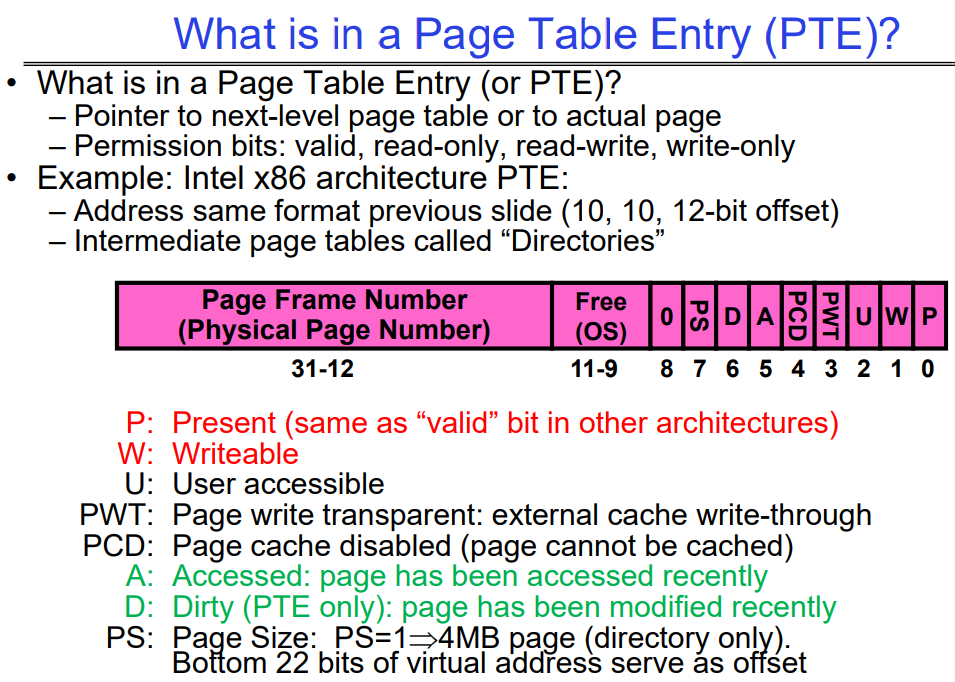

这张幻灯片解释了页表条目（PTE）的内容，以及它在Intel x86架构中如何被解释和使用：

- **页表条目（PTE）包含的内容**：
  - 指向下一级页表或实际页面的指针。
  - 权限位：有效位、只读、只写、可读写等。

- **Intel x86架构的PTE示例**：
  - 地址格式与前一张幻灯片相同，有10位的页目录索引，10位的页表索引，和12位的偏移量。
  - 中间的页表称为“目录”。

- **页框号（物理页号）**：
  - 位于PTE的高位部分（31-12位），用于指示物理内存中的页框位置。

- **权限和状态位**：
  - P（Present）：如果设置，表示页在物理内存中，这与其他架构中的“有效”位相同。
  - W（Writable）：如果设置，表示页面可以被写入。
  - U（User accessible）：如果设置，表示用户模式的进程可以访问该页。
  - PWT（Page write transparent）：页写透明，外部缓存写穿透。
  - PCD（Page cache disabled）：如果设置，表示禁用页面缓存，该页不会被缓存。
  - A（Accessed）：如果设置，表示页面最近被访问过。
  - D（Dirty）：仅在PTE中使用，如果设置，表示页面自上次被清理以来已被修改。
  - PS（Page Size）：如果设置并且PDE中PS=1，表示页面大小为4MB（仅限目录，即只有一层页表）。

幻灯片上的紫色区域高亮显示了PTE的结构，显示了不同的位如何被用来存储关于页面的不同类型的信息。这些信息对于操作系统管理内存和提供内存保护机制非常重要。在操作系统设计中，PTE允许细粒度的内存访问控制，确保了不同的页面可以有不同的访问权限，同时能够跟踪页面的状态，如是否被访问过或者被写入过。

## PTE的Valid位是0-page fault

当操作系统遇到一个无效的页表条目（PTE），并且尝试访问这个页时，它确实会触发一个页面错误（page fault）。操作系统通过以下步骤来处理这种情况，并找到磁盘上相应页的地址：

1. **页面错误处理程序**：当页面错误发生时，CPU会自动调用在操作系统内核中预设的页面错误处理程序。

2. **错误代码分析**：处理程序首先会分析页面错误提供的错误代码，确定页面错误的原因（例如，是因为访问了无效的地址，还是因为权限问题）。

3. **内存管理数据结构**：操作系统会维护一份数据结构（如页表或者交换文件映射表），该数据结构包含了虚拟页面到磁盘地址的映射信息。这些数据结构通常在进程的控制块（PCB）或者其他内核结构中存储。

4. **磁盘地址查找**：使用引起页面错误的虚拟地址，操作系统查找相应的数据结构以确定页面的存储位置。

5. **物理内存分配**：操作系统选择一个物理内存页面，如果当前没有可用的空闲页面，它可能会选择一个不活跃或较老的页面进行替换，如果这个页面被修改过（是“脏”页面），则会先将其写回磁盘。

6. **从磁盘读取**：操作系统然后从磁盘中的映射地址读取页面内容到分配的物理内存页面。

7. **更新PTE**：一旦页面被加载到物理内存中，操作系统会更新PTE以反映新的物理地址，并将其标记为有效。

8. **重新尝试指令**：处理完页面错误后，引起页面错误的指令将会重新执行。这一次，它应该能够找到有效的PTE，并成功地访问内存中的数据。

操作系统需要使用复杂的内存管理策略来跟踪哪些页面在物理内存中，哪些页面已经被交换到磁盘，以及它们在磁盘上的确切位置。这些策略的实现通常是操作系统最为核心和复杂的部分之一。

### OS如何在page fault时确定目标缺失的磁盘页的位置

当发生页面错误（page fault）时，操作系统通过几个关键的数据结构来确定缺失页在磁盘上的位置。这个信息通常由以下对象提供：

1. **页表自身**：对于已经映射但不在内存中的页，页表的条目可能包含用于指示磁盘位置的标记或者指针。

2. **交换空间管理结构**：操作系统维护一个专门的数据结构，比如交换表（swap table），映射虚拟页到它们在磁盘上的交换空间位置。每当页面从物理内存交换出去时，这个信息会被更新。

3. **文件系统**：如果页面错误是因为需要从映射文件（如内存映射文件）中读取数据，相关的文件系统将提供必要的磁盘位置信息。

4. **进程控制块（PCB）**：进程的PCB包含了管理该进程所需的所有信息，可能也包含或指向磁盘上页面存储位置的信息。

当页面错误发生时，处理程序会查看这些结构，找到造成错误的虚拟地址，然后确定其相应的磁盘位置。在许多操作系统中，这些信息是通过懒加载的方式来管理的，即直到确实需要某个页面时才去检索它，这样做可以提高效率和响应速度。

## Examples of how to use a PTE

如何使用页表条目（PTE）以及它在操作系统中的几种典型应用：

**PTE的使用**：

1. 无效的PTE可以表示不同的情况：它可能指示某个地址空间区域实际上是无效的，或者页面/目录位于内存的其他位置。
2. 首先会检查PTE的有效性。
3. 操作系统可以使用其他（比如说31位）的位来存储位置信息。

**需求分页（Demand Paging）**：
- 在内存中仅保留活动页面，其他页面放在磁盘上，并将其PTE标记为无效。

**写时复制（Copy on Write）**：
- UNIX的fork操作会将父进程的地址空间复制给子进程。
- 创建子进程后，地址空间是如何分离的？我们如何以一种低代价的方式做到这一点？
  - 通过复制父进程的页表并将页表中的条目标记为只读来实现（此时父进程和子进程指向相同的物理内存）。
  - 这样，在写入操作发生时，操作系统可以创建两个副本。

**按需填零（Zero Fill On Demand）**：

- 新的数据页面在创建时必须不包含任何信息（通常需要被清零）。比如说，当前进程要从disk载入一个page，他需要找到一个空闲内存页或者置换一个脏内存页，在这个进程看到这个内存页的时候，他只会看到全0的状态，因为kernel会将这个内存处理妥当（脏页刷盘等），最后在交付给新进程使用时，会把该内存页填充为全0，以避免数据泄露。
- 标记PTE为有效；在使用到零填充页面时会发生页面错误。
- 通常，操作系统在后台创建填充了零的页面。

这张幻灯片强调了PTE不仅仅是内存管理的一部分，而且是操作系统实现高效内存使用，如需求分页、写时复制和按需填零等技术的关键。这些技术允许操作系统优化内存使用，减少不必要的数据复制，提高系统的整体性能和响应速度。

## Sharing with multilevel page tables

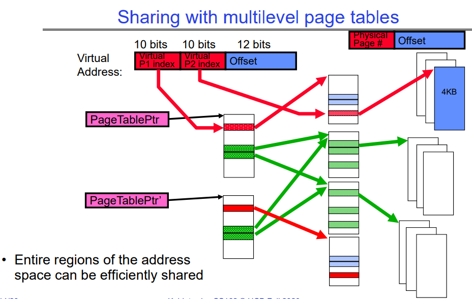

该图展示了如何通过多级页表实现地址空间的高效共享。在多级页表系统中，一个虚拟地址被分为几部分：第一级页表索引（P1 index）、第二级页表索引（P2 index）以及页内偏移量（Offset）。

图中有两个不同的页表指针（PageTablePtr 和 PageTablePtr'），它们指向不同的页表。这些页表可以包含指向相同物理页的指针，这意味着不同的进程可以共享相同的物理内存页。在图中，红色箭头显示了进程的一个部分是私有的（只有一个页表指向特定的物理页），绿色箭头显示了两个不同的页表指向同一个物理页，这代表共享。

通过这种方式，例如，在操作系统中运行的多个进程可以共享相同的代码库或数据集，而无需为每个进程的内存中复制这些数据。这节省了大量的内存，并允许对共享资源的高效管理。这在例如运行相同应用程序的多个实例或者使用共享库时非常有用。

## Multi-level Translation Analysis（多级页表翻译机制）

**优点**：
1. **按需分配页表条目**：只需要为应用程序实际使用的内存分配页表条目，这使得稀疏地址空间易于管理。
2. **简化内存分配**：内存的分配变得简单，因为不需要连续的物理内存，页表可以指向分散的物理页。
3. **简化共享**：可以在段（segment）或页（page）级别上轻松地共享内存，虽然这可能需要额外的引用计数来管理。

**缺点**：
1. **每页一个指针**：每个4KB（至今常见的页面大小）的页面都需要一个指针，对于大内存系统来说，页表本身可能会占用相当大的内存空间。
2. **页表连续性**：页表需要是连续的，这可能在物理内存上创建分配的压力。但是10位-10位-12位的配置（用于32位系统中的页表结构）保证了页表的大小恰好是一页大小（一个页表大小是4KB，一个PTE是4B，一共有2^10^个PTE），这有助于最小化所需的连续内存。
3. **多次查找**：每次内存引用可能需要两次或更多（如果超过两级页表）的查找，这看起来很费时间。然而，现代处理器使用各种缓存机制，如快表（Translation Lookaside Buffers, TLBs）来减少这种开销。

总结来说，多级页表结构提供了灵活性和有效的内存管理方式，尤其是在需要支持大型和稀疏地址空间的现代操作系统中。不过，这种方法也带来了一些性能和资源连续性方面的挑战。

## Recall: Dual-Mode Operation

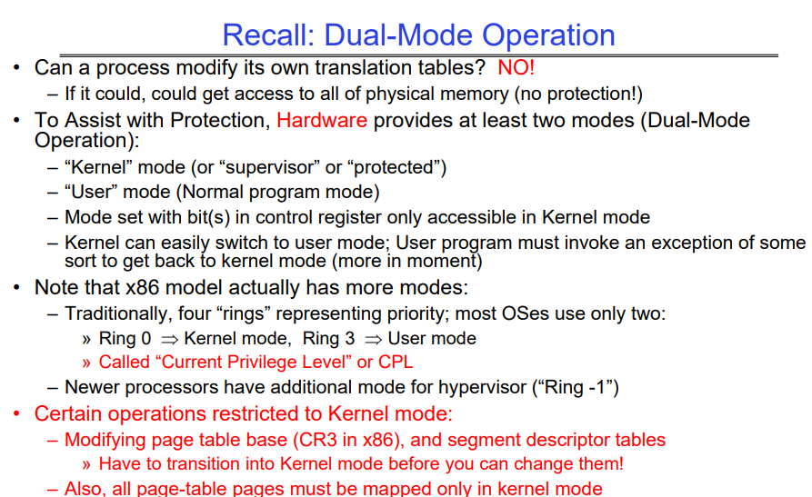

这张幻灯片介绍了现代计算机系统中的双模式（Dual-Mode）操作，主要关注于保护和权限分隔，尤其是在x86架构下的实现：

- **双模式操作**：硬件通过提供至少两种模式（内核模式和用户模式）来辅助保护机制。
- **内核模式**：也称为监督器模式或受保护模式，是操作系统执行最高权限操作的模式。在这个模式下，操作系统可以访问所有硬件资源。
- **用户模式**：是普通程序执行的模式，权限受限。在用户模式下，程序不能直接执行可能影响系统整体稳定性和安全性的操作。
- **权限控制**：通过控制寄存器（如CR3在x86中）来设置模式，这些寄存器只能在内核模式下被访问。
- **模式切换**：内核可以轻松地切换到用户模式，而用户程序必须通过触发某种异常（如系统调用）才能切换到内核模式。
- **x86权限级别**：
  - 传统上，x86有四个权限级别或“环”，从0到3，通常操作系统只使用两个：环0（内核模式）和环3（用户模式）。
  - “当前特权级别”（Current Privilege Level，CPL）用于表示当前的权限等级。
  - 新的处理器可能有额外的模式用于虚拟化（如“环-1”或hypervisor模式）。
- **内核模式的专有操作**：有些操作只能在内核模式下执行，例如：
  - 修改页表基址寄存器（CR3）来改变页表映射。修改段描述符表。
  - 在更改映射之前，所有页表页面必须已映射在内核模式下。

这些措施确保了操作系统能够控制程序如何访问物理内存，防止用户程序随意修改页表，这样就无法越过操作系统直接访问或修改内核内存区域，从而保证了系统的安全性。

## Making it real: X86 Memory model with segmentation (16/32-bit)

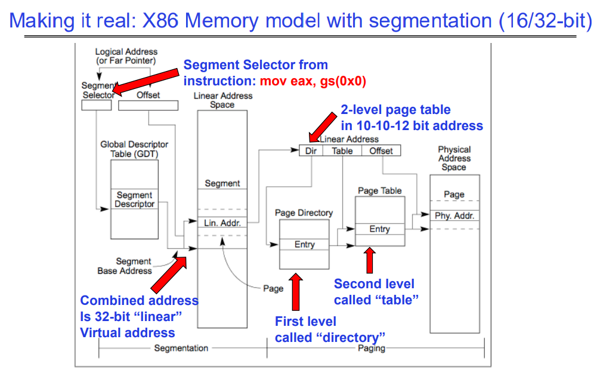

这张图说明了x86体系结构下结合分段和分页的内存模型。这个模型是16位和32位x86架构上使用的典型内存管理方式。

1. **逻辑地址**：首先，程序使用逻辑地址，它由两部分组成：段选择子（Segment Selector）和偏移量（Offset）。逻辑地址通常在程序中表示为指针或远指针。

2. **全局描述符表（GDT）**：段选择子用于从全局描述符表中选择一个段描述符，这个表包含了内存中所有段的信息。

3. **段描述符**：包含了段的基地址、限长、权限等属性。

4. **线性地址空间**：段描述符中的基地址与偏移量相结合生成一个32位的“线性”地址，这个地址是分段机制处理后的结果。

5. **分页**：线性地址接着通过分页系统进行处理。首先，它被分解为目录索引（Directory）、表索引（Table）和页内偏移量（Offset）。

6. **两级页表**：线性地址被映射到物理地址通过两级页表结构：
   - 第一级叫做“目录”（Directory）。
   - 第二级叫做“表”（Table）。

7. **物理地址**：最终，页表条目（Entry）将线性地址映射到物理内存空间中的具体位置。

图中还提到了一个汇编指令 `mov eax, gs(0x0)`，这个指令示例展示了如何使用段选择子来访问内存。`gs` 是一个段寄存器，它包含一个指向GDT中某个段的选择子。在这个例子中，指令将使用 `gs` 段的基地址加上偏移量 `0x0` 来访问内存，并将结果移动到 `eax` 寄存器中。

总的来说，这张图展示了x86架构中如何结合分段和分页机制来从程序中的逻辑地址转换到物理内存地址的具体过程。这种复合方式允许了灵活的内存管理，并为不同的安全和保护目的提供了支持。

### X86 Segment Descriptors (32-bit Protected Mode)

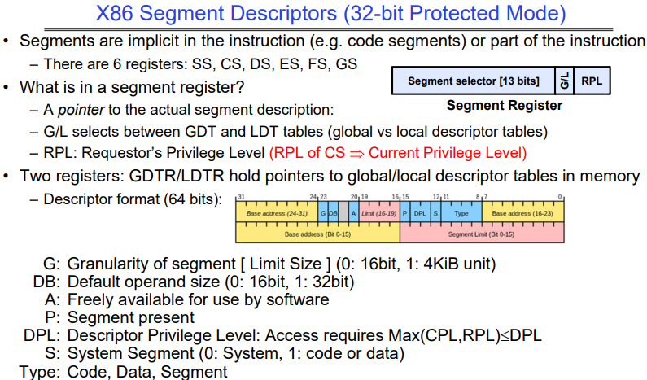

指令中的段是隐含的（例如代码段）或是指令的一部分。存在六个段类型寄存器：SS-栈段寄存器、CS-代码段寄存器、DS-数据段寄存器、ES-附加段寄存器 。

FS、GS：这两个是较后引入的额外的数据段寄存器，用于特殊目的。在现代操作系统中，它们常被用来访问线程或任务特定的数据（例如，在Windows中，FS通常用于访问线程特定的数据结构，如线程环境块TEB）。

段寄存器中是什么？
- 一个指向实际段描述符的指针。Segment selector
- G/L用来在全局描述符表（GDT）和局部描述符表（LDT）之间选择（全局与局部描述符表）。
- RPL是请求者的权限等级（CS的RPL ⟹ 当前权限等级）。

有两个寄存器：GDTR/LDTR持有指向内存中全局/局部描述符表的指针。

- 描述符格式（64位）：
- G：段的粒度（限制大小）[0：16位，1：4KiB单位]
- DB：默认操作数大小（0：16位，1：32位）
- A：软件可自由使用
- P：段存在
- DPL：描述符权限等级：访问要求Max(CPL,RPL) < DPL
- S：系统段（0：系统，1：代码或数据）
- Type：代码，数据，段

### How are segments used?

所有人都有一组全描述符表（GDT），每个进程都有一组不同的本地描述符表（LDT）。

在传统应用程序中（16位模式）：

- 段提供用户程序不同组成部分的隔离：
  - 代码、数据、栈的不同块有不同的段。
  - 代码段的RPL（请求者权限级别）是CPL（当前权限级别）。
- 受限于64KB的段大小。

在32位模式下的现代使用：

- 即使所有段都具有完整的功能，段设置为“扁平化”，即每个段为4GB大小。
- 一个例外：使用GS（或FS）作为指向“Thread Local Storage”（TLS）的指针：
  - 一个线程可以像这样访问TLS：`mov eax, gs(0x0)`

在64位（“长”）模式下的现代使用：

- 大多数段（SS、CS、DS、ES）基址为零，没有长度限制。
- 只有FS和GS保留它们的TLS功能。

## Alternative: Inverted Page Table

反向页表（Inverted Page Table，IPT）是一种内存管理的数据结构，用于实现虚拟内存系统。

- 在传统的页表系统中，操作系统为每个进程维护一个页表，该页表包含了该进程虚拟地址到物理地址的映射。当系统运行多个进程时，每个进程都会有自己的页表，这就会占用大量的内存空间来存储这些页表。
- 因为并不是每个虚拟地址都有对应的物理页在用，因此页表中会有很多null项。

反向页表的概念是为了减少这种页表所需的内存量。与为每个进程的每个虚拟页保持一个单独的页表条目不同，反向页表采用一种全局的页表，为物理内存中的每个页帧（Page Frame）只保持一个条目。每个条目不是将虚拟地址映射到物理地址，而是将物理地址映射到虚拟地址。

这种方式需要页表中的条目数目等于物理内存中的页帧数目，而不是虚拟地址空间中的页数目，通常会更少。

在查找物理地址对应的虚拟地址时，操作系统会查找反向页表，并且可能会使用辅助的结构比如哈希表来加速查找过程。由于物理内存的大小通常比虚拟内存小得多，所以反向页表可以节省大量的内存空间。反向页表尤其适用于具有大量物理内存和大型虚拟地址空间的系统，如服务器或大型多处理器系统。

总之，反向页表是一种减少页表内存开销的有效方式，它通过将每个物理页帧映射到一个或多个虚拟页来实现这一点。这种方式对于操作系统的内存管理特别重要，因为它帮助操作系统有效地支持大量的进程和大型的虚拟地址空间。

# Address Translation Comparison

| 地址翻译方式                     | 优势                              | 劣势                                             |
| -------------------------------- | --------------------------------- | ------------------------------------------------ |
| 简单分段（Simple Segmentation）  | 快速上下文切换（段映射由CPU维护） | 外部碎片化（External Fragmentation）             |
| 单级分页（Paging, Single-Level） | 没有外部碎片化 分配快速且简单  | 表的大小较大（约等于虚拟内存大小） 内部碎片化 |
| 分页分段（Paged Segmentation）   | 表的大小约等于虚拟内存中的页数    | 每次页访问需要多次内存引用                       |
| 多级分页（Multi-Level Paging）   | 分配快速且简单                    |                                                  |
| 反向页表（Inverted Page Table）  | 表的大小约等于物理内存中的页数    | 哈希函数更复杂 页表没有缓存局部性             |

**简单分段**：这种方式将内存分为多个段，每段有一个起始地址和大小。这种方法允许快速的上下文切换，因为CPU只需更改段寄存器的内容。然而，它容易造成外部碎片化，即未被利用的内存空间散布在内存中。

**单级分页**：这是现代操作系统广泛使用的一种技术，它将虚拟内存分为大小固定的页，每页映射到物理内存中的页帧。它避免了外部碎片化但可能会有内部碎片化（一个页内部未被完全使用的空间）。

**分页分段**：结合了分页和分段的特点，它提供了分段的好处，同时每个段都是分页的，从而简化了内存管理并减少了碎片化。

**多级分页**：这种技术使用了多个层级的页表，使得每次内存访问都需要通过这些层级来翻译地址，可能会造成额外的内存访问开销，但它使得页表的大小可以有效控制。

**反向页表**：如前所述，反向页表减少了页表所需的内存量，因为它的大小与物理内存中的页帧数相匹配，而不是虚拟内存中的页数。但是，这种方法的页表管理通常更复杂，因为需要额外的数据结构（如哈希表）来快速查找页表项，而且由于页表项的分布，它可能没有好的缓存局部性，这可能导致缓存命中率较低。

## Where and What is the MMU ?

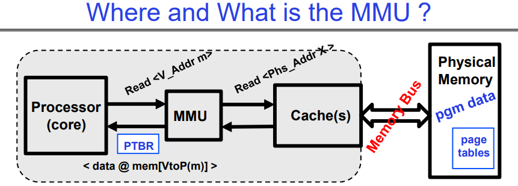

这张图展示了内存管理单元（Memory Management Unit，MMU）的位置和功能。这里是图中信息的概述和解释：

- 处理器（核心）通过MMU（VA->PA）向缓存（随后是内存）请求读取物理地址。
- 经过一段时间后，内存系统会响应，并提供存储在物理地址上的数据（这是虚拟地址到物理地址转换的结果）。
- 如果缓存命中，则读取速度快；如果缓存未命中，则慢。

MMU的工作内容包括：
- 在每次引用（例如，指令提取、加载、存储。I-fetch, Load, Store）时，MMU都会读取（可能是多级的）页表条目来获取物理帧或是发现错误（FAULT）。
- 这个过程通过缓存来完成，然后读写物理位置。

图中还展示了处理器和物理内存之间的交互，指出MMU使用页表寄存器（PTBR）来转换地址，并通过缓存（如果可能）来加速数据访问。当MMU不能在缓存中找到相应数据时，它会通过内存总线从物理内存中读取数据。

这张图解释了虚拟内存管理中的一个关键部分，显示了处理器、MMU、缓存和物理内存如何相互作用，以支持现代计算机系统中复杂的内存访问模式。

## MMU和Page Table

操作系统的内存管理单元（MMU）和页表（Page Table）是虚拟内存系统中的两个关键组件，它们紧密协作以实现有效的内存管理。下面是它们各自的定义，以及它们之间的区别和联系：

### MMU（Memory Management Unit）：

- **定义**：MMU是计算机硬件的一部分，通常位于CPU内，负责虚拟地址到物理地址的转换。
- **功能**：MMU使用页表来将程序使用的虚拟地址翻译成物理内存地址。它还处理内存保护、缓存控制和内存分配的硬件支持。
- **工作流程**：当程序尝试访问内存时，它会产生一个虚拟地址，MMU通过查找页表来将这个虚拟地址转换成对应的物理地址。

### 页表（Page Table）：

- **定义**：页表是操作系统维护的数据结构，它记录了虚拟地址到物理地址的映射信息。
- **功能**：页表用于存储虚拟内存页与物理内存页帧之间的映射关系。每个进程都有自己的页表。
- **工作流程**：当MMU需要翻译地址时，它会查询页表以找到虚拟页面对应的物理页面。如果所需的页表项不在内存中，将会发生缺页异常（Page Fault）。

### 它们的区别：

- **物理位置**：MMU是硬件设备，而页表是由操作系统维护在内存中的数据结构。
- **作用范围**：MMU是全局的，为整个系统服务；每个进程都有自己的页表，它是进程级别的。

### 它们的联系：

- **协作关系**：MMU使用页表进行地址翻译，页表项的内容由操作系统管理，并在必要时更新。
- **内存访问**：任何内存访问都需要MMU和页表的协作。程序请求的虚拟地址由MMU转换为物理地址，转换过程中依赖于页表提供的信息。
- **性能与管理**：MMU的效率在很大程度上取决于页表的结构和管理。操作系统负责管理页表，确保它的高效和最新，这直接影响MMU翻译地址的速度。

总的来说，MMU和页表共同为操作系统提供了一个抽象层，这个抽象层使得进程好像都在使用连续的、完整的内存空间，而实际上它们被映射到物理内存的不同位置。这种机制增强了内存的利用效率和系统的安全性。