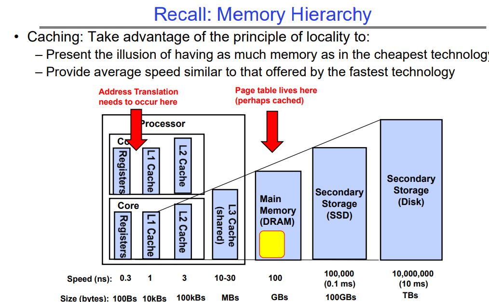
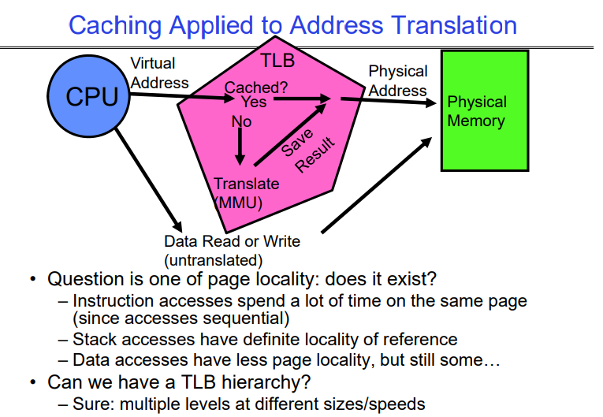

# Memory 2: Virtual Memory (Con’t), Caching and TLBs

# Cache

## Why cache?

缓存（Cache）的概念在操作系统中无处不在，因为它是提高计算机性能的关键组件之一。缓存利用了局部性原理，通过将数据暂存于快速访问的存储区域中来减少对慢速存储（如硬盘或网络）的访问。这样，当再次需要这些数据时，可以迅速从缓存中获取，而不是每次都从原始的慢速存储中读取。

在操作系统中，缓存的使用范围非常广泛：

1. **处理器缓存**：CPU内部包含L1、L2和L3缓存，用于存储频繁访问的指令和数据。

2. **磁盘缓存**：操作系统通常会保留一部分内存用于磁盘缓存，以加速对磁盘文件的读写操作。

3. **文件系统缓存**：操作系统的文件系统会缓存文件的元数据和数据块，以减少对磁盘的访问次数。

4. **网络缓存**：网络协议栈可以缓存DNS查询结果或其他网络请求的数据，以提高网络操作的效率。

5. **软件应用缓存**：应用程序自身也可能实现缓存机制，比如Web浏览器会缓存网页内容，以快速渲染访问过的网站。

6. **数据库缓存**：数据库系统用缓存来存储查询结果和常用数据，这样可以加速查询速度和数据检索。

7. **I/O缓存**：输入/输出操作经常涉及缓存，例如打印作业可能首先被缓存起来，再逐步发送到打印机。

操作系统设计的一个重要方面是有效地管理这些不同类型的缓存，确保数据一致性和高效的缓存更新策略。正确使用缓存可以显著提高系统性能，减少延迟，增加吞吐量。

## Recall: Memory Hierarchy

cache的妙用在上图中得到了明显的表达。

## Caching Applied to Address Translation

这张图解释了缓存技术如何应用于地址转换过程，重点突出了转换后备缓冲器（Translation Look-Aside Buffer，简称TLB）的作用，并提出了关于页面局部性及是否可以有一个TLB层次结构的问题。

图中的流程描述如下：

- 当**CPU**需要进行数据读取或写入时，它会生成一个**虚拟地址**。
- 系统首先检查这个地址是否在**TLB**中。如果在（"Yes"），则可以从TLB快速获得到**物理地址**的转换，TLB是专门用于地址转换的缓存。
- 如果地址不在TLB中（"No"），那么**MMU**必须将虚拟地址转换为物理地址。这个转换结果随后被保存到TLB中，以便将来访问时能更快获取。
- 使用转换后的物理地址去访问**物理内存**以完成读或写操作。

图中的注释还讨论了**页面局部性**的概念，这对TLB的效率非常重要：

- 指令访问倾向于有高度的局部性，因为程序通常在同一页面内顺序执行指令。
- 栈访问具有明确的引用局部性，这意味着栈操作通常在有限的内存范围内进行，通常在同一页上。
- 数据访问可能页面局部性较少，但通常仍有一定程度的局部性。

最后，图中提出了是否可以有一个**TLB层次结构**的问题，暗示像其他缓存一样，拥有不同大小和速度的多级TLB可能是有益的。这将模仿现代处理器中的缓存层次结构，其中L1是最快但容量最小的缓存，L2和L3则逐级增大和减慢。TLB层次结构可能通过为这些地址转换提供一个分级的缓存系统来提高地址转换的性能。

## A Summary on Sources of Cache Misses

**强制性未命中（Compulsory）**：这是指首次访问一个块时发生的未命中，比如冷启动或进程迁移时的第一次引用。这是不可避免的现象，对此无法做太多处理。如果程序将要运行数十亿条指令，强制性未命中在总体上是微不足道的。

**容量未命中（Capacity）**：发生在缓存无法包含程序访问的所有块时。解决办法是增加缓存大小。

**冲突未命中（Conflict，也称为碰撞）**：多个内存位置被映射到同一缓存位置时发生。解决办法有两个：

- 方案一：增加缓存大小。
- 方案二：增加缓存的关联性（Associativity）。

**一致性未命中（Coherence）或失效（Invalidation）**：当其他进程（例如，I/O操作）更新内存时，可能导致缓存中的数据失效。

这些类型的缓存未命中是衡量和优化缓存性能的关键指标，操作系统和硬件设计师会尝试通过各种方法来减少这些未命中的发生，从而提升系统性能。

# Address Translation Cache：Translation Look-Aside Buffer（TLB）

## Concepts

**TLB**集成在CPU芯片中，是一种硬件，位于registers和L1 cache之间的关键路径上。

Translation Look-Aside Buffer（TLB）是一种特殊的缓存，用于加速虚拟地址到物理地址的转换过程。在虚拟内存系统中，这个转换通常涉及访问页表，这可能是一个耗时的操作，特别是在多级页表的情况下。TLB的作用是存储近期使用过的虚拟页号到物理帧号的转换结果。

### TLB的关键点：

- **缓存页表项**：TLB记录了最近的虚拟页号到物理帧号的转换，减少了对页表的访问。
- **地址转换效率**：如果TLB中存在某个虚拟地址的转换，CPU可以直接使用这个转换后的物理地址，无需再次读取页表。
- **多级页表支持**：即使地址转换涉及到多级页表，TLB也能缓存从虚拟地址到物理地址的最终结果。

### TLB的历史和影响：

- **发明**：TLB是由Sir Maurice Wilkes发明的，这发明比CPU内部的数据缓存（如L1、L2缓存）更早。
- **命名权**：新概念的提出者通常有命名的权利。Wilkes在提出TLB的概念时给它命名。
- **启发**：人们意识到，如果TLB对于页表这么有用，那么对于内存中的其他数据也应该是有益的。这最终促进了现代缓存系统的发展。

### TLB缺失的处理：

- **TLB缺失（Miss）**：当CPU在TLB中找不到虚拟地址到物理地址的转换时，它会尝试从页表中获取这个信息。
- **页表缓存**：页表项可能已经被缓存，因此在TLB缺失时可以先从缓存的页表中查找，而不必直接访问内存。
- **内存访问**：只有当TLB缺失并且缓存的页表中也没有找到所需的转换信息时，CPU才会访问内存中的页表。

通过TLB，系统能够显著提高地址翻译的速度，这直接影响了程序的性能。TLB缺失会降低系统性能，因为它需要系统进行额外的内存访问来加载正确的页表项。这就是为什么操作系统和硬件设计者不断努力以提高TLB的命中率，例如通过增加TLB的大小或使用更加智能的替换策略。

# Summary

## Summary

**页表**
- 内存被划分为固定大小的块。
- 通过页表将虚拟地址中的虚拟页号映射到物理页号。
- 虚拟地址的偏移量与物理地址的偏移量相同。
- 大型页表可以放置在虚拟内存中。

**多级页表**
- 将虚拟地址映射到一系列的页表。
- 允许地址空间的稀疏填充。

**反向页表**
- 使用哈希表来存储翻译条目。
- 页表的大小约等于物理内存的大小而非虚拟内存的大小。

### 解释

- **页表** 是虚拟内存管理中用于将虚拟地址转换为物理地址的数据结构。每个虚拟页面都有一个对应的条目在页表中。

- **多级页表** 是一种减少页表内存占用的技术，通过将一个大的页表分解成多个小的表，减少了未使用的地址空间的页表条目。

- **反向页表** 是另一种页表的组织形式，它基于物理页帧而不是虚拟页来索引页表项，从而减小了页表所需的大小，因为物理内存通常比虚拟内存小。

这些机制的目的都是为了高效地管理和转换虚拟内存地址和物理内存地址，同时尽量减少内存的消耗。