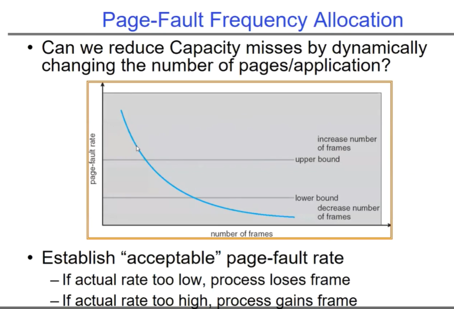
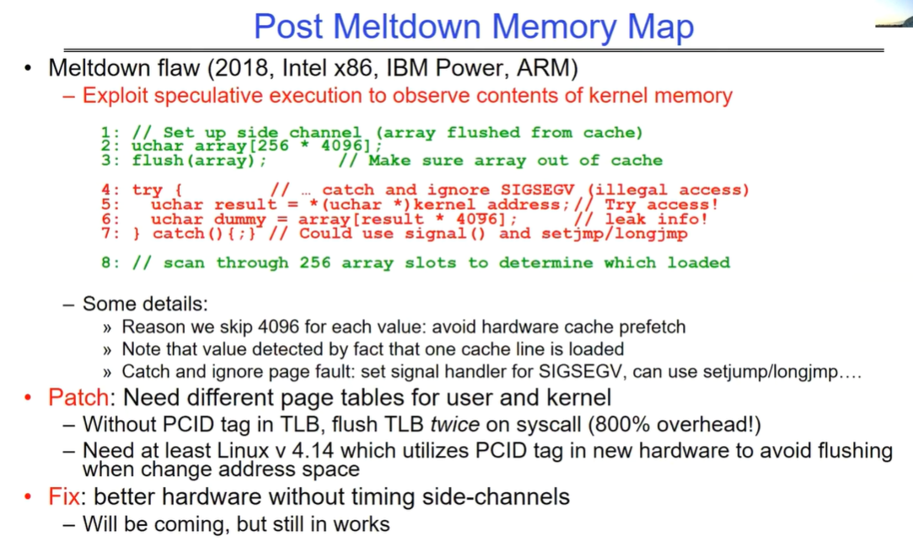
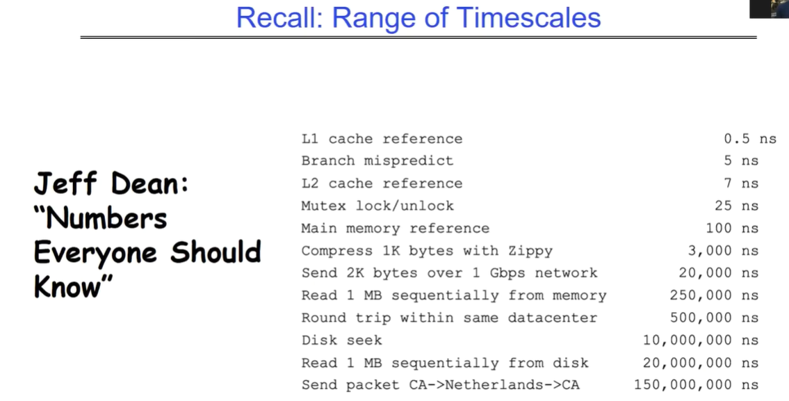
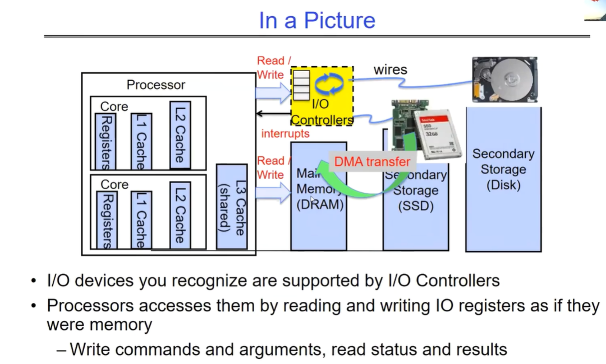
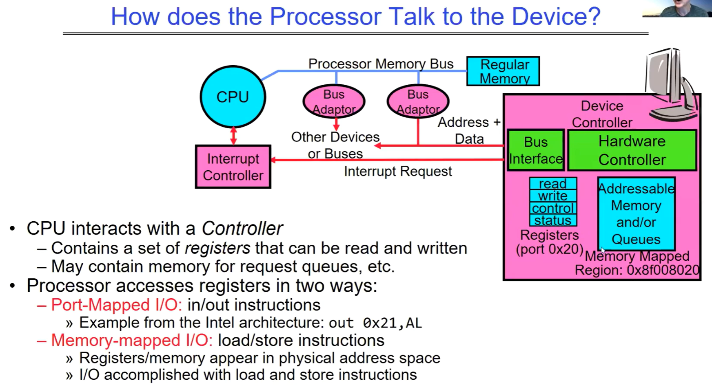

# Lec17-Demanding Paging-General I/O, Storage Devices

# 物理页面分配原则

## page fault 频率分配法

当实际的页面错误频率过低时，意味着进程可能没有充分利用分配的内存，此时可以减少分配给该进程的帧数，让其他进程有机会使用这些内存资源。

当实际的页面错误频率过高时，说明进程可能缺少足够的帧数，此时可以增加分配给该进程的帧数，以降低页面错误的频率。

通过建立一个 “acceptable”（可接受的）页面错误率，系统可以根据实际的页面错误频率动态地调整每个进程的帧数分配，以优化内存的使用效率，减少因内存不足或分配不合理而导致的容量缺失问题。

## OS Thrashing：频繁换入换出页面

当一个进程没有 “足够” 的页面时，页面错误率会非常高，这会导致：

1. 低 CPU 利用率，因为操作系统大部分时间都在进行页面与磁盘的交换操作。
2. 定义了颠簸为一个进程忙于页面的换入换出，但实际进展很小或没有。

线程数过高（会导致当前内存page数目不够用）会导致频繁的页面换入换出（即page fault概率变大），大部分时间都在调度，导致执行无法取得进展；过低则无法充分利用CPU资源，导致吞吐量较低。

### OS的swap行为

**一、swap 的定义及作用**

当物理内存（RAM）不足时，操作系统会将一部分暂时不使用的内存页面（通常是进程的一部分数据或代码）移动到辅助存储设备（如硬盘上的交换空间），从而腾出物理内存空间供其他更急需的进程使用。这个过程就称为 swap 行为。

其主要作用是在物理内存有限的情况下，通过利用辅助存储设备来扩展可用内存的总量，使得系统能够同时运行更多的进程或处理更大规模的任务。

**二、swap 行为的具体过程**

1. 触发条件
   - 当操作系统监测到可用物理内存低于某个阈值时，或者当新的进程需要分配内存而物理内存不足时，就会触发 swap 行为。
   - 例如，在一个多任务的服务器系统中，如果同时运行着多个占用大量内存的服务，当新的服务请求到来时，可能会导致物理内存紧张，从而触发 swap 操作。
2. 页面选择
   - 操作系统会根据一定的算法选择要换出到交换空间的内存页面。常见的算法有最近最少使用（LRU）算法等，即选择那些最近一段时间内最少被访问的页面进行换出。
   - 比如，一个长时间未被访问的后台进程的部分页面可能会被优先换出，以释放内存给正在活跃运行的进程。
3. 页面换出
   - 被选中的内存页面会被写入到交换空间中。这个过程通常涉及到磁盘 I/O 操作，相对比较耗时。
   - 在写入交换空间时，操作系统会更新相应的页面表和内存管理数据结构，以记录页面的新位置（在交换空间中）。
4. 页面换入
   - 当进程再次访问一个被换出到交换空间的页面时，会触发页面错误（page fault）。操作系统会检测到这个错误，并从交换空间中将相应的页面重新读入到物理内存中。
   - 这个过程同样涉及磁盘 I/O 操作，会导致一定的延迟。为了提高性能，操作系统可能会采用预读策略，即在发现一个页面被访问时，提前将其附近的页面也读入到内存中，以减少后续可能的页面错误。

**三、swap 行为对系统性能的影响**

1. 性能下降
   - 由于涉及到磁盘 I/O 操作，swap 行为会显著降低系统性能。磁盘的访问速度远远低于物理内存的访问速度，因此频繁的页面换入换出会导致系统响应时间变长，吞吐量降低。
   - 例如，在一个运行大型数据库的系统中，如果频繁进行 swap 操作，数据库查询的响应时间可能会从几毫秒增加到几十毫秒甚至更长，严重影响用户体验。
2. 资源竞争
   - swap 行为可能会与其他磁盘 I/O 操作竞争资源，进一步影响系统性能。例如，如果同时有多个进程在进行大量的文件读写操作，而此时又发生了 swap 操作，磁盘的负载会增加，导致所有的 I/O 操作都变慢。
   - 此外，频繁的 swap 操作还可能会导致磁盘磨损加剧，缩短磁盘的使用寿命。

总之，swap 行为是操作系统在内存管理方面的一种重要机制，但过度的 swap 操作会对系统性能产生负面影响。因此，在设计和管理系统时，需要合理配置物理内存和交换空间的大小，以及优化内存分配算法，以减少 swap 行为的发生频率，提高系统的性能和稳定性。

# MeltDown相关说明

## MeltDown漏洞

在 Linux 中，“Meltdown”（熔毁）而是一种安全漏洞。

Meltdown 漏洞允许恶意程序从其他正在运行的程序或操作系统内核的内存中读取数据，即使这些数据在正常情况下应该是受保护且不可访问的。

**一、漏洞原理**

现代处理器为了提高性能会采用乱序执行等技术。Meltdown 漏洞利用了处理器在执行指令时的预测执行特性。恶意程序可以通过精心构造的指令序列，诱导处理器在权限检查之前进行推测性执行，从而访问到受保护的内存区域。即使后续的权限检查失败，处理器在推测执行过程中获取的数据可能已经被缓存，恶意程序可以通过分析缓存的状态来推断出被访问内存中的内容。

**二、影响范围**

Meltdown 漏洞影响了众多的现代处理器，包括英特尔、AMD 和 ARM 等厂商的产品。几乎所有的主流操作系统，包括 Linux，都受到了该漏洞的影响。

**三、应对措施**

针对 Meltdown 漏洞，Linux 系统以及其他操作系统采取了一系列的缓解措施：

1. 内核补丁：Linux 内核开发者发布了安全补丁，对内核进行了修改以防止 Meltdown 漏洞的利用。这些补丁包括对内存访问的更严格检查、限制推测执行的范围等。
2. 微代码更新：处理器厂商也发布了微代码更新，通过修改处理器的底层行为来修复漏洞。操作系统通常会与处理器厂商合作，确保微代码更新能够正确地应用到系统中。
3. 安全配置调整：系统管理员可以调整一些安全配置参数，如加强内存隔离、限制用户权限等，以进一步降低受到 Meltdown 漏洞攻击的风险。

总之，Meltdown 是一个严重的安全漏洞，对计算机系统的安全性构成了重大威胁。通过及时安装补丁、更新微代码和调整安全配置等措施，可以有效地降低受到 Meltdown 漏洞攻击的风险。

## MeltDown的一些可能解决方案

介绍了熔毁漏洞（Meltdown flaw）在 2018 年对 Intel x86、IBM Power 和 ARM 等架构的影响以及相关应对措施：

**一、Meltdown 漏洞表现**

- 利用推测执行来观察内核内存的内容。通过设置侧信道，将一个较大的数组从缓存中刷新出去，确保其不在缓存中，然后尝试访问内核地址，如果引发非法访问信号（SIGSEGV）则捕获并忽略，通过特定方式泄露信息，具体是扫描数组的槽位来确定哪个被加载从而获取内核内存信息。

**二、一些细节**

- 每次取值跳过 4096 是为了避免硬件缓存预取。通过一个缓存行被加载的事实来检测值，并且可以捕获并忽略页面错误，设置信号处理程序来处理 SIGSEGV，可使用`setjmp/longjmp`。

**三、补丁措施**

- 需要为用户和内核设置不同的页表。如果在 TLB 中没有 PCID 标签，在系统调用时需要刷新 TLB 两次，会带来 800% 的开销。至少需要 Linux v4.14 版本，它利用新硬件中的 PCID 标签来避免在更改地址空间时进行刷新。

**四、未来方向**

- 修复方向是更好的硬件，消除计时侧信道。目前仍在研究中。

# I/O

## 各种操作行为的时间总结

不同操作的时间跨度从纳秒级到几亿纳秒不等，具体如下：

- L1 高速缓存引用需 0.5 纳秒。
- 分支预测错误需 5 纳秒。
- L2 高速缓存引用需 7 纳秒。
- 互斥锁的锁定和解锁需 25 纳秒。
- 主内存引用需 100 纳秒。
- 使用 Zippy 压缩 1K 字节需 3000 纳秒。
- 通过 1Gbps 网络发送 2K 字节需 20000 纳秒。
- 从内存中顺序读取 1MB 数据需 250000 纳秒。
- 在同一数据中心内往返需 500000 纳秒。
- 磁盘寻道需 10000000 纳秒。
- 从磁盘中顺序读取 1MB 数据需 20000000 纳秒。
- 从加利福尼亚发送数据包到荷兰再返回加利福尼亚需 150000000 纳秒。

## OS的I/O概览图

这张图展示了计算机系统中不同层面的 I/O 情况，分析如下：

**一、处理器层面**

- **Processor Read/Write wires（处理器读写线路）**：代表处理器与其他组件进行数据传输的通道。处理器可以通过这些线路读取和写入数据到不同的存储层次和 I/O 设备。
- **Core C Controllers/Interrupts（核心 C 控制器 / 中断）**：核心控制器负责管理处理器核心的各种操作，包括处理中断。中断是一种机制，允许 I/O 设备向处理器发出信号，通知有需要处理的事件，例如数据准备好被读取或设备需要服务。
- **Registers（寄存器）**：位于处理器内部的高速存储单元，用于暂存指令、数据和地址等信息。处理器可以非常快速地访问寄存器，它们在执行指令和处理数据时起着关键作用。
- **Cache（缓存）**：包括 L1、L2 和 L3 缓存，它们的作用是存储最近使用的数据和指令，以减少处理器访问主内存的次数，从而提高性能。缓存层级越高，容量通常越大，但访问速度相对较慢。

**二、存储层面**

- **Memory（内存，DRAM）**：主存储器，通常由动态随机存取存储器（DRAM）组成。内存的访问速度比缓存慢，但比辅助存储设备快。处理器可以直接访问内存中的数据和指令。
- **Secondary Storage（辅助存储，Disk/SSD）**：包括磁盘和固态硬盘（SSD）等设备。这些存储设备的容量通常比内存大得多，但访问速度较慢。它们用于长期存储数据和程序，当需要时可以将数据加载到内存中供处理器使用。

**三、I/O 设备层面**

- **I/O devices you recognize are supported by I/O Controllers（你认识的 I/O 设备由 I/O 控制器支持）**：各种 I/O 设备，如键盘、鼠标、显示器、硬盘等，通过 I/O 控制器与处理器和系统连接。I/O 控制器负责管理 I/O 设备的操作，包括数据传输和设备状态监测。
- **Processors accesses them by reading and writing I/O registers as if they were memory（处理器通过读写 I/O 寄存器来访问它们，就像它们是内存一样）**：处理器通过读写 I/O 寄存器与 I/O 设备进行通信。这些寄存器在处理器看来就像内存地址一样，可以通过特定的指令进行访问。处理器可以向 I/O 寄存器写入命令和参数，以控制设备的操作，并从 I/O 寄存器读取设备的状态和结果。

**四、数据传输层面**

- **Core Read/Write（核心读写）\**和\**DMA transfer（直接内存访问传输）**：处理器核心可以直接读取和写入数据到缓存和内存。此外，DMA 技术允许 I/O 设备直接与内存进行数据传输，而无需处理器的直接干预，从而提高数据传输的效率。

综上所述，这张图展示了计算机系统中不同层面的组件如何协同工作来处理 I/O 操作。从处理器到存储设备再到 I/O 设备，通过各种通道和机制实现数据的传输和交互，以满足系统的输入输出需求。

## PCI Bus

整个架构以 CPU 和内存为核心，通过主机桥连接到不同的总线系统(不同的总线之间用不同的桥连接)，包括 PCI 总线和 ISA 总线。PCI 总线和 ISA 总线又连接了各种控制器和设备，实现了计算机系统中不同组件之间的数据传输和交互。ROM（只读存储器）可能存储着系统的基本输入输出系统（BIOS）等重要信息。

不同的总线之间可以通过不同类型的桥来连接。

PCI（Peripheral Component Interconnect）总线在物理层面上由多条并行的信号线组成，包括地址线、数据线和控制线等。数据可以在同一时刻通过多条数据线并行传输，从而实现较高的数据传输速率。

串行通信是在一条信号线上逐位传输数据，通常在速度、信号线数量和成本等方面与并行通信有不同的特点。

### processor如何与设备交互

处理器通过与设备控制器进行交互来与设备通信。控制器连接着处理器、内存以及其他设备或总线，当中包含一组可被读写的寄存器，还可能包含用于请求队列等的内存。例如在特定的内存映射区域（如 0x8f008020），就可能存在这样的控制器相关资源。

> CPU通过设备驱动程序访问设备控制器，注意设备驱动程序是软件，设备控制器是硬件上的部分。

控制器中的寄存器可用于控制设备状态、读取设备状态和写入控制信息等。同时，可能存在的内存可用于请求队列等用途。

处理器有两种方式访问控制器中的寄存器：

1. 端口映射 I/O：使用 in/out 指令。以英特尔架构为例，如 “out 0x21, AL”。
2. 内存映射 I/O：使用 load/store 指令。此时寄存器或相关内存出现在物理地址空间中，通过加载（load）和存储（store）指令来完成 I/O 操作。就是mmap机制换个场景使用，注意这种机制会将设备映射到物理地址空间中没有DRAM的部分，对于64位机器而言，我们知道中间有很大的一块未使用区域。

当我们映射多个设备的时候，要确保这些设备所映射到的物理地址不会产生overlap。

