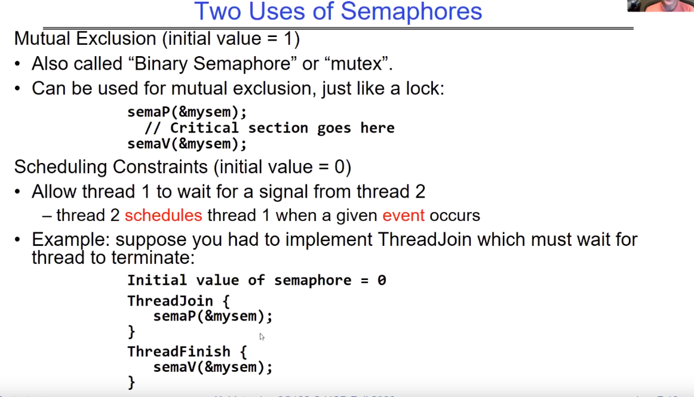

# Synchronization 1: Semaphores (Con’t) Lock Implementation, Atomic Instructions-Supplyment

# 1. Recall

这部分回忆了一些关于之前讲述的同步方法，即给临界区加上Lock后可以消除race condition，但是这并不是唯一的解决方法，我们可以使用Producer-Consumer模型。

# 2. Producer-Consumer Model

## 2.1 Producer-Consumer with a Bounded Buffer

**问题定义：**

- 生产者将数据放入共享缓冲区
- 消费者从中取出数据
- 需要同步来协调生产者和消费者之间的操作

不希望生产者和消费者必须同步工作，因此在它们之间放置一个固定大小的缓冲区

- 需要同步访问这个缓冲区
- 如果缓冲区已满，生产者需要等待
- 如果缓冲区为空，消费者需要等待

**示例1：GCC编译器**：cpp | cc1 | cc2 | as | ld

- "|"标识符在这里代表着管道操作。
- 在编译器链中，有多个阶段，每个阶段可以看作是一个生产者或消费者
- 这些阶段之间使用共享的缓冲区来传递中间结果
- 缓冲区的大小和同步机制需要确保编译器链的正确执行

**示例2：饮料自动贩卖机**
- 生产者是贩卖机供应商，只能放入有限数量的饮料
- 消费者是顾客，只能在贩卖机有货时购买饮料
- 缓冲区在这里是贩卖机内部的库存，需要确保生产者和消费者之间的同步，以避免出现问题

**其他应用场景：**
- Web服务器：请求可以看作生产者，响应可以看作消费者，它们之间使用缓冲区来传递请求和响应。
- 路由器：数据包进入路由器并需要根据路由表进行路由，这涉及到生产者和消费者之间的协调。

生产者-消费者问题是并发编程中的一个基本概念，了解如何有效地处理这种情况对于确保系统的正确性和性能至关重要。同步和互斥机制是在这种情况下使用的关键概念。

## 2.2 Why Locks can't meet all requests

如果我们只是采取lock去对缓冲区进行同步，这明显是比较浪费时间资源的，即使我们采取了自旋的形式：如生产者发现缓冲区已满，他不是马上放弃CPU，而是在一个循环中不断地解锁加锁，不断地自旋，直到发现缓冲区有空格了，就可以进行put操作。但是这种方式效率会比较低下，这意味着一个线程在自旋期间会不断的占据CPU资源，如果我们提前知道每个线程会短时间持有锁，这还好，不会浪费大量CPU，如果其他线程会长时间持有锁，那么自旋中的线程会浪费大量的CPU资源，因为它只是在自旋 ，并没有做什么有用的工作。

您提到的问题是多线程编程中的一个常见挑战，即如何在避免线程阻塞的情况下，有效地共享资源并减少 CPU 的浪费。这通常涉及到锁的粒度和性能权衡。

您提到的自旋锁是一种在一段时间内不断检查锁是否可用的方式，以避免线程进入阻塞状态。自旋锁通常对于短暂的锁定操作非常有效，因为它们避免了线程上下文切换和内核开销。然而，对于长时间持有锁的情况，自旋锁可能会导致 CPU 资源浪费，因为线程会不断自旋而无法做有用的工作。

为了解决这个问题，可以考虑以下几种方法：

1. **调整自旋次数或自旋超时**：可以限制自旋的最大次数或设置自旋的最大超时时间。如果在这个时间内锁仍然不可用，线程可以选择进入休眠状态或执行其他任务，以避免浪费 CPU 资源。

2. **使用互斥量的优化版本**：一些现代操作系统和编程库提供了针对长时间持有锁的优化版本的互斥量。这些版本可能会使用更复杂的策略，如自适应自旋和线程优先级，以减少 CPU 资源的浪费。

3. **锁分级**：将资源分成多个部分，每个部分有自己的锁，以减小锁的粒度。这可以减少锁的争用，从而减少自旋的需要。这种方法通常需要谨慎设计，以确保数据一致性。

4. **无锁数据结构**：考虑使用无锁数据结构，如 CAS（Compare-And-Swap）操作或读写锁，以减少锁的使用。这些数据结构可以允许多个线程并发访问资源而不需要锁。

5. **任务分解**：将任务分解为更小的子任务，以便可以在持有锁的情况下只处理其中一部分任务，从而减小锁的持有时间。

最终，选择哪种方法取决于您的具体应用程序需求和性能特点。在多线程编程中，通常需要权衡各种因素，包括并发性、内存开销、锁开销和 CPU 利用率，以找到最合适的解决方案。

## 2.3 Higher-level Primitives than Locks

什么是同步共享内存的线程的正确抽象？

- 我们希望尽可能使用高级原语 

好的原语和实践非常重要！

- 由于执行并非完全顺序，因此很难找到错误，因为它们很少发生
- UNIX现在相当稳定，但直到大约80年代中期（开始后10年），运行UNIX的系统每周都会崩溃 - 并发错误

同步是一种协调使用共享状态的多个并发活动的方式

- 这堂课和下一堂课将介绍一些结构化共享的方法

这段文字讨论了同步机制中更高级别原语（primitive）的概念。在计算机科学中，“原语”通常指代构成更复杂系统或程序结构基础部分。所以这里提到“比锁更高级”的原语，主要指那些用于管理和控制并发或者多线程环境下资源访问冲突问题的手段或者工具，例如信号量(semaphore)、互斥量(mutex)、条件变量(condition variable)等。

接下来几节课中我们将会讨论不同的同步方式和高级原语。

## 2.4 Semaphores Like Integers Except…

信号量是并发编程中的一种同步工具，用于控制多个进程对公共资源的访问，避免并发系统中的临界区问题。它们就像整数，但具有以下特性：

1. **无负值**：信号量的值总是非负的。它表示可用资源的数量或者可以访问某个特定代码段的任务数量。
2. **只允许进行P和V操作**：可以在信号量上执行两种操作 - P（proberen/test）和V（verhogen/increment）。P操作将信号量值减少1，如果它不为零（如果为零，则执行P操作的进程将阻塞，直到它不为零）。V操作将信号量值增加1，并在必要时唤醒任何等待的进程。
3. **原子操作**：对信号量进行的操作必须是原子性即不可中断。这确保了一旦一个进程开始执行一个操作，它必须完成而不被中断。
4. **初始化**：信号量可以初始化为任何非负整数值，通常表示某些资源可用单位数量。

在你提供的例子中，你提到了一个初始化为2用于资源控制的信号量，这意味着最初有两个单位某些资源可用。

POSIX标准通过添加额外功能来扩展了信号量, 如能够读取当前值, 但如你所注意到, 这技术上并不属于他们最初定义或接口部分!

### Two uses of semaphores

## 2.5 Revisit Bounded Buffer: Correctness constraints for solution

正确性约束：

- 如果没有满的缓冲区，消费者必须等待生产者填充缓冲区（调度约束）[1](https://www.studytonight.com/operating-system/bounded-buffer)。
- 如果所有缓冲区都已满，生产者必须等待消费者清空缓冲区（调度约束）[1](https://www.studytonight.com/operating-system/bounded-buffer)。
- 一次只能有一个线程操作缓冲区队列（互斥）[1](https://www.studytonight.com/operating-system/bounded-buffer)。

我们需要互斥的原因是因为计算机是“愚蠢”的。想象一下现实生活中的情况：送货人正在填充机器，而有人试图将他们的钱塞入机器[1](https://www.studytonight.com/operating-system/bounded-buffer)。

一般的经验法则是：对于每个约束使用一个单独的信号量[1](https://www.studytonight.com/operating-system/bounded-buffer)：

- 信号量 fullBuffers; // 消费者的约束
- 信号量 emptyBuffers;// 生产者的约束
- 信号量 mutex; // 互斥

有界缓冲区问题，也被称为生产者消费者问题，是同步问题的经典问题之一[1](https://www.studytonight.com/operating-system/bounded-buffer)[2](https://www.baeldung.com/cs/bounded-buffer-problem)。这个问题经常出现在多线程编程中[2](https://www.baeldung.com/cs/bounded-buffer-problem)。我们有一个包含n个插槽的缓冲区，每个插槽能存储一个数据单元。我们有两个正在运行的进程，即生产者和消费者，它们在缓冲区上进行操作[1](https://www.studytonight.com/operating-system/bounded-buffer)。

生产者试图将数据插入到缓冲区的一个空插槽中。消费者试图从缓冲区的一个已填充插槽中移除数据[1](https://www.studytonight.com/operating-system/bounded-buffer)。你可能已经猜到了，如果这两个进程同时执行，它们不会产生预期的输出[1](https://www.studytonight.com/operating-system/bounded-buffer)。

解决这个问题的一个方法是使用信号量[1](https://www.studytonight.com/operating-system/bounded-buffer)[2](https://www.baeldung.com/cs/bounded-buffer-problem)。这里将使用三个信号量：m、empty和full[1](https://www.studytonight.com/operating-system/bounded-buffer)。m是一个二进制信号量，用于获取和释放锁。empty是一个计数信号量，其初始值是缓冲区中插槽的数量，因为最初所有插槽都是空的。full是一个计数信号量，其初始值为0[1](https://www.studytonight.com/operating-system/bounded-buffer)。

在任何时刻，empty的当前值代表缓冲区中空插槽的数量，full代表缓冲区中占用插槽的数量[1](https://www.studytonight.com/operating-system/bounded-buffer)。

生产者操作和消费者操作都有自己特定的伪代码[1](https://www.studytonight.com/operating-system/bounded-buffer)。在这些操作中，我们可以看到生产者和消费者如何通过操作信号量来同步他们对缓冲区的访问[1](https://www.studytonight.com/operating-system/bounded-buffer)[2](https://www.baeldung.com/cs/bounded-buffer-problem)。

## 2.6 The thinking about Produ-Cons

P的操作顺序很重要，因为P是带有阻塞性质的，操作不当可能会导致死锁。而V是带有唤醒性质的，V的顺序是没有关系的。

# 3. Where are we going with Synchronization

## 3.1 All Sync tools of all levels

上图中是OS中各个层级提供给我们的一些Sync操作。

硬件层级提供给我们的Sync方式被称为原子操作（Atomic Operation）是：Load/Store，中断无效等等的方式给我们提供最基础的同步。

更高级别的原语要用硬件提供给我们的sync方式去实现。

当我们实现了这些更高级别的原语后，就可以去做多线程的任务，而多线程任务中我们在意的当然是堆上面的共享数据。

接下来的课程我们将讨论如何用硬件提供的原语去实现更高级别的原语。

## 3.2 use low-level primitive to implement hign-level primitive

使用底层硬件提供的原子操作实现各种高级同步原语是一项重要的任务[1](https://www.qemu.org/docs/master/devel/atomics.html)[2](https://www-inst.eecs.berkeley.edu/~cs162/su21/static/lectures/su21/7.pdf)[3](https://inst.eecs.berkeley.edu/~cs162/fa20/static/lectures/7.pdf)。

- 如果只有加载和存储这两种原子原语，那么所有的操作都会相当痛苦[1](https://www.qemu.org/docs/master/devel/atomics.html)[2](https://www-inst.eecs.berkeley.edu/~cs162/su21/static/lectures/su21/7.pdf)[3](https://inst.eecs.berkeley.edu/~cs162/fa20/static/lectures/7.pdf)。
- 因此，我们需要提供对用户级别有用的原语[1](https://www.qemu.org/docs/master/devel/atomics.html)[2](https://www-inst.eecs.berkeley.edu/~cs162/su21/static/lectures/su21/7.pdf)[3](https://inst.eecs.berkeley.edu/~cs162/fa20/static/lectures/7.pdf)。

原子操作是一种在多线程环境中用于同步的低级技术[1](https://www.qemu.org/docs/master/devel/atomics.html)[2](https://www-inst.eecs.berkeley.edu/~cs162/su21/static/lectures/su21/7.pdf)[3](https://inst.eecs.berkeley.edu/~cs162/fa20/static/lectures/7.pdf)。原子操作是指一个操作要么完全执行，要么完全不执行[3](https://inst.eecs.berkeley.edu/~cs162/fa20/static/lectures/7.pdf)。这些原子操作是构建各种同步原语的基础[1](https://www.qemu.org/docs/master/devel/atomics.html)[2](https://www-inst.eecs.berkeley.edu/~cs162/su21/static/lectures/su21/7.pdf)[3](https://inst.eecs.berkeley.edu/~cs162/fa20/static/lectures/7.pdf)。

同步原语，如互斥锁（Mutex）、事件（Event）、条件变量（Conditional Variables）和信号量（Semaphores）等，都是用于在多线程环境中协调和控制线程执行顺序的工具[4](https://stackoverflow.com/questions/8017507/definition-of-synchronization-primitive)。这些同步原语可以帮助我们在复杂的多线程环境中保持数据的一致性和完整性[1](https://www.qemu.org/docs/master/devel/atomics.html)[2](https://www-inst.eecs.berkeley.edu/~cs162/su21/static/lectures/su21/7.pdf)[3](https://inst.eecs.berkeley.edu/~cs162/fa20/static/lectures/7.pdf)[4](https://stackoverflow.com/questions/8017507/definition-of-synchronization-primitive)。

例如，QEMU提供了一个头文件qemu/atomic.h，它包装了C11的原子操作，以提供更好的可移植性和更简洁的语法[1](https://www.qemu.org/docs/master/devel/atomics.html)。在这个头文件中，提供了一些宏，这些宏分为三类：编译器屏障、弱原子访问和手动内存屏障、以及顺序一致的原子访问[1](https://www.qemu.org/docs/master/devel/atomics.html)。

总的来说，我们应该尽可能地使用更高级别的同步工具，如互斥锁、条件变量和信号量等，而不是直接使用原子操作和内存屏障[1](https://www.qemu.org/docs/master/devel/atomics.html)[2](https://www-inst.eecs.berkeley.edu/~cs162/su21/static/lectures/su21/7.pdf)[3](https://inst.eecs.berkeley.edu/~cs162/fa20/static/lectures/7.pdf)[4](https://stackoverflow.com/questions/8017507/definition-of-synchronization-primitive)。这样可以使我们的代码更易于理解和维护，同时也可以减少因并发问题导致的错误[1](https://www.qemu.org/docs/master/devel/atomics.html)[2](https://www-inst.eecs.berkeley.edu/~cs162/su21/static/lectures/su21/7.pdf)[3](https://inst.eecs.berkeley.edu/~cs162/fa20/static/lectures/7.pdf)[4](https://stackoverflow.com/questions/8017507/definition-of-synchronization-primitive)。
