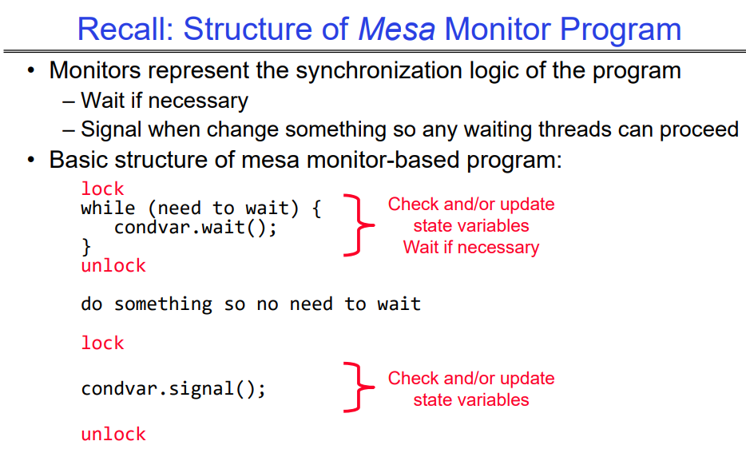
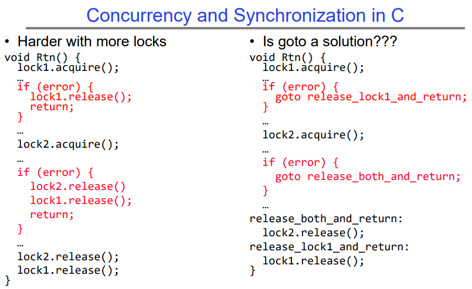
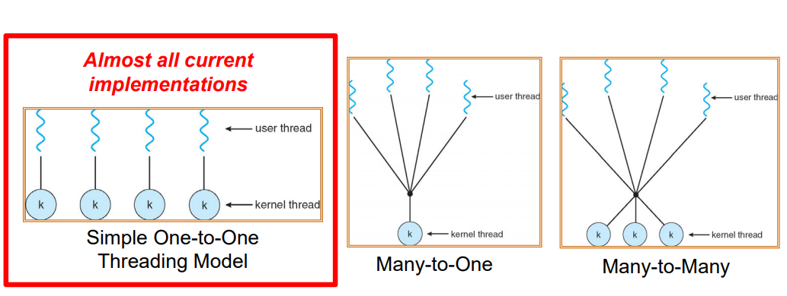
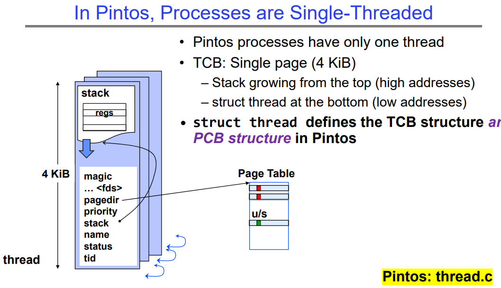
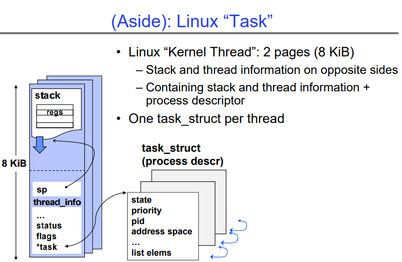
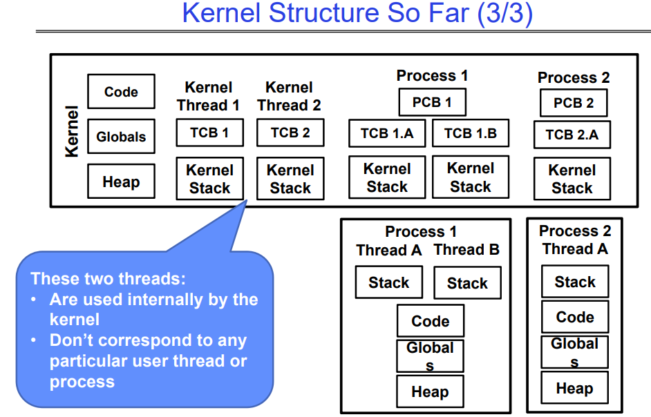
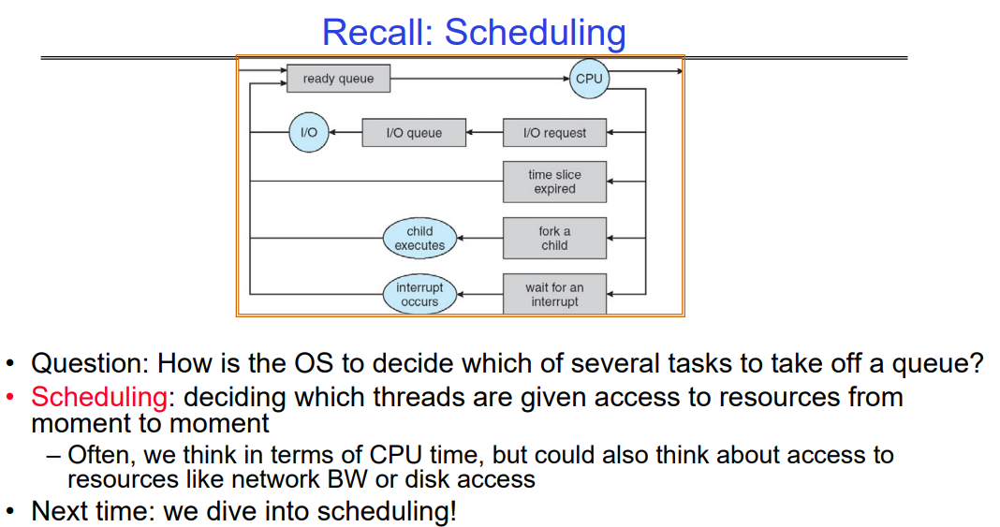

# Synchronization 4: Monitors and Readers/Writers (Con’t), Process Structure, Device Drivers

# Recall

## Structure of Mesa Monitor Program

从下图中很容易知道，lock在此处的作用是保护条件变量的访问，访问完并可以退出后，就可以解锁并对数据库或者相关的shared data做一些合理的事情了，做完之后需要唤醒一个等待的线程，注意所有涉及到条件变量的操作都需要用锁保护起来，保证操作是互斥的。

如果我们全程持有锁，那么很明显，在读写者问题中就不会允许多个Readers同时操作了。



##  Can we construct Monitors from Semaphores?

第一种实现是简单的用semaphore来套用：

```c
Wait(Semaphore *thesema)   { 
    // release(thelock);
    semaP(thesema);
    // acquire(thelock);
}
Signal(Semaphore *thesema) { semaV(thesema); }
```

这种明显不可以，因为在Wait的时候不会释放当前持有的锁，这会造成死锁。即使我们主动在P操作前释放锁，这种实现也会P操作和V操作可以交换的问题，因为无论谁先执行，都不会影响P操作可以被唤醒。而在条件变量中这种任意的顺序交换是不允许的。

进一步的，我们主动释放锁；如果可以在确定semaphore queue中有内容时才会实际调用signal()：

```pseudocode
Wait(Lock *thelock, Semaphore *thesema) {
    release(thelock);
    semaP(thesema);
    acquire(thelock);
}
Signal(Semaphore *thesema) {
    if semaphore queue is not empty
        semaV(thesema);
}
```

- 首先查看semaphores队列的行为是不允许的。
- 此外，这种方法有一个问题，若当前queue为空，且signal操作在wait()执行完release后、执行P之前运行，那么semaphores队列就会错过一个值递增，从而整体都会错过一次唤醒机会。

所以，这种方式是不可取的。

## Conclusion: We love Mesa Type Monitor

`Monitor=Lock+condition variables`的模式才是我们想要的，这种模式不用我们担心底层细节，可以让我们更专注于临界区与限制条件的实现的相关设计。

- 即使被唤醒后，也要反复确认是否真的可以继续执行了。
- 当执行完必要操作后，执行signal()操作唤醒某个正在wait()的程序。

```c++
lock;
while (need to wait) {
	condvar.wait();
}
unlock;

do something so no need to wait;

lock;
condvar.signal();
unlock;
```


# Languages Support for Synchronization

大多数高级语言都支持了对锁的处理，下面逐个介绍。

## C-Language Support for Synchronization

C语言本身并不支持在异常或错误的时候自动释放锁，因此我们要知道在临界区中所有可能的代码路径，并确保无论程序以什么方式退出，我们都需要及时的释放锁：

```c
int Rtn() {
acquire(&lock);
    …
    if (exception) {
        release(&lock);
        return errReturnCode;
    }
    …
    release(&lock);
    return OK;
}
```

如果有更多的锁，那么程序会变得更复杂，除了直接释放，我们还可以用goto方法让程序变得更美观：



## C++ Language Support for Synchronization

同样的，C++的Exception机制本身也不支持自动释放锁：

```c++
void Rtn() {
	lock.acquire();
    …
    DoFoo();
    …
    lock.release();
}
void DoFoo() {
    …
    if (exception) throw errException;
    …
}
```

上述代码中，如果在DoFoo函数中由于异常退出，那么会一直持有锁而导致问题。因此在C++中，我们必须在所有可能出现Exception的地方执行`Try-Catch`机制，及时的捕捉到各种异常，并主动地释放锁。

```c++
void Rtn() {
lock.acquire();
    try {
        …
        DoFoo();
        …
    } catch (…) { // catch exception
        lock.release(); // release lock
        throw; // re‐throw the exception
	}
	lock.release();
}
void DoFoo() {
    …
    if (exception) throw errException;
    …
}
```

### Much better: C++ Lock Guards

C++本身提供了std::lock_guard<>类，当我们退出lock()的作用域时，lock_guard会自动帮我们解锁。

- 本质上是因为lock_guard是在栈上分配的，这一点与smart pointer十分相似。

```c++
#include <mutex>
int global_i = 0;
std::mutex global_mutex;

void safe_increment() {
    std::lock_guard<std::mutex> lock(global_mutex);
    …
    global_i++;
    // Mutex released when ‘lock’ goes out of scope
}
```

## Python with Keyword

下面的代码展示了在Python中使用线程锁 (`threading.Lock`) 来实现同步操作。线程锁用于确保在多线程环境中对共享资源的安全访问。

```python
lock = threading.Lock()
…
with lock: # Automatically calls acquire()
    some_var += 1
    …
# release() called however we leave block
```

with语句自动实现了一个临界区：

1. `lock = threading.Lock()`: 在这一行中，我们创建了一个线程锁对象 `lock`。

2. `with lock:` 这是Python中的上下文管理器 (`with` 语句)，它会在代码块的开始和结束时自动调用线程锁的 `acquire()` 和 `release()` 方法。在代码块内部的任何代码执行前，`acquire()` 方法会被调用以获取锁。而当代码块执行完毕后，`release()` 方法会被调用以释放锁。

3. `some_var += 1`: 这是一个示例操作，可以是对共享资源的任何操作。在这种情况下，假设 `some_var` 是一个在多个线程中共享的变量，我们使用线程锁来确保对它的递增操作是原子的，即在同一时间只有一个线程可以执行此操作，以避免竞态条件（race condition）。

4. 在 `with lock:` 代码块结束时，Python会自动调用 `lock` 对象的 `release()` 方法，以释放锁。这样，其他线程就可以继续获取这个锁并执行他们的操作。

总之，这段代码展示了如何使用 Python 中的 `threading.Lock` 来确保在多线程环境中对共享资源的安全访问，通过 `with` 语句来保证在进入和离开临界区时自动获取和释放锁。

## Java synchronized Keyword

每个Java对象都有一个关联的锁，这个对象默认的关联锁只会在被声明为synchronized关键字的方法上使用：
- 在进入同步方法时获取锁，在退出时释放锁。
- 如果在同步方法内部发生异常，则会正确释放锁。
- 保证同步方法的互斥执行（注意死锁）。

```java
class Account {
    private int balance;
    
    // 对象构造函数
    public Account(int initialBalance) {
        balance = initialBalance;
    }
    
    // 获取余额
    public synchronized int getBalance() {
        return balance;
    }
    
    // 存款
    public synchronized void deposit(int amount) {
        balance += amount;
    }
}
```

### Java Support for Monitors

除了锁之外，每个对象还有一个与之关联的单个条件变量。

在同步方法内等待：

- `void wait();`
- `void wait(long timeout);`

在同步方法内发出信号：

- `void notify();`
- `void notifyAll();`

与c++的condition variable的道理是一样的。

# Recall: User/kernel Threading Modelss



目前大多数采用的是一个内核线程<->一个用户态线程的one-to-one的方式。

对于进程中的每个线程，内核维护着：
- 线程的TCB（线程控制块）
- 用于系统调用/中断/陷阱的内核栈，即该用户线程对应的内核线程持有的栈
  - 这种内核状态有时被称为“内核线程”
  - 当线程在用户空间运行时，“内核线程”被挂起（但准备就绪）
- 当用户线程产生了某些需要内核线程需要做的工作时，就会进入内核态，该内核线程会启动。

此外，一些线程仅在内核中执行工作，这些内核线程是服务于内核本身的：

- 仍然有TCB
- 仍然有内核栈
- 但不属于任何进程，并且永远不会在用户模式下执行

## In Pintos, Processes are Single-Threaded

Pintos中每个进程只有一个线程，是Singe-thread to single-process模型。




## Linux的kernel Thread(task_struct)

在 Linux 中，内核线程（Kernel Thread）对应着一个叫做 task_struct 的数据结构，该数据结构占据着内存中的 2 个页面（也就是 8 KiB）。

- Stack和thread信息是在相反的方向向增长的，一个page存放stack，一个page存放相关元数据信息。

- 这个 task_struct 结构体中包含了线程的各种信息，比如进程 ID、线程状态、调度信息等。其中的一部分是关于内核线程的栈和线程信息，另一部分则是关于进程的描述符。

每个线程都有一个对应的 task_struct 结构体，这意味着对于每个线程来说，都有一份单独的描述信息来管理它的状态和属性。这个结构体的大小是固定的，因此对于内核线程来说，它占据了 2 个页面的内存空间，其中包含了栈、线程信息以及进程描述符。



## Multithreaded Processes (not in Pintos)

传统的实现策略：
- 每个进程一个 PCB（进程结构）
- 每个 PCB 包含（或存储指向）每个线程的 TCB（线程控制块）

Linux 的策略：

- 每个线程一个 task_struct
- 属于同一进程的线程恰好共享一些资源
  - 如地址空间、文件描述符表等

## Kernel Structure So Far 

下图是进程和线程模型的一个抽象图，很明白的可以看出每个用户线程在内核态中都会有一个对应的内核线程。并且有一些内核线程是不会对外提供服务的，他们仅仅服务于内核，不对应任何用户态线程。



## Timer may trigger thread switch

简单说明一下线程调度是如何发生的，以定时器中断为例，用户会先进入内核态，找到对应的内核线程，之后：

thread_tick
- 更新线程计数器
- 如果时间片用完，设置yield标志

thread_yield
- 在中断返回路径上
- 将当前线程设置回READY状态
- 将其重新加入ready_list
- 调用schedule函数选择下一个要运行的线程，在iret时切换到该线程继续运行

Schedule（下一讲！）
- 选择下一个要运行的线程
- 调用switch_threads函数将寄存器指向线程恢复的堆栈
- 将其状态设置为RUNNING
- 如果是用户线程，激活该进程
- 返回到intr_handler

如果新的待运行内核线程有对应的用户线程，那么最终会返回到用户线程。

## Scheduling


操作系统决定从队列中取出哪个任务进行调度是操作系统调度的一个基本方面。这个决定通常由操作系统的调度器组件完成。调度器使用各种调度算法来确定任务或线程被授予系统资源的顺序。

调度标准：

1. **CPU 时间**：大多数调度决策都围绕着分配 CPU 时间给不同的任务或线程。调度器旨在实现公平性、吞吐量、响应时间或其他性能指标。
2. **优先级**：任务或线程可能具有关联的优先级，调度器可能会优先考虑较高优先级的任务，以确保关键操作的及时执行。
3. **资源可用性**：调度器在进行调度决策时可能考虑除了 CPU 之外的其他资源的可用性，例如网络带宽、磁盘访问或内存。
4. **截止时间**：实时系统可能根据任务的截止时间对任务进行优先级排序，以确保关键任务在指定的时间限制内完成。
5. **I/O 操作**：等待 I/O 操作完成的任务可能会被降低优先级，或者放入不同的调度队列，直到所需的资源可用为止。

教授讲了很多和调度、虚拟内存等相关的内容，这些会在后面的课程详述，十分的重点。

# Conclusion

Monitor:是一个很实用的编程范式，用lock+若干个condition variables的模式实现互斥与相关的限制条件。

- 在访问共享数据时，我们总是要先Acquire(Lock)。
- 之后用条件变量实现限制条件，这允许我们可以在critical section内等待。
  -  `Three Operations: Wait(), Signal(), and Broadcast()`

`Monitor`模式代表程序的逻辑

- 如果必要，等待。
- 当改变了某些东西时发出信号，以便任何等待的线程可以继续执行。
- 监视器在许多编程语言中原生支持。

读者/写者`Monitor`模式示例
- 展示了监视器如何允许对受保护代码进行复杂的控制输入。`Monitor`模式允许我们实现允许多个reader同时读，writer优先工作等限制条件。

 `Kernel Thread`：堆栈+状态构成了一个内核线程，用于内核中的独立执行，是一个独立的内核执行单元
- 每个用户级线程都与一个内核线程一一对应

- 当用户级线程正在运行时，与用户级线程关联的内核线程处于“挂起”状态（准备就绪）。内核线程在以下情况下会被调度执行：

  1. **内核级任务**：内核线程通常用于执行内核级别的任务和操作，如管理文件系统、网络通信、设备驱动程序等。当系统需要执行这些任务时，与之关联的内核线程会被调度执行。

  2. **中断处理**：当系统发生硬件中断或软件中断时，内核需要处理这些中断事件。内核线程负责处理中断，因此会被调度执行以处理中断事件。

  3. **系统调用**：当用户级别线程调用系统调用时，会导致切换到内核态并执行相应的内核代码。与当前用户级别线程关联的内核线程会被调度执行以处理系统调用请求。

  4. **定时器事件**：内核线程可能会处理定时器事件，如定期检查和更新系统状态、执行定时任务等。

  5. **内核调度策略**：内核的调度策略也会影响内核线程的调度执行。内核会根据不同的调度算法和策略来确定哪个内核线程应该被调度执行，以达到一定的调度目标，如公平性、响应时间等。

  总之，内核线程会在处理内核级任务、中断、系统调用、定时器事件等情况下被调度执行，以保证系统的正常运行和高效处理。

设备驱动程序（下节课讲）：内核中与设备硬件直接交互的设备特定代码
- 支持标准的内部接口
- 相同的内核 I/O 系统可以轻松地与不同的设备驱动程序进行交互
