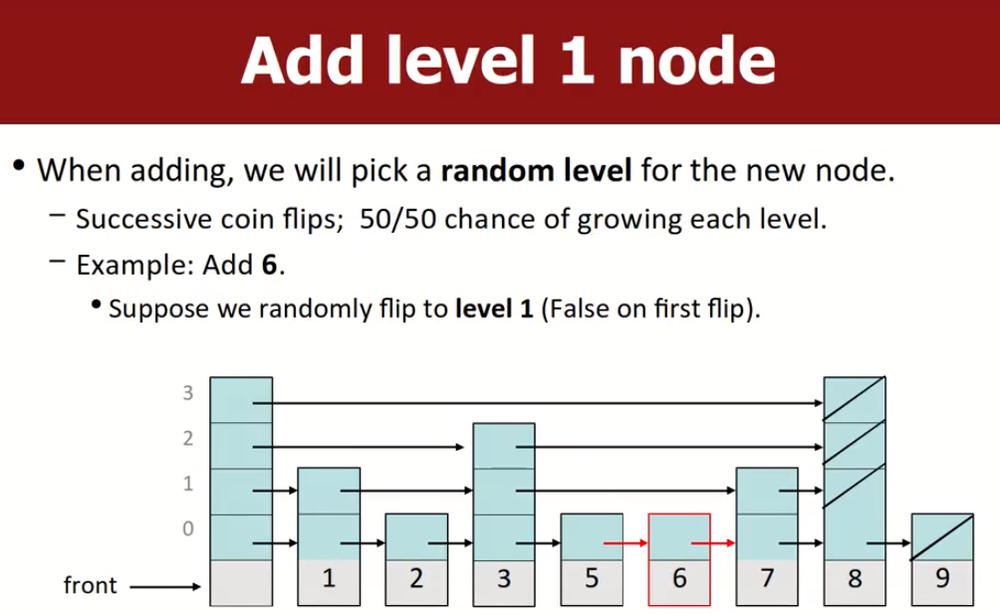

# Classes and Objects1

## some concepts

`object`：是一个实体，该实体结合了state和behavior。（即变量和函数）

`object-oriented programming`：程序的执行表现为object之间的交互，大部分代码都与object有关，这些对象执行任务并与其他对象相互协作。

`abstraction`：将概念与实现细节解耦。比如我们在c++中，知道STL中有哪些类可以使用，我们只需要了解其函数原型（函数名），知道怎么用即可，而不用去了解STL的实现细节。

## elements of a class

`member variables`：在每个object内部的state。每个object实例都有一份副本。注意classs定义中只做变量声明，不要进行初始化操作，声明与初始化应该分离。

`member functions`：在每个object内部的behaviour。每个object实例都有一份函数副本，并且这些函数可以与object内部的数据进行交互。

`constructor`：在对象实例被创建的时候初始化objects。用于设置每个新object实例的初始state，因此构造函数通常接收state值作为参数。

## class declaration（.h文件）

这里教我们如何正确的声明一个类的函数原型文件，即只包含定义部分（class.h文件）。#include的作用实际上是把目标.h文件的内容直接复制并粘贴过来。

```c++
// 考虑如下情况：某个class有多个.cpp文件，因此每个cpp文件都要Include这个.h，添加#ifndef、#define声明可以确保.h中的内容只会被声明一次，即使他被多个cpp文件多次include。
// 或者更简单的方法，直接开头声明一个#pragma once即可，但是#pragma once并不会兼容所有编译器，因此首选还是使用下列的组合声明套装
#ifndef _classname_h // if not define,
#define _classname_h  // then define

class ClassName {
public:
    ClassName(...); // 构造函数
    .... // 可以声明一些成员函数
private:
    type name; // 成员变量
    type name;
};
#endif // endif
```

.cpp文件的编写就很简单了，在函数开始#include该.h文件后，我们可以定义相关的函数体，ReturnType ClassName::MemFunc(....)  { ....}。

此外，private属性只是在访问层面保护了数据，比如cn.name的访问方式是行不通的，但是如果我们知道cn.name的内存地址，我们确实可以直接去访问修改它，并且编译器还支持这种方式，不会阻止。

#  Const关键字

再强调一次，当我们试图了解一个变量，而该变量的声明很复杂时，采用**从右向左法**进行解读即可。

在C++中，`const` 关键字用于声明常量。它可以应用于变量、函数、指针、引用等多种情况，用于指定数据的不可变性。

以下是 `const` 关键字的几种用法及其示例说明：

## 声明常量变量：

```cpp
const int MAX_SIZE = 100;
```

在这个例子中，`MAX_SIZE` 被声明为一个常量，其值不可更改。

## 声明常量引用：

```cpp
const int& ref = someVariable;
```

在这个例子中，`ref` 是一个常量引用，它指向 `someVariable`，并且不允许通过 `ref` 修改 `someVariable` 的值。

## 声明常量指针：

```cpp
int value = 42;
const int* ptr = &value;
```

在这个例子中，`ptr` 是一个指向整型常量的指针，它指向 `value`，并且不允许通过 `ptr` 修改 `value` 的值。

## 声明常量成员函数：

```cpp
class MyClass {
public:
    void print() const {
        // 该成员函数不会修改对象的状态
        // 且不能调用任何非const类型的函数
    }
};
```

在这个例子中，`print()` 函数被声明为一个常量成员函数，它不会修改对象的状态。这样的函数可以在常量对象上被调用。`const` 关键字可以确保数据的不可变性，在程序设计中有助于提高代码的安全性和可维护性。

对于 C++ 中的成员函数而言，如果一个成员函数被声明为 `const`，那么在该函数中不能调用非 `const` 的成员函数。这是因为 `const` 成员函数被设计为不修改对象的状态，而调用非 `const` 成员函数可能会导致对象状态的修改，这与 `const` 成员函数的语义相违背。

### 非成员函数

在 C++ 中，对于不属于类的函数，你无法直接将 `const` 属性放在末尾，因为这个属性是针对类的成员函数的。然而，你可以通过使用函数参数的 const 修饰符来达到类似的效果。

如果你想要一个不属于类的函数在使用时遵循 const 的约束，你可以将需要保持不变的参数声明为 const 引用或 const 指针。

# Classed and Objects2

## overloading(重载)和overriding(覆盖)

在 C++ 中，"overloading"（重载）和 "overriding"（覆盖）是两个不同的概念，分别适用于函数和类中的方法。

**函数重载**：

- 函数重载指的是在同一个作用域中定义多个同名函数，但是它们的参数列表不同。
- 这些函数可以有不同数量或类型的参数。
- 当调用函数时，编译器根据传递给函数的参数的数量和类型来确定调用哪个函数。
- 函数重载允许为不同类型或数量的参数提供多个函数实现，提高了代码的可读性和灵活性。
- 示例：
  ```cpp
  int add(int a, int b) {
      return a + b;
  }
  
  double add(double a, double b) {
      return a + b;
  }
  ```

**方法覆盖**：
- 方法覆盖发生在继承的上下文中，子类提供了对父类中已定义方法的特定实现。
- 子类中覆盖的方法必须与父类中的方法具有相同的签名（名称和参数）。
- 当在子类对象上调用方法时，将执行子类中的覆盖方法，而不是父类中的方法。
- 方法覆盖允许在子类中提供特定的行为，促进了代码的重用和多态性。
- 示例：
  ```cpp
  class Animal {
  public:
      virtual void speak() {
          cout << "Animal speaks" << endl;
      }
  };
  
  class Dog : public Animal {
  public:
      void speak() override {
          cout << "Dog barks" << endl;
      }
  };
  ```

总的来说，函数重载允许定义具有相同名称但不同参数的多个函数，而方法覆盖允许子类提供对父类方法的特定实现。"overloading"（重载）和 重载在编译时根据函数签名解析，而"overriding"（覆盖）在运行时根据实际对象类型解析。

## operator overloading（操作符重载）非成员函数方式

这是c++中一个独有的特性，`operator overloading`允许我们为自定义类重新定义一些在c++中通用的操作符。下面列出了具体支持的一些操作符，有二进制的，有十进制的：


格式语法如下：

```c++
returnType operator op(params); // .h文件,op就是我们想要重载的操作符。
returnType operator op(params) { statements; }; // .cpp文件,op就是我们想要重载的操作符。

// 比如说，我们可以为foo类重载+运算符
operator +(Foo a, Foo b) { statements;}
```

此外，操作符重载函数一般不会声明为成员函数，万一该函数需要访问类的一些私有成员，而我们恰好没有声明该成员的get方法（这种情况很少很少见，一般都是成员函数需要访问类的私有数据），此时可以在类中将该重载方法加上friend关键字声明，这样该方法就可以直接访问private成员了：

```c++
class TA {
	....
    friend bool operator ==(const TA& ta1, const TA& ta2);
private:
    a int;
    b int;
};
bool operator ==(const TA& ta1, const TA& ta2) {
	return  ta1.a == ta2.a && ta1.b == ta2.b;
}
```

此外，我们也可以将操作符重载函数声明为成员函数，第一个操作数是对象本身，需要指定第二个可能的操作对象，但是这种方法有诸多限制，上述非成员函数方式更为通用。

### 重载 << 操作符

为了让我们的自定义类可以用cout直接输出，可以重载<<操作符，第一个参数是ostream类，第二个是我们想要输出的类，前面已经学过ostream包含一系列的输出流定义。格式如下：

```c++
ostream& operator <<(ostream& out, Type& name) {
    // out << name.a << endl;
    // 或别的statements;
    return out;
}
```

本质上就是向流中输入信息，之后返回该ostream对象。类似的，我们也可以重载>>运算符，举一反三。

## Destructor（析构函数）

当类的对象实例被程序删除的时候，调用析构函数。或者当前object所在的{}作用域结束时，会自动调用默认析构函数；析构函数有默认的，当然也可以自定义，从而主动释放堆内存。

当类对象实例中有一些资源需要我们主动去收尾时，析构函数就很有用了：

- 在对象内部保存一些临时资源。
- 释放所有被实例对象成员使用的动态分配的内存资源。

语法格式如下：

```c++
// classname.h
~classname() {}
```

# LinkedLists Variants

Double LinkedLists（双向链表）和Skip Lists（跳表），我们接下来会重点介绍跳表。

## Double LinkedLists（双向链表）

 每个节点有prev和next两个指针。双向链表类通常会维护head和tail两个指针。这个之前就已经接触过了，只是操作时需要小心，需要确保所有涉及到的指针都被正确的更新。

# Skip Lists（跳表）

Skip List是一种高效的可替代平衡树的数据结构，用于存储**有序**的元素集合。它通过在多个层上维护多个指向其他元素的指针来实现快速搜索、插入、删除操作。Skip List的平均时间和空间复杂度都是O(log n)，其中n是列表中元素的数量。

Skip List由多层组成，最底层是原始的有序序列。每一层都是下一层的一个子集，并且每个元素通过一个或多个向右的指针与同一层的其他元素相连。顶层的元素数量最少，但通过跳跃连接可以快速接近任何元素。

- **搜索**：从顶层开始搜索，如果下一个元素大于搜索键，则下降一层继续搜索，直到找到目标元素或到达列表底层。
- **插入**：首先搜索元素的位置，然后以一定的随机概率决定新元素应该插入到哪些层中，为新元素在这些层中找到其位置并更新指针。
- **删除**：搜索元素的位置，然后在每一层中删除该元素并更新指针。

## Dummy header

跳表的节点存储一个数据，并存储一个指向下一个节点的指针的数组，注意每个指针指向的下一个节点都是不同的。此外，跳表的head pointer不存储任何数据。


## Search a skip list 

我们可以看到，多层跳表中，每一层都是其下层的链表子集。


## Add to a skip list

### 1.决定新元素的层数

插入一个新数据，并且不指定该元素要占据的层数；那么在哪些层插入新数据是随机决定的，插入后需要更新对应层的指针。

这里的策略是：连续的抛硬币，如果第一次就是false，那么只放在第0层；如果是{true,false}，则第0层和第1层都有；如果我们的运气足够好，抛出了连续4次true，这意味着要在第4层也放，但是当前没有第四层，因此需要新建一层，将其指针指向新数据。



### 2.决定插入位置

现在已经通过步骤1知道了新元素K的所占层数，那么需要按照一定的规则去添加。

添加3层值K到跳表中，从K的顶层开始，即从现有skiplist的第2层开始查：

- 到达该层末尾，或者发现K小于下一个节点的值：
  - 将值K插入到该节点的前面，并且下降一层，更新后续指针。
- 否则继续向右


## Remove node from a skip list

Remove操作需要更新所有与目标node相关的链表队列。