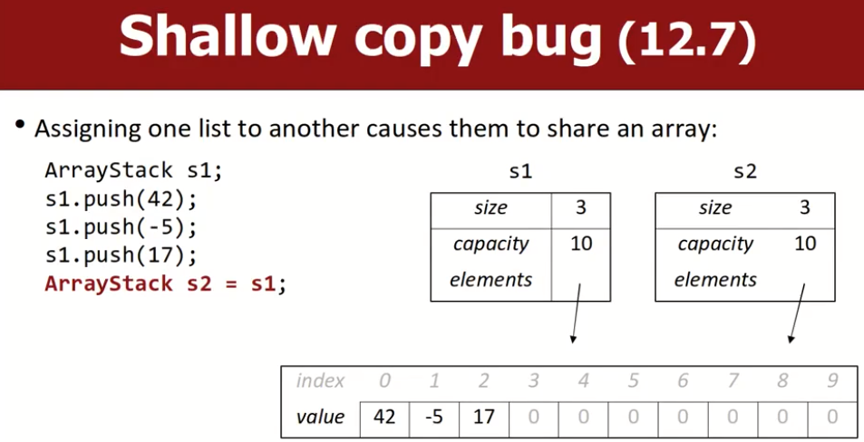

# Arrays and Templates

# Arrays

## create arrays and initialize

```c++
type name[length]; // 在栈上创建
type* name = new type[length]; // 在堆上创建
```

在栈上创建的数组是静态的，不能改变大小，无需手动释放，当前函数结束后会自动释放内存。

在堆上创建的数组是动态的，在使用完后需要我们调用delete手动释放：`delete[] name`，否则会有内存泄露。本质上name也是一个指针，每次+1就是一块type类型的数据，length是我们在堆上申请的块数。

动态意味着我们可以重新申请一块更大的数组，注意原地址的内存大小没变，但是我们申请了一块更大的内存。

上面是对数组的声明，由于没有对存储内容进行初始化，里面存储的都是垃圾值，在堆上创建动态数组时，c++有一种默认的初始化方法，此外，还有一种适用于堆和栈上的初始化方法:

```c++
int* a = new int[4](); // 意味着全部初始化为0，注意这是一种语法，()里面不能填值
int* a = new int[4] {1,2,3,4} // 创建+初始化
int* a = new int[4] {} // 创建+初始化为0

int a[4] {} // 创建+初始化为0
int a[4] {1,2,3,4} // 创建+初始化
```

## How Vector/Stack works

vector内部是一个array，我们称之为unfilled array，通常这个array会比当前已经放入的元素数量大，他会自己动态的扩容，即重新申请更大的内存空间，并把旧值复制过去。

- `vector::size()`：当前vector放了多少个元素进去。
- `vector::capacity()`：当前vector内部的总容量，即当前最多可以容纳多少个元素。

stack通常也是使用unfilled array实现的。可以尝试用Array去实现一个Stack，实现常见的pop、push、peek等操作。

## shallow copy bug（浅拷贝bug）

执行ArrayStack s2=s1后，栈上的变量会被复制过去，但是对于堆上的array，S1和S2会共享同一块内存区域。



## Deep Copy（深拷贝）

为了解决上述的浅拷贝bug，可以进行deep copy，需要定义如下函数：

```c++
// a copy constructor(用另一个类作为参数)
ArrayStack(const ArrayStack& stack);

// an assignment operator(为ArrayStack类重载=运算符)
// 很明显这是一个成员函数
ArrayStack & operator =(const ArrayStack& stack);
```

`Rule of Three`：在c++中，当我们定义了下面三个函数中任意一个时，最好把这三个都定义了：

- copy constructor（复制构造函数）
- assignment operator（重载=运算符）
- destructor（析构函数）

还有一种绕过他们的方法，将这deep copy方法的声明放到private部分，这样使用者就不被允许进行赋值构造了。

# Template

在 C++ 中，模板（Template）是一种通用编程工具，允许编写通用的代码，以处理各种数据类型，而不仅仅是特定的数据类型。通过模板，可以编写函数模板和类模板，使得代码更加灵活、可重用和通用化。

下面我将分别介绍函数模板和类模板的用法，并提供示例说明。

## 函数模板（Function Templates）

函数模板允许你编写一个通用的函数，该函数可以用于不同的数据类型。

### 基本语法

```cpp
template <typename T>
T functionName(T parameter) {
    // 函数实现
}
```

### 示例

```cpp
#include <iostream>

// 函数模板，用于比较两个值的大小
template <typename T>
T max(T a, T b) {
    return (a > b) ? a : b;
}

int main() {
    std::cout << "Max of 3 and 5: " << max(3, 5) << std::endl; // 使用函数模板比较整数
    std::cout << "Max of 3.5 and 6.7: " << max(3.5, 6.7) << std::endl; // 使用函数模板比较浮点数

    return 0;
}
```

## 类模板（Class Templates）

类模板允许你编写一个通用的类，该类可以处理各种数据类型。

### 基本语法

```cpp
template <typename T>
class ClassName {
    // 类成员和成员函数
};
```

### 示例

```cpp
#include <iostream>

// 类模板，表示一个通用的容器类
template <typename T>
class Container {
private:
    T element;

public:
    Container(T elem) : element(elem) {}

    void display() {
        std::cout << "Element: " << element << std::endl;
    }
};

int main() {
    Container<int> intContainer(10); // 使用类模板创建一个存储整数的容器
    intContainer.display();

    Container<double> doubleContainer(3.14); // 使用类模板创建一个存储双精度浮点数的容器
    doubleContainer.display();

    return 0;
}
```

在上述示例中，`max()` 函数模板和 `Container` 类模板都是通用的，可以处理不同的数据类型（整数、浮点数等）。通过模板，我们可以编写更加通用、灵活的代码，提高代码的可重用性和通用性。