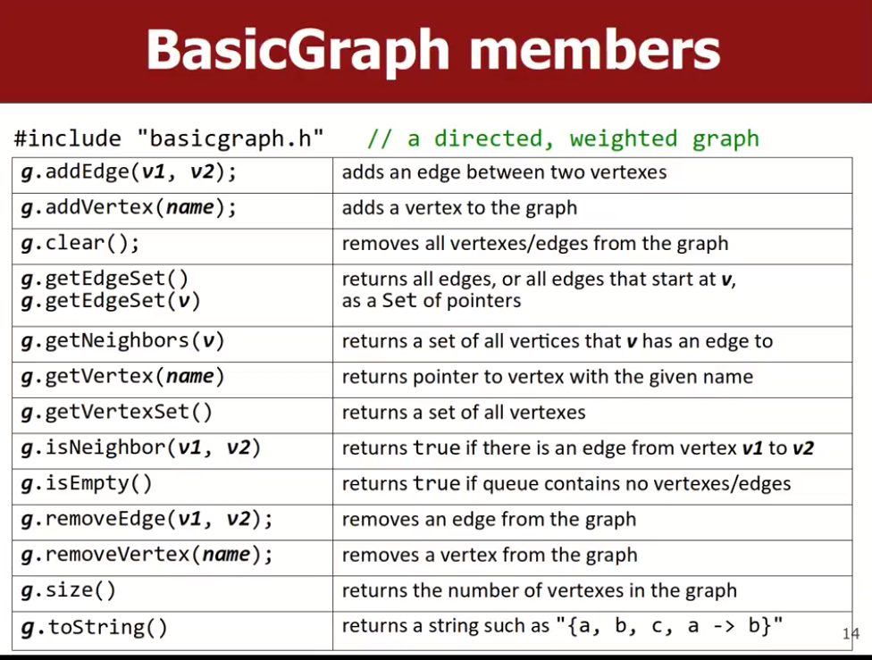
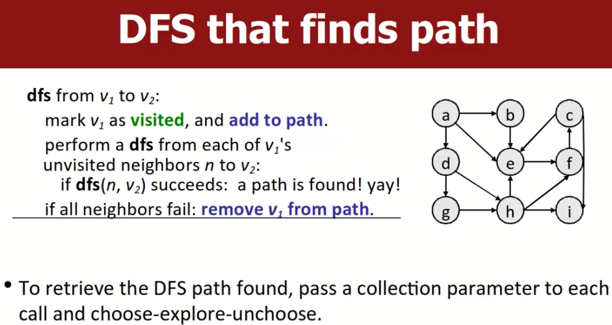
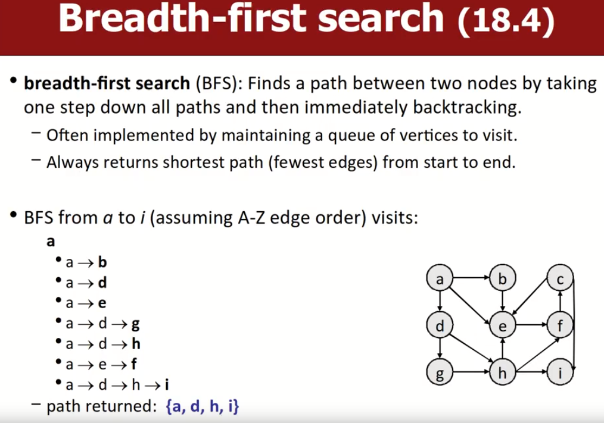
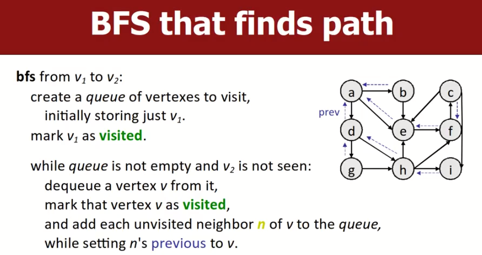
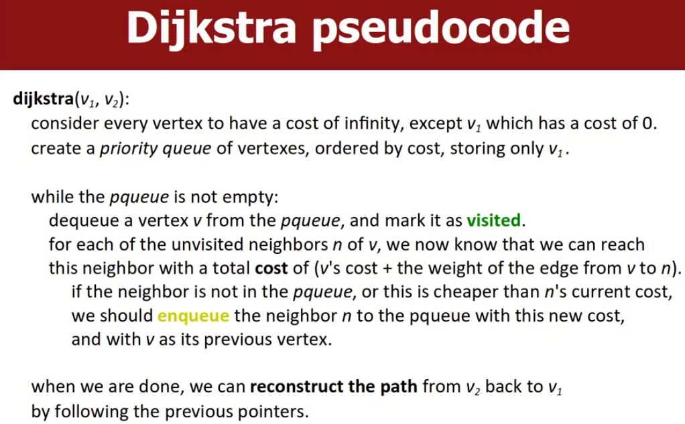
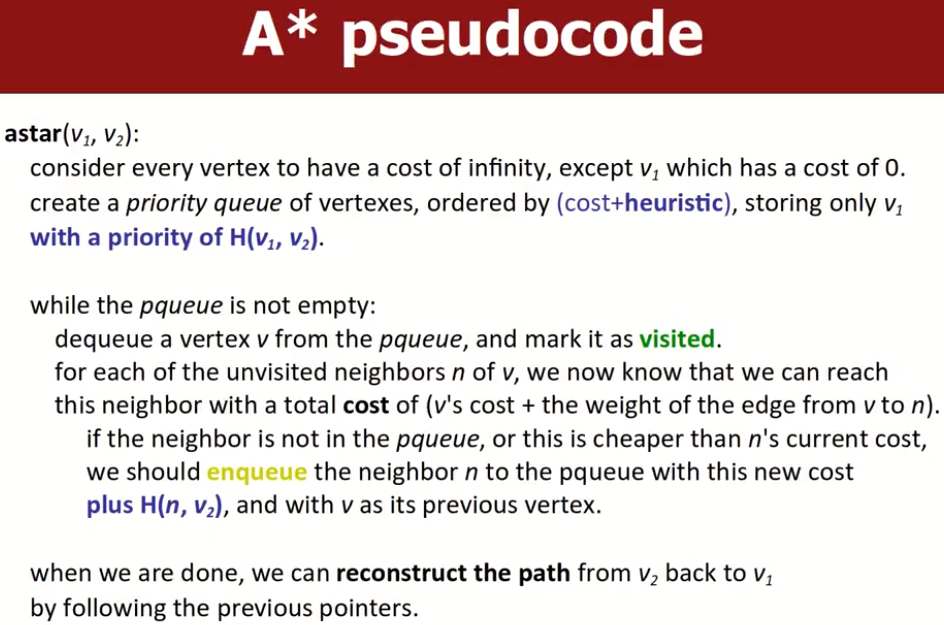

# Graphs and Graphs Searching Algorithms

## Graph的一些基本知识

这些知识以前有学过，如图中的`vertex`、`edge`、`path`、`neighbor/adjacent`等。介绍一些没见过的：

- `reachable`：存在一条从a到b的path，称从b可以到达a。a对于b而言是reachable的。
- `connected`：图中任意vertex对于其他vertex都是reachable的，称该图是connected的。连通图。
- `complete`：图中每个vertex都有一条直接的边连向其余所有的vertex，称该图是complete的。完全图。
- `cycle`：图中存在环；`acyclic graph`意味着图中没有环。
- `loop`：图中存在一个vertex ，它有一条边指向自己。

## Graph's variants

`weighted graphs`：每条边上都有一个给定的权重，大多数图不允许负数权重。比如说航线图中，边上的权重代表里程数。

`directed graph`：有向图，边是有方向的。

- 二叉树也可以理解为一个带有一定限制的图，无权重的有向无环图（DAG）。

## SPL:basic graph

SPL中有一个BasicGraph类，代表了一个带权重的有向图，是基于类Graph实现的。

# Graph Searching Algorithm

## DFS（Depth-first Search）

 目标是寻找两个顶点之间的路径，探索特点是：在回溯之前，对于每一条路径尽可能深入的探索。

- 经常用回溯实现。
- 许多图算法都使用visiting或marking来标记某个vertex已经被访问过了。防止在访问时陷入循环，即防止不停地重复访问某一个点。
- 该算法不能确保找到最短路径。这种方法的优点是简单。

## BFS（Breadth-first searching）

目标是探索两个顶点之间的路径，搜索特点是，优先探索每个节点的所有邻居，探索完一个节点的所有邻居后马上回溯，之后探索该节点的父节点的下一个邻居节点（与上面的节点属于同一深度），当前深度探索完毕后，深度+1，不停地执行，直到找到目标路径或探索结束。

> 每次只专注于探索一个路径。

注意，在探索时，和当前节点属于同一批次邻居的节点不能被探索，如下图中，g，h，f是一个批次的，虽然存在g->h的路径，但是此路径是不允许被探索的。

- 实现时，经常使用一个队列保存将要探索的vertexs，即同属于同一个深度的vertexs。
- 总是可以返回**最少的边数的路径**。这很容易从BFS算法的特点中推断出来。因为该算法在探索完一个深度，且没有找到目标路径，才会继续探索下一个深度。
- 但是有时候BFS相比于DFS而言更耗时。

### 算法实现思想（bfs from v1 to v2）

上面说过我们会维护一个queue来保存将要访问的节点，刚开始只有一个初始节点v1，我们会重复如下过程，直到队列为空（队列是先进先出）：

> 同时探索多个可能的路径。

- 从队列中取出第一个元素，将其标记为已访问（`visited`），然后将该元素的所有的处于`unvisited`的状态邻居放入队列之中，待后续处理。
- 不断重复上述过程，直到我们取出目标节点为止。
- 如果想确定路径，我们一般会设置一个数据结构，每一次将unvisited的邻居节点放入队列中时，同时设置`vec[n]=v`，即意味着这些n（邻居）节点的previous节点是n。（可以用vector、map等）
- 当我们找到路径后，可以用反向的方法，从I开始逆序索引找出路径。并将路径返回给用户。

此外，还可以根据需要求去定制化算法，如找到目标步数的路径，找到所有可能的路径等等。

## DFS，BFS runtime(成本分析)

**时间复杂度O(V+E)**：两种算法的时间复杂度和空间复杂度与图的顶点数量V和边数E有关系，在最坏的情况下，DFS和BFS算法都要把每个顶点/每条边都要检查一次，且只会检查一次。因此时间复杂度应该是`O(V+E)`。

> 后面会有课程专门分析为什么时间复杂度是`O(V+E)`，先留个疑问

空间复杂度未做说明其实无论是时间复杂度还是空间复杂度，都和采用的数据结构有关，如采用邻接表和采用邻接矩阵的运行成本可能是不同的。

------

下面讲的Dijkstra算法和A*算法都是在BFS算法的基础上进行进一步改进的版本，目的是提高BFS的执行速度。

适用于图的规模十分庞大的场景。此外，这些算法考虑了权重因素，最短路径往往不一定是权重和最低的路径，我们想要的也不总是最短路径，也可能是成本最低的路径。

这里讲解的算法没有考虑任何优化，是最原生的版本，适用于所有具有不同特点的图。

# Dijkstra's Searching-BFS算法的改良版

在一个**带权重的有向图**中，给定一个起始vertex，dijkstra算法可以找到从该给定点到其他任意顶点的最小权重和路径。算法基本思想如下：

- 创建一个表的数据结构，里面存储了当前从给定顶点到达每个vertex的最低权重路径（每个vertex记录了到自己的当前最低成本路径对应的成本，以及基于该路径的previous vertex序号），之后不断地改良这些信息，直到最优解。
- 该算法改良自BFS，因此它同样是先查看所有低成本的路径，之后才会查看所有高成本路径。

比如说，寻找最优路径问题，城市是vertexs，路程长度是带权重的边，Dijkstra算法可以找到从一个给定city到**其他任何一个城市**的最短里程路径。当每条边的权重都相同时，Dijkstra算法就退化为BFS搜索算法。

该算法具有多种不同的变种，可以在某些类型的图中最大化发挥作用。可以自行了解这些变种。

> 注意：该算法不适用于具有负权重边的图。

## 伪代码思想

我们使用dijkstra算法寻找从v1到v2的最短权重路径，需要做的工作如下所示：

**初始化**：创建一个表记录v1到其他每个顶点的成本大小，初始值设为正无穷，这意味着我们还不知道从v1到达这些顶点的任何路径。当然v1到自己的成本肯定是0；创建一个priority quque，将所有vertexes放进去，按照成本从小到大依次放入（这就是判断优先级的准则），刚开始队列中只有v1。

> 由于放入节点时采用的是从小权重到大权重得到思想，因此我们总是能先找到低成本的路径，且找到目标节点的路径之后，就可以停止了。探索思想与BFS方法是十分相似的。

当prioriy queue（下称pqueue）不为空时：
- 从队列中取出一个顶点`v`，之后将其标记为`visited`。

- 对于`v`的每个`unvisited`的邻居节点n，我们知道这些顶点是可到达的。当某个邻居节点满足了**条件**后，将该邻居顶点与该顶点相应的总权重一起放入到`pqueue`中。**总权重=v的权重+边<v,邻居>的权重**。

  - `pqueue`中本质上存放的是一个kv元素，key是顶点，v是从起点v1到该顶点的已知最短距离。

- **条件**：如果该邻居节点不在pqueue中；或该节点已在pqueue中，且我们计算出的成本值小于n当前存储的成本值；只要满足上述任意一个条件：

  - 第一种情况，应该将该邻居节点n和它的新权重一起放入到队列中，并将v设置为它的新previous节点。
  - 第二种情况：如果邻居节点之前已经在队列中，要更新其权重值为新的更小权重值），并将v设置为它的新previous节点。

- 可知，节点有`visited`，`enqueue`和`unenqueue`三种状态，后两种状态都可以总结为`unvisited`状态。

- 当目标节点被标记为`visited`或pqueue中待pop的元素就是v2的时候，算法运行结束。<u>即当我们在pqueue中要pop出来的元素是v2时，这就意味着已经找到了到V2的最短路径，后续到v2的路径一定比当前的路径长，因为我们采用的是按照权重优先级从小到大的顺序将顶点依次入队的。</u>

  > 因此这也是为什么Dijkstra算法不适用于具有负权重的图，在有负权重的图中会破坏这种性质，这会使算法不得不遍历所有的路径与path，考虑一下，如果一个负权重边是一个具有很大权重的边的邻居，只有之前的边被访问后才能查看这个边，但是我们在前面的时候已经找到了结果，因此算法会停止搜索，算法认为后面所有的路径都比当前能找到的路径大，这本身就是以非负权重边为基础的。

当完成上述过程后，我们已经可以通过previous节点指针重构出从v2回到v1的最小权重路径。这种算法不会遍历所有路径，一般来说只会探索pqueue之中在目标点之前的所有小权重路径。

## 不足之处

假设在一个二维迷宫里，我们想要找到到某个地点的最优路径，假设采用了Dijkstra算法，算法会默认向所有方向进行探索，但是我们知道终点是在某一个方向上的，因此很多路径的探索都是无用功，原生的Dijkstra算法不能充分的利用图中现有的信息，他只是根据步骤，不停地探索自己所有方向上的邻居。

> 我们是否可以给算法一些hints，用一个更聪明的方式去探索，尽量避免做无用功？

# A* Searching-在Dijkstra算法基础上加上启发式规则

## Heuristics（启发式规则）

用一个推测、估算或者有根据的猜测，来引导算法找到一个解决方案。**唯一准则是离目标越近越好**。

-  在图搜索算法的上下文中，启发式规则应该是估算一个已知顶点到另一个目标点的距离。

`admissible heuristic`：这种启发式方法估算出来的距离值是小于或等于实际答案的。这是一种保守、乐观的估算，称之为可接受的启发式规则。这种方法往往不会考虑图中会不会存在障碍物等现实因素。

- 比如说，不考虑任何障碍的情况，直接认定二者的直线距离。

我们要考虑如何在Dijkstra算法的基础上制定一个合理的`admissible heuristic`，引导算法少做无用功。

> 启发式规则的设定直接影响了算法的效果，如果我们设定的启发式规则比实际最短路径要长，那么这会使得算法找不到最短路径，即在找到实际的最短路径之前算法就会停止搜索。

## A*算法思想

A*算法是Dijkstra算法的改进版本：加入一个启发式规则函数来引导路径的探索顺序。这种规则必须能够引导算法更快的、正确的找到最短的路径。在大多数情景下，A\*算法会具有比Dijkstra算法表现得更好，会探索更少的顶点而找到最短路径，

假设我们要寻找从顶点a到顶点c的路径，b节点可以看做是任意一条路径中的中间节点：

- 任何中间节点b都有两个成本。
- 第一个：从起点a到中间节点b的已知路径成本。（Dijkstra算法中的成本）
- 第二个：基于启发式函数，估算的从中间节点b到终点c的成本。

因此，A*算法实际是在DijkStra算法的基础上改变了pqueue中计算优先级的方式，使之更适合现实情况：

- `priority(b) = DijkstraCost(a,b) + Heuristic(b,c)`。
- 总是优先探索具有较低priority值的路径。因此，表数据结构中记录的成本与pqueue中记录的成本是不同的，前者仅仅是Dijkstra算法的成本，pqueue中的成本要在前者基础上加上从该中间节点到终点的预测成本。

A*算法的伪代码思路如下：

根据伪代码来看，A*算法与Dijkstra算法有如下的几个不同之处，我们使用A\*算法寻找从v1到v2的最小成本路径，下面将`Dijkstra Cost`统一称为`D(v1,v2)`，`Heuristic Cost`统一称为`H(v1,v2)`：

- 声明并初始化`priority queue`时，pqueue同样是按照成本从小到大放入节点，但是这里的`cost=Dijkstra cost+heuristic cost`。在刚开始时，pqueue中只有一个v1节点，初始cost值为`H(v1,v2)`。
- 当pqueue队列不为空时，从pqueue中取出一个顶点v，并将其标记为`visited`，对于v每个处于`unvisited`状态的邻居节点，从v到达这些邻居节点的`cost=v's cost+边<v,n>的cost`，同样，若出现以下两种情况，我们需要将该邻居节点放入队列或者更新已在队列的节点的cost值：
  - 若该邻居节点n不在pqueue中，我们应该将节点n放入pqueue中，并且在原来成本值基础上加上`H(n,v2)`作为入队后的最终成本值，并更新n的previous节点为v。
    - 最终成本值计算公式如下：`n final cost = v's cost +E<v,n>cost+H(n,v2)`。
  - 若该邻居节点已经在pqueue中，且在上面计算出的n的cost值小于n当前的成本值（这里指的应该是成本表中目前存储的成本值，而不是pqueue中的），那么根据公式计算出n的final cost，用新的final cost更新队列中原来节点n的final cost，并用v作为n的新previous节点。
- 当我们在队列中下一个要访问的节点是v2时，意味着已经找到了到v2的最短权重路径，后面的都不可能比当前更短了，因此可以终止搜索。此时可以从成本表中，从v2开始通过previous节点构造出到v1的反向路径。

注意，pqueue中存储的是每个节点的final cost，而成本表数据结构中依然只存储每个节点的Dijkstra成本。
