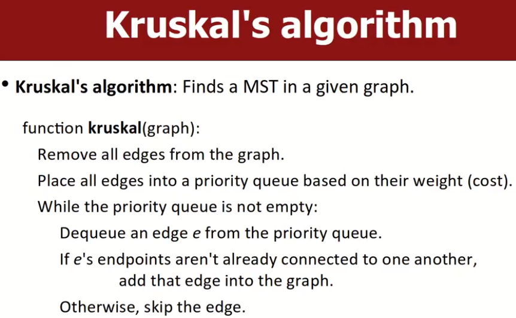
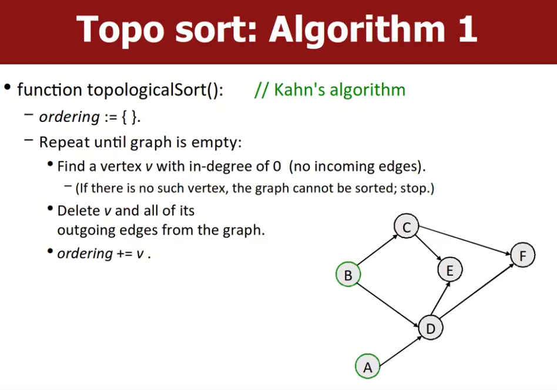
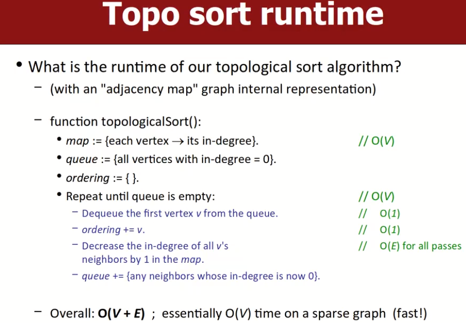
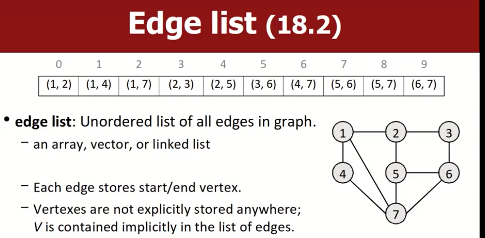
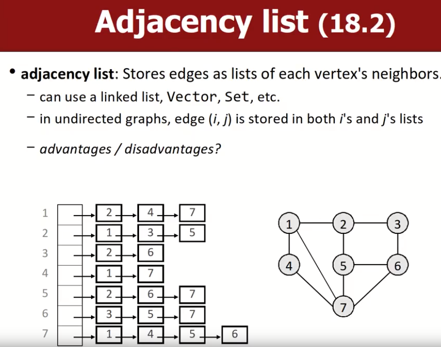
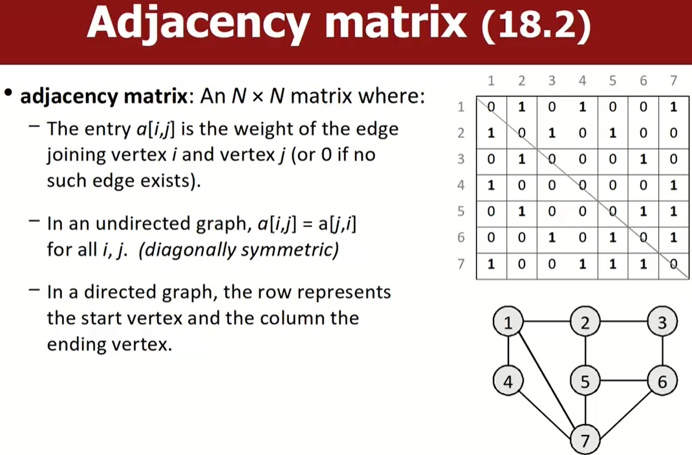

# Graph: Spanning Trees;Topological Sort;Implementations of Graph

# Minimum Spanning Trees and Kruskal's Algorithm

先介绍什么是最小生成树，之后介绍Kruskal算法来找到最小生成树。

## Spanning Trees（生成树）

一个图的生成树：意味着需要从原图中提取出边的子集，这些子集可以确保每个顶点都可以相互到达，即这些子集边生成的图是连通图，且图中无环，总结来说生成树就是用某个图的边的子集生成的**连通无环图**。

### Minimum spanning tree（最小生成树）

该生成树使用的边的子集的权重和是所有可能的生成树中最小的 ；如果图是无权重图，那么就是该生成树使用到的边的数量是最少的。

可以用最小生成树来生成迷宫，而具有最小生成树性质的迷宫只会有一条路可以走到固定的点。

## Kruskal's algorithm

该算法可以在给定的图中找出最小生成树。下面给出Kruskal算法的伪代码：

要做的有如下几步，输入是一个固定的图：

- 首先将图中所有的边都拿出来，按照权重从小到大依次放入一个priority queue中。
- 当pqueue不为空时：
  - 从pqueue中取出一个边e。
  - 如果e边的两个端点还没有连通（即有路径可以让两个点互相到达），那么这条边就留下。
  - 如果e边的两个端点已经连通了，就放弃这个边。

# Topological Sort

## 基本思想

拓扑排序，通常用来排序具有依赖关系的任务。给定一个有向图`G=(V,E)`，使用拓扑排序可以得到一个图中所有顶点的总排序，这个总排序的特点是，对于图中的每一条边`<V,E>`（从V指向E），在这个排序中，V节点总是在W节点的前面。

总的来说，如果存在一堆任务，但是这些任务存在依赖关系，即有些任务必须在某些任务执行完成后才能继续执行，拓扑排序可以用来为这些任务找到一个合适的执行序列。当然结果可能不唯一。

拓扑排序算法是一个综合称呼，有多种具体的实现。

## 方法1：kahn's  algorithm

重复以下过程，直到图为空：

- 找到一个入度为0的顶点v（如果图中没有这种顶点，说明图中有环，且图不能被进行拓扑排序，终止搜索）
- 删除顶点v和图中从顶点开始的所有边。
- 将顶点v放入最终排序列表中。

如果不制作副本，这种方法会破坏原有图像。

## 修正版算法（思路相同，实现不同）

方法1会破坏原有的图像，我们不想在拓扑排序期间从图中删除顶点或边，也不想再重新制作一个图（这种操作往往取决于库，有时候很难制作副本），因此可以采用如下的修正算法：

首先初始化三个变量：

- `map`：顶点->对应的入度。
- `queue`：存放所有入度为0的节点。
- `ordering`：存放最终的排序结果。

重复下列过程，直到queue为空：

- 从queue中弹出第一个节点v，放到ordering中。
- 将map中存储的节点v的所有邻居节点的入度-1。
- 如果上一步操作中产生了入度为0的节点，将节点放到queue中。

如果所有的节点都被处理了，成功。否则意味着图中有环。

## 拓扑排序的复杂度分析

首先要查看所有的节点：O(V)。在第三步中把节点v的所有邻居节点的入度-1的操作需要查看所有的边：O(E)。因此综合下来就是`O(V+E)`。

# Graph Implementations

 首先，没有一种图的实现方式可以做到完美适配所有的图算法，因此这里介绍三种普遍使用的图实现策略：

- `edge list`。
- `adjacency list`。（邻接表）
- `adjacency matrix`。（邻接矩阵）

## edge list

优势就是方便直接遍历所有的边；劣势就是：难以知道目标顶点的邻居、目标顶点的入度、出度等等，大多数操作都得遍历所有的边。这种方法有点蠢。

## Adjacency list（邻接表）

邻接表：每个顶点都用一个数据结构（链表、vector、set等）来存储自己所有的邻居节点。邻居节点有序存储。

优点是容易找到每个节点的邻居，容易增加节点。缺点是删除节点不方便，有向图中找节点入度不方便，确定两个顶点是否连通不方便。

## Adjacency matrix

邻接矩阵，假设有N个顶点，那么矩阵就是N*N的：

- a[i,j]代表了从顶点i到顶点j的边的权重（如果边不存在，则该值为0）。
- 在无向图中，`a[i,j]=a[j,i]`（对角对称）。
- 在一个有向图中，行索引代表了start vertex，列索引代表了ending vertex。

便于添加/删除边，判定两个节点是否是邻居非常快。
