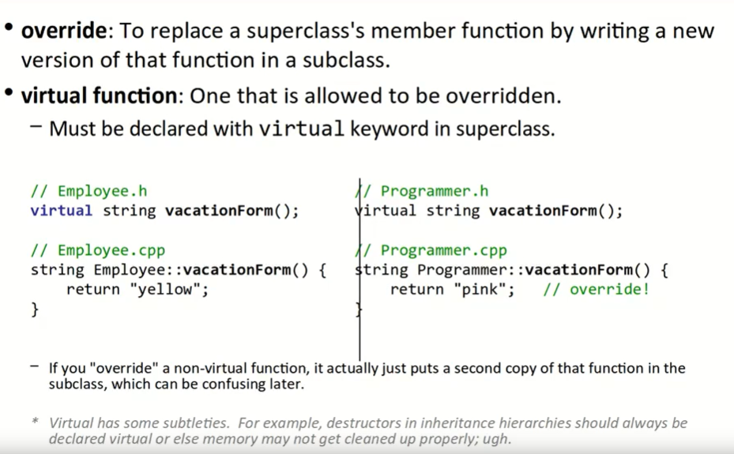
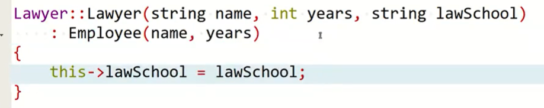
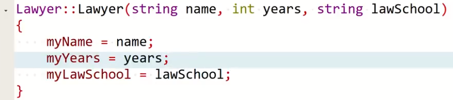
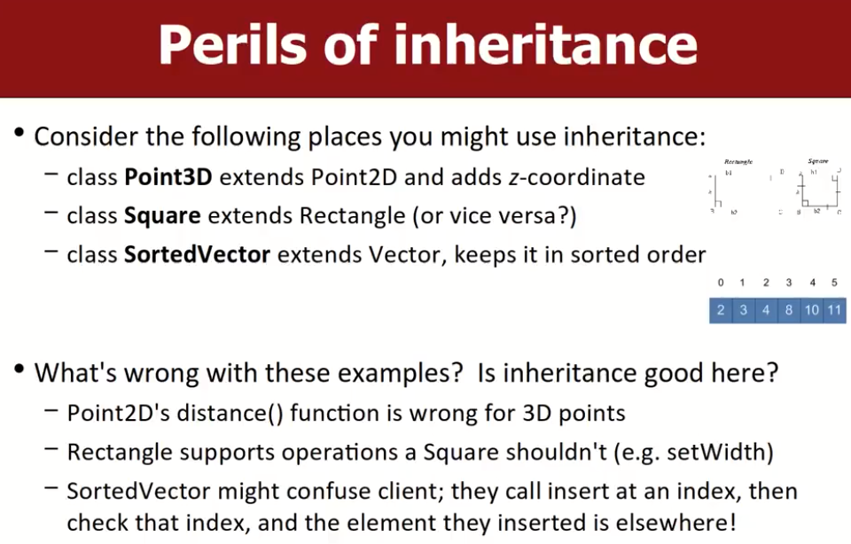
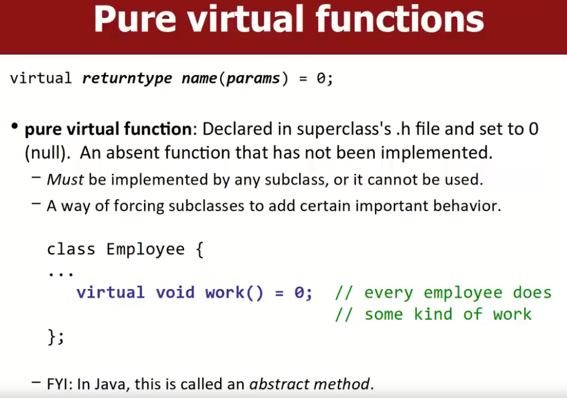
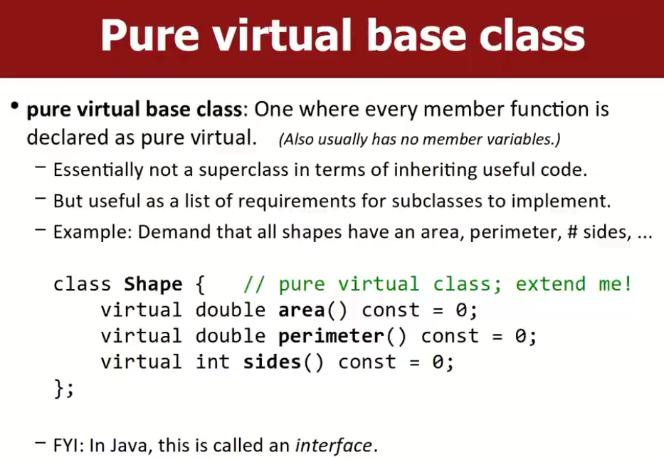
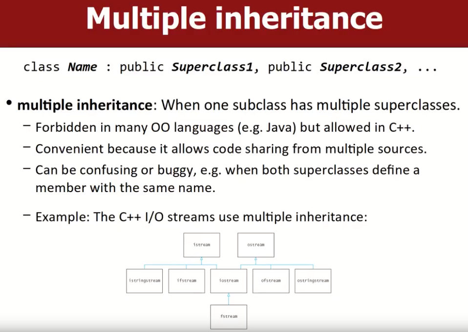
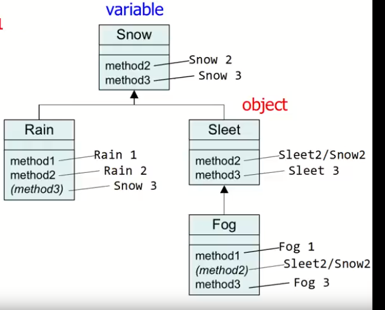
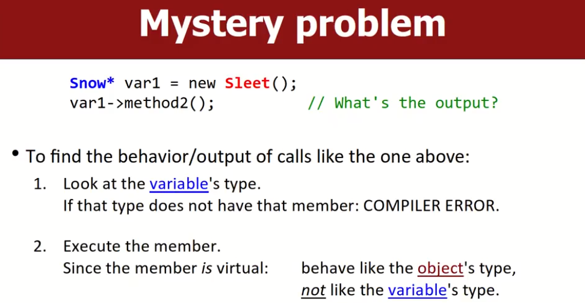
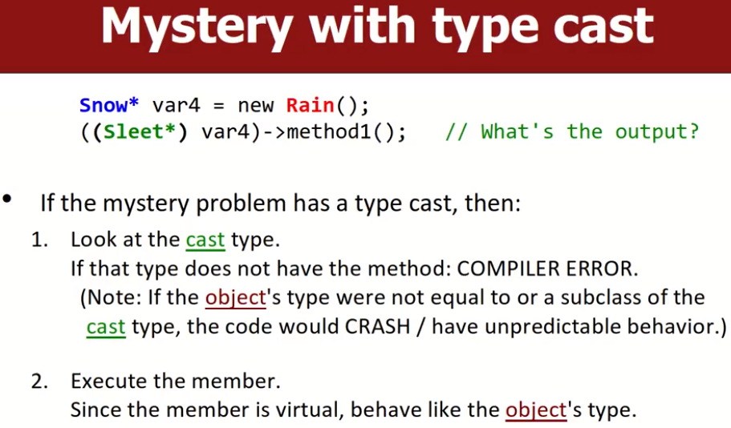

# Inheritance and Polymorphism

# Inheritance（继承）

一个class（child class）可以在保有父类（super class）的数据和行为的基础上扩展其父类。

child class继承自super class：

- 子类会获取其父类的字段和方法的副本。
- 子类可以添加属于自己的行为，也可以修改继承自父类的行为。

```c++
public lawyer : public worker {}; // 公有继承
public lawyer : private worker {}; // 私有继承
```

## overriding（覆盖）

为了替换父类的成员函数内容，子类中可以在继承该函数的基础上对该函数进行overriding；只能overriding父类中带有virtual关键字声明的函数，并且是否overriding完全是可选的，加上virtual关键字只是意味着子类有权力overriding这个函数。子类的function prototype必须与父类保持一致，这意味着只能修改function body。

**注意，父类只需要在头文件中加上virtual中即可，.cpp文件中不必加。子类中overriding该方法时，可以根据他是否需要自己的子类重写该方法，自主选择是否在声明该函数时加virtual关键字，一般保持与父类统一**

`virtual function`：如果我们在父类中对某个函数加上了virtual关键字声明，那么该函数允许被overriding。

- 注意需要overriding的函数在父类中必须有virtual关键字存在。
- 当子类想要引用父类的方法或成员时，用`parent class::member`的方式即可。

如果尝试overriding一个父类中没有virtual关键字的函数，那么实际上是在子类中创建了一个该函数的另一个副本，运行时可能会引起困惑，编译器在多数情况下，不会执行在子类中写的这个版本。



### 强制子类overriding函数

上面我们提到了，在父类中实现的函数，加上virtual关键字可以告诉子类该函数是允许被overriding的，但是这不是必须的。如果父类想要某些函数必须被子类overriding，父类会把该函数声明为`pure virtual function`。

```c++
class Employee {
public:
    // virtual关键字意味着函数可以被overriding,=0意味着该函数必须被子类overriding，加了强制效果。
    virtual void speak() = 0; // pure virtual function
}
```

如果子类没有实现该pure virtual function，那么会编译报错。

### 构造函数的继承




Employee是Lawyer的父类，这里Lawyer调用父类构造函数为参数name和years赋值。方法是在子类的构造方法的头部，加上：符号，之后写上父类的构造函数，为父类对象赋值。因为子类继承了父类的对象，因此这些对象可以看作是子类也拥有的，但是仅仅是子类引用了父类的对象，因此只能用上述两种方法赋值。

如果父类中的这些变量被声明为private，因为子类不允许访问父类中的private成员，因此下述的赋值方式会报错：



此外，当子类想调用父类对象时，只需要用`Employee::vars`这种方式即可。

## Perils of inheritance（继承的缺点）



并不是所有场景下使用继承都有好处，比如说，当你试图让Point3D成为Point2D的子类，但是你发现Point3D中很多方法从根本上与Point2D不一样，因为3D有3个坐标，很显然通过overriding方式做这件事情很愚蠢，你需要添加新的参数进去，但是overriding不允许改变父类的function prototype。

## Private inheritancee（私有继承）

意味着该子类确实继承了一个类，但是外部代码无法知道该子类与其他的类有关，关键是无法知道。举例如下：

- 比如说，Lawyer对象私有继承了Employee对象，但是我们无法做出将Lawyer对象放入Employee对象的容器中的操作，因为外部代码无法理解Lawyer与Employee的关系，这就是私有继承。

这种方式一般情况下不会使用。

##  Pure virtual functions(纯虚函数)

纯虚函数在父类的.h文件中声明，并且总是用这种固定的语法，父类中不必实现该纯虚函数，但是该纯虚函数必须在子类中被实现，否则该函数不能被子类使用，还会报错。

这是强迫子类添加某种重要行为的方式。



> 在Java中，我们称之为abstract method。

## Pure virtual base class(纯虚基类)

该父类所有的成员函数都是纯虚函数，并且没有任何的成员变量。

- 在继承有用的代码方面而言，纯虚基类本质上不是一个父类。
- 但作为子类要实现的需求列表很有用。
- 示例： 要求所有形状都有一个面积、周长、# 边、...

C++不允许为纯虚基类声明/实例化对象。



> 在Java中，我们称纯虚函数为interface。

## Multiple inheritance（多重继承）

一个子类可以继承多个父类。

- 在多种面向对象的语言中都是被禁止的，但是在C++中是允许的。
- 很显然，方面多个类之间的代码共享。
- 但是可能会造成困惑和bug。如：当两个父类定义了同名成员时，子类该如何区分？
- C++的I/O streams使用了多重继承。

这部分教授没有详细讲解，如果想知道更多可以自行Google查阅相关资料。



# Polymorphism(多态)

有时候基于继承，可以出一些关于多态的题目，有点类似于八股了，但是还是很有意思的，场景如下，这些涉及到的函数往往是虚函数。

只需要记住最为核心的一点：**左侧的声明变量类型只决定代码是否能够通过编译，即欺骗编译器，而右侧的分配对象实例类型决定了函数是否有这个行为，是否能做这个行为。**：

```c++
Snow* var1 = new Sleet(); // 这是一个Snow类型的变量，但是分配的是其子类Sleet的对象实例
((Rain*) var1)->method1; // 无论进行何种类型变换，如果变换后的类型没有Method1，就会编译失败，但是一旦编译成功，那么函数的行为只会取决于Sleet类，如果Sleet没有Method1，那么会直接崩溃
```




有一个名为Snow的父类和一系列的子类

## Mystery problem1



比如这种情况，var1的类型是父类Snow*，但是在实际分配对象时，分配的是子类Sleet的对象。原则如下：

首先查看变量类型，这里声明的是父类Snow：

- 如果Snow没有名为method2()的方法，那么会直接编译错误。
- 若编译通过，因为method2是虚函数，函数行为将取决于分配给var1变量的实际对象实例类型：即这里会执行子类Sleet Object的method2方法，因为实际上的分配的object是Sleet。

## Mystery with type cast

同样的，cast Type如果没有method1()，那么编译报错；因为var4实际上拥有的对象类型是rain，如果实际对象类型与cast type不匹配， 或者实际对象不是cast type的子类，那么代码执行的时候会有无法预计的错误。

因为是虚函数，所以具体函数行为取决于给变量分配的实际对象类型。

