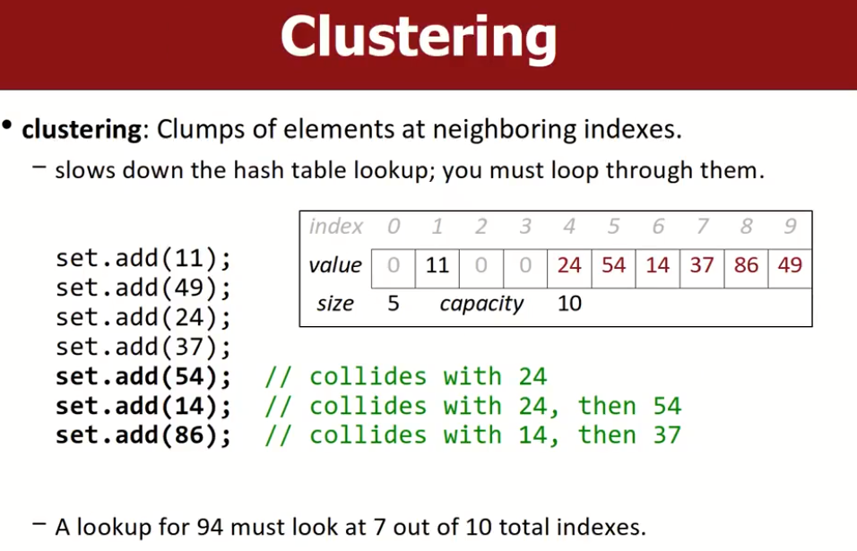
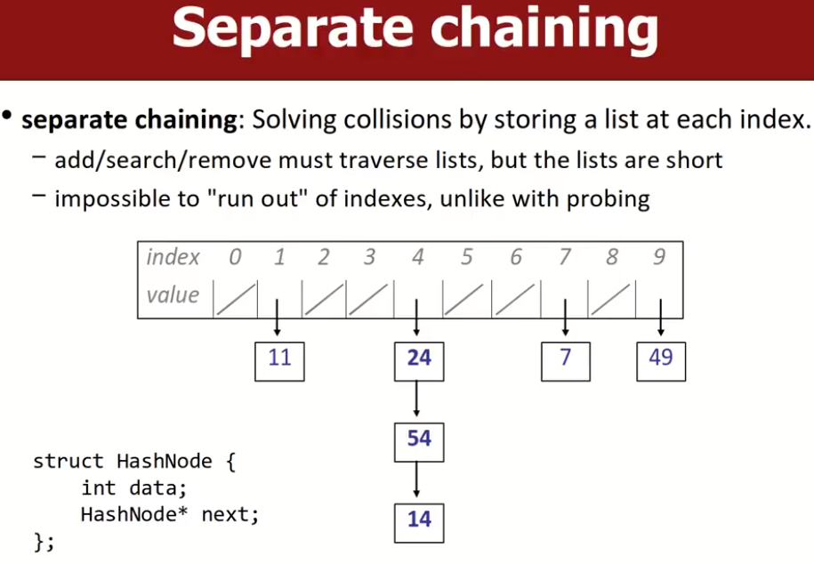
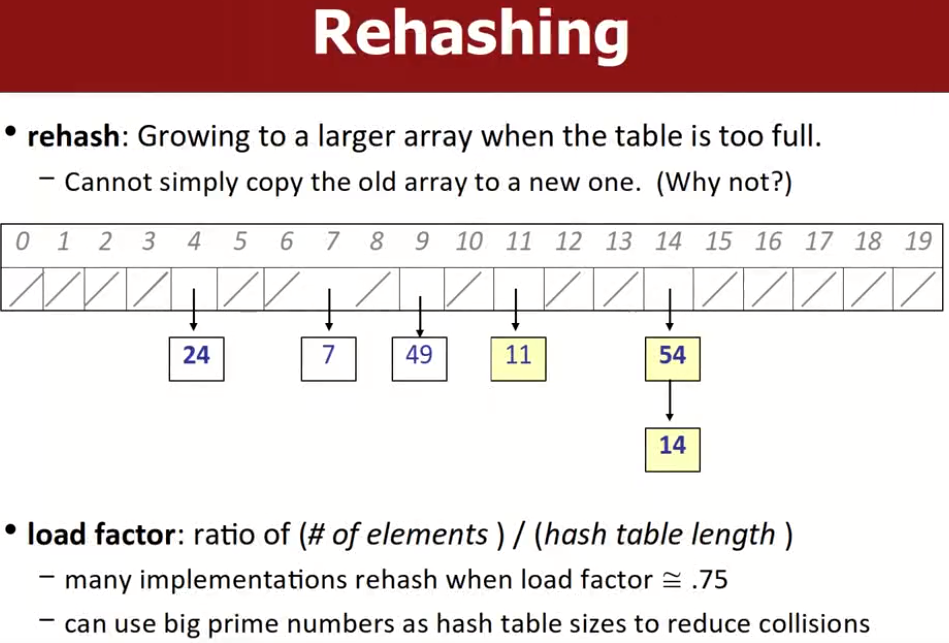
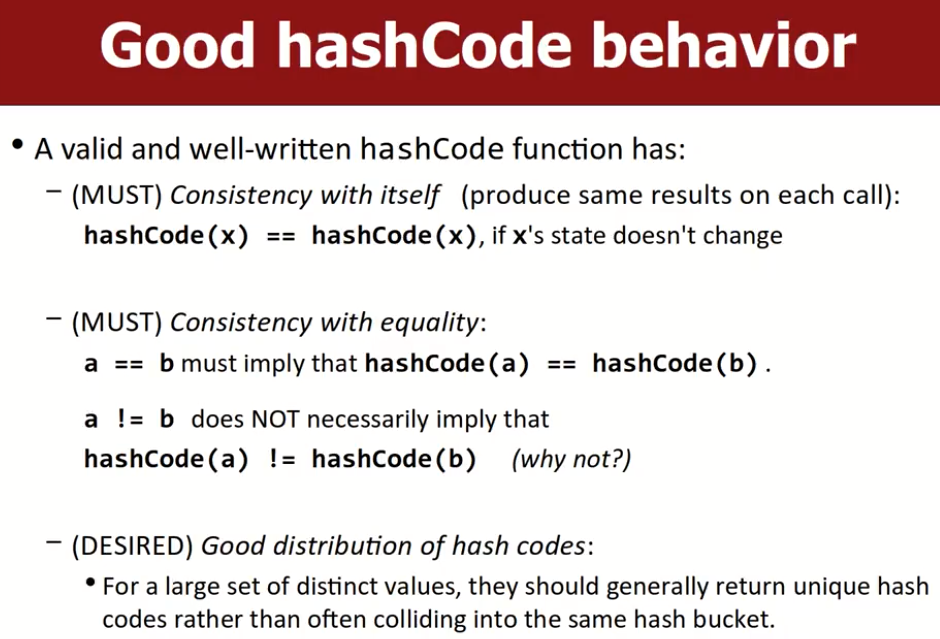
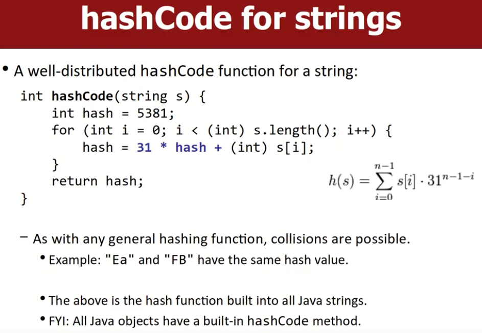
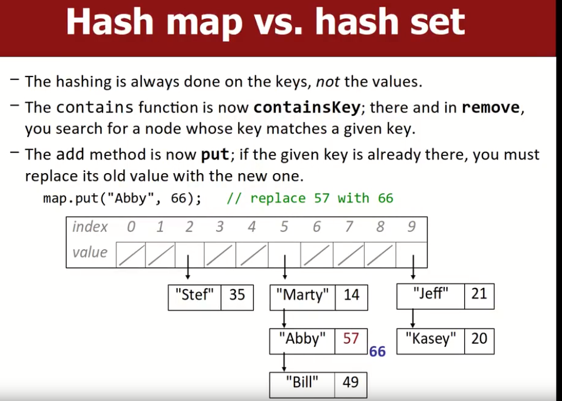

# Hashing

这部分主要讨论在c++内部的一些和hash思想有关的STL是如何设计的。

## what's hashing

hash：将大范围的值映射存储到一个更小的固定区域。将给定的值存到一个特定的索引下，这个索引值是可以通过某种规则计算出来的。

- `hash table`：通过hashing规则，将值存储到给定索引的数组。
- `hash function`：hashing函数采用的算法，即从values->indexes的算法规则。
- `hash code`：向hash function输入一个value，得到的index输出值，我们称这个输出为hash code。

## collisions（冲突）

当多个值被hash到同一个index时，hash函数需要可以处理这种冲突。因此需要冲突解决算法。有多种方法可以解决hash index冲突的问题。如下所示：

### probing（探测）

当出现冲突情况时，将该新value移动到另一个index存储。

`linear probing`：遇到冲突后，试图将元素放到index+1的位置。不断运行直到找到空位。

`quadratic probing`：遇到冲突后，每次的increasement值会递增，如：+1，+4，+9....等。一定程度上可以避免频繁的进行probing操作。

该方法有一个不足，如果大量元素聚集在一起，我们在删除元素时，不能直接删除，因为这会导致后续探测操作找不到被删除元素之后的元素，因此我们应该用某种tombs（墓碑）标记，指示搜索继续进行。

- 如下图，如果直接删除54，之后查询14是否存在，我们首先到了4的索引处，但由于后面是0，因此我们会停止搜索，从而得到一个假的结果。所以需要墓碑标记指示查询继续执行。

### Separate chaining

通过将每个index处的values存储为一个list来解决冲突。

- add/search/remove必须遍历对应索引的list，但是多数情况下lists都很短。
- 不可能出现wrap round（造成循环访问，最终回到原点）访问索引的情况，这比probing方式更好。

SPL库中的HashSet和HashMap就是采用了这种方法。

## rehashing

如果当前hash table已经快满了，那么我们需要对其进行扩容，我们会得到一个更大的hash table，相应的hash算法也会改变，因此不能简单的将原来的哈希表元素复制到新的哈希表里面，应该遍历旧的哈希表中的元素，将其作为input输入到新的哈希表算法中，得到新的位置。这个过程我们称之为rehashing。

一般来说，当``load factor`=元素数量/哈希表长度=0.75时，就可以扩容了。负载因子是一种衡量指标。

## Hashing strings

如果我们想对字符串进行hash操作，那么我们需要某种策略可以将字符串转化为integer。所以我们需要设计一个好的hash function，一个好的hash function需要具备以下特点：

- 相同（等）的输入总是有相同的输出。但我们可以接受不同的输入输出可能会相等，这意味着发生了碰撞，一般情况下碰撞是不可避免的，我们可以想办法最小化碰撞发生的概率，并用合适的算法去处理碰撞。
- 最好可以将数据均匀的分布到哈希表上，并且可以最小化碰撞的可能性。

相同意味着地址不同，但是存储的值相同。相等意味着就是同一个地址的值。

### Java's hashCode for strings

下图中在ASCII码相加的基础上加入了一个初始值和一个乘积因子，一定程度上避免了冲突，Java算法使用的HashCode函数的思想与这个十分类似。

- 这种算法适用于大部分字符串都比较短的情况。
- 可选的，我们可以把一个很长的字符串进行拆分，形成多个状态片段，之后将这些状态片段作为hashcode输入得到hash值，将这些值组合在一起作为最终标记，这可以进一步减少碰撞的可能性。

## Hash map

设计hashmap的思路与Hash set是类似的，只不过每一个元素是一个键值对，hash函数用key作为input值，而不用value，因此key决定了这个键值对会被放在哪里。

- 不同的是，Contains函数变成了containsKey()，每次查找的目的是确定是否有给定键的键值对存在。
- add方法现在变成了put，如果给定key的键值对已经存在了，我们需要用新值替换旧值。

在SPL的实现中，HashSet实际上是一个value类型为Bool的HashMap，代表着key本身是否有效。
