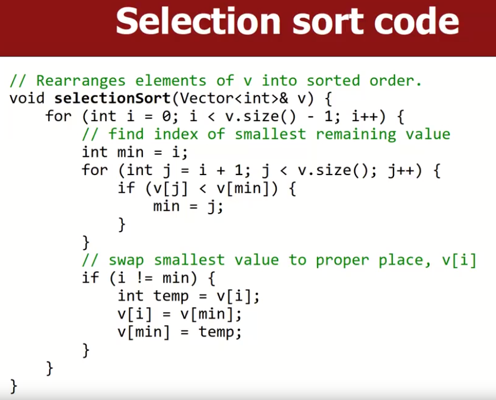

# Sorting

排序算法有很多很多种，而这些特定的基础算法还会衍生各种变体，教授挑选了几种最常见的算法进行讲解说明。下面先简要说一下将要介绍的算法的特点：

- `bogo sort`：打乱元素顺序并且祈祷能碰巧排序完成。
- `bubble sort`：交换那些相对顺序出错的相邻元素对，比如我们要求从小到大排序，交换元素位置时就按照这个准则进行，每一轮进行完后，都会有一个当前排序队列中的最大元素被找到，因此称之为冒泡排序。
- `selection sort`：每次找到当前待排序数组中的最小/最大的元素，将其移动到头部/尾部。
- `insertion sort`：首先构建一个存放有序元素的容器；之后取出待排序数组的第一个元素，将之插入到有序元素的容器中。
- `merge sort`：递归的将整个待排序数组划分为两部分，将每个小块进行单独排序，之后再合并同一级别的小块，它们会成为更大的大块；递归进行排序、合并操作，直到最后还剩余一个块时，排序完毕。
- `heap sort`：将元素放到一个有序的树结构中（如有序二叉树），待该树中的元素有序排列后，采用某种方法遍历该树结构，就会得到最终的排序结果。
- `quick sort`：递归的做如下动作：基于一个middle value，将当前数组不断地分割为两部分，小于mid的值放在其左侧，大于mid的值放在其右侧，当做完最后一个mid value的排序操作后，排序完毕。
- `bucket sort`：将元素拆分为更小的组，每个组可以看作一个桶，之后对这些桶进行排序，最后合并。
- `radix sort`：将元素按照当前最后一个数字进行排序，之后按照倒数第二个，等到排完最长元素的正数第一个元素之后，排序完毕。（基数排序）

上述是几种常用的算法，也是接下来教授要介绍的算法。

## Bogo Sort

通过不断地随机打乱数组中的元素来对数组进行碰运气式的排序，直到数组碰巧有序，否则不停地打乱他。

### Big O Performance

时间复杂度：总元素个数的阶乘O(N!)，这太糟糕了，根据概率论思想，最化的情况下，它需要尝试N!次可能的排序序列后才能拿到最终正确的排序结果。

这很考验我们编写的shuffle函数，需要shuffle函数每个元素同等的概率，稍有不慎就可能出现概率失衡。

# Comp-Swap based Sort

## Selection Sort

每次找到当前待排序数组中的最小元素，将其移动到头部。 不断重复直到待排序数组为空。 

时间复杂度：基本上需要为每个最小元素遍历一次整个数组，因此是O(n^2^)。

下面是一种实现方式：

## Insertion Sort

首先构建一个存放有序元素的容器；之后取出待排序数组的第一个元素，将之插入到有序元素的容器中。当然我们可以就地排序，使用一个分割线将数组分为有序和无序部分。

> 就地排序的话，就是不断地将待排序元素与前面的元素进行compare_and_swap操作，直到找到合适位置。或者可以将有序部分的元素不断的后移，直到找到

时间复杂度：每取出一个元素时，最坏的情况下都需要与当前有序容器中所有元素比较后才能决定放入位置，因此时间复杂度是O(N^2^)。

- 最好的情况下明显是O(N)，当数组有序时，插入排序只需要遍历一次数组即可。

在大数据量情况下，总体上来说比Selection Sort要快。示例代码如下：

像selection Sort和Insertion Sort这两种排序都是基于compare and swap的，因此时间复杂度都是O(N^2^)。

# Divide-and-Conquer based Sort

## Merge Sort(Stable Sort)

将未排序的数组递归的分成两半，直到每个half的大小符合我们规定的sort block size，之后单独对每个half进行merge sort，然后将两个sorted half合并为一个sorted list（一般用双指针的方法合并两个sorted half），不断地重复该过程，直到只有一个sorted list。

时间复杂度：很明显，在算法的每个级别我们都需要进行双指针的排序操作，因此每个级别都把所有元素遍历了一遍，是O(N)；当我们拆分数组时，一共有LogN层。因此，该算法的时间复杂度是O(NLogN)。

从下图中可以直观的感受该算法。

### runtime intuition

下图可以更直观的感受merge sort的时间复杂度：

### example

下面是一个实现的例子：

## Quick Sort（not stable sort）

通过将待排序列表分为两部分分别进行排序，这个分割的标准取决于我们选择的pivot elem，小于pivot的元素放在pivot左侧，大于等于pivot的元素放在其右侧。

快排也是一种分治算法：

- 在当前的待排序list中选出一个pivot元素。（**pivot元素选择策略直接决定了算法复杂度**）
- 这就将元素以pivot为界，（Divide）分为两部分：小于pivot的元素放在左侧，大于等于pivot的元素放在右侧。注意这只是按照pivot进行划分了，左右两个partition内部元素仍然是无序的。
- 递归的对当前的左右两端的partition应用quick sort，直到排序完毕。

时间复杂度：平均为O(NLogN)。如果pivot选的不好，最坏情况下是O(N^2^)。结合二叉树结构很容易想明白。

- 总体上比merge sort要快。

Quick Sort的步骤大体上可以分为如下几步：

### choosing a "pivot"

理论上，不管我们选择哪个元素作为pivot，算法都能正确的工作。只是运行效率不同。

- 一个简单地实现是直接用当前待排序partition的第一个元素。

但是为了效率，选择的pivot最好可以将元素分为大小相当的两个partition（当前元素结合的中位数）。

- 一般来说，是随机选择一个pivot，或者从当前数组中随机选择三个元素，之后取中位数。

### partition an array

暂时将pivot元素放到最后一个索引处。

partition行为通过重复以下操作进行`while(i < j)`：

- `start from i=0`，向右遍历，直到找到一个元素`a[i]>=pivot`。
- `start from j=N-1`，向左遍历，直到找到一个元素`a[j]<pivot`。
- 这两个元素顺序不对，交换a[i]和a[j]元素，继续重复上述行为。

最后i,j相遇或者i+1=j，将pivot元素与a[i]元素交换，此时partition操作完成。

# Stable Sort

**稳定排序**是一种排序算法，它在排序的过程中保持相等元素的相对顺序。与之相对的是**不稳定排序**，它不保证相等元素的相对顺序。

比如说，我们首先用S1策略排序数组，之后用S2策略排序数组，如果S2策略后数组仍然可以保持S1策略的相对顺序，那么S2就是稳定排序。