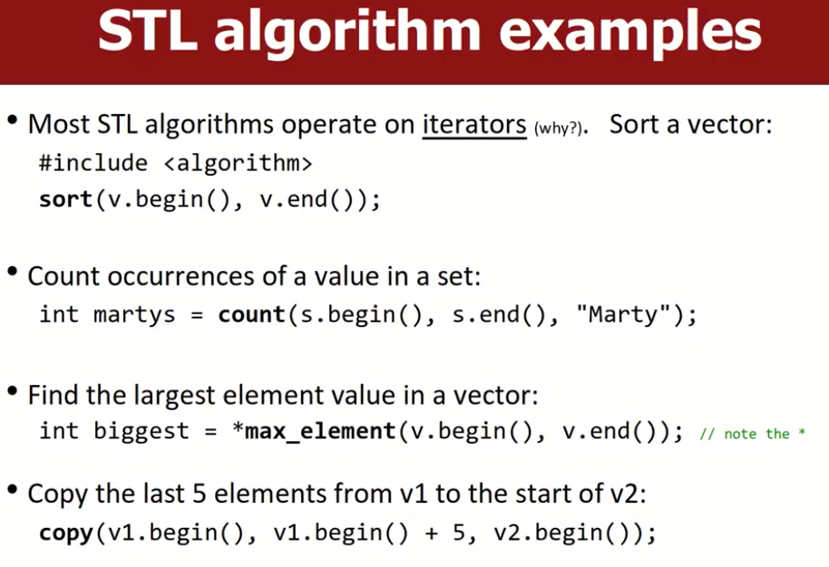

# Templates，STL，Smart pointers

# Templates

## definition

```c++
template<typename T>
returnType name(params) {
	statenments;
}
```

Templates是可以接收某个类型作为params的函数或类。

- 允许我们写一个函数，该函数可以接收许多类型的值。
- 避免了需要对不同类型数据重复写相同函数的冗余。
- Templates可以出现在单个函数中，或者整个class中。
- Java有类似的机制：称之为generics。

## Template function example

每次我们使用的时候，template会根据传递参数的类型实例化：

- 编译器每次都会生成一个新版本的代码。
- 要保证可能使用到的type都已经有了operator的支持，大多数基本类型都有支持；对于一些自定义type或者复杂的type可能需要进行overloading operator操作。**如果不支持相关operator，是无法通过编译的。**

```c++
template<typename T>
T max(T a, T b) {
	if(a < b) {return b;}
    return a;
}
max(17,4);
max(3.1,2.4);
max(string("hy"),string("ggh"));
```

## Template class

模板类：接受一个type类型作为参数。比如我们常用的STL，vector<>,unordered_set<>等等。

- 在header和cpp文件中，标记class/function为template<typename T>。
- 将类中和存储类型有关的变量全部改为T。下图有一个cpp文件的示例。

```c++
// className.h
template<typename T>
class ClassName{
    
};
// className.cpp
template<typename T>
type ClassName<T>::name(params) {

}
```


# Standard Template Library(STL)

STL是一些包含c++的类和算法的集合，大多数使用templates实现。

- 如容器类（集合）、算法、函数型编程、迭代器等等。

## STL iterators

STL中每个容器都有一个begin和end iterator指向容器开头和末尾。

Iterator使用的是类似于指针的语法（`Pointer-Like`，通过operator overloading做到）：

- `++iter`意味着前进一个元素；`--iter`回退一个元素。
- `*iter`意味着访问当前iterator指向的元素。

可能对于vector而言，index更方面，但是C++设计者是为了通用性设计了Iterator，对于一些复杂的数据类型，如二叉树这些，遍历时节点需要存储上一个和下一个节点的信息，这时候iterator就很有用了。

## STL algorithms

在函数开头#include<algorithm.h>，就可以得到大量有用的功能和算法，它们以STL的容器作为参数；**更一般的来说，他们以iterator作为参数。**



# Smart Pointers

## 概念（很重要）

`smart ptr`本身是一个位于stack的**容器**，但是该容器中存储了一个指向heap上数据的指针，当使用完毕并调用析构函数时，析构函数中会自行释放内存，无需用户动手，因此不再需要关心其生命周期等内容。

- c++11开始支持，在此之前，许多coders使用Boost库或者其他库。

c++的智能指针有如下几种类型：

```c++
#include<memory> // 必要的头文件

std::unique_ptr<T> a; // 只有且仅有一个owner; best one
std::shared_ptr<T> b; // 可以有多个owners;
// std::weak_ptr<T> c;// 无视即可，基本不用
// std::auto_ptr<T> d;// 已经弃用了，不要再用
```

## Unique Pointer

`unique_ptr`本身是一个在stack上的容器，该容器存储了一个heap data的地址。

- 我们可以像使用普通指针那样使用`unique_ptr`。（`unique_ptr`本身overload了如*,->,++，--等操作符）
- 当`unique_ptr`超出当前作用域时，自动调用析构函数从而释放自己正在管理的堆内存。
- 当一个heap data被一个unique_ptr管理之后，他就不能再被任何别的指针管理。除非主动转移管理权。

```c++
unique_ptr<T> name(heapObject);// 注意与普通pointer的不同之处，这里不是=，而是()。
```

### Unique_ptr Usage

```c++
unique_ptr<T> p(new T()); // 创建一个T类型的unique_ptr
p->data=1234;....
p.reset(new T()); // 我们不想使用之前的heap了，这里调用reset函数，参数是要指向的新对象，或者直接分配一个新的内存地址
p->data=12; p->next=nullptr;
```

### get and release

`unique_ptr<T> p`有`get()`和`release()`方法。

- `get()`：返回该unique_ptr容器中的heap地址，即原生类型，我们现在可以用一个该heap对象的原生指针类型存储他。p仍然持有该对象，因此这**不影响**unique_ptr在作用域结束之后自动调用析构函数释放该对象。
- `release()`：返回该unique_ptr容器中的heap地址，即原生类型，我们现在可以用一个该heap对象的原生指针类型存储他。但是之后p不再持有该对象，该指针的声明周期由用户决定。

```c++
void foo() {
	unique_ptr<int> p(new int());
    int* p1 = p.get(); // p仍然拥有该对象所有权
    int* p2 = p.release(); // p不再拥有对象所有权，不会自动释放内存
}
```

### unique_ptr as parameter（不可以）

我们不能直接将`unique_ptr`作为参数传递，或者使用=赋值。下面这些实例无法工作或过不了编译：

```c++
void foo(unique_ptr<T> a) {...}

int main() {
    unique_ptr<T> a(new T());
    foo(a); // 不起作用
    unique_ptr<T> b(new T());
    a = b; // 无法编译，unique_ptr不支持operator=，很明显这会导致双重释放
    return 0;
}
```

### 使用move()或者直接返回

c++中有以下两种方法可以转移smart ptr中内容的所有权：

- 我们可以使用move函数来转移**smart pointer**的所有权。

- c++允许我们通过return的方式传递smart ptr，也意味着转移smart ptr的所有权。

```c++
void foo(unique_ptr<T> a) {...}
unique_ptr<T> getUnique(){
    unique_ptr<T> a(new T());
    return a;
}

int main() {
    unique_ptr<T> a(new T());
    foo(std::move(a)); // 允许，Move转移了该ptr的所有权到另一个unique_ptr
    a = getUnique(); // 允许，c++允许return的方式传递smartPtr
    
    return 0;
}
```

