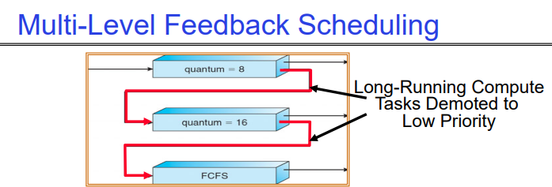
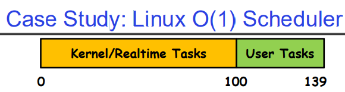
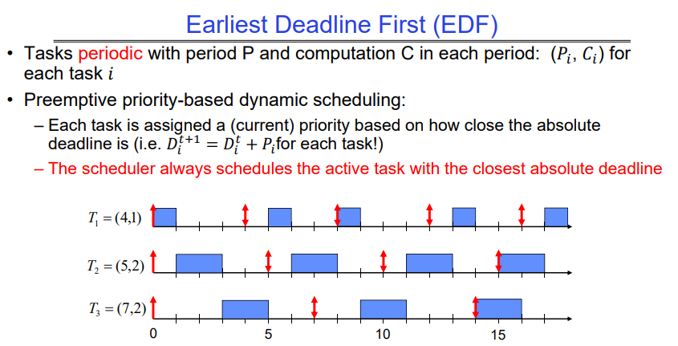
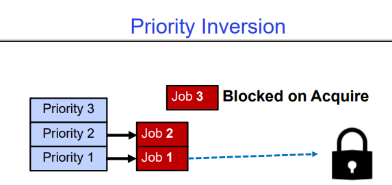
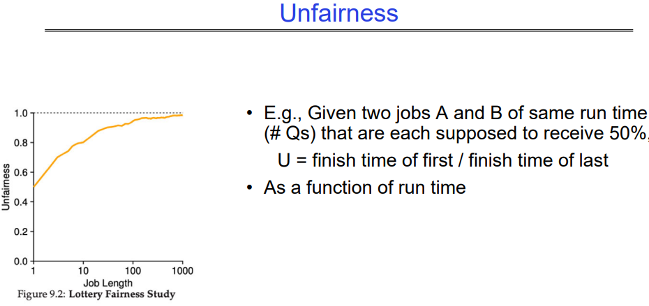
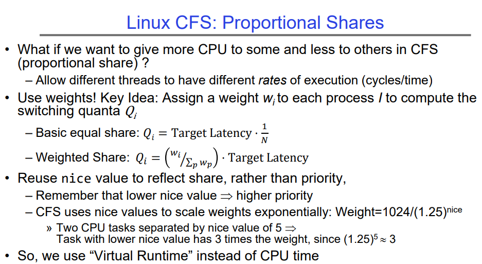
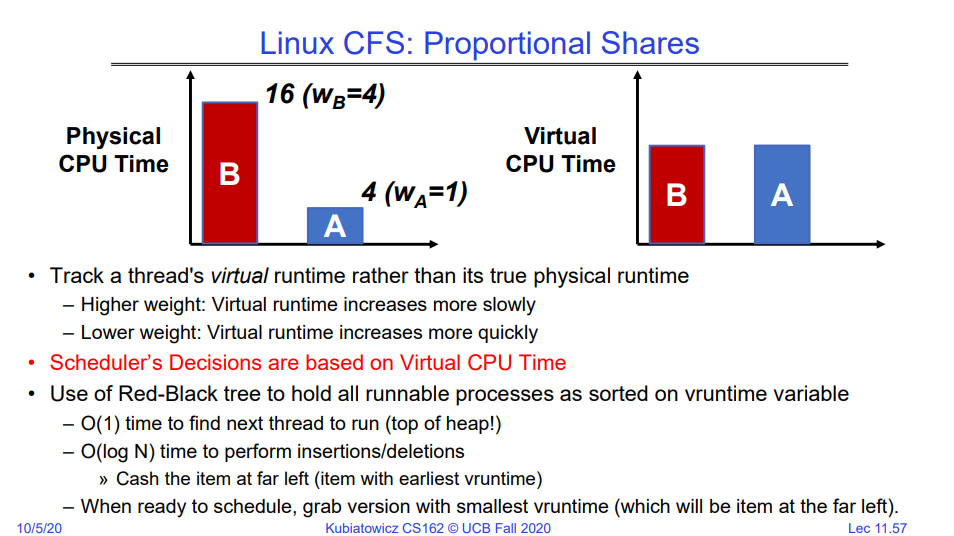
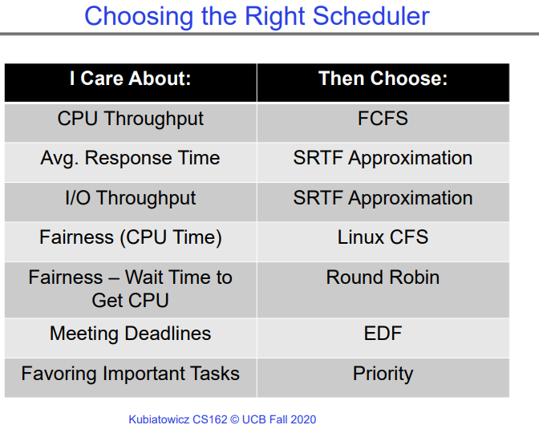
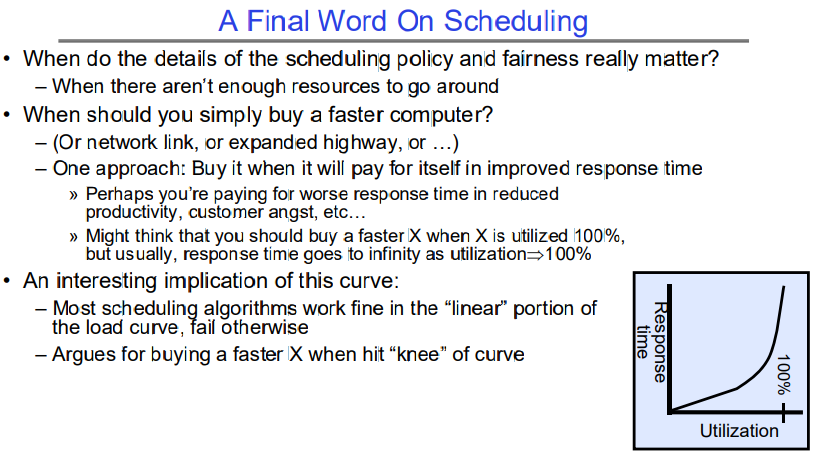

# Scheduling 2:  Case Studies, Real Time, and Forward Progress

## How to Handle Simultaneous Mix of Diff Types of Apps?

考虑交互式和高吞吐量应用的混合情况：
- 如何最好地安排它们的调度？
- 如何识别它们中的一个？
» 你相信应用程序说自己是“交互式”吗？

应该在服务器、工作站、平板电脑和手机上相同地安排应用程序集吗？

- 例如，观察到的突发时间（Burst Time）是否有用于决定哪个应用程序获得CPU时间？
- 短突发时间->交互性->高优先级？

 许多调度程序中编码的假设：

- 睡眠时间较长且突发时间较短的应用程序必须是交互式应用程序——它们应该获得高优先级
- 计算量较大的应用程序应该获得低（一些？）优先级，因为它们不会注意到交互式应用程序的间歇性突发

很难表征应用程序：

- 对于长时间休眠然后长时间计算的应用程序怎么办？
- 或者，对于必须在所有情况下运行（例如周期性运行）的应用程序怎么办？

# Multi-Level Feedback Scheduling



利用过去行为的另一种方法（首次在CTSS中使用）
- 多个队列，每个队列具有不同的优先级
- 较高优先级队列通常被认为是“前台”任务
- 每个队列都有自己的调度算法
  - 例如，前台队列使用循环轮转（RR），后台队列使用先到先服务（FCFS）
  - 有时会使用多个RR优先级，量子逐渐增加（最高：1毫秒，下一个：2毫秒，下一个：4毫秒，依此类推）

调整每个作业的优先级如下（细节有所不同）

- 作业从最高优先级队列开始
- 如果超时(用完在当前级别的所有时间配额），降低一个级别
- 如果没有超时，提升一个级别（或到顶部）。需要根据进程过去的行为推测该进程是否会很快完成，若推测出进程可以很快完成，则提高该进程的优先级。
- 二者区别在于进程是主动放弃CPU（没有超时）还是被调度算法换下来的（超时）。

结果近似于SRTF：
- CPU密集型作业的优先级迅速下降。
- 短期I/O密集型作业保持在顶部附近。

必须在队列之间进行调度

- 固定优先级调度：从最高优先级开始依次服务，然后是下一个优先级，依此类推。
- 时间片：
  - 每个队列都会获得一定量的CPU时间
  - 例如，最高优先级获得70%，下一个优先级获得20%，最低优先级获得10%。

## Scheduling Details

对策：用户行为可能破坏操作系统设计者的意图
- 对于多级反馈，插入一堆无意义的I/O以保持作业的优先级高
- 当然，如果每个人都这样做，就行不通了！

奥赛罗程序的例子：

- 与竞争对手对战，关键是以较高的优先级执行计算。
- 插入printf语句后，运行速度快了很多！

## Case Study: Linux O(1) Scheduler-based linux 2.6



基于优先级的调度器：共140个优先级，Linux2.6版本使用的这种调度算法，目前已经弃用这种方法，当前Linux系统采用的是CFS调度算法：

- 40个用于“用户任务”（由“nice”设置），100个用于“实时/内核”
- 优先级值较低意味着较高的优先级（对于nice值）
- 最高的优先级值意味着较低的优先级（对于实时值）
- 所有算法都是O(1)
- 当作业完成时间片时，计算所有时间片/优先级/交互信用（如：投票调度）
- 140位的位掩码表示在给定优先级级别是否存在作业

两个独立的优先级队列：“活动”和“已过期”

- 活动队列中的所有任务使用它们的时间片，在使用完时间片后会被放置在已过期队列中，之后队列会交换
- 虽然名义上是两个优先级队列，但是严格意义上来说他有140个优先级队列，因为有140个优先级。

时间片取决于优先级-线性映射到时间片范围

- 类似于多级队列（每个优先级一个队列），每个级别的时间片不同
- 执行被分割为“时间片粒度”块-通过优先级进行轮转。


如上图所示，每个大的队列中都有所有优先级目前正在活跃的/休眠的进程，若当前Active queue中的时间用尽后，会交换队列，让之前等待的queue中的人物得以执行。

- scheduler本身定义了一系列的启发式规则，会尝试提高I/O型进程的优先级，尝试提高饥饿进程的优先级。
- 启发式规则是使调度算法变得复杂的主要原因。

### O(1) Scheduler Continued

启发式
- 根据启发式调整用户任务的优先级±5
  » p->sleep_avg = sleep_time - run_time
  » 更高的sleep_avg意味着任务更倾向于I/O，更多的奖励（反之亦然）
- 交互信用
  » 当任务休眠“长时间”时获得
  » 当任务运行“长时间”时花费
  » 交互信用用于提供滞后，以避免因行为的临时变化而改变交互性
- 然而，“交互任务”获得特别许可
  » 为了尝试维持交互性
  » 放回活动队列，除非其他任务长时间饥饿...

实时任务

- 总是抢占非实时任务
- 优先级没有动态调整
- 调度方案：
» SCHED_FIFO：抢占其他任务，无时间片限制
» SCHED_RR：抢占正常任务，在相同优先级的任务之间进行循环调度

这种依赖于启发式规则的策略，只要稍加改动可能就会导致一系列的奇怪行为，因此Linux系统放弃了这种调度方法，目前在用的是CFS调度算法。

# Multi-Core Scheduling

在算法上，多核调度并没有与单核调度有很大的区别

在实现上，拥有每个核心的调度数据结构很有帮助

- 缓存一致性

亲和调度：一旦一个线程在一个CPU上调度，操作系统会尽量在同一个CPU上重新调度它

- 缓存重用，频繁的切换线程执行上下文会造成一定开销，进程的开销更大。

## So, Does the OS Schedule Processes or Threads?

许多教科书使用“旧模型”——每个进程一个线程。

通常情况下实际上是：线程（例如，在Linux中）。内核调度的单位大多数情况下是线程。

需要注意的一点是：切换线程与切换进程会产生不同的成本：

- 切换线程：保存/恢复寄存器
- 切换进程：还需要切换活动地址空间！
  - 昂贵；需要打断缓存。

然而，回顾一下：同时多线程: Simultaneous Multithreading （或“超线程“Hyperthreading”）

- 不同的线程以逐周期的方式交替进行，并且可以处于不同的进程中（具有不同的地址空间）。

## Recall：Spinlocks for multiprocessing

自旋锁实现：
```cpp
int value = 0; // 空闲
Acquire() {
    while (test&set(&value)) {}; // 忙等待
}
Release() {
    value = 0; // 原子存储
}
```
自旋锁不会让调用线程进入睡眠状态 - 它只是忙等待:

- 在什么情况下这可能更可取？屏障（`barrier`）

  - 在多处理器（多核心）程序的**屏障**处等待有限数量的线程。
  - 如果在内核中必须唤醒线程，则在**屏障**处的等待时间会大大增加。

  > 多核处理器的屏障（barrier）是一种同步机制，用于确保多个线程在程序执行中达到某个点之前都必须等待其他线程到达同一点。这样可以确保所有线程在继续执行之前都达到了一个共同的同步点。在多核处理器中，屏障通常用于协调多个并发执行的线程，以便在执行某些并行计算后进行同步。

每个 test&set() 都是一次写操作，这使得值在core的local cache之间来回跳动（使用了大量内存！）。

- 因此，实际上更希望使用 test&test&set()！

正如我们在第 7 讲中讨论的那样，额外的读操作消除了 ping-ponging 问题：

```c
// test&test&set() 的实现：
Acquire() {
    do {
        while(value); // 等待可能会释放锁，除非value是空闲的（0），否则一直进行读取
    } while (test&set(&value)); // 如果获得锁则退出
}
```

### ping-pong between core-local caches

在多核处理器上使用不断地进行test&set操作可能会导致内存带宽的浪费和性能下降的问题。这种情况发生的原因包括：

1. **缓存一致性问题**：当一个核心对共享变量进行test&set操作时，它会在自己的缓存中修改该变量的值。然后，其他核心可能会尝试读取该变量，但由于缓存中的值已经被修改，它们需要从内存中重新加载该变量的最新值。这会导致缓存行的无效化和重新加载，增加了内存带宽的使用。

2. **总线竞争**：频繁的test&set操作会导致多个核心之间竞争访问共享内存，从而增加了总线的负载和竞争。这可能会导致性能下降，并且在高负载情况下可能会产生瓶颈。

3. **上下文切换开销**：如果一个核心不断地尝试获取锁（或修改共享变量），但由于其他核心正在使用该锁，它不得不不断地进行上下文切换以等待锁的释放。这种上下文切换会带来额外的开销和延迟，降低了系统的整体性能。

为了避免这些问题，需要采取合适的同步机制和优化策略，例如减少对共享变量的访问频率、使用更高效的锁算法、减少锁的粒度，以及设计并发数据结构来减少对共享状态的依赖等。

## Gang Scheduling and Parallel Applications

当多个线程在多核系统上协同工作时，尝试将它们一起调度

- 使自旋等待更有效（对于被挂起的线程自旋等待是低效的）

另一种方法：操作系统告知并行程序其线程在多少个处理器上调度（调度器激活）

- 应用程序适应其被调度的核心数量
- 与其他并行程序的“空间共享”会更高效，因为并行加速通常不随核心数量线性增加而增加

## Real-Time Scheduling（实时调度）

目标：性能的可预测性！

- 我们需要有信心地预测系统的最坏情况响应时间！
- 在实时系统中，性能保证是：
  - 任务和/或类别为中心，并经常事先确保
- 在传统系统中，性能是：
  - 以系统/吞吐量为导向，通过后期处理（…等待并观察…）
- 实时性是关于强制可预测性，并不等同于快速计算！

硬实时：用于时间关键的安全型系统

- 满足所有截止期限（如果可能的话）
- 理想情况下：提前确定是否可能
- 经典算法：最早截止期限优先（EDF）、最小宽限期优先（LLF）、
    周期率调度（RMS）、截止期限调度（DM）

软实时：用于多媒体

- 试图以高概率满足截止期限：比如说在播放器中，我们偶尔错过了某一帧，这是无关紧要的。
- 案例：恒定带宽服务器（CBS）



### EDF Feasibility Testing

即使是EDF，如果任务太多的话E，DF也不起作用

对于 𝑛 个具有计算时间 𝐶 和截止期限 𝐷 的任务，如果存在一个可行的调度，则应满足以下条件：
$$
[\sum_{i=1}^{n}{(C_i/D_i)}] <= 1
$$
很明显，因为每个任务在给定周期Di内必须完成Ci次计算，如果所有的利用率加起来<=1，说明CPU有足够的资源可以调度他们（不考虑上下文切换的开销）；如果大于1，说明CPU无法兼顾所有的线程，无论怎么调度，总会有线程无法在DDL内完成本次计算。

# Starvation

饥饿：线程在无限期的时间内无法取得进展

饥饿（这节课） ≠ 死锁（下一节课），因为在适当的情况下，饥饿可能会得到解决。死锁是饥饿的一种，但是饥饿并不总是死锁。

- 死锁是不可解的，资源的循环请求

饥饿的原因：

- 调度策略从不在 CPU 上运行特定的线程

- 线程彼此等待，或者以一种永远无法解决的方式自旋（有点像死锁）

让我们探讨可能遇到的问题类型以及如何避免它们...

## problem1：Priority Inversion

我们之前探讨过的基于优先级队列的调度器：在优先级调度器中，始终运行具有最高优先级的线程。

- 然而，低优先级线程可能永远不会运行，从而导致饥饿现象。

但是，还存在更严重的问题，即优先级反转（priority inversion）：

- 即使高优先级线程也可能会被饿死。



如上图所示，Job1刚开始在执行，并且已经获得了一把锁，但是此时有更高优先级的Job2和Job3到来，Job3需要获取Job1的锁，但是发现无法获得，因此他会休眠，之后由Job2接替：

- 若Job2也需要获得这把锁，他也会休眠，之后Job1执行完毕释放锁，这没什么问题。
- 若Job2不需要这把锁，且需要运行很长时间，问题就来了，Job3可能会被Job2饿死，因为Job1始终无法得到执行机会，因此也就无法释放锁。这就破坏了优先级，因为Job2把Job3饿死了。

### One Solution: Priority Donation/Inheritance

调度器实现优先级继承机制以防止优先级反转。作业1可以继承作业3的优先级，以继续运行释放锁，这意味着当作业1持有锁时，它继承作业3的优先级，以防止其他低优先级任务抢占它。一旦作业1释放锁，它恢复其原始优先级，下面是具体步骤：

1. **优先级捐赠**：
   - 当作业3（高优先级任务）需要运行但被阻塞时，因为作业1（低优先级任务）持有锁，它可以暂时将其优先级捐赠给作业1。这意味着作业1将使用作业3的优先级运行，直到它释放锁。
2. **关键部分执行**：
   - 作业1现在以作业3的更高优先级运行，可以及时执行其关键部分。一旦完成关键部分，它释放锁。
3. **调度器处理**：
   - 调度器在检测到作业1释放锁时，可以重新评估所有等待任务的优先级。由于作业3现在由于优先级捐赠而

通过实施这些机制，调度器可以确保高优先级任务（如作业3）不会被持有锁的低优先级任务不必要地延迟，从而提高系统响应性，并避免优先级反转问题。

## Cause for Starvation: Priorities?

SRTF和MLFQ调度算法都会有饥饿问题，本质上是因为定义了优先级，高优先级的永远会被优先执行。

调度中的饥饿问题确实可能是由优先级引起的。通常在调度中遵循的策略是优先考虑某些作业，这可能会导致非优先考虑的作业被饿死，特别是在优先考虑的作业不断入队的情况下，会抢占低优先级作业的执行。

然而，优先级本身并不是饥饿的根本原因。优先级只是实现更广泛目标的手段，例如在普通硬件上有效地服务混合的CPU密集型、I/O密集型和交互型作业。

调度的最终目标是确保资源分配的公平性和效率，考虑到不同类型作业的需求：

1. **I/O密集型作业**：这些作业需要CPU时间来发出I/O操作，然后等待这些操作完成（例如从或写入慢速存储设备）。对这些作业分配足够的CPU时间是至关重要的，以便它们能够在不受过度延迟的情况下取得进展。

2. **交互式作业**：这些作业涉及人类交互，并需要及时响应。它们还需要CPU时间来处理输入并回应用户，即使它们可能花费大部分时间等待用户输入。确保交互式作业的及时响应性可以增强用户体验。

3. **CPU密集型作业**：这些作业主要消耗CPU资源，可能不太依赖于I/O操作或用户交互。它们需要持续的CPU执行时间来高效完成任务。

为了减轻饥饿并有效地实现这些目标，调度策略应旨在在不同类型作业之间平衡CPU资源的分配。这可能涉及根据作业特性动态调整优先级、实现公平排队机制，或者采用多级反馈队列等技术，以在防止任何单一类型垄断资源的同时，为每种类型的作业提供足够的CPU时间。

# Key Idea: Proportional-Share Scheduling

## background

我们迄今所研究的策略是：
  - 总是更倾向于将CPU分配给优先级较高的作业
  - 非优先级作业可能永远不会获得运行机会

相反，我们可以按比例分享CPU

  - 根据作业的优先级，给予每个作业一定比例的CPU时间
  - 低优先级作业运行的频率较低
  - 但所有作业至少可以有所进展（避免饥饿现象）

比如我们之前讲到的Lottery Scheduling。给定一组作业（即混合），为每个作业提供一定比例的资源份额，例如，为作业A分配CPU的50%，作业B分配30%，作业C分配20%。

- 思路：根据每个作业应该接收的比例分配票据，
- 每个cpu时间片（时刻）：随机选择一个票据，安排该作业（线程）运行。

但是即使两个运行时间相同的作业A和B，因此他们会被各分配50%的票，但是根据实验研究，当作业长度变大时，反而不公平概率会递增：



因此这种方法也是存在不公平性的。即使作业A和B的长度相同，并且它们各自被分配了相同比例的票据，但实际上随着作业长度的增加，不公平性递增的原因可能如下：

1. **作业完成时间不同**：即使两个作业被分配了相同比例的票据，但是实际上它们的执行时间可能会有所不同。在相同的时间片内，如果作业A和B完成的工作量不同，那么在整个运行过程中，完成工作量较多的作业将获得更多的CPU时间，从而导致不公平性。
2. **调度器的干预**：即使CPU每次获取到任何一方的票的概率都是50%，但是调度器可能会有一些策略来调整实际的运行情况。例如，如果调度器更倾向于执行某个作业，或者某个作业具有更高的优先级，那么它在被选择执行的频率就会更高，导致不公平性。
3. **竞争环境**：在实际运行中，作业之间可能会存在其他资源竞争，如内存访问、I/O操作等。这些因素可能会影响作业的执行速度，进而导致不公平性的增加。

综上所述，尽管理论上每个作业都应该获得相同比例的CPU时间，但实际上由于多种因素的影响，作业长度增加可能会导致不公平性递增。这也说明了调度算法设计中需要考虑到实际情况的复杂性，并采取相应的措施来保证公平性和效率。

## Stride Scheduling

为了实现比例份额调度而不借助随机性，并克服“小数法则”问题，可以采用以下方法：

- 每个作业的“步幅”是根据其票数计算的。
  - 越大份额的作业，其步幅越小。
  - 例如，假设总票数为10,000，作业A有100张票，作业B有50张票，作业C有250张票。
  - 则作业A的步幅为100，作业B为200，作业C为40。

- 每个作业都有一个“pass”计数器。

- 调度器选择通过计数器最小的作业运行，并将其步幅添加到pass计数器中。

- 低步幅的作业（票数较多）更频繁地运行。
  - 有两倍票数的作业可以运行两次。

- 可能会出现计数器溢出、新作业加入等情况，这可能会引起一些混乱。

通过这种方法，可以实现比例份额调度，确保不同作业按照其票数的比例获得CPU时间，并且不会依赖于随机性。同时，低步幅的作业将更频繁地运行，从而实现了公平性。

# Linux Completely Fair Scheduler (CFS)

目标：每个进程获得大体相同的CPU Quantum数量（虚拟运行时间，在每个线程权重相同时，每个CPU Quantum代表相同的实际运行时间）。
  - N个线程“同时”在CPU的一部分上执行，抽象来说，每个线程都会在CPU的1/N块上执行。
  - 这种模型有点像同时多线程（simutaneous multithreading）——每个线程获得CPU周期的一部分。

一般来说，真实硬件无法完全实现这一目标。

  - 操作系统需要按时间片分配完整的CPU。
  - 因此，我们必须使用某种方法来使线程大致同步。

## ideas

基本思想：跟踪每个线程的CPU Quantum数量，并调度线程以匹配平均执行速率。
调度决策：

  - “修复”完全公平的错觉
  - 选择CPU时间最少的线程
  - 与公平队列调度紧密相关

使用类似堆的调度队列…

  - 添加/删除线程的时间复杂度为O(log N)，其中N是线程数

睡眠线程不会增加它们的CPU时间，因此当它们再次唤醒时会得到提升…

  - 自动获得交互性！因为这些线程的CPU时间一般都是最少的，因此会被率先执行。

## Linux CFS: Responsiveness/Starvation Freedom

除了公平性外，我们还希望低响应时间和避免饥饿。
  - 确保每个进程至少有一点运行时间！

约束1：目标延迟
  - 每个进程获得服务的时间段
  - 时间片大小 = 目标延迟 / 进程数量

目标延迟：20毫秒，4个进程
  - 每个进程获得5毫秒时间片

目标延迟：20毫秒，200个进程
  - 每个进程获得0.1毫秒时间片（!!!）
  - 回顾轮转调度：如果时间片太小，会有较大的上下文切换开销。

## Linux CFS: Throughput

目标：吞吐量
  - 避免过度的上下文切换、调度等等开销

约束2：最小粒度
  - 任何时间片的最小长度
  - 目标延迟20毫秒，最小粒度1毫秒，200个进程
  - 每个进程获得1毫秒时间片

## Aside: Priority in Unix – Being Nice

20世纪60年代和70年代的工业操作系统给予了优先级，以执行所需的使用策略。

  - 当它在伯克利开发时，相反地，它提供了“友好”的方式。

"nice"值范围从-20到19，这对应了Linux2.4版本之前的O(1)调度器中，用户有40个优先级的设定：

  - 负值表示“不友好”，Nice值越小，代表程序优先级越高。
  - 如果你想让你的朋友获得更多时间，你会增加你的作业的nice值
  - 普通用户可以提高nice的值，但只有root user可以降低nice值

调度程序使较高nice值（优先级较低）的任务睡眠更多...

  - 在O(1)调度程序中，这直接转换为优先级（和时间片）

这个想法如何转化到CFS（完全公平调度）？
  - 改变给予线程的CPU周期的速率，以改变相对优先级。

## Linux CFS: Proportional Shares

如果我们想在CFS中给一些线程更多的CPU时间，而给其他线程较少的CPU时间（比例份额）?

- 允许不同的线程有不同的执行速率（周期/时间）

使用权重！关键思想：为每个进程I分配一个权重wi来计算切换量Qi



重新利用nice值来反映份额，而不是优先级
- 低nice值意味着较高的优先级
- CFS使用nice值来指数级地缩放权重：Weight=1024/(1.25)^nice
- 两个CPU任务的nice值相差5：
  - 具有较低nice值的任务的权重是具有较高nice值的任务的3倍，因为(1.25)^5 ≈ 3

因此，我们使用“虚拟运行时间”而不是CPU时间来计算CFS中的相对优先级和切换量。我们的调度目标仍然是每个线程大致得到相同的CPU Quantum数量（虚拟运行时间），但是每个虚拟运行时间代表的实际物理运行时间是不同的，即代表的实际运行速率不同，如此一来，我们就实现了不同比例的CPU分配。绝妙！

## Linux CFS: Proportional Shares



跟踪线程的虚拟运行时间而不是实际的物理运行时间

  - 较高的权重：虚拟运行时间增长更慢
  - 较低的权重：虚拟运行时间增长更快

调度器的决策基于虚拟CPU时间，因为基于上述的份额机制，nice值不同的线程会被分配到代表不同实际运行时间的CPU Quantum，但是我们的调度是基于

使用红黑树来保存所有可运行的进程，按照vruntime变量排序
  - 找到下一个要运行的线程的时间复杂度为O(1)（在堆顶！）
  - 执行插入/删除的时间复杂度为O(log N)
    - 缓存最左边的项目（具有最早的vruntime的项目）
  - 准备调度时，获取具有最小vruntime的版本（即最左边的项目）。

# Linux Completely Fair Scheduler (CFS) summary

Linux系统现在采用的CFS调度算法（Completeness Fairness Scheduling），核心思想保证每个**线程**都得到**大致相同的CPU Quantum**（可以认为是虚拟运行时间 ）数量，采用红黑树管理当前的调度队列，在队列首的一定是当前得到CPU Quantum数量最少的。O(1)调度器中所有复杂的启发式规则都被这个虚拟调度时间的思想所取代，太妙了。

注意这里我们用了CPU Quantum数量这个概念，每个CPU Quantum代表了一定长度的执行时间，至于为什么没有用具体时间，下面讲到比例份额的时候就明白了，在此基础上，加入了以下机制，从而形成了了CFS算法：

1. 并在此基础上添加机制（RR调度、规定最小时间片），从而在一定程度上兼顾了响应时间和吞吐量，因为频繁的上下文切换会导致吞吐量降低。
   - 比如说，我们设定Target Latency=20ms，一共有4个线程，那么在没有权重的情况下，20ms的CPU时间会平均分给4个线程，即每个线程的CPU Quantum都是4ms。
2. 在上述基础上加入了优先级的支持，高优先级的线程会得到更多的执行机会，但每次执行的时间会少；低优先级的线程的执行机会较少，但是每次的执行时间较长。因此线程之间的总CPU Quantum数量总是相同的。

到此，CFS算法的虚拟运行时间=物理运行时间，之后，我们加入了权重思想，那么虚拟运行时间代表的实际物理运行时间就不同了，权重高的线程，一个Vruntime Quantum意味着更多物理执行时间，权重低的线程，一个Vrumtime quantum意味着更少的物理执行时间：

1. 支持按照比例分配CPU时间，在上面的描述中，我们认为每个线程得到的CPU Quantum数量都是相同的，这时我们重用nice值为每个线程分配权重（nice值越高，得到的权重越低），之后根据每个线程的权重值的比例，为其分配CPU Quantum值，即每次执行实际上会执行多少时间。
2. CFS的核心调度思想仍然是让每个线程可以得到大致相同的CPU Quantum-虚拟运行时间单位，但是实际上优先级高的线程会得到更多的实际运行时间。

# Conclusion

## How to Choosing the Right Scheduler



## A Final Word On Scheduling



调度策略和公平性的细节真正重要的时候是在资源不足时。当资源不足以满足所有任务的需求时，如何合理地分配资源就显得尤为重要。

什么时候应该购买更快的计算机呢？或者更快的网络链接，或者扩建道路等等。

- 一个方法是当新资源能够通过改善响应时间来回报自己时才购买它。
- 也许你支付更差的响应时间会导致生产力下降、客户不满等问题。
- 也许你认为当某个资源的利用率达到100%时就应该购买一个更快的资源，但通常来说，响应时间会随着利用率接近100%而趋于无限。

这条曲线的一个有趣推论是：

- 大多数调度算法在负载曲线的“线性”部分都能很好地工作，但在其他情况下则会失败。
- 这说明了在曲线的“拐点”处购买更快的资源是合理的。

## Summary (1 of 2)

调度目标：
  - 最小化响应时间（例如，用于人机交互）
  - 最大化吞吐量（例如，用于大规模计算）
  - 公平性（例如，合理共享资源）
  - 可预测性（例如，硬实时/软实时）

轮转调度（Round-Robin Scheduling）：
  - 当线程执行时给予每个线程一小部分的CPU时间；在所有准备好的线程之间循环
  - 优点：对于短作业更好

最短作业优先（SJF）/剩余时间最短优先（SRTF）：
  - 运行具有最少计算量/剩余计算量的作业

多级反馈调度（Multi-Level Feedback Scheduling）：
  - 不同优先级的多个队列和调度算法
  - 自动提升/降级进程优先级以逼近SJF/SRTF

实时调度器（如EDF）：
  - 通过满足截止期限来保证行为
  - 实时任务由计算时间和周期的元组定义
  - 调度性测试：使用提议的一组进程是否可能满足截止期限？

抽奖调度（Lottery Scheduling）：
  - 给每个线程分配一个依赖于优先级的令牌数（短任务更多令牌）
  - 每次随机抽取一个令牌，该令牌的拥有者可以获得执行权限。

Linux CFS调度器：CPU的公平份额
  - 近似于“理想的”多任务处理器
  - “公平队列”实践例子，本质上是综合了多个需求，添加了对应的各种限制。
