# Memory 1: Address Translation and Virtual Memory

# Virtualizing Resources

多路复用：多个任务共用同一个信道或者同一个资源。

物理现实：不同的进程/线程共享相同的硬件资源
- **需要对 CPU 进行多路复用（刚完成：调度）**
- **需要对内存的使用进行多路复用（从今天开始）**
- **需要对磁盘和设备进行多路复用（学期后期）**

为什么要担心内存共享？
- 一个进程和/或内核的完整工作状态由其在内存中的数据（和寄存器）定义
- 因此，不能让不同的控制线程简单地共享相同的内存
  - 物理上，两个不同的数据不能同时占据内存中的同一位置
- 如果处于不同的进程中，可能不希望不同的线程甚至访问彼此的内存（保护）

首先，需要先彻底了解一下一段程序是如何被转化为进程的：

- **这段代码历经了compile、link、load、run四个过程后，最终被转化为进程。**

## Recall: Four Fundamental OS Concepts

线程：执行上下文
- 完全描述了程序状态
- 程序计数器、寄存器、执行标志、栈

地址空间（带或不带转换）

- 程序可访问的一组内存地址（读或写）
- 可能与物理机器的内存空间不同（在这种情况下，程序在虚拟地址空间中运行）

进程：运行程序的一个实例

- 受保护的地址空间 + 一个或多个线程

双模式操作 / 保护：即内核态或用户态

- 只有“系统”有能力访问某些资源
- 结合地址转换，将程序与其他程序（地址转换0）以及操作系统（双模式）与程序隔离开来

## Address Space, Process Virtual Address Space

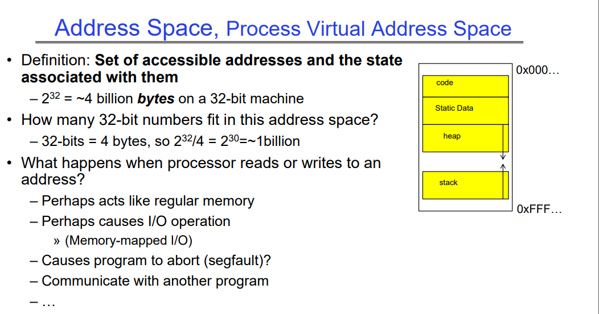

定义：可访问地址的集合及其关联的状态
处理器读取或写入地址时会发生什么？

- 可能表现为常规内存
- 可能会导致I/O操作
  - （内存映射I/O）
- 导致程序中止（段错误）？访问了不属于自己空间的部分。上图heap和stack之间不属于当前线程的部分。
- 与另一个程序通信，共享内存机制允许不同进程通信。

## Recall: Process Address Space: typical structure

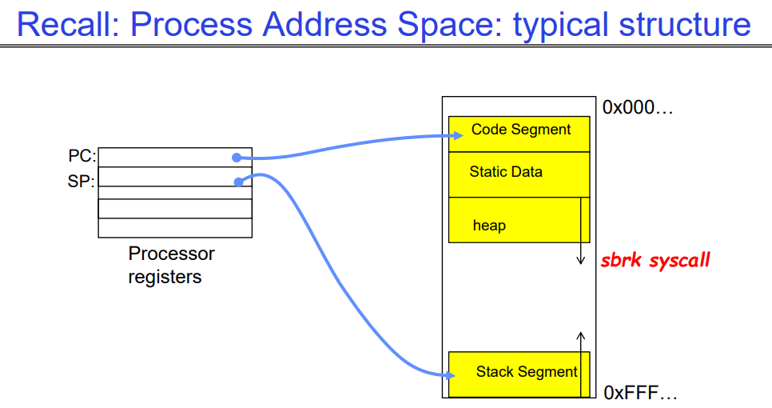

这是处理器上存储的关于当前线程的信息，右侧是一个线程自己的地址空间：

- 我们要知道stack和heap之间总是有一大块未映射到实际的物理内存地址（未分配）的空间，因此表现为一个很大的洞，只有线程的某个虚拟地址中实际对应了一块物理内存，我们才会把这个虚拟地址视作已分配（黄色）。
- sbrk系统调用用来为heap分配内存，其找到一块物理内存，将其映射到虚拟内存，之后放到该线程的heap空间中。sbrk被用户态的malloc操作中调用的，用于动态分配空间。

## Recall: Single and Multithreaded Processes

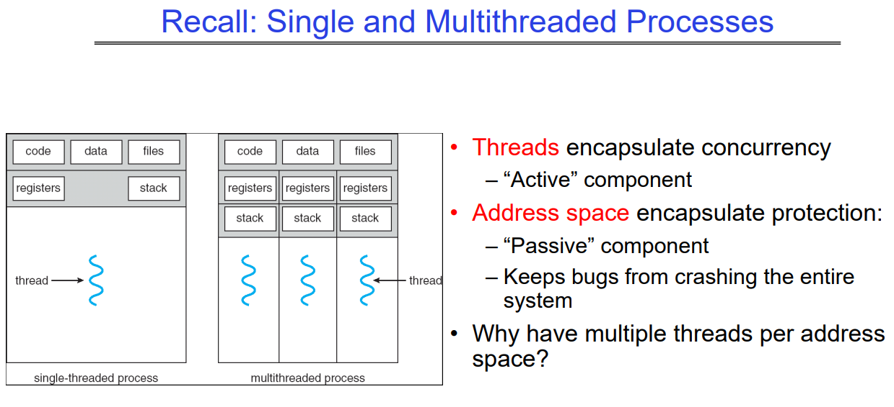

线程封装并发性
- “活动的”组件

地址空间封装保护：

- “消极的”组件
- 防止错误导致整个系统崩溃

为什么一个地址空间需要多个线程？

## Important Aspects of Memory Multiplexing

保护：

- 避免访问其他进程的私有内存
  - 内存的不同页面可以被赋予特殊的行为/权限（只读、对用户程序不可见等）。
  - 内核数据受到用户程序的保护
  - 程序受到自身的保护

翻译：

- 能够将对一个地址空间（虚拟）的访问转换为对另一个地址空间（物理）的访问
- 当存在翻译时，处理器使用虚拟地址，物理内存使用物理地址
- 副作用：
  - 可以用来避免重叠
  - **可以用来为程序提供统一的内存视图**

受控的重叠（即不同进程可以在用户希望的情况下共享相同的内存，可能是用于通信）：

- 属于不同进程的线程的不同状态不应该在物理内存中发生冲突。显然，意外的重叠会造成混乱！
- 相反，希望在需要时能够重叠（用于通信）

## Alternative View: Interposing on Process Behavior

操作系统对进程的I/O操作进行拦截

- 如何实现？所有I/O操作都通过系统调用进行。

操作系统对进程的CPU使用进行拦截

- 如何实现？中断使操作系统可以抢占当前线程

问题：操作系统如何对进程的内存访问进行拦截？

- 操作系统如果对每次内存访问都要进行拦截的话，速度太慢了。
- 翻译：硬件支持以加速常见情况，硬件本身有地址翻译机制，可以加速从VA->PA的过程。
- 页面错误：罕见情况会触发到操作系统以处理，如page fault等等。

# Recall：program code->process

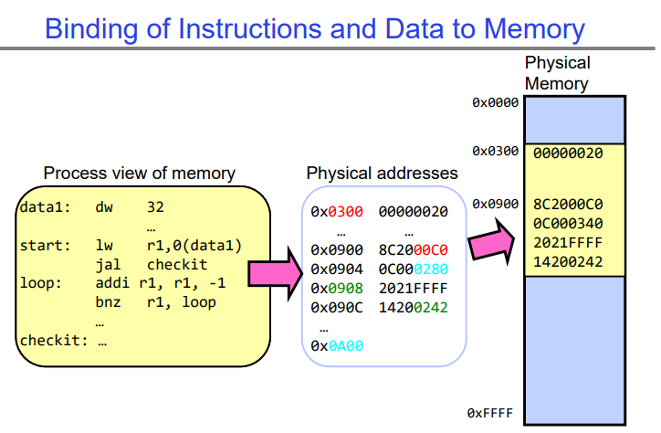

## compile、link、load、run

编译（compile）、链接（link）、加载（load）、运行（run）：

- 编译（compile）：编译是将源代码转换为目标代码的过程。编译器将源代码转换为目标代码，目标代码通常是机器语言或者是汇编语言的形式，能够被计算机直接执行。
- 链接（link）：链接是将目标代码与库文件等合并成一个可执行文件的过程。链接器将编译器生成的目标代码与所需的库文件、外部函数等合并，生成一个完整的可执行文件，该文件包含了程序的所有代码和数据，可以直接在计算机上运行。
- 加载（load）：加载是将可执行文件从存储器加载到计算机的内存中，并准备开始执行的过程。加载器负责将可执行文件中的代码和数据加载到内存中的合适位置，并为程序分配所需的内存空间。加载完成后，程序就可以开始在计算机上运行了。
- 运行（run）：运行是指程序在计算机上执行的过程。一旦程序被加载到内存中，操作系统就会启动程序的执行，程序开始按照指令顺序执行，并根据输入和程序逻辑进行计算和操作，直到程序执行完成或被终止。

同时执行程序的两个副本本质上是改变了link和load操作时的地址偏移量，因此程序可以被绑定到另一块物理内存上，如下图所示，可以对比上图。即我们可以改变link和load策略，从而让compile生成的汇编语言被link到物理内存中的一个特定的加载点。

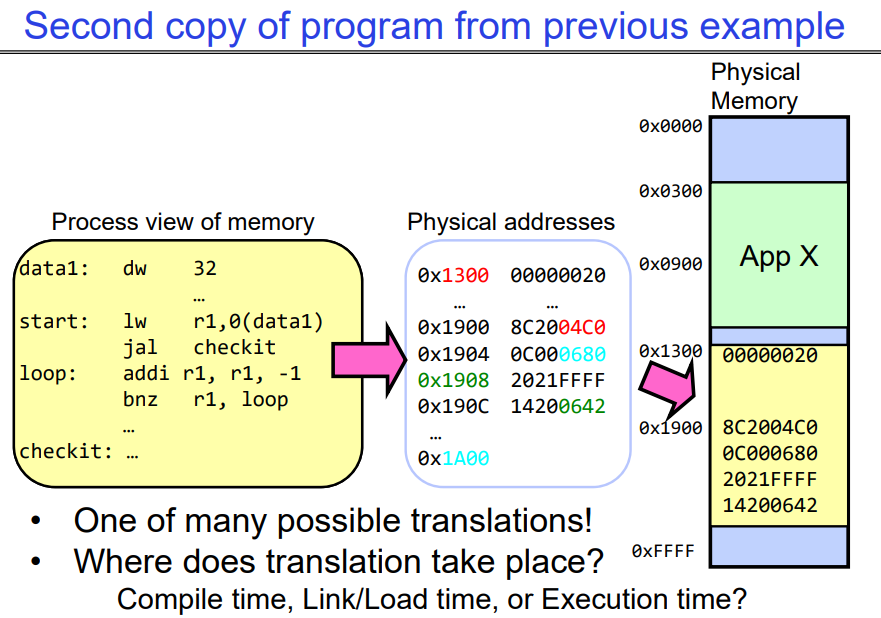

## From program code to Process

程序准备执行涉及以下组件：
   - 编译时（例如，“gcc”）
   - 链接/加载时（UNIX中的“ld”进行链接）
   - 执行时（例如，动态库）

地址可以下图中路径的任何位置绑定到最终值，这取决于硬件支持，也取决于操作系统。

动态库可以延迟到run阶段的时候再link：

   - 一个小段代码（即存根），定位到适当的内存中的库例程
   - 存根将自己替换为例程的地址，并执行该例程

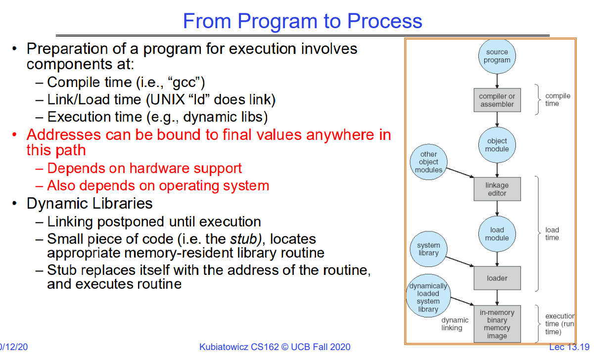

# Virtual Address-抛砖引玉(Seg、Multi-Seg(VarLength))

下面说明了运行程序地址转换的发展历程，从没有地址转换到有地址转换，从整个段->多个段，最后再到以page为单位的虚拟地址转换。这是一个translation粒度不断变小的过程。

## Base and bound（每个进程占用连续内存区域，单个段）

在Address Translator出现前，是在link-load的时候，采用relocating-loader的方式，将程序加载到一块内存区域中。如果没有额外的保护措施（如base and bound这些），那么程序之间可能会出现越界访问，相互影响从而导致程序崩溃，因此，MMU诞生了。

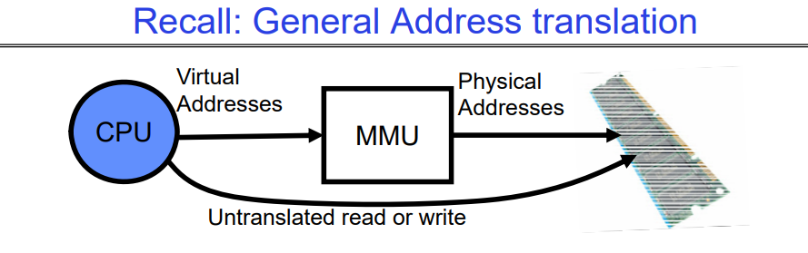 
因此，内存有两种视图：

- CPU 的视图（程序所见，虚拟内存）

- 内存的视图（物理内存）

- 翻译盒（内存管理单元或 MMU)在这两种视图之间进行转换。

通过翻译，实现保护变得容易多了！

- 如果任务 A 甚至无法访问任务 B 的数据，那么 A 不可能对 B 产生不利影响

通过翻译，每个程序都可以链接/加载到用户地址空间的相同区域，即每个程序都认为自己拥有所有的内存地址空间（虚拟的），通过MMU转换，将虚拟地址空间转化为实际的内存地址空间；每当切换进程时，MMU中的翻译机制就会随之改变。

但是仅仅用base and bound和简单地加法地址重定位机制，会导致内存碎片的问题，这种方式也不支持内存共享，也不能良好的支持栈和堆的动态增长。

## More Flexible program Segmentation（多段机制）

每个进程可以被拆分为多个段，每个段仍然是一个连续的内存块，从而减缓内存空间碎片化问题。因此我们需要为当前进 程的每个segment都维护一个MMU机制的转换，如下例所示：

- 每个段都有自己的base值，base加上当前在虚拟地址中的偏移量，就是实际的物理地址。

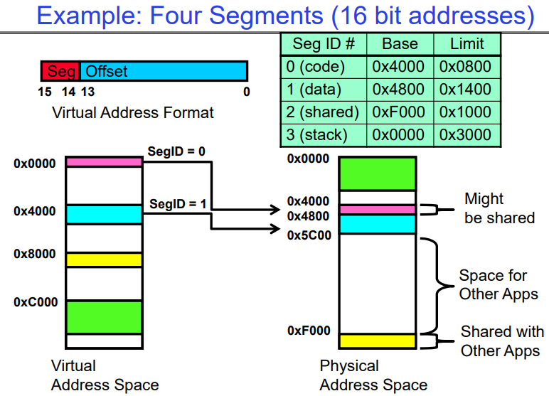

### Example of segment translation(16 bit address)

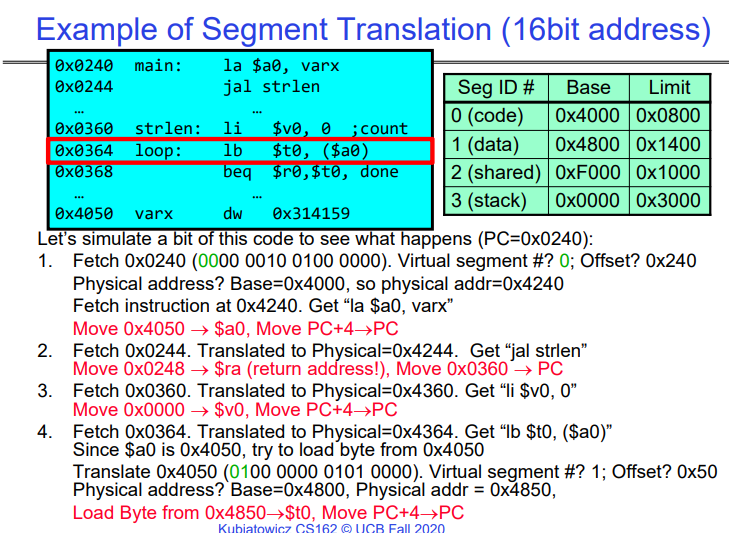

根据上例，我们可以得到如下结论：

每次指令提取、加载或存储时进行翻译

- 对于稀疏地址空间，分段是有效的

在有效范围之外寻址有何影响：这就是栈（和堆？）被允许增长的原因，

- 例如，栈发生错误，系统会自动增加栈的大小。

分段表中需要保护模式：例如，代码段将是只读的；数据和栈将是读写的（允许存储）

在上下文切换时需要保存/恢复什么？

- 分段表存储在 CPU 中，而不是存储在内存中（占用空间小）

- 在切换时可能会将进程的所有内存存储到磁盘上（称为“换出”）

### What if not all segments fit in memory?

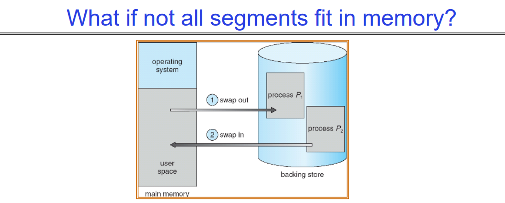

极端的上下文切换形式：Swapping整个Segment

- 为了为下一个进程腾出空间，将上一个进程的部分或全部移到磁盘上
  - 可能需要发送完整的段

- 这大大增加了上下文切换的成本

有什么可能是一个理想的替代方案？

- 某种方式在任何时候只保留**进程的活动部分**在内存中

- 需要对物理内存有**更细粒度**的控制

### Problems with Segmentation

必须将可变大小的块放入物理内存中；可能需要多次移动进程以适应所有内容；到磁盘的交换选项有限，只能移动整个Segment大小，磁盘I/O是非常恐怖的。

碎片化：浪费空间

- 外部碎片：分配块之间的空闲间隙

- 内部碎片：分配块中不需要的所有内存，比如说，有个进程申请了4个块，但其实他当前只有1个块在被CPU运行，其他块在内存里都是无用的。

# Virtual Address-Fixed Size Chunk(serveral pages)

## Paging: Physical Memory in Fixed Size Chunks

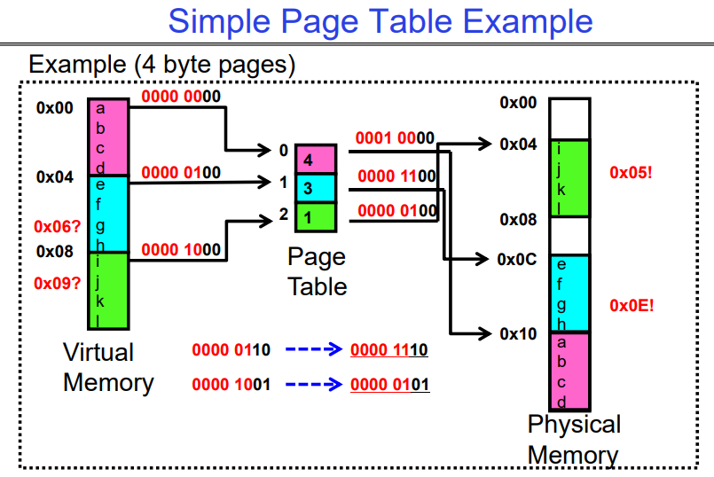

分页：将物理内存划分为固定大小的块，这解决了分段带来的碎片化问题吗？

将物理内存划分为固定大小的块（“页面”）

每个物理内存块都是等价的

- 可以使用简单的位向量来处理分配：00110001110001101 … 110010；每个位代表一个物理内存页面；1表示已分配，0表示空闲

页面应该和以前的段一样大吗？

- 不应该：可能导致大量的内部碎片

- 通常有小页面（1K-16K）

- 因此：一个段可能需要多个页面

## 进程通信方式: Sharing Memory

下图就是进程间通过共享内存方式进行通信的一个简单示例。

### Where is page sharing used ?

**内核区域的共享：** 每个进程的内核区域具有相同的页表条目，但在用户级别无法访问。但是在用户到内核的切换时，内核代码可以访问它以及属于该用户的区域。这种共享可用于访问其他用户进程所需的内核功能。

**运行相同二进制文件的不同进程：** 当多个进程运行相同的二进制文件时，它们可以共享code segments/pages，因为这些segments是只执行的，不需要复制。

**用户级系统库：** 这些库通常是只执行的，因为它们不需要被修改，因此可以被多个进程共享。

**不同进程之间的共享内存段：** 可以在不同进程之间共享内存段，允许它们直接共享对象。为了实现这种共享，需要将内存页映射到各个进程的相同的实际物理内存地址空间位置。这种共享形式类似于单个进程的内部的多个线程之间的共享。