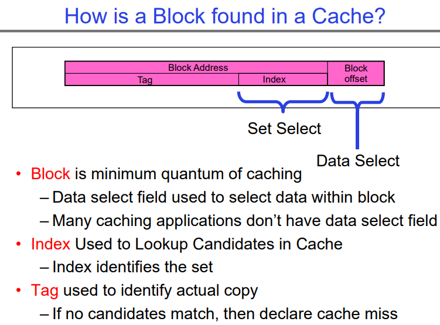
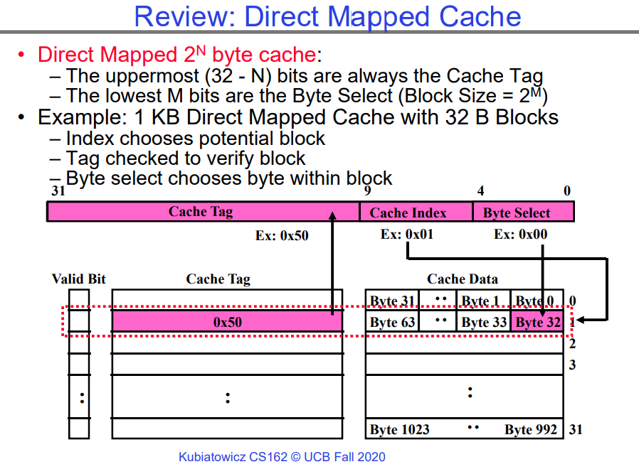
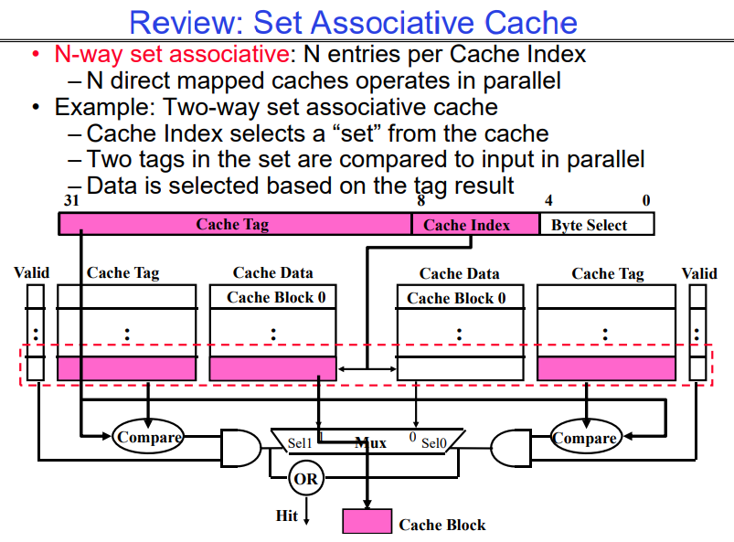
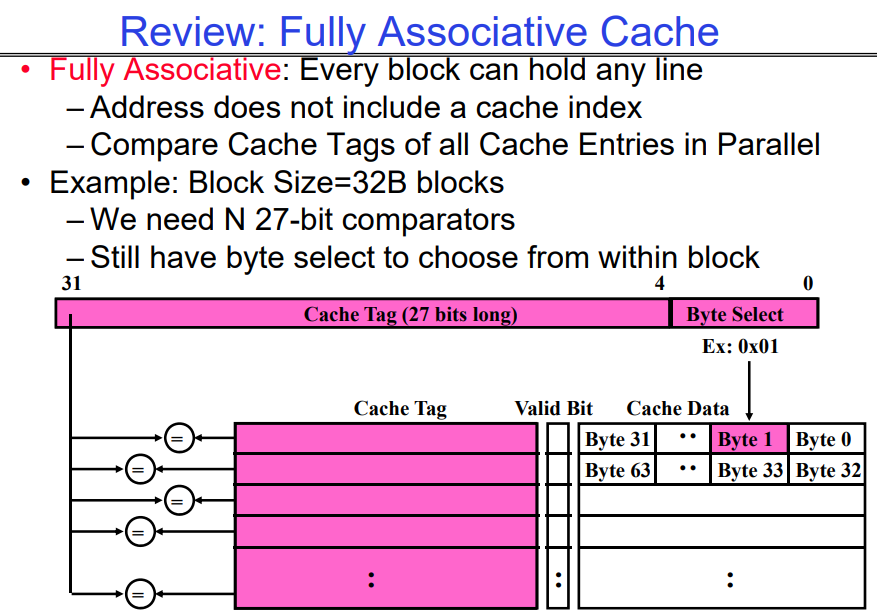
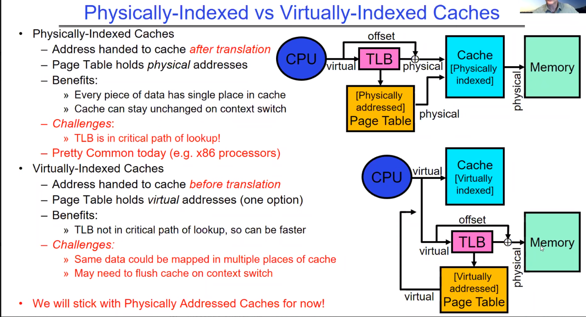
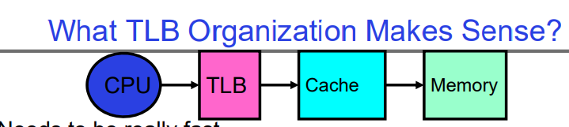
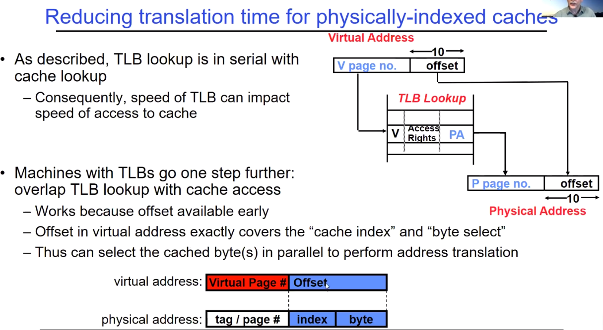
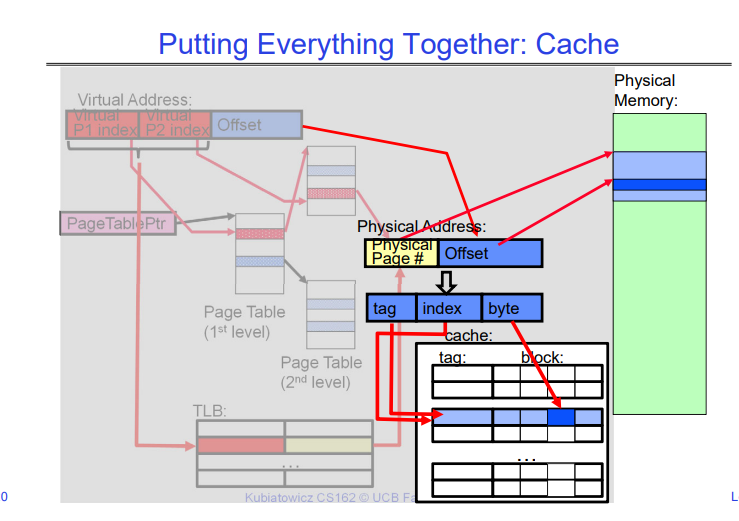

# Memory 3: Caching and TLBs (Con’t), Demand Paging

## A Summary on Sources of Cache Misses

**强制性未命中（Compulsory）**：这是指首次访问一个块时发生的未命中，比如冷启动或进程迁移时的第一次引用。这是不可避免的现象，对此无法做太多处理。如果程序将要运行数十亿条指令，强制性未命中在总体上是微不足道的。

**容量未命中（Capacity）**：发生在缓存无法包含程序访问的所有块时。解决办法是增加缓存大小。

**冲突未命中（Conflict，也称为碰撞）**：多个内存位置被映射到同一缓存位置时发生，下面讲到映射方式的时候会具体介绍这种问题。解决办法有两个：

- 方案一：增加缓存大小。
- 方案二：增加缓存的关联性（Associativity）。

**一致性未命中（Coherence）或失效（Invalidation）**：当其他进程（例如，I/O操作）更新内存时，可能导致缓存中的数据失效。

这些类型的缓存未命中是衡量和优化缓存性能的关键指标，操作系统和硬件设计师会尝试通过各种方法来减少这些未命中的发生，从而提升系统性能。

## Cache's minimal quantum: Block

这张图解释了在缓存中如何找到一个数据块。它包含了数据块地址结构的图示以及参与过程中各组成部分的描述。这里是详细解释：

- **块（Block）**：这是可以从缓存中存储或检索的最小数据单元。访问缓存时，数据以块为单位进行读取或写入，而不是单个字节，以提高效率。

- **数据选择（块偏移，Block Offset）**：块地址内的这个字段用于选择缓存块内的确切数据。它指定了数据在块内的确切位置。

- **集合选择（索引，Index）**：此字段用于确定数据块可能所在的缓存集合。索引是内存地址的一部分，用于在缓存中查找块可能位于的候选组。

- **标签（Tag）**：这是内存地址的一部分，用于识别是否为所需的特定数据块。标签用于验证从索引指示的缓存集合中检索的块是否正确。

在缓存中找到一个数据块的过程如下：

1. **查找索引**：地址的索引部分用于确定查看哪个缓存集合。

2. **检查标签**：在这个集合内，检查块的标签是否有任何一个与我们正在查找的地址的标签匹配。

3. **选择数据**：如果有标签匹配，块偏移用于选择块内的特定数据。

4. **缓存命中或未命中**：如果集合中没有标签与我们正在查找的地址的标签匹配，就会发生缓存未命中，意味着数据不在缓存中，必须从主内存中检索。

这种图示和描述通常用于计算机架构中，以解释缓存内存的工作原理及其在减少数据访问时间中的重要性。

# Cache Types

告诉我们应该如何将整块cache进行设计并切分，以实现高效的访问和较高的命中率。我们依次介绍`Direct Mapped Cache`、`Set Associative Cache`、`Fully Associate Cache`。

以1KB大小的Cache为例，我们可以看到从第一种类型到第三种类型，Cache Index在不断地变小，因为这意味着每个Cache Index中包含的Cache Block在慢慢地变多；并行度也逐渐变高，注意系统对同一个Cache Index内的所有Block的Cache Tag的检查是可以通过硬件来并行执行的。

## Direct Mapped Cache

这张图解释了直接映射缓存（Direct Mapped Cache）的原理和组件。在直接映射缓存中，每个块数据只能放在缓存中的一个固定位置。这是通过使用内存地址中的某些位来决定的。

图中的要点包括：

- **直接映射2^N字节缓存**：指的是缓存的大小，这里的N是决定缓存大小的参数。上图的Cache大小是1KB。此时N=10。Cache Index+Byte Select=N。这很容易理解。
  
- **地址的最上面（32-N）位始终是缓存标签（Cache Tag）**：用于标识缓存中数据的唯一性。

- **地址的最低M位是字节选择（Byte Select）**（块大小=2^M）：这是根据块的大小确定的，用于在块内选择具体的字节。

- **例子**：1KB直接映射缓存，每个块大小为32字节（B）。
  - **索引（Index）**：用于选择潜在的块。
  
  - **标签（Tag）**：用于验证块的数据。
  
  - **字节选择（Byte Select）**：用于在块内选择具体的字节。

图中还展示了缓存的结构，包括有效位（Valid Bit）、缓存标签（Cache Tag）、缓存数据（Cache Data），以及如何从完整的内存地址中提取这些部分。有效位用来表示缓存中的数据是否有效。缓存标签与内存地址中的标签进行匹配，以验证所请求的数据是否已在缓存中。索引用来选择特定的缓存行，字节选择用来从缓存行中选择所需的数据。

这个过程是如何进行的：

1. CPU生成内存地址，寻找数据。
2. 根据地址中的索引值，选择缓存中对应的行（set）。
3. 在这一行中，比较缓存标签与地址中的标签是否一致。
4. 如果标签匹配且有效位为1，表示缓存命中。
5. 使用字节选择从缓存行中选择所需的数据。
6. 如果标签不匹配，发生缓存未命中，需要从主内存中获取数据。

这是计算机组成原理和操作系统中常见的概念，用于解释和优化内存的访问速度。

## Set Associative Cache-N way set Associative

这张图说明了集合相联缓存（Set Associative Cache）的原理，这是介于全相联缓存和直接映射缓存之间的一种缓存映射技术。图中讲解了二路集合相联缓存的例子，但概念也适用于更多路的集合相联缓存。

集合相联缓存的基本概念包括：

- **N路集合相联**：意味着每个缓存索引对应有N个条目（或称作块）。每个索引定义的组中可以有N个缓存块。

- **缓存索引**：用来选择缓存中的一个“集合”。

- **缓存标签**：在集合内部，每个块有一个标签，用于标识缓存的内容。

- **比较操作**：地址的标签部分与缓存集合中所有块的标签并行比较。

- **数据选择**：如果标签匹配，相应的块数据被选中并输出。

在图中的二路集合相联缓存中：

1. **缓存索引**用于选择一个特定的缓存集合（由两个缓存块组成）。
   
2. **缓存标签**在两个块中并行比较。如果输入的标签与集合中的某个块标签匹配，则认为缓存命中。这一步可以由硬件完成，从而使得两个块的比较是并行执行的。

3. **选择信号（Sel0, Sel1）**和多路选择器（Mux）用于选择正确的缓存块数据。

4. 如果两个标签都不匹配，则发生缓存未命中，需要从更低级别的存储器或主存中加载数据。

5. **有效位（Valid Bit）**用于指示缓存块中的数据是否有效。

集合相联缓存提供了比直接映射缓存更好的折中方案，因为它减少了缓存冲突，同时不像全相联缓存那样硬件实现复杂。

## Fully Associative Cache

这张图讲解了全相联缓存（Fully Associative Cache）的工作原理。全相联缓存是一种灵活的缓存类型，其中任何数据块可以放在缓存中的任何位置。

全相联缓存的特点包括：

- **每个块可以放置任意行**：不像直接映射或集合相联缓存，全相联缓存没有索引字段。内存地址被分为两部分：缓存标签和字节选择。

- **地址不包含缓存索引**：由于任何数据块都可以放置在任意位置，所以不需要索引来选择特定的缓存集。

- **并行比较所有缓存条目的缓存标签**：这意味着CPU地址中的标签与缓存中每个块的标签都要进行比较，以查找匹配的数据。

- **例子**：如果块大小为32字节，那么对于缓存中的每个块，都需要一个27位的比较器来比较标签。

- **字节选择**：尽管缓存是全相联的，但依然需要字节选择来从块中选择所需的具体字节。

在图中还展示了缓存的一部分结构，包括：

- **缓存标签**：每个缓存行都有一个标签字段，其长度是27位。

- **有效位**：表示缓存行中的数据是否有效。

- **缓存数据**：实际存储的数据部分。

全相联缓存的一个优点是缓存不会发生冲突未命中（conflict misses），因为任何数据块都可以放在任何位置。但缺点是，由于需要更多的硬件比较器，这使得硬件设计变得复杂且成本较高。在实际的处理器设计中，通常会使用集合相联缓存作为折中方案，因为它平衡了硬件复杂性和缓存效率。

## 总结

三种常见的缓存方案包括直接映射缓存、集合相联缓存和全相联缓存。它们各自的优缺点如下：

### 直接映射缓存（Direct Mapped Cache）
**优点**:
1. **硬件简单**：由于每个数据块只有一个可能的位置，硬件设计简单。
2. **访问速度快**：计算缓存位置的速度通常很快，因为这个过程很简单。
3. **成本低**：相较于其他缓存方案，所需的比较器和逻辑较少。

**缺点**:
1. **冲突未命中**：多个数据可能映射到同一个位置，导致频繁的替换和冲突未命中。比如我们上面讨论的例子，一个Cache大小为1KB，在32位的系统中，只要Cache Tag相同，那么他们就都会落在同一个cache line中，因为一个cache Tag对应的cache line只能存放一个cache block，所以会有频繁的替换和冲突未命中。
2. **利用率低**：某些缓存行可能非常热门，而其他行却很少使用，导致总体缓存利用率不高。

### 集合相联缓存（Set Associative Cache）
**优点**:
1. **冲突未命中减少**：每个索引有多个潜在的块，减少了冲突未命中。
2. **折中方案**：平衡了直接映射和全相联之间的硬件复杂性和访问速度。
3. **灵活性更高**：可以根据需要和成本选择不同的“路数”（如2路、4路等）。

**缺点**:
1. **硬件复杂性增加**：需要多个比较器和更复杂的逻辑来处理多个块。
2. **访问速度**：相对于直接映射缓存，访问速度可能略慢，因为需要更多的比较操作。
3. **成本增加**：相比直接映射缓存，集合相联缓存的实现成本更高。

### 全相联缓存（Fully Associative Cache）
**优点**:
1. **最小的冲突未命中**：数据块可以放在缓存中的任何位置，完全消除了冲突未命中。
2. **最大化利用率**：缓存利用率最高，因为每个缓存行都可以用于存储任何数据。

**缺点**:
1. **硬件非常复杂**：需要对所有缓存行进行搜索，需要更多的比较器。
2. **成本最高**：所有这些比较器都增加了硬件成本。
3. **速度较慢**：比较整个缓存可能导致较长的延迟。

在选择缓存方案时，设计者必须在速度、成本、复杂性和未命中率之间进行权衡。直接映射缓存在简单性和成本效益方面是最好的，但它的性能可能因冲突未命中而下降。集合相联缓存提供了一个中间的选择，具有合理的性能和成本。全相联缓存提供了最佳的性能，特别是在冲突未命中方面，但代价是更高的成本和复杂性。在实践中，`N way set Associative`缓存被广泛用于现代计算机系统中，因为它们在性能和成本之间提供了很好的平衡。

# Cache related topics

## Which block should be replaced on a miss?

讲解了当缓存发生未命中时，应该替换哪个缓存块的问题，同时给出了不同替换策略和不同大小、不同“路数”缓存下的未命中率数据。

在**直接映射缓存**中，替换决策很简单，因为每个数据块只有一个可能的位置，所以在发生缓存未命中时，要替换的块是固定的。

对于**集合相联**和**全相联缓存**，需要选择一个替换策略。图中列举了两种常见的替换策略：

1. **随机（Random）**：随机选择一个块来替换。
2. **最近最少使用（LRU，Least Recently Used）**：替换最长时间未被访问的块。

此外，图表还展示了不同缓存大小（16KB、64KB、256KB）和不同集合相联性（2路、4路、8路）下，使用LRU和随机替换策略的未命中率。例如，对于16KB的2路集合相联缓存，LRU策略的未命中率为5.2%，而随机策略的未命中率为5.7%。数据显示，在大多数情况下，LRU策略和Random策略的Cache Miss概率是差不多的，因此在Cache中的替换策略选择用Random就可以，不必花费额外的开销维护LRU。

## What happens on a write?

缓存系统中发生写操作时有两种策略：写直达（Write Through）和写回（Write Back），以及它们各自的优缺点。

**写直达（Write Through）**:
- 当数据写入缓存时，同时也会写入到下一级的内存中。
- **优点**：读未命中时不会导致写操作，数据在主内存中总是最新的。
- **缺点**：如果没有写缓冲，处理器在写操作完成之前可能会被阻塞。
- 这种方案一般用于L1 Cache中，因为L1 Cache速度快，阻塞时间极小。

**写回（Write Back）**:
- 数据仅写入缓存，只有当缓存块被替换时才会写回到主内存。
- **优点**：重复的写操作不会立即写入主内存，减少了对主内存带宽的需求，不会阻塞处理器。
- **缺点**：更复杂，读未命中可能需要先写回脏数据（修改过但尚未写回主内存的数据）。
- 一般用于L1之后的一些cache。

在写回策略中，还需要考虑缓存块是“干净”还是“脏”的，即是否已被修改过。如果缓存块是脏的，它包含了还未写回到主内存的修改数据，这时候如果发生读未命中，就必须先将这些脏数据写回主内存，然后才能从主内存中装载新的数据块到缓存中。

## Physical Indexes vs. Virtual Indexes

这张图对比了物理索引缓存（Physically-Indexed Caches）和虚拟索引缓存（Virtually-Indexed Caches）两种设计，并列出了它们的优势和挑战。

**物理索引缓存**:**地址转换之后**传递给缓存。

- 页表（Page Table）持有物理地址。
- **优势**：数据在缓存中只有一个位置；下文切换时缓存可以保持不变。
- **挑战**：快表（TLB）在查找路径中是关键部分，可能影响性能。
- 这种设计在当今（如x86处理器）非常常见。

**虚拟索引缓存**:
- **地址转换之前**传递给缓存。页表持有虚拟地址。
- **优势**：TLB不在查找的关键路径中，可能更快。
- **挑战**：同一数据可能映射到缓存的多个位置。上下文切换时可能需要清空缓存。

最后，图中提到，“现在我们将坚持使用物理地址缓存”。这可能表明，虽然虚拟索引缓存有其优点，但物理索引缓存因其简单性和在上下文切换时不需要额外操作的特性，在当前的讨论或应用中是优先考虑的选择。

## What TLB Organization Makes Sense?

这张幻灯片探讨了转换后援缓冲器（TLB）的组织结构，它是在CPU、缓存和内存之间进行有效地址转换的关键部分，TLB位于CPU core里面的registers和L1 Cache之间的关键路径上。因此TLB的设计需要考虑的几个关键因素：

- **速度**：TLB需要非常快速，因为它处于内存访问的关键路径上。在最简单的设计中，TLB操作发生在缓存访问之前，因此任何延迟都会增加访问时间并减慢缓存速度。

- **映射方式**：幻灯片建议直接映射或低相联性（low associativity）的TLB可能更有意义，因为它们在设计上比高度相联的TLB简单，有助于快速的地址转换。

- **冲突的成本**：TLB的冲突未命中（即所需的地址转换不在TLB中）非常昂贵，因为这会涉及遍历页表（PT traversal），这是一个高代价操作。因此，TLB设计需要尽量减少冲突。

- **抖动（Thrashing）**：如果多个访问频繁地导致TLB条目替换，会导致性能下降。幻灯片讨论了基于页面的低位或高位来索引TLB的可能性，以及这些选择如何影响抖动现象。
  - 使用页面低位作为索引可能会导致首次代码、数据、栈映射到同一个TLB条目，可能需要至少3路相联性来减轻这个问题。
  - 使用高位作为索引可能对小程序有利，因为它们的TLB使用会比较稀疏。

总的来说，这张幻灯片在讨论设计TLB时需要权衡的不同因素，以及这些设计决策如何影响缓存和内存访问的性能。

## TLB organization: include protection

讨论了转换后备缓冲器（Translation Lookaside Buffer, TLB）的组织结构，尤其是在包含保护机制的情况下。TLB是一种特殊的缓存，用于存储虚拟地址到物理地址的转换信息，并且通常还包含了关于内存访问权限的保护信息。

- **TLB的大小**：通常TLB的大小较小，有128到512个条目，但现在的设计可以有更多条目，支持更高的相联性（associativity）。

- **小型TLB的组织**：通常以全相联缓存（fully-associative cache）的形式组织，它根据虚拟地址进行查找，并返回物理地址以及其他信息（如访问权限、脏位、引用位等）。

- **全相联缓存过慢时的策略**：如果全相联的TLB查找速度太慢，可以在前面放一个小型的直接映射缓存，称为“TLB Slice”，其中只包含4到16个条目。

- **MIPS R3000处理器的例子**：表格展示了该处理器TLB的一个例子，包括虚拟地址和物理地址映射，以及与每个条目相关联的保护和状态位：

这张幻灯片强调了设计TLB时需要考虑的性能和保护两个重要方面，以确保快速有效的地址翻译和内存访问控制。

## Reduce translation time for physically-indexed caches

并行进行virtual page的转换与cache中block的查找，因为block定位仅仅与offset有关系。

**主要内容包括：**

- TLB查找与缓存查找是串行的：因此，TLB的速度会影响到缓存的访问速度。

- 为了提高效率，一些机器的设计使得TLB查找与缓存访问重叠：这是可行的，因为虚拟地址中的偏移量（offset）很早就可用了。在虚拟地址中的偏移量恰好可以覆盖“缓存索引”和“字节选择”。

**地址翻译过程：**

- 虚拟地址被分成两部分：虚拟页面号和偏移量。
- TLB使用虚拟页面号来查找对应的物理页面号和访问权限。
- 物理地址由物理页面号和相同的偏移量组成。

通过这种设计，即使在物理地址尚未完全确定时，也能开始缓存行的查找过程，从而减少整个访问过程的延迟。这种方法依赖于偏移量，它在地址翻译过程的早期阶段就已经确定，允许缓存和TLB操作能够并行进行。

## Current Example: Memory Hierarchy

**缓存配置**：
- 所有缓存层的行大小均为64字节。
- **L1指令缓存**：每核32 KiB，8路集合相联。
- **L1数据缓存**：每核32 KiB，8路集合相联，写回策略，访问延迟4-5个周期。
- **L2缓存**：每核1 MiB，16路集合相联，包含（Inclusive），写回策略，访问延迟14个周期。
- **L3缓存**：每核1.375 MiB，11路集合相联，跨核共享，非包含式牺牲缓存（Non-inclusive victim cache），写回策略，访问延迟50-70个周期。

**TLB配置**：
- **L1指令TLB (ITLB)**：128条目，8路集合相联，支持4 KB页。
  - 每线程8条目；对于2 MiB/4 MiB页，完全相联。
- **L1数据TLB (DTLB)**：64条目，4路集合相联，支持4 KB页。
  - 32条目；4路集合相联，2 MiB/4 MiB页转换。
  - 4条目；4路集合相联，1 GiB页转换。
- **L2共享TLB (STLB)**：1536条目，12路集合相联，支持4 KB和2 MiB页。
  - 16条目；4路集合相联，1 GiB页转换。

此摘要显示了一个多层缓存体系结构，这种体系结构设计用于优化处理器访问内存时的性能，减少访问延迟，并通过多级缓存来管理数据。每一层的缓存提供了不同的存储大小、相联性、访问时间和管理策略。TLB被用于优化虚拟地址到物理地址的翻译过程，同时减少页表查找的延迟。TLB的多级设计进一步优化了不同大小页面的地址翻译。

## What happens on a Context Switch?

讨论了在上下文切换时TLB（Translation Lookaside Buffer）需要执行的操作。上下文切换是指操作系统切换CPU从当前执行的进程到另一个进程的过程。因为每个进程都有自己的虚拟地址空间，所以当上下文切换发生时，当前的TLB条目就不再有效，因为它们映射的是旧的地址空间。

有如下几种处理这一问题的方案：

**使TLB无效（Invalidate TLB）**：这是一个简单的解决方案，但可能代价昂贵，特别是如果进程频繁切换的话。

**在TLB中包含进程ID**：这是一个需要硬件支持的架构解决方案。通过这种方式，TLB可以区分不同进程的条目，因此在上下文切换时不需要使整个TLB无效。可以实现按需替换陈旧的TLB条目，当我们切换回旧的进程时，旧的TLB条目仍然是有效的。

**如果翻译表发生变化怎么办**：例如，当一个页面从内存移动到磁盘（或反之）时，必须使对应的TLB条目无效。否则，系统可能会错误地认为该页面仍然在内存中。这就涉及到了`TLB Consistency`的概念：

- **TLB一致性（TLB Consistency）**的概念，即确保TLB内容反映最新的页面映射状态。这是内存管理的关键部分，特别是在多任务操作系统中，确保数据的准确性和有效性。

## Page Fault

页面错误（Page Fault）是指当一个程序请求的数据不在物理内存中时，操作系统所发出的一种中断。在现代操作系统中，使用虚拟内存管理技术允许程序认为它拥有连续的、通常比实际物理内存大得多的地址空间。程序使用的这些地址被称为虚拟地址。操作系统负责将虚拟地址映射到实际的物理内存地址。当程序尝试访问其虚拟地址空间中的某个部分，而该部分没有被映射到物理内存时，就会发生页面错误。

页面错误的处理通常涉及以下几个步骤：

1. **中断执行**：CPU检测到访问无效的内存地址后，会暂停当前指令的执行。

2. **故障处理**：操作系统接管控制权，开始处理页面错误。

3. **确定原因**：操作系统会检查页面错误的原因，比如请求的页面是否在硬盘上，或者访问权限是否正确。

4. **页面调入**：如果数据在硬盘上，操作系统会从硬盘读取所需的数据页面，并将其放入物理内存中。
   - OS如何确定磁盘页的定位，教授介绍了两种思路，一种是无效PTE本身存储的就是磁盘页的地址，还有一种是OS中有一个特殊的数据结构，专门用于记录当前进程中不在内存中的页的VA->磁盘PA的映射。

5. **更新页表**：一旦页面被装入物理内存，操作系统会更新页表，建立虚拟地址到物理地址的映射。

6. **重新执行指令**：更新完页表后，操作系统将控制权返回给程序，重新执行导致页面错误的那条指令。

如果页面错误是由于程序错误或非法访问（如访问没有权限的内存区域）引起的，操作系统通常会终止程序。如果是因为页面不在内存中而是在硬盘上，这称为“次要页面错误”（minor page fault），操作系统会处理这个错误，而程序可以继续执行。

页面错误是虚拟内存系统的一个基本特性，它使得多任务操作系统能够有效地使用有限的物理内存资源，并为每个运行的程序提供足够的地址空间。

### PPT讲述的page fault

这张幻灯片讲述的是页面错误（Page Fault）的概念和它在虚拟内存管理中的作用。

页面错误发生在虚拟地址到物理地址的转换失败时：

- 页表项（PTE）标记为无效；权限级别违规；访问违规；

- 页面错误会导致一个故障或陷阱（Fault/Trap），这是一种同步事件，发生在指令执行期间。
  - 与中断不同，因为中断是异步的。
- 页面错误可能发生在指令获取或数据访问时。
- 权限违规的相关问题通常会终止导致错误的指令。

当发生页面错误时，操作系统会介入以修复问题，并重试导致错误的指令。这可能涉及：

- 分配一个额外的栈页面
- 使页面可以访问，例如实施写时复制（Copy on Write）
- 从辅助存储（如硬盘）将页面调入内存，这是需求分页（demand paging）的一部分

幻灯片最后提到了页面错误反映了硬件与软件边界的一个根本性转变，因为它涉及到操作系统在硬件请求数据时的介入和处理。这是现代操作系统内存管理的关键组成部分，允许了虚拟内存的实现，从而超出了物理内存的限制，提高了内存的使用效率和程序的运行安全性。

## Putting Everything Together: Address Translation

下面将TLB、数据Cache等放在一起，演示CPU从一个virtual address获取数据直到最终拿到这份数据会经历什么（不考虑page fault的情况）：

