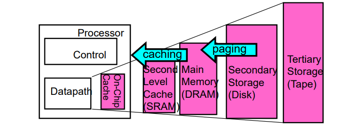
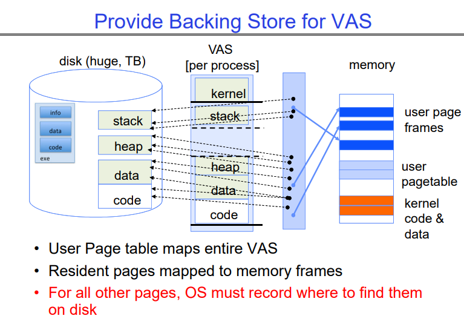
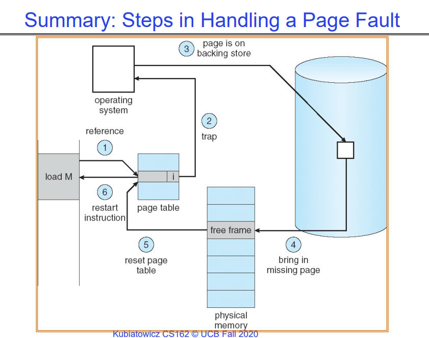

# Demanding Paging

## concepts

“需求分页”，是计算机操作系统中用于内存管理的一种技术。概述以下几点：

1. 现代程序需要大量的物理内存，系统的内存增长速度比每年25%-30%还要快。

2. 但是程序并不会一直使用它们的全部内存。
   - 根据90-10规则，程序90%的时间只运行代码的10%部分。
   - 要求所有用户代码常驻内存是浪费的。

3. 解决方案是将主内存作为磁盘的“缓存”使用。

如上所示，我们可以认为每一层存储都可以作为下一层广义上的cache。让每一层按照需求从下一层中有选择的拉取page使用，这就是所谓的按需分页。

**每当某一层存储有数据缺失，会出发广义上的page fault，进而尝试从下一级别获取对应内容。**

## Demand paging as Caching

当使用按需分页策略时，我们需要考虑以下几点：

**块大小（Block size）**：这里的“块”指的是页的大小，通常是1页，例如4KB。

**组织方式（Organization）**：即缓存可以如何映射到内存，是直接映射（direct-mapped）、组关联（set-associative）还是全关联（fully-associative）？

- 这里指出了全关联，因为它允许任意的虚拟地址映射到物理地址。

**定位页的方法（How do we locate a page?）**：首先检查快表（Translation Lookaside Buffer, TLB），然后进行页表遍历（page-table traversal）。

**页面替换策略（Page replacement policy）**：比如最近最少使用（LRU, Least Recently Used）策略，随机替换等。指出这需要更多解释，类似于LRU策略。

**缺页发生时的操作（What happens on a miss?）**：转到更低一层级（如磁盘）填充缺失的数据。

**写操作发生时的处理（What happens on a write?）**：这里分为直写（write-through）和回写（write back）。

- 并特别指出肯定是回写，因为需要脏位（dirty bit）。write-through策略会大大的拖慢操作速度。

## Demand Paging Mechanisms

基于需求分页（Demand Paging）机制，操作系统在发生页面错误（Page Fault）时会有如下响应：

**页表项（PTE, Page Table Entry）**：它使得需求分页成为可能。
- 有效（Valid）：表示页在内存中，PTE指向物理页。
- 无效（Not Valid）：表示页不在内存中；使用PTE中的信息在必要时在磁盘上找到它。

**用户访问无效的PTE**：
- 内存管理单元（MMU）将引起操作系统（OS）的中断。
- 结果中断是一个“页面错误（Page Fault）”。

**操作系统在页面错误发生时的操作**：
- 选择一个旧的页面来替换。如果旧页面被修改（D=1，即“脏”位为1），将内容写回磁盘。
- 改变它的PTE并使任何缓存的TLB无效。从磁盘加载新页面进入内存。
- 更新页表项，使TLB对新条目无效。从原始发生错误的地方继续线程。

**TLB和线程的继续**：
- 当线程继续时，TLB将为新页面加载。
- 当OS为一个进程从磁盘拉取页面时，它会运行就绪队列中的另一个进程。挂起的进程位于等待队列。

## Many Uses of Virtual Memory and "Demand paging"

“虚拟内存和‘需求分页’的多种用途”。它列举了虚拟内存在操作系统中的几种关键应用：

**扩展栈（Extend the stack）**：
- 分配一页并将其清零。

**扩展堆（Extend the heap）**：
- 以前使用`brk`来扩展堆，但现在使用`mmap`。

**进程复制（Process Fork）**：
- 创建页表的副本。
- 条目引用父页面，设置为不可写（NO-WRITE）。
- 共享的只读页面保持共享。
- 写时复制（Copy on write）。

**执行程序（Exec）**：
- 只有在活跃使用时才加载二进制文件的部分。
- 根据需求进行操作。

**使用MMAP来明确共享区域**（或作为内存访问文件）：
- `mmap`可以用于显式地在进程之间共享内存区域，或者将文件作为内存进行访问，便于读写操作。

这些点强调了虚拟内存技术不仅是内存扩展的一种形式，它还为进程创建、内存管理、文件访问等提供了重要的机制。需求分页是支持这些功能的关键技术之一，因为它允许操作系统按需加载和存储内存页面。

## run executable

这涉及了如何在操作系统中创建进程的虚拟地址空间，以及如何通过需求分页和内存管理将执行文件从磁盘加载到内存。主要有如下的步骤：

1. **加载可执行文件到内存（Loading an executable into memory）**：
   - 可执行文件（.exe）存储在磁盘上，包含代码和数据段、重定位信息以及符号。
   - 操作系统将这个可执行文件加载到内存，并初始化寄存器以及初始堆栈指针。
   - 程序设置堆栈和堆在初始化时：C运行时初始化（C runtime init）。

2. **创建进程的虚拟地址空间（Create Virtual Address Space of the Process）**：
   - 在第一张图中，显示了进程虚拟地址空间（VAS）中的不同段（堆栈、堆、数据和代码）是如何被创建的。
   - 进程的VAS使用页面（由磁盘上的页面块或交换文件支持）来映射整个虚拟地址空间。
   - 这允许内存中的使用区域在磁盘上有备份，当需要时可以交换进出内存。

3. **为每个进程创建VAS**：
   - 这个过程为每个进程重复，每个进程有自己的VAS。
   - 用户页表映射整个VAS，所有利用的区域都在磁盘上有备份，并根据需要交换进出内存。

4. **为VAS提供后备存储（Provide Backing Store for VAS）**：
   - 最后一张图说明了，用户页面表映射了整个VAS。
   - 内存中的常驻页面映射到内存帧。
   - 对于所有其他页面，操作系统必须记录在磁盘上的位置。

这就是现代操作系统中内存管理的复杂性和精妙之处。虚拟内存允许程序员以为他们有几乎无限的内存可用，而实际上，物理内存的限制和磁盘I/O活动被操作系统透明地管理。这也显示了现代计算机系统如何通过分页和页表高效地使用有限的物理资源，为每个进程提供了独立且隔离的地址空间。

## Summary： Steps in Handling a Page Fault

这幅图展示了在程序执行过程中发生页面错误（Page Fault）时的处理步骤：

1. **引用（Reference）**：程序尝试访问一个内存位置。

2. **陷阱（Trap）**：如果引用的页面不在内存中，会触发页面错误，操作系统通过中断（trap）接管控制。

3. **后备存储（Backing Store）**：操作系统在后备存储中找到所需页面，后备存储通常指的是硬盘，它存储了当前不在物理内存中的数据。

4. **带入缺失页面（Bring in Missing Page）**：操作系统将缺失的页面从后备存储调入物理内存中的一个空闲帧。

5. **重置页表（Reset Page Table）**：页表更新，以包括虚拟地址到物理地址的新映射。

6. **重启指令（Restart Instruction）**：页面加载到内存并且页表更新后，被页面错误中断的指令重新开始执行，这次能够成功地访问内存位置。

这个过程对于虚拟内存管理至关 重要，它允许系统处理比物理内存大的进程，通过根据需要加载页面。

在一个程序开始执行时，**操作系统会设置完整的虚拟地址空间，包括所有静态代码和数据段，以及为动态分配（如堆和栈）预留的空间。**这整个虚拟地址空间的布局会反映在页表中，页表的条目会指示每个虚拟页的状态：

- 一些页表项（PTEs）会指向已经加载到物理内存中的页。
- 其他PTEs会标记为不在物理内存中，表示相关页当前存储在磁盘的后备存储（如交换空间或文件系统）上。
- 当我们需要访问某个页时，先从虚拟地址空间找到对应的虚拟地址，之后可以去页表中探寻。注意页表采用的翻译机制是1对1的，不要与Cache中的全相联映射、组相联映射这些弄混。

当程序尝试访问一个标记为不在物理内存中的虚拟页时，就会发生页面错误。然后，操作系统会执行页面错误处理流程，这包括从磁盘读取缺失的页到物理内存中，并更新页表以反映这个新映射。

在程序执行期间，操作系统和硬件协同工作，通过需求分页机制来动态管理物理内存。只有当程序实际访问特定的内存区域时，才会加载对应的页面。这种懒加载（lazy loading）策略可以提高内存利用率，避免不必要的I/O操作，确保快速响应时间。

因此，确实，页表会包含所有可能被访问的虚拟页面的条目，但不是所有这些页面在程序启动时都已经加载到物理内存中。

### page table

页表的条目数量通常会覆盖进程的整个虚拟地址空间，这不仅仅包括code（代码段）和data（数据段），还包括heap（堆）和stack（栈）。对于现代操作系统，虚拟地址空间通常是预先分配好的，并且相当大，远大于物理内存的大小。因此，是的，页表的条目数量通常会大于或等于进程的代码和数据段的大小。

举例来说，如果操作系统支持的虚拟地址空间为4GB大小，那么理论上页表将有足够的条目来映射这4GB的空间，即使实际的代码和数据段只占用了其中的一小部分。这也包括为动态运行时内存分配（如堆和栈的扩展）预留的空间。堆和栈是在运行时动态增长和缩小的，所以页表需要有预留空间来映射这些可能被使用的地址。

实际上，页表中的许多条目在进程开始时可能被标记为无效，它们只有在相应虚拟地址被访问时才会被分配实际的物理存储或者后备存储。所以，尽管页表的条目数量很大，但并不是所有的条目在进程启动时都映射到实际的物理或磁盘存储。只有在访问时才可能进行这种映射，这正是需求分页策略的本质。

# Next Job

## some questions

还有一些关于操作系统如何处理页面错误（page fault）和内存管理的关键问题：

**页面错误发生时，操作系统如何获得一个空闲帧？**
- 操作系统保持一个空闲列表来跟踪可用的物理内存帧。
- 如果内存过于充满，Unix系统会运行一个“清道夫（reaper）”进程：
  - 安排脏页（修改过的页）回写到磁盘。
  - 清零（zero）一段时间内没有被访问过的干净页。
- 作为最后手段，如果没有干净页可用，它会首先逐出（evict）一个脏页。

**我们如何组织这些机制？**
- 需要设计并实现一个页替换策略。

**每个进程需要多少个页帧？**
- 这类似于线程调度，需要对内存资源进行“调度”：
  - 考虑到利用率、公平性和优先级。
- 对磁盘分页带宽的分配。

这些问题是内存管理的核心部分，关系到操作系统如何有效地使用有限的物理内存，以及在运行多个进程时如何维持性能和资源分配的平衡。解决这些问题需要综合考虑算法设计、系统性能和用户需求。

## summary

**局部性原理**：

- 程序倾向于在任何时刻只访问地址空间的一小部分。
  - 时间局部性：在时间上近期被访问过的内存位置很可能不久后再次被访问。
  - 空间局部性：一旦访问了某个内存位置，很可能很快会访问其附近的位置。

**三种(+1)主要缓存缺失的分类**：
- 强制性缺失：生活中的不幸事实。例如，冷启动缺失。
- 冲突缺失：增加缓存大小和/或关联性来解决。
- 容量缺失：增加缓存大小。
- 一致性缺失：由外部处理器或I/O设备引起。

**缓存组织**：
- 直接映射：每个集合一个块。
- 组相联：每个集合多个块。
- 完全相联：所有条目等价。

**转译后援缓冲器（Translation Lookaside Buffer, TLB）**：
- 包含少量的页表项（PTEs）和可选的进程ID，数量通常小于512。
- 通常是完全相联的，因为冲突缺失的代价较高。
- TLB缺失时，必须遍历页表，并且如果找到的PTE无效，则会导致页面错误。
- 在页表变化时，TLB条目必须被使无效。

**需求分页**：
- 将DRAM作为磁盘上的缓存。
- 页表跟踪哪些页面在内存中。
- 任何尝试访问不在内存中的页面都会生成页面错误，导致操作系统将缺失的页面带入内存。

**替换策略**：
- 先入先出（FIFO）：将页面放入队列中，替换队尾的页面。
- 最不经常使用（MIN）：替换将来最远将被使用的页面。
- 最近最少使用（LRU）：替换过去最久未被使用的页面。

