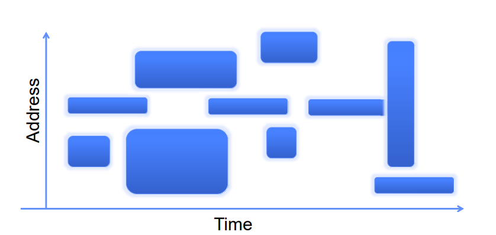
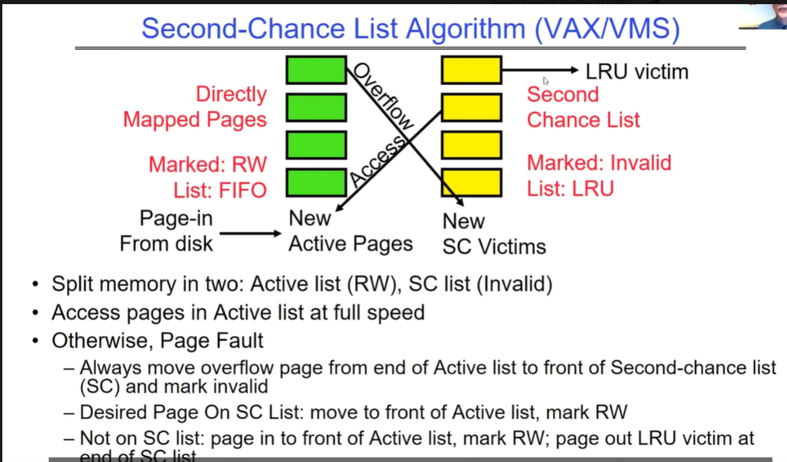
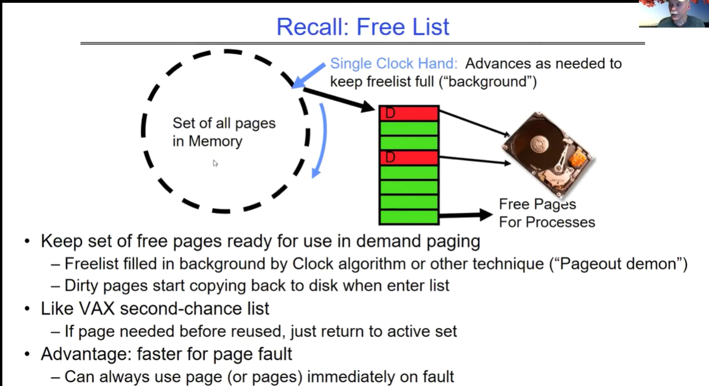

# Memory4:Demanding Pages policies

## Recall: Demand Paging Mechanisms

**页表项（PTE）与需求分页**：
- 页表项使得需求分页成为可能。
- 若PTE标记为有效，表示页面在内存中，PTE指向物理页面。
- 若PTE标记为无效，表示页面不在内存中，系统会使用PTE中的信息在磁盘上找到该页面，并在需要时调入内存。

**处理无效PTE的页面引用**：
- 当用户引用一个无效的PTE指向的页面时，内存管理单元（MMU）会触发操作系统的trap机制。
- 结果产生的陷阱称为“页面错误”（Page Fault）。

**操作系统处理页面错误的步骤**：
- 选择一个旧页面进行替换。
- 如果旧页面被修改过（标记为"D=1"），则将其内容写回磁盘。
- 更改它的PTE并使任何缓存在TLB中的条目无效。（因为该页被写完）
  - 这里的意思是，在替换机制下，一旦一个page被写回，就意味着该page被从mem中换出，此时对应的内存空间应该是无效的，因此需要做PTE和TLB的更新操作。
- 从磁盘加载新页面到内存中。
- 更新页表项，使新条目的TLB无效。
- 从原始产生错误的位置继续执行线程。

**翻译后备缓冲区（TLB）**：
- 当线程继续执行时，将会加载新页面的TLB。
- 当TLB正在填充新页面时，操作系统会运行另一个进程，来自就绪队列。
- 被挂起的进程位于等待队列中。

## Working Set Model

工作集模型是一种内存管理策略，用于描述一个程序在执行过程中其所需要的一系列不同大小的地址空间子集。这里是关于该模型的简要解释：

- **工作集**：工作集是在一段时间内程序访问的一组页面。这个概念用于确定程序运行时在内存中必须保持的页面集合大小，以避免频繁的页面错误。

- **地址空间的子集**：图中不同大小的蓝色块表示程序在不同时间段可能需要的不同的地址空间部分。这些蓝色块的大小和位置变化反映了程序在执行过程中访问内存地址的变化。

- **时间的推移**：横轴代表时间的推移，纵轴代表内存地址。随着时间的推移，程序的工作集（即需要的内存页面集合）会发生变化。

总的来说，工作集模型帮助操作系统了解在某个时间窗口内，程序究竟需要哪些内存页面来有效运行，进而可以更好地管理内存，减少页面错误，并提高系统的整体性能。

## Demand Paging Cost Model

**需求分页与缓存**：

- 需求分页（Demand Paging）像缓存一样，可以计算平均访问时间，即有效访问时间（Effective Access Time, EAT）。

**有效访问时间的计算**：
- EAT = 命中率（Hit Rate）× 命中时间（Hit Time） + 未命中率（Miss Rate）× 未命中时间（Miss Time）
- 也可以表达为：EAT = 命中时间 + 未命中率 × 未命中代价（Miss Penalty）

**实例计算**：
- 内存访问时间是200纳秒。平均页面错误服务时间是8毫秒。假设p为未命中的概率，1-p为命中的概率。
- 计算EAT如下：EAT = 200ns + p × 8ms = 200ns + p × 8,000,000ns

**页面错误对性能的影响**：
- 如果在1,000次访问中有一次发生页面错误，则EAT = 8.2微秒：这是40倍的减慢！
- 如果希望减慢不超过10%，那么EAT < 200ns × 1.1 ⇒ p < 2.5 × 10^-6
- 这相当于在400,000次访问中大约有1次页面错误。

## What Factors Lead to Misses in Page Cache?

**必需失效（Compulsory Misses）**：
- 指从未被加载到内存中的页面。
- 解决方法可能包括预取（Prefetching），即在需要之前就将它们加载到内存中。
- 需要某种方式来预测未来的需求。

**容量失效（Capacity Misses）**：
- 发生在内存不足时，需要增加可用的内存大小。

- 解决方案包括增加动态随机存取内存（DRAM）的数量（不是快速修复）。

  另一种方法是调整分配给每个进程的内存百分比。

**冲突失效（Conflict Misses）**：
- 在技术上，虚拟内存中不存在冲突失效，因为它是一个“完全关联”的缓存。

**策略失效（Policy Misses）**：
- 当页面在内存中但由于替换策略过早地被移除时引起。
- 解决方案是采用更好的替换策略。

# Page Replacement Policies

接下来提供关于页面置换策略的概述。页面置换是操作系统用来管理计算机内存的一种方法。讨论了为什么页面置换策略很重要，主要是因为它们与任何缓存系统都有关联，尤其是在涉及到内存页面时，因为这涉及到昂贵的磁盘I/O操作。介绍了几种不同的页面置换策略：

1. **先进先出（FIFO）**：最早进入的页面会被首先置换出去。这种方法很公平，因为每个页面都有相同的生存时间。但是，FIFO的缺点是它可能会置换掉经常被访问的页面。

2. **随机置换（RANDOM）**：随机选择一个页面来置换。这种方法通常用于翻译后备缓冲器（Translation Lookaside Buffers, TLB），因为它硬件实现简单。但缺点是结果不可预测，不适合需要实时保证的场景。

3. **最小未用（MIN）**：置换最长时间将不会被使用的页面（需要用某种方法预测未来）。理论上这是最优的策略，但因为未来不可预，通常无法实现。这种方法认为过去的使用模式是未来的好预测。

4. **最近最少使用（LRU）**：它通过替换从当前视角下看，最长时间未被使用的页面来工作。由于程序具有局部性，长时间未使用的页面在不久的将来也不太可能被使用。LRU看起来是MIN的一个退化版本，因为他是根据最近的情况淘汰页的，而MIN是提前知道了访问序列，可以精准预测。

LRU的实现可以通过使用链表来实现：新访问的页面被移动到头部，而最少使用的页面（即LRU页面）位于尾部。当页面被访问时，它会从列表中移除，并放置在头部。

这种方案的问题在于，需要立即知道页面何时被访问，这样才能在列表中改变它的位置，这可能需要每个硬件访问都要执行很多指令。即插入和删除操作都需要额外的CPU Quantum成本，如果不用其他O(1)数据结构，那么很难做到常数级别单位找到目标page。

因此，实践中通常使用LRU的近似方法。LRU和FIFO就不再详细介绍，下面详细介绍一下Clock算法以及其变体。

## Adding Memory Doesn’t Always Help Fault Rate（for FIFO）

增加内存是否会降低页面错误（page faults）的数量？对于最近最少使用（LRU）算法和最佳（MIN）算法，增加内存通常会降低页面错误的数量。但是，对于先进先出（FIFO）算法，这种情况不一定成立，这就是所谓的Belady异常。

在不增加内存的情况下，FIFO算法会导致一系列页面错误。然而，当内存增加后，FIFO算法的内存内容可能会完全不同，而LRU和MIN算法的内存内容则仅是原有内存状态的超集。

在FIFO算法下，增加内存后，内存内容可以完全不同；与此相对的是，LRU或MIN算法下，拥有X个页面的内存的内容是增加到X+1个页面后内存内容的子集。

## Second Chance Free List

**一、整体架构**

该算法将内存分为两部分：

1. Active list（活跃列表）：包含可读写（Marked: RW）的页面。在这个列表中的页面可以被快速访问。
2. Second-chance list（二次机会列表，简称 SC 列表）：包含被标记为无效（Marked: Invalid）的页面。

**二、页面访问流程**

1. 当访问 Active list 中的页面时：
   - 可以以全速进行访问，因为这些页面是活跃且可读写的。
2. 当访问的页面不在 Active list 中时：
   - 会发生缺页中断（Page Fault）。

**三、页面在不同列表间的移动**

1. 从 Active list 向 SC list 的移动：
   - 当 Active list 溢出时，即 Active list 中的页面数量超过一定限度，将 Active list 末尾的页面移动到 Second-chance list 的前端，并将其标记为无效。
2. 从 SC list 向 Active list 的移动：
   - 如果所需的页面在 SC list 中：将该页面移动到 Active list 的前端，并标记为可读写（RW）。
   - 如果所需的页面不在 SC list 中：
     - 将新页面加载到 Active list 的前端，并标记为可读写（RW）。注意这里可能会触发一些OS本身的预取策略，因此page数量可能会增多？
     - 同时，从 SC list 的末尾淘汰一个最近最少使用（LRU victim）的页面，将其写回磁盘（page out）。

这种算法通过将页面分类管理，在一定程度上平衡了页面访问的速度和内存的利用率。Active list 保证了常用页面的快速访问，而 SC list 则作为一个缓冲区，用于存储不常使用的页面或等待被重新激活的页面。同时，通过页面在不同列表间的移动规则，实现了类似最近最少使用算法的页面置换策略，以提高系统的性能和稳定性。

## Clock LRU改进版-Second Chance Free List思想

**一、总体目标和作用**

该算法旨在维护一个可供需求分页使用的空闲页面集合，确保系统在发生页面错误时能够快速找到可用页面，从而提高系统性能。

**二、自由列表的维护**

1. 单一时钟指针：有一个单一的时钟指针，它会根据需要推进以保持自由列表始终处于满的状态（在后台进行）。这个时钟指针的作用类似于传统时钟算法中的扫描指针，不断地检查内存中的页面以确定哪些页面可以放入自由列表。
2. 页面来源：内存中的所有页面组成一个集合，其中一部分页面作为自由页面供进程使用。自由列表中的页面通过时钟算法或其他技术在后台进行填充，就像 “Pageout demon”（页面回收后台进程）一样，不断地寻找可回收的页面放入自由列表。
3. 脏页处理：当脏页进入自由列表时，会立即开始将其内容复制回磁盘。这样可以确保自由列表中的页面是干净的，随时可供分配给新的需求。

**三、类似二次机会列表的特点**

该算法与 VAX 二次机会列表有相似之处，例如：

1. 如果页面在被放入自由列表后又被需要，它可以直接从自由列表中返回至活跃页面集合，无需从磁盘重新读取，这在发生页面错误时具有优势，可以更快地处理页面错误。
2. 与二次机会列表一样，该算法也给予了页面一定的 “第二次机会”，避免了页面被过早地淘汰出内存。

**四、优势总结**

这种算法的优势在于能够始终在页面错误发生时立即使用页面（或多个页面），因为自由列表的存在使得系统可以快速响应页面需求，减少了从磁盘读取页面的时间，从而提高了系统的整体性能。因为之前的页面已经被及时的page out到磁盘，但是对应的内存页我们依然保留在free list中，万一后面有需要，可以直接将其从free list中拉出来，这就是所谓的“second chance”。
