# 18-Gerneral I/O, Storage Devices, Performance

# Preparation：I/O架构图，设备分类，I/O方式

## 如何将数据传入/传出设备控制器(在硬件上)

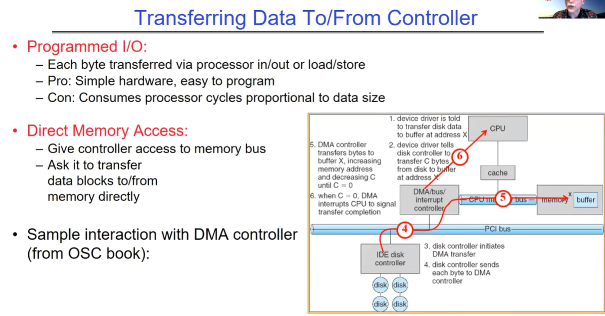

数据在控制器之间的传输方式：

Programmed I/O（编程输入 / 输出）：

- 每个字节通过处理器的输入 / 输出或加载 / 存储指令进行传输。
- 优点是硬件简单，易于编程。缺点是消耗的处理器周期与数据大小成正比。

Direct Memory Access（直接内存访问）：

- 给予控制器访问内存总线的权限。
- 要求它直接在内存和其他设备之间传输数据块。

右图描述了CPU通过DMA方式从磁盘中读取数据的6个步骤，DMA是在设备和内存之间获得高带宽速率的方式：

1. “device driver is told to buffer at address χ to transfer disk data CPU”：设备驱动程序被告知在地址 χ 处设置缓冲区，准备将磁盘数据传输到 CPU。这一步是为后续的数据传输做准备，确定了数据在内存中的存储位置。
2. “device driver tells disk controller to buffer X, increasing memory address and decreasing C transfer C bytes from disk to buffer at address cache”：设备驱动程序告诉磁盘控制器在地址 X 处缓冲，并设置要传输的字节数 C。同时，这一步还涉及到内存地址的增加和字节数 C 的递减操作，为后续的数据传输过程中的地址更新和计数做准备。
3. “disk controller initiates DMA transfer”：磁盘控制器启动直接内存访问（DMA）传输。在这一步中，磁盘控制器开始与 DMA 控制器进行交互，启动数据从磁盘到内存的传输过程。
4. “disk controller sends each byte to DMA controller”：磁盘控制器将每个字节发送至 DMA 控制器。这一步是实际的数据传输过程中的一个环节，磁盘控制器将数据逐个字节地发送给 DMA 控制器。
5. “DMA controller transfers bytes to buffer”：DMA 控制器将字节传输至缓冲区。DMA 控制器接收到磁盘控制器发送的字节后，将其传输到内存中的缓冲区，实现数据的存储。
6. “when C = 0, DMA interrupts CPU to signal until C = 0 transfer completion”：当字节数 C 等于 0 时，DMA 控制器中断 CPU，以表示传输完成。这一步是数据传输的结束标志，DMA 控制器通过中断 CPU 通知系统数据传输已经完成，以便进行后续的处理。

## I/O设备如何提醒OS操作已完成

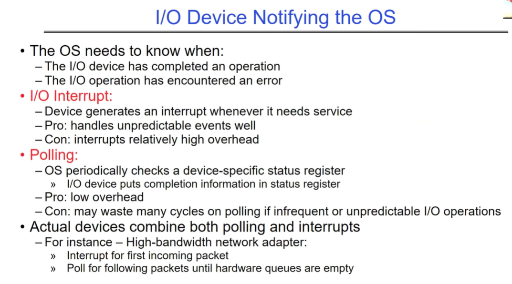

操作系统需要知道：

- I/O设备是否完成操作。
- I/O操作是否遇到错误。

**I/O中断（Interrupt）：**设备在需要服务时生成中断信号。

- **优点：** 能很好地处理不可预测的事件。
- **缺点：** 中断会带来较高的开销。

**轮询（Polling）：**操作系统定期检查设备特定的状态寄存器。

- **优点：** 开销低。
- **缺点：** 对于不频繁或不可预测的I/O操作，可能浪费大量处理器周期。

**实际设备结合了轮询和中断：**例如：高带宽的网络适配器。

- 第一个传入数据包使用中断通知。对这一批后续的数据包使用轮询，直到硬件队列为空。

## 内核管理设备的结构图

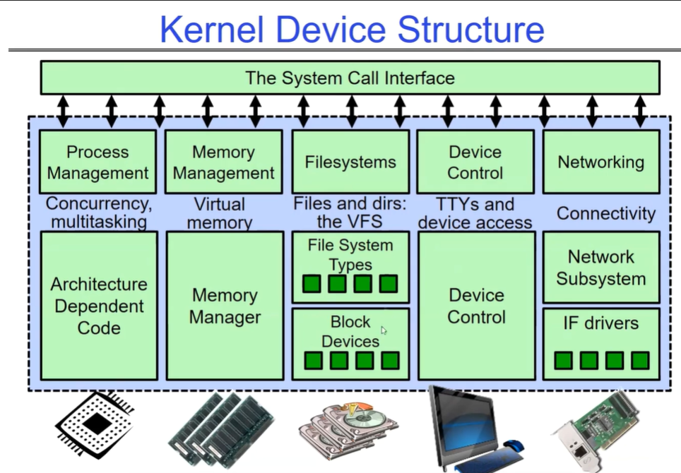

## OS设备分类

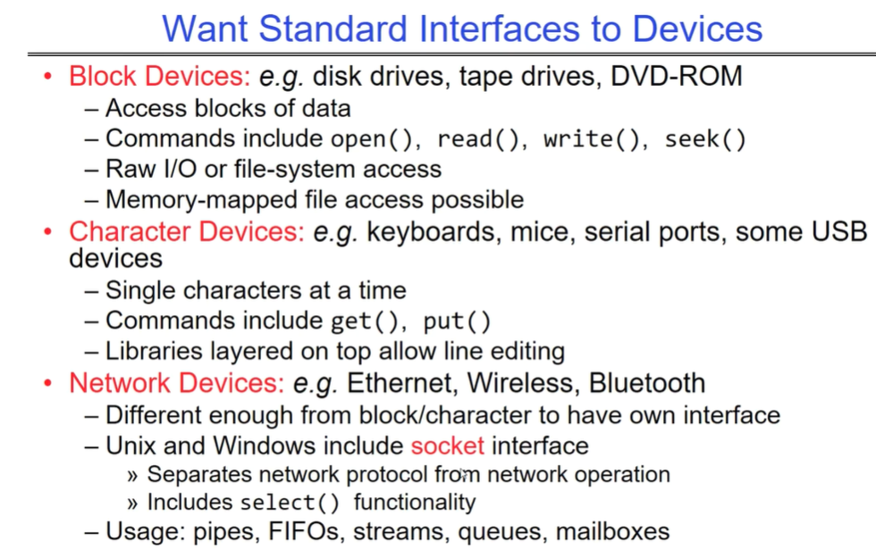

OS主要有三类设备接口（块设备、字符设备和网络设备），下面简要描述它们的特点和常用命令，要注意网络设备通过套接字接口进行通信，这一点不同于块/字符设备：

**块设备（Block Devices）：**

- 例如：磁盘驱动器、磁带驱动器、DVD-ROM。
- 访问数据块。
- 常用命令包括：`open()`, `read()`, `write()`, `seek()`。
- 支持原始I/O或文件系统访问。即在块设备上再加一个文件系统层，从而支持字符读取。
- 支持内存映射文件访问。

**字符设备（Character Devices）：**

- 例如：键盘、鼠标、串口设备、一些USB设备。
- 一次处理一个字符。
- 常用命令包括：`get()`, `put()`。
- 顶层库可以支持行编辑。

**网络设备（Network Devices）：**

- 例如：以太网、无线网络、蓝牙。

- 与块设备和字符设备区别大，使用专有接口。

- Unix和Windows使用

  套接字（socket）接口

  - 将网络协议与网络操作分离。支持`select()`功能。

- 常用形式：管道、FIFO、流、队列、邮箱。

## 读写设备的I/O方式

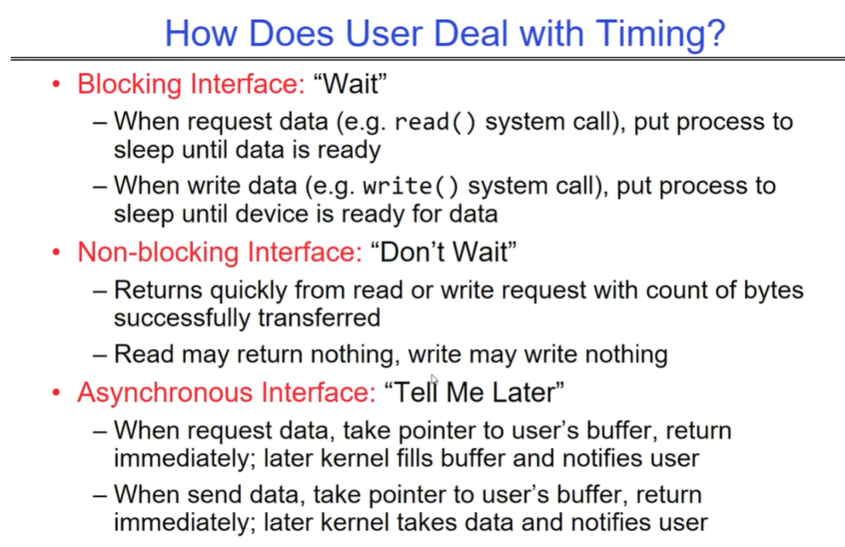

**用户如何处理定时问题？**

**阻塞接口（Blocking Interface）：“等待”**

- 当请求数据时（例如：`read()`系统调用），进程进入睡眠状态，直到数据准备好。
- 当写入数据时（例如：`write()`系统调用），进程进入睡眠状态，直到设备准备好接收数据。

**非阻塞接口（Non-blocking Interface）：“不等待”**

- 读取或写入请求会快速返回，返回已成功传输的字节数。
- 读取可能返回空数据，写入可能未写入任何数据。
- 比如说采用Polling的方式，通过多次polling拿到最终期望的数据。

**异步接口（Asynchronous Interface）：“稍后告诉我”**

- 当请求数据时，传递用户缓冲区指针，立即返回；稍后由内核填充缓冲区并通知用户。
- 当发送数据时，传递用户缓冲区指针，立即返回；稍后由内核处理数据并通知用户。
- 就是将请求交给kernel后，用户可以不管了，但是要通过某种通知机制，当kernel完成工作时，可以给用户发送一个通知消息，让用户知道。

OS的三种I/O方式对应三种处理定时问题的接口方式，分别是阻塞接口、非阻塞接口和异步接口。每种方式都有不同的行为方式，阻塞接口要求等待；非阻塞接口无需等待，马上返回当前数据，但可能需要多次轮询拿目标数据；而异步接口则是稍后由系统处理并通知。注意只有第三种操作实现了真正的一步。

# 设备层面相关

## 存储设备

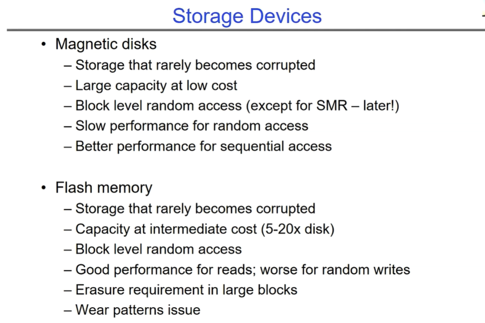

磁性磁盘：很少出现损坏情况。成本低且容量大。除了叠瓦式磁记录（SMR）外，其余设备都支持块级随机访问。随机访问性能较慢，顺序访问性能较好。

闪存：很少出现损坏情况。成本中等（是磁盘的 5 - 20 倍），容量中等。可进行块级随机访问。读取性能良好，随机写入性能较差。需要以大块进行擦除操作，存在磨损模式问题。

## Magnetic Disks-磁性磁盘

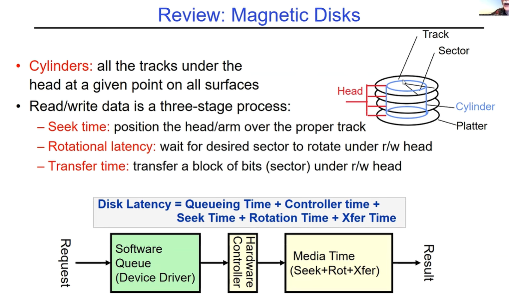

介绍了磁性磁盘中的 “柱面” 概念，即所有磁头在给定位置下所有盘面的所有磁道。即在一个时刻下，所有磁头都会在同一个柱面上。

读写数据是一个三阶段过程，涉及磁道、扇区、磁头、柱面和盘片。

磁盘操作涉及的时间：

- 寻道时间：将磁头 / 磁臂定位到正确的磁道上。
- 旋转延迟：等待所需扇区旋转到读写磁头下方。
- 传输时间：在读写磁头下传输一块比特（扇区）。

磁盘延迟等于排队时间、控制器时间、寻道时间、旋转时间和传输时间之和。整个过程涉及请求、控制器硬件、软件以及结果，还有设备驱动程序的队列（包括寻道时间、旋转时间和传输时间）以及媒体时间。

### 对于磁盘来说的一些常见参数

| 参数         | 信息 / 范围                                                  |
| ------------ | ------------------------------------------------------------ |
| 空间 / 密度  | 空间：14TB（希捷），8 个盘片，采用 3.5 英寸外形规格！面密度：21 太比特 / 平方英寸！（垂直磁记录、氦气填充等） |
| 平均寻道时间 | 通常为 4 - 6 毫秒                                            |
| 平均旋转延迟 | 大多数笔记本电脑 / 台式机磁盘以 3600 - 7200 转 / 分钟旋转（每转 16 - 8 毫秒）。服务器磁盘高达 15000 转 / 分钟。平均延迟是磁盘旋转半圈的时间，所以为 4 - 8 毫秒 |
| 控制器时间   | 取决于控制器硬件                                             |
| 传输时间     | 通常为 50 到 250MB / 秒。取决于：传输大小（通常是一个扇区）：每个扇区 512B - 1KB；旋转速度：3600 转 / 分钟到 15000 转 / 分钟；记录密度：每英寸磁道上的比特数；直径：范围从 1 英寸到 5.25 英寸 |
| 成本         | 过去每 1.5 年（或更快）下降一倍，现在下降速度放缓            |

### 对于磁盘，顺序读取更好

假设：暂时忽略排队时间和控制器时间。

给出参数：平均寻道时间为 5 毫秒，旋转时间为 6000（毫秒 / 分钟）除以 7200（转 / 分钟）约等于 8 毫秒，传输速率为 50MB / 秒，块大小为 4KB。

计算从磁盘随机位置读取块的时间：寻道时间（5 毫秒）加上旋转延迟（4 毫秒）加上传输时间（0.082 毫秒）等于 9.082 毫秒，大约 9 毫秒获取 / 放置数据，速度约为 451KB / 秒。

计算从同一柱面的随机位置读取块的时间：旋转延迟（4 毫秒）加上传输时间（0.082 毫秒）等于 4.082 毫秒，大约 4 毫秒获取 / 放置数据，速度约为 1.03MB / 秒。

计算读取同一磁道上的下一个块的时间：只有传输时间（0.082 毫秒），速度约为 50MB / 秒。

得出结论：有效使用磁盘（特别是对于文件系统）的关键是最小化寻道时间和旋转延迟。因此顺序读取性能更好。

## Solid State Disks(SSDs)

### SSD架构-read操作

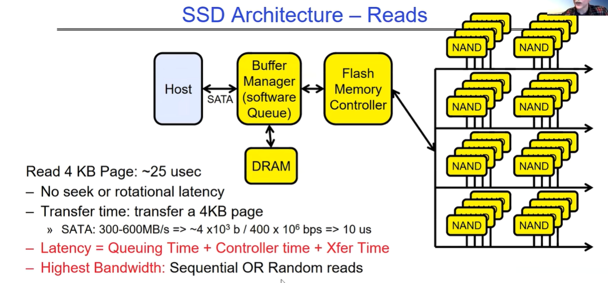

从固态硬盘（SSD）读取 4KB 页面的情况及 SSD 架构中的读取部分：

1. 读取 4KB 页面大约需要 25 微秒，没有寻道时间和旋转延迟，主要是传输一个 4KB 页面的时间。
2. SSD 架构的读取部分涉及主机 SATA 管理器（软件队列）、缓冲控制器、内存、闪存 NAND 和 DRAM NAND。SATA 的传输速度为 300 - 600MB / 秒，计算可得传输 4KB（约 4×10³ 字节）数据的时间约为 10 微秒。
3. SSD 的读取延迟等于排队时间、控制器时间和传输时间之和。最高带宽可用于顺序或随机读取。因此在SSD下，顺序读与随机读是几乎没有性能差异的。

### SSD架构-write操作

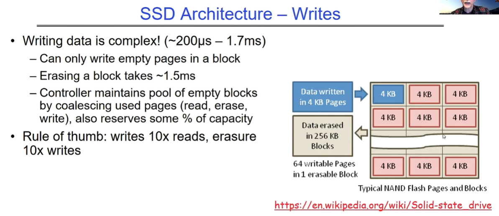

介绍了固态硬盘（SSD）架构中的写入部分：

1. 写入数据较为复杂，时间大约在 200 微秒到 1.7 毫秒之间。
2. 只能在一个块中写入空页面。
3. 擦除一个块大约需要 1.5 毫秒。
4. 控制器通过合并已使用的页面（读取、擦除、写入）来维持空块池，并且保留一定比例的容量。
5. 经验法则是：擦除速度大约是写入速度的10%，而写入速度大约是读取速度的10%。

数据以 4KB 页面为单位写入，却以以 256KB 块为单位擦除，一个可擦除块中有 64 个可写的 4KB 页面。

所以对于SSD而言，尽量少写，少擦除，多读。

#### 关于SSD写操作和擦除操作的补充内容

SSD 向操作系统提供与 HDD 相同的接口，每次读写的数据块大小为 4KB。

但只能一次覆盖 256KB 的数据。

为什么不能直接擦除并重写整个 256KB 块？：擦除速度非常慢（以毫秒计），并且每个块有有限的寿命，大约只能被擦除和重写 10000 次左右，频繁使用的块可能会很快磨损。

### 一些写操作的解决方案-两个系统设计原则

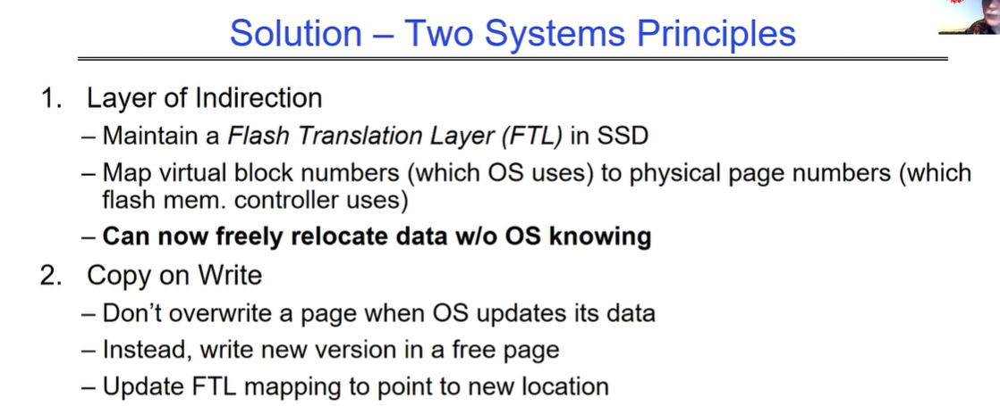

**间接层原则**：在固态硬盘（SSD）中维持一个闪存转换层（FTL）。将操作系统使用的虚拟块编号映射为闪存内存控制器使用的物理页编号，这样可以在操作系统不知情的情况下自由地重新定位数据。

> 闪存转换层（Flash Translation Layer）使得在进行小的修改时无需擦除和重写整个 256KB 的块。SSD 控制器可以分配映射以在各个页面上分散工作负载，实现磨损均衡。对于旧版本的页面，通过后台的垃圾回收处理，擦除包含旧页面的块，并将其添加到空闲列表中。

**写入时复制原则**：当操作系统更新数据时，不要覆盖页面。而是在一个空闲页面中写入新版本，并更新 FTL 映射以指向新的位置。

> 因此注意，即使我们每次写的都是同一个块（文件系统视角），但是进入到闪存内部后，由于FTL存在，每次写操作都会写入到不同的闪存块上。

## 衡量性能的一些指标

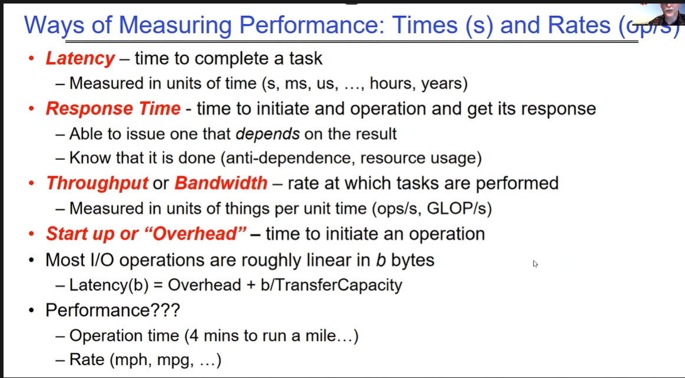

**延迟**：完成一项任务的时间，以时间单位（秒、毫秒、微秒等）衡量。

**响应时间**：发起一个操作并获得响应的时间，能够根据结果发出下一个操作，并且了解操作是否完成（涉及反依赖、资源使用等情况）。

**吞吐量和带宽**：以单位时间内的任务处理数量（如 ops/s、GLOP/s）衡量，即吞吐量或带宽，表示任务执行的速率。同时提到性能可以用操作时间（如跑一英里需要 4 分钟）或速率（如英里 / 小时、英里 / 加仑等）来表示。

**启动或 “开销” 时间**：发起一个操作所需的时间。大多数操作的时间与数据大小（b 字节）大致呈线性关系，延迟（b）= 开销 + b / 传输容量。

### I/O Path的总体路径概览

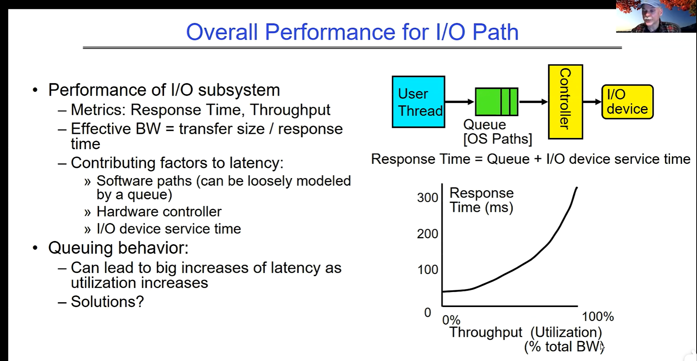

I/O 子系统的整体性能：主要衡量指标为响应时间和吞吐量。有效带宽等于传输大小除以响应时间。响应时间由队列时间和 I/O 设备服务时间组成，软件路径（可大致用队列模型表示）和硬件控制器以及 I/O 设备服务时间都是影响延迟的因素。

排队行为会随着利用率（吞吐量）的增加而导致延迟大幅增加，我们该怎么解决。

# 总结

## 总结1

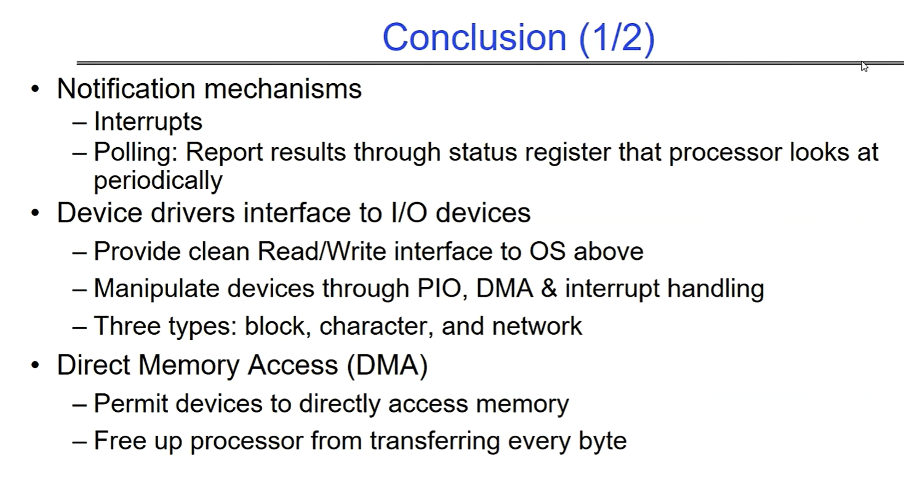

通知机制：包括中断和轮询（通过处理器定期查看的状态寄存器报告结果）。

设备驱动程序是 I/O 设备的接口：为上层操作系统提供清晰的读写接口，通过编程 I/O（PIO）、直接内存访问（DMA）和中断处理来操作设备。设备驱动程序有三种类型：块设备、字符设备和网络设备。

DMA 允许设备直接访问内存，使处理器无需逐字节传输数据，从而解放处理器。

## 总结2

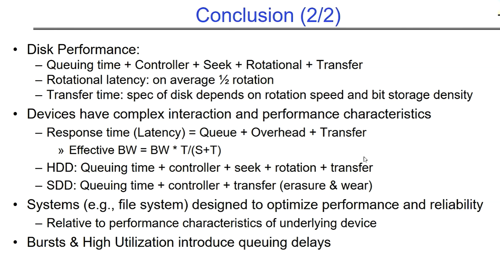

磁盘性能：由排队时间、控制器处理时间、寻道时间、旋转延迟时间和传输时间组成。旋转延迟平均为磁盘旋转半周的时间，传输时间取决于磁盘的旋转速度和位存储密度等规格。

设备具有复杂的交互和性能特征：

- 响应时间（延迟）等于队列时间、开销和传输时间之和。
- 有效带宽等于带宽乘以时间 T 除以（服务时间 S 加时间 T）。

- HDD的延迟：排队时间加上控制器处理时间、寻道时间、旋转时间和传输时间组成其计算方式，
- SDD的延迟：有排队时间加上控制器处理时间和传输时间（考虑擦除和磨损）的情况。SDD这类设备消除了寻道与旋转的时间。

相对于底层设备的性能特征而言，系统（如文件系统）的设计旨在优化性能和可靠性。

突发情况和高利用率会引入排队延迟。
