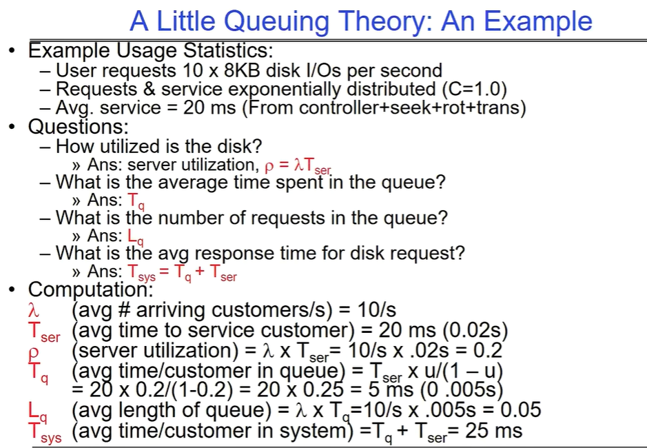
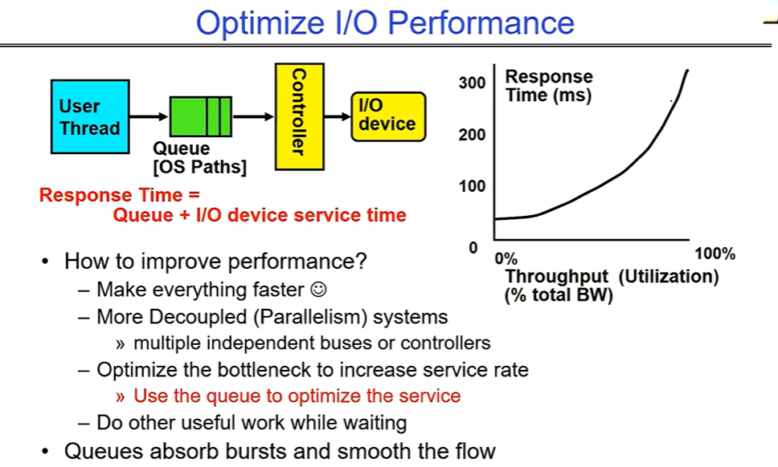
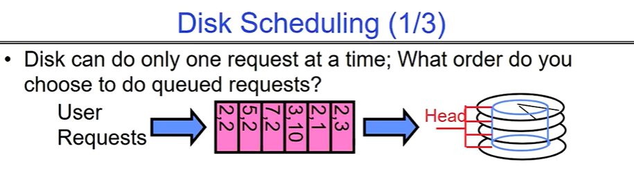

# File Systems 1：Performance , Queueing Theory,File System Design

# 排队理论

给个例子，用的时候可以再去查排队论。排队理论在OS中，会有如下的应用：

 “Response Time = Queue + I/O device service time” 的公式，并展示了响应时间与吞吐量（利用率）的关系图。

提升性能方法：让一切变得更快。

- 采用更解耦（并行）的系统，如多个独立的总线或控制器。
- 优化瓶颈以提高服务速率，利用队列优化服务，可在等待时做其他有用的工作。

队列还能吸收突发情况并使流量更平滑。

可以使用有限大小的队列控制延迟，但是高压情况下可能会引入不确定性和livelock。

# 磁盘I/O请求调度-基于排队理论

将I/O请求做合理的重排序，从而使得磁盘的旋转变得更有效率。常见的重排序算法有如下图几种：

**FIFO 顺序**：按照请求到达的顺序处理，对请求者公平，但请求可能到达磁盘上的随机位置，导致寻道时间很长。

**SSTF（最短寻道时间优先） 策略**：选择磁盘上距离当前磁头位置最近的请求进行处理。如今的计算必须包括旋转延迟，因为旋转时间可能和寻道时间一样长。缺点是虽然能减少寻道时间，但可能导致某些请求饥饿。

**一、SCAN（扫描算法）**

- 该算法也被称为电梯算法。磁头在磁盘上移动，就像电梯在楼层间运行一样。磁头从磁盘的一端开始，向另一端移动，在移动过程中处理位于磁头移动方向上距离最近的请求。当到达磁盘的另一端时，磁头会改变移动方向，再次处理沿途的请求。
- 例如，假设磁头初始位置在最左侧，且向右侧移动。如果在这个方向上有多个请求，它会依次处理距离最近的请求。到达最右侧后，磁头反向向左移动，处理左侧的请求。

- 避免了饥饿问题。由于磁头在两个方向上都处理请求，不会出现某些请求长时间得不到处理的情况。
- 在一定程度上减少了寻道时间，因为它总是选择距离当前位置最近的请求进行处理。

- 对于某些请求分布情况，可能会导致磁头频繁改变移动方向，增加了一些额外的寻道时间。

**二、CSCAN（循环扫描算法）**

- CSCAN 是对 SCAN 算法的改进。磁头同样从磁盘的一端开始向另一端移动，处理沿途的请求。但是，当磁头到达磁盘的另一端时，它会立即回到磁盘的起始端，而不是像 SCAN 算法那样反向移动。然后，再从起始端向另一端移动，处理新的请求。
- 例如，磁头从最左侧开始向右移动，处理完右侧的请求后，直接回到最左侧，再次向右移动处理请求。

- 相比 SCAN 算法，进一步减少了磁头的移动距离和寻道时间。因为磁头不会在两端之间频繁来回移动，而是以循环的方式单向移动。
- 也能较好地避免饥饿问题。

- 对于某些请求分布情况，可能会导致某些请求的等待时间较长，因为磁头只能单向移动，不能立即响应反方向的请求。

**三、FSCAN（分步扫描算法）**

- FSCAN 将磁盘请求分为两个队列。一个是由当前所有请求组成的队列，另一个是新到达的请求队列。
- 磁头首先处理当前队列中的请求，采用类似于 SCAN 或 CSCAN 的算法。在处理完当前队列中的所有请求后，才处理新到达的请求队列中的请求。

- 可以有效地减少新请求对正在处理的请求的干扰，保证当前请求能够尽快得到处理。
- 能够更好地控制磁盘的负载，避免过多的请求同时竞争磁盘资源。

- 可能会导致新请求的等待时间较长，尤其是当当前队列中的请求较多时。

剩下内容就是研究一些文件系统的case了，等一波更新。
