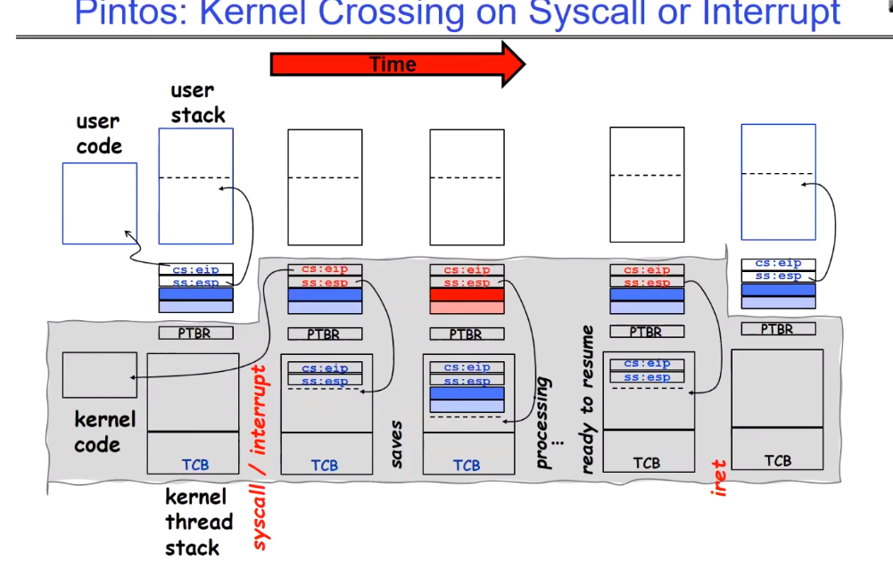
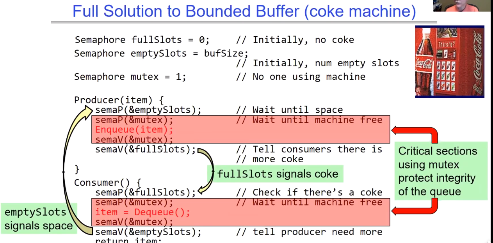
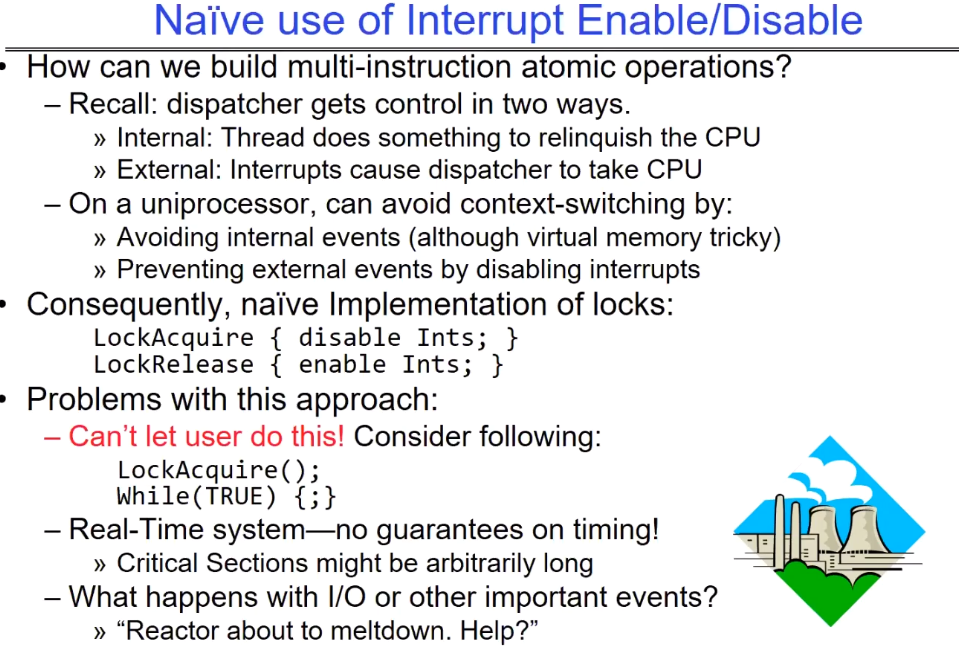
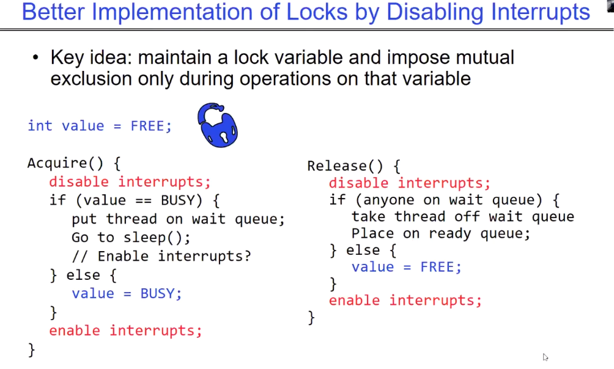
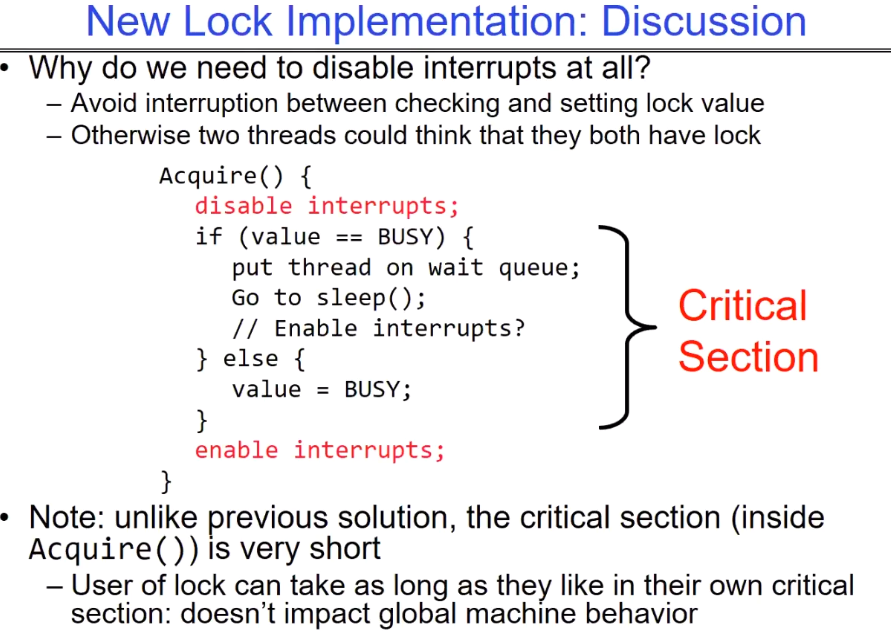
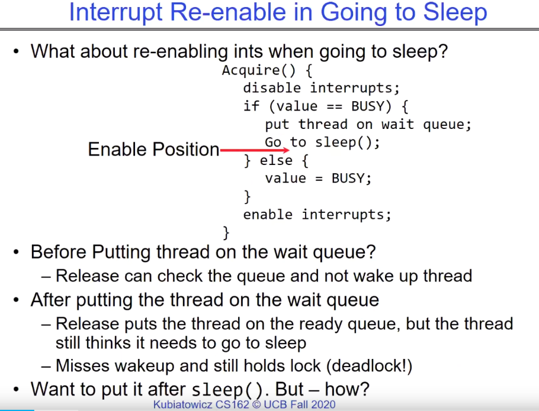
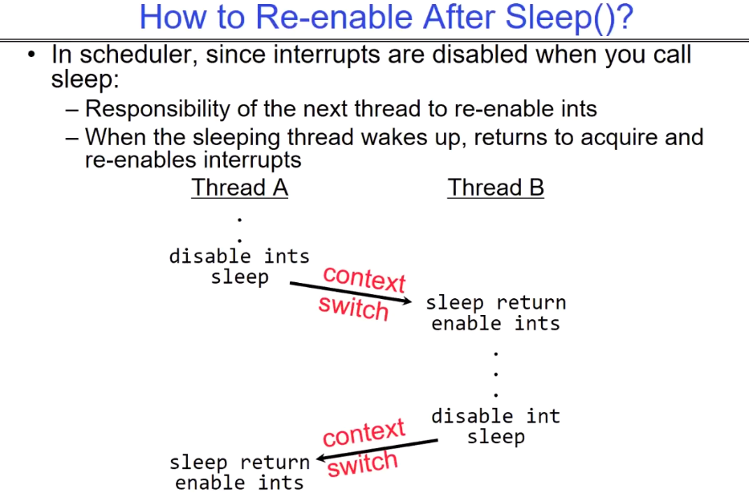
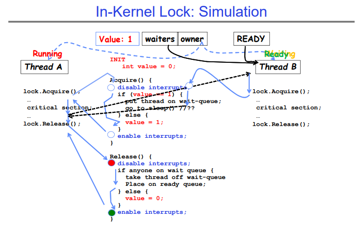
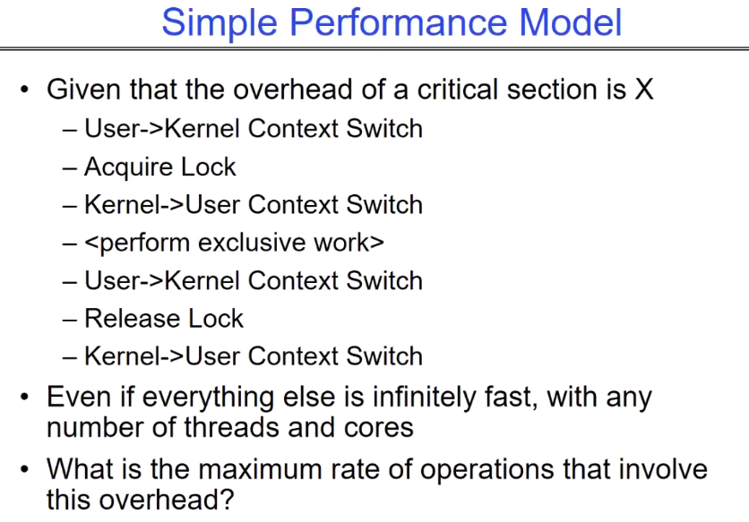

# Synchronization 2: Semaphores (Con’t) Lock Implementation, Atomic Instructions

##  Context Switching behaviors between thread

讲述了一个不改变进程的中断，或者一个系统调用是如何发生的：

ip是instruction ptr，sp是stack ptr，PTBR是page table base register。ip保存了当前线程的执行进度，指向用户代码段；sp指向当前用户栈的执行进度。当发生中断或者上下文切换时，内核态的对应线程会将ip和sp、寄存器、当前用户栈内容等保存到该用户对应的TCB中（保存寄存器的行为由硬件完成），之后就可以转去处理别的线程。注意这里仍然是同一个进程。

在处理别的线程之前，我们需要将PTBR和TCB替换为另一个线程的信息，之后就像往常一样加载并运行即可。

一段时间过后，该线程可以恢复了，此时内核已经准备好重新处理这个线程了，首先内核态会从对应的TCB中读取相关的寄存器和用户栈内容，之后返回到用户态，此时就可以继续执行之前被中断的程序了。

<u>红黑树这种数据结构在Linux中被广泛使用，网上有很多资料，可以看看是为什么。</u>

接下来教授讲了多生产者消费者的问题。以此来引出我们今天要学习的主题，更高级别的同步原语。semaphores在上节课已经讲过了。

## Bounded Buffer solution

## Recall：what is lock

同步的核心思想就是通过等待来协调，我们的目的是让等待的线程尽可能减少等待，且等待的时候不要占着CPU资源（意味着线程只要需要等待，就让它去休眠），这样可以让别的程序来运行并取得进展。

- 线程休眠：本质上是将该线程从调度队列放入等待队列。
- 自旋等待：while循环一直等待，这会占着CPU资源不做事情，这很愚蠢。
- semaphores的P操作：P操作在等到时，具体会做哪种等待方式，取决于我们的实现，一般是线程休眠。

# How can we implement locks based on hardware

我们不想用那种复杂的硬件的load、store类型的指令实现同步机制，不同的硬件的指令可能是不同的，这会增加许多烦恼，因此我们在硬件指令的基础上实现更为高级的锁原语，类似于Acquire()和Release()这样的简单原语。那么采用哪些方式进行实现是好的？

## Naive use of Interrupt Enable/Disable

显然interrupt是从用户态转换到内核态的方法，也是切换CPU控制权的方式；试想一下，当我们获取锁之后，如果这期间发生了中断等时间使得core上运行的程序被切换，那么当前代码就会被停止执行，这就不是一个严格意义上的`critical section`了。

> 计时器中断会切换线程，这是为了确保所有线程都可以取得一些进度，这里禁用中断是为了确保在critical sec在被执行期间不会被打断。

所以我们首先尝试，在上锁的时候禁用interrupt，解锁后再启动interrupt，即直接使用禁用/启用中断作为锁的实现，很明显这是愚蠢的。

问题也很明显，让用户直接操作硬件是不可取的，这会导致系统运行出现错误，导致I/O事件不能被及时响应。

## Better Implementation of locks by Disabling Interrrupts

与上面第一种方法的主要区别在于，我们维护一个锁变量，只有在对该变量操作的时候，才会启动critical section的环境，而critical section的实现方式就是使用中断**。因此这里我们是借助中断实现Acquire和Release，上面的第一种方式是直接把中断的两种操作变成Acquire和Release。**这种方案下，我们将对系统的影响降至了最小，我们不会将interrupts的禁用时间交给用户程序，而是交给OS实现的Acquire和Release，只在操作mutual var时会禁用中断。操作完毕后会马上启用中断。

- interrupts在这两个函数内部就相当于一把变相的Lock。
- 禁用interrupts期间该程序是独享CPU的，没有任何events可以把它换下来。
- value变量在这里是一个shared value，需要互斥访问。
- 程序能否获得锁取决于value当前的状态，与interrupts关系不是特别紧密，这样就极大地降低了对系统中其他需要中断的event上的影响。

## Discussion about use interrupts

为什么需要在临界区完全禁用中断：

- 避免在检查和set lock值的时候发生中断，发生线程切换，从而打断操作。
- 否则当前临界区就不再是严格的临界区，这会出现多个线程可以同时操作lock的情况（操作value值）。

### when re-enable interrupts is suitable?（at BUSY situation）

在value锁被占用的时候，我们应该什么时候启动中断：

- 若在put thread on wait queue之前：可能使用完锁线程的release会提前执行，导致该thread不会被唤醒。
- 在放到wait queue之后：另一线程使用完锁，执行release将该thread放入ready queue，但是该thread仍然认为自己需要休眠。如此一来该thread错过了唤醒机会，并且该thread理论上已经获得了这个锁，但是他会一直沉睡，而别的thread也会等待这个锁，因此会造成死锁。
- 如果在sleep()之后呢。事实上，OS中的启用中断确实是在sleep()之后进行的，但是是当该线程被再次唤醒的时候，具体见下文。

## How to re—enable after Sleep()

sleep()：当前线程被放到了等待队列上，它不会被调度，因此不会获得CPU周期。

kernel中的scheduler调度程序运行，这个过程不涉及到外部中断机制。

如下例所示，当TheadA发现锁已经被B占用了，那么他会在休眠之后，立即发上下文切换，切换到当前在ready queue中的线程，之后由这些ready queue中的线程（意味着已经sleep完毕）主动启动中断。总之：

- 启动中断应该交给下一个被唤醒的线程。
- 当一个休眠的线程被唤醒后，他会返回acquire操作并重新启动中断。
- 启动中断操作应该是被动的，触发条件是某个sleep thread被唤醒，之后他会返回到acquire操作，获取锁，最后启动中断 。休眠线程不该在sleep()是主动启用中断。

### In-Kernel Lock: Simulation

这里举了一个在内核中调度线程的例子：A先运行，获取到value锁后，设置value=1，之后发生定时器中断，切换到B运行，B在Acquire中发现value=1，B会休眠；之后CPU使用权又回到A，A运行完毕后，调用Release()，当value=1时：

- 若wait queue上存在等待的线程，A会选择主动地唤醒一个在ready queue上的线程，之后结束运行。**注意在wait queue上有线程存在的时候，value会一直为1，因为我们实际上是在传递value这把锁的所有权，value这把锁仍然是有人使用的，只不过发生了短暂的持有权传递。**这不影响多线程并发运行的正确性。
- 若wait queue上没有正在等待的线程，那么A会设置value=1，因为此时没有可以传递锁持有权的对象，他会通过将value设置为1，从而将锁放回原处，等待下一个人来使用。

下图中的虚线意味着timer interrupt发生，进入内核态，scheduler调度Ready queue另一个线程到CPU Core上开始运行。

## Simple Performance Model（based Acquire and Release）

意味着每一次对lock的操作都需要进行两次状态切换。这从本质上就限制了程序的最大运行速率。

**系统调用的时间消耗大概是函数调用消耗的25倍。**

## Summary

之前的方案有如下几个缺点：

- 我们不能将中断的禁用启动权利交给users，这可能会打乱OS的运行。
- 在后面几种方案中进行了封装，但是基于中断的sync行为在多核处理器上十分浪费时间。

**禁用所有处理器上的中断可能需要向每个处理器发送消息，因为每个禁用中断消息只会禁用一个CPU core的中断**，并且可能需要在多个处理器之间进行协调和同步操作，这可能会非常耗时。这种耗时的原因包括：

1. **多处理器之间的同步：** 禁用中断可能需要在多个处理器之间进行同步和协调操作。这可能涉及到向每个处理器发送消息或命令，然后等待它们的响应。这种同步操作可能需要额外的时间来完成。

2. **中断处理器的状态保存和恢复：** 在禁用中断之前，通常需要保存处理器的状态，以便在需要时能够恢复它们。这可能涉及到保存处理器的寄存器状态、中断掩码和其他相关信息。保存和恢复这些状态可能需要额外的时间和处理器资源。

3. **系统资源竞争：** 如果在禁用中断时有其他系统活动正在进行，比如其他进程或线程正在竞争系统资源，那么禁用中断可能会引起资源竞争和延迟。

因此，禁用所有处理器上的中断可能会是一个耗时的操作，尤其是在多核处理器系统中。在实际系统中，需要权衡禁用中断带来的性能影响和系统响应性之间的平衡，以确保系统的稳定性和可靠性。

因此，基于内核的Acquire()和Release()无疑极大地限制了程序的运行能力，这意味着在单位时间内我们可以拥有的锁的数量是有限的。我们需要一些可以在user space使用的synchronization primitives（同步原语）。

### next class：User space atomic structions

幸运的是，我们有atomic instruction sequences可以选择：

- 这些指令读取/写入一个值都是原子性的。
- 硬件确保了原子性。
  - 可以在单处理器上确保原子性（不算太难）
  - 可以在多个处理器上确保原子性（需要cache coherence（缓存一致性）协议的帮助）
- 相比于基于中断的方案，atomic指令的优势在于，可以同时作用于单处理器和多处理器的系统，确保操作的原子性。

下次我们将讨论可以在用户态运行的atomic Read/Modify/Write 指令。

