# Synchronization 3:  Atomic Instructions (Con’t), Monitors, Readers/Writers

# Read-Modify-Write Instructions

下面举出一些atomic指令，这些指令在给定的指令集架构中都是原子的发生在处理器执行的一条指令中的，由硬件本身确保原子性，因此我们不需要锁，仅仅用这些指令就可以使并发变得正确：

- `TAS(Test&Set)`指令：大多数指令集架构都有这种指令，将一个给定内存地址中的值设置为1。主要用于同步操作，设置为1，是因为1是一个对于同步需求来说很有用的值，下面会举例说明。
- `swap`指令：在x86指令集架构上的指令，更像是TAS指令的泛化版本，该指令会将一个给定register和一个给定的内存address中的指针进行交换。
- `compare&swap`指令：x86架构拥有的指令，若内存中address地址中存储的值与reg1中存储的值相同，那么将reg2中的值赋给内存地址；否则什么都不做。
- `load-linked&store-conditional`：用汇编语言写的指令，这个先不展开。

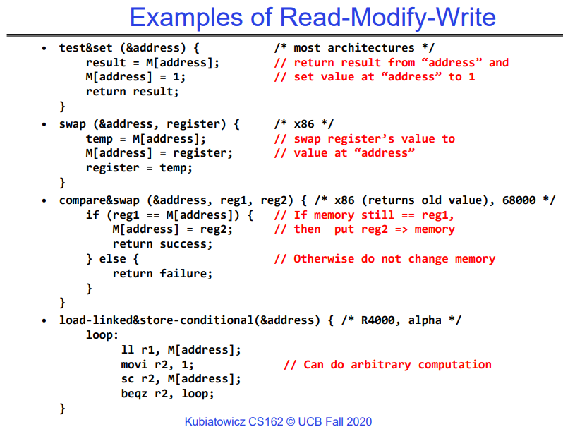

## Using of Compare&Swap for queues

下图是一个以compare&swap指令为基础实现安全的并发向链表中添加节点的操作，这可以确保不会有节点丢失，但是无法确保添加的顺序。首先介绍必要的背景知识，一个节点包括当前存储的数据和指向下一个节点的地址：

- 如，&object代表某个链表节点的地址，object代表该链表对象本身，M[object]代表该节点存储的指向下一个节点的地址。

这样一来就很容易理解为什么下面的基于CAS指令的函数可以保证并发安全了。

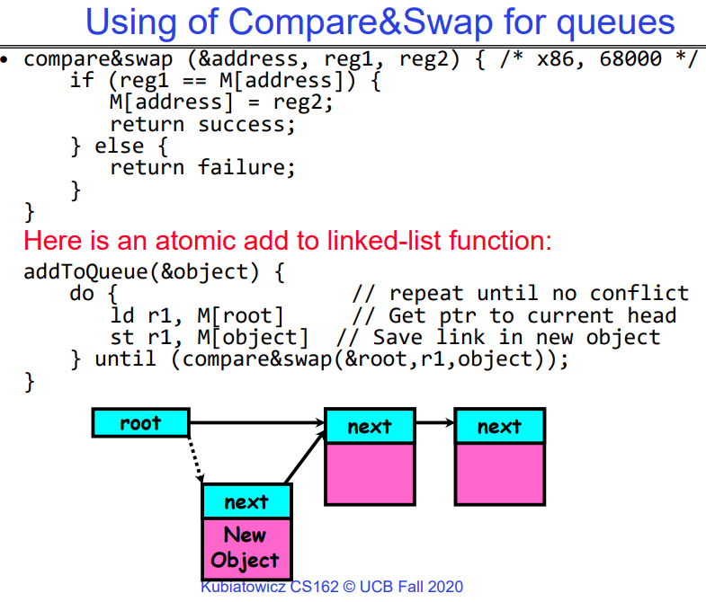

## Implementing Locks with TAS(Test&Set)(承上启下)

用TAS指令实现c语言中的acquire和release操作，显然这是可行的，当lock=0时，TAS会将lock设置为1，意味着上锁成功，返回lock原来的0；当lock=1时，TAS仍然是将lock设置为1，返回的是lock原来的1，这意味着该线程需要等待锁被释放。

但是这种方案有问题：

- 在等待的线程会占用一个CPU核心，无意义的不断while循环浪费CPU周期（busy-waiting）。
- 对于多处理器而言，每个TAS指令都是一个写操作，这会使得lock值在不同处理器的cache之间来回横跳，这会浪费很多不必要的网络带宽。

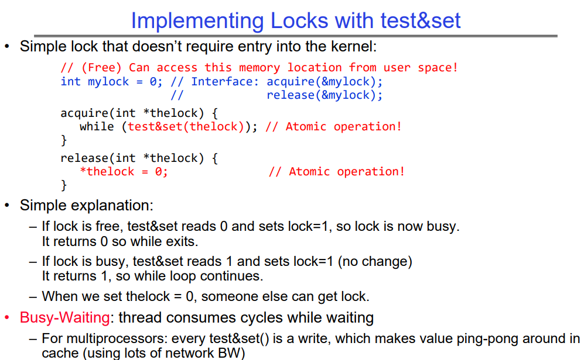

## Problem: Busy-Waiting for Lock

这种用户态操作的优点是：机器可以正常接受中断、用户代码可以使用锁、并且在多处理器上也是可以工作的。

但是缺点也很明显：

- 当锁被占用的时候，线程会一直无意义的循环，浪费cpu cycles。
- 因为中断没有被禁用，因此timer interrupt会定时触发，将正在持有锁的线程换下来，让忙等的线程上去无意义的while一会，相当于是需要锁的线程把想要释放锁的线程的执行进度推后了。
- 此外，如果当前scheduler是基于优先级的调度，且忙等线程比当前持有锁的线程拥有更高优先级，那么会陷入永远无法获得锁的状态。

对于semaphores和monitors机制而言，等待的线程会等无法预计的时间长度：

- 因此，即使繁忙等待对于锁来说是可以接受的，但对于其他原语来说绝对不可以。

所以，尽量减少忙等，忙等是一个很蠢的策略。

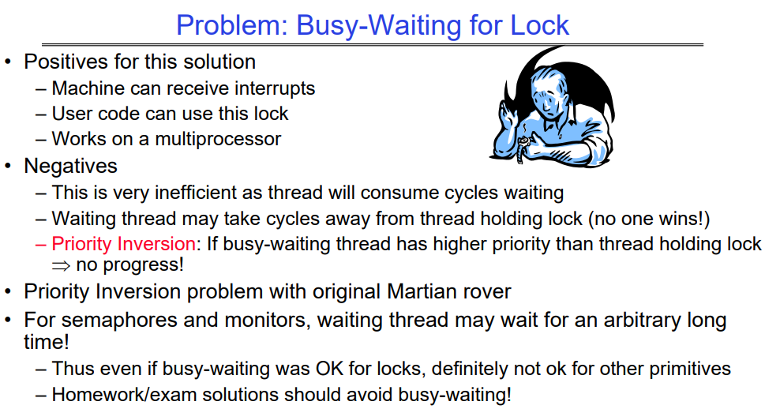

## Multiprocessor Spin Locks:test&test&set

这种策略仍然会在某个核上面不断地忙等，但是优点在于它修复了缓存一致性协议中的缓存来回反复横跳的情况，因为在没有锁的时候，该线程只是不断地从缓存中读取某个值；因为不断地test&set操作会修改缓存中的值，这使得缓存行在不同的core之间来回横跳，重点在于这个修改是没有意义的。

这意味着该线程在cache进行读取操作中，直到锁变得空闲之后，他会快速的做一次test&set操作。

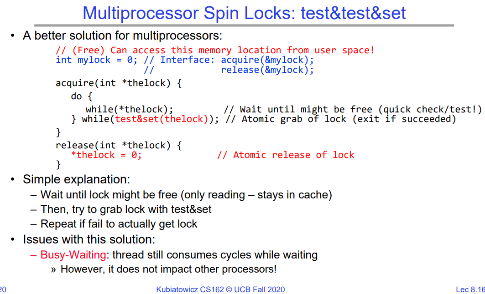

## lock using test&set

这里用test&set指令替换之前的中断指令，guard是一个全局的锁变量，用于提供对acquire()和release()的互斥访问，同一时刻只能恰好有一个acquire或release在执行；而内部的thelock则是真正的用于线程调度互斥的锁变量，用于让多线程的执行更有序。

可以从多生产者消费者问题角度考虑这些锁变量的意义：

- guard相当于对缓冲区的保护，缓冲区一次只能被一个线程访问，拿到guard后才可以进一步做操作。
- thelock用于对同一种类型的工作者排队，确保每次只有一个人在放入或取出商品。

注意，当线程休眠的时候，他会同时将guard设置为0，当该线程被唤醒时，因为是其他线程调用realease唤醒了自己，因此可以确保此时guard还是为0。

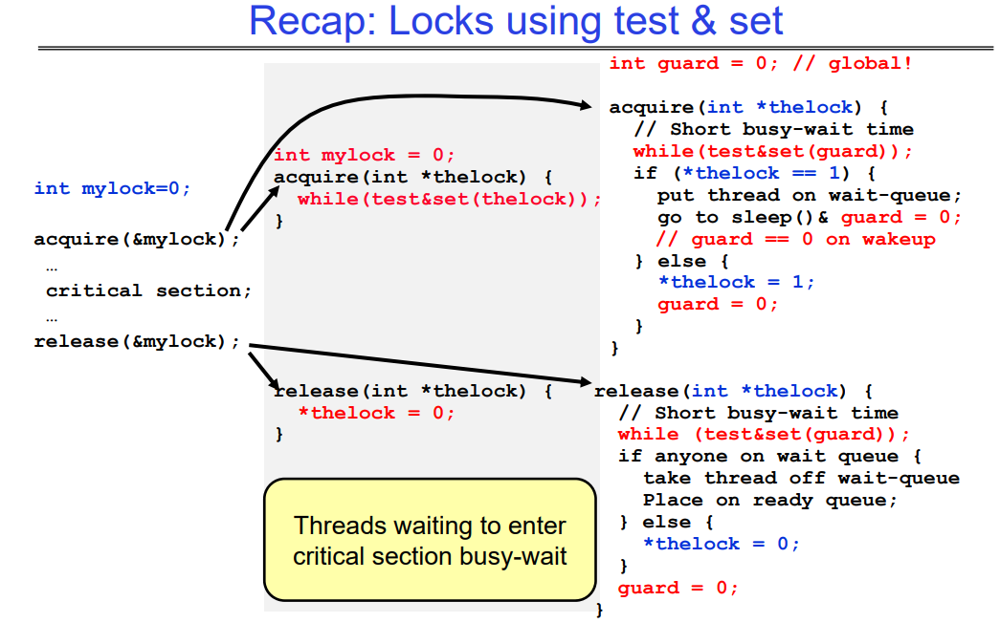

# Linux-futex(fast user-space mutex)

在C++中，futex（Fast Userspace Mutex）是一种特定于Linux系统的同步原语，用于实现低级别的线程同步操作。它是Linux内核提供的系统调用，用于实现用户空间线程同步的一种机制。futex主要用于实现互斥锁（Mutex）和条件变量（Condition Variable）等高级同步原语。

这是futex系统调用的基本签名和参数说明：

```c
int futex(int *uaddr, int futex_op, int val, const struct timespec *timeout)
```

提供的信息详细阐述了futex系统调用的一些重要方面：

**uaddr（用户地址）**：指向用户空间中的一个32位整数值。futex系统调用将在这个共享整数变量上执行操作。

**futex_op（操作类型）**：该参数指定对共享变量`uaddr`要执行的操作。常见的操作包括：
- `FUTEX_WAIT`：如果`uaddr`指向的值等于`val`，则调用进程将睡眠，直到条件发生变化。此操作涉及原子检查，以确保在禁用中断后条件仍然成立（在内核态禁用中断之前，内核会检查M[uaddr]是否仍然等于val）。
- `FUTEX_WAKE`：唤醒最多`val`个正在等待的线程，这些线程正在futex关联的`uaddr`上睡眠。
- 其他操作，如`FUTEX_FD`、`FUTEX_WAKE_OP`、`FUTEX_CMP_REQUEUE`，提供了更复杂的功能。

**val**: 这是一个与操作相关的值。根据操作类型的不同，它可能是一个预期值或一个计数器。上面举出的两种操作类型说明了这一点。

**timeout（超时）**：这是指向`timespec`结构的指针，用于指定操作的超时时间。它提供了与内核睡眠功能的接口。如果提供了超时，线程将最多睡眠指定的持续时间。这允许线程有条件地自己进入睡眠状态。如果`timeout`参数为`NULL`，则睡眠将是无限期的。

**用法**：futex并没有直接暴露在C标准库（libc）中；而是在pthread（POSIX线程）的实现中使用。它作为实现各种同步机制（如锁、信号量、监视器等）的基本构建块。`futex()`系统调用的返回值表示操作的结果。通常，成功的操作返回0，而错误则返回-1，并设置`errno`以指示错误类型。

总的来说，futex提供了一种灵活且高效的机制来管理用户空间中的同步原语，允许在不增加不必要开销的情况下实现高级线程功能。

可以用futex实现acquire和release操作，这会更高效，

##  using more atomic instructions build acqiure

下面是一种更好的使用用户态原子指令和futex去实现acquire和release的方式，这种方法十分清晰，并且在没有争用存在的时候是没有开销的。此外，我们也可以用类似的方法去构建semaphores。

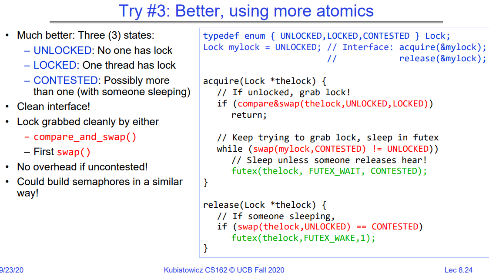

## Recall: Where are we going with synchronization?

现在再看下面这张图应该会更有体会：

硬件级别的原语，L/S是纯硬件指令；禁用中断会影响系统，毫无疑问不能交给用户使用；而T&S和C&S是基于硬件实现的用户级别的atomic 原语，可以给用户使用。

更高级的sync原语：上面讲过，我们用下述图中两种hardware的用户级别的原子指令实现了lock，并且代码更为整洁，效率更高。

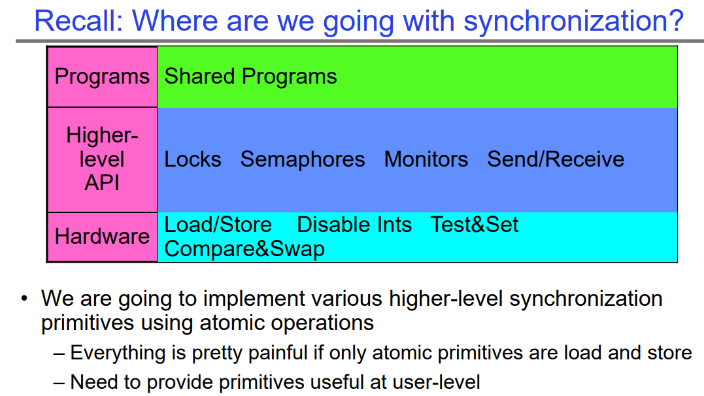

## Semaphores are good but…Monitors are better!

信号量是一个巨大的进步；想想如果只用加载和存储，甚至只用锁来做有界缓冲区会怎样！

问题在于信号量具有双重目的：

- 它们既用于互斥，也用于调度约束
- 例如：有界缓冲区中P的翻转导致死锁这一事实并不是显而易见的。你如何向别人证明正确性呢？

**更清晰的想法是：使用锁（`locks`）来实现互斥，使用条件变量（`condition variables`）来实现调度约束。**

监视器（`Monitor`）：被定义为一种同时包含锁（`lock`）和零个或多个条件变量（`condition variables`）的机制，用于管理对共享数据的并发访问。

- 一些语言如Java本身就提供了这种支持。
- 大多数其他语言使用真正的锁和条件变量。

监视器（`Monitor`）是并发编程的一种范式！

- 一些语言明确支持监视器。

# condition variables

要将`consumer()`例程更改为等待直到队列中有东西可以获取，可以使用条件变量来实现。

条件变量：是一个队列，其中的线程在critical section上等待某些条件的满足。

- 关键思想：允许在critical section内睡眠，方法是在我们进入睡眠时原子性地释放锁。
- 与信号量相比：信号量不允许在critical section内等待。**信号量的`wait()`操作会阻塞当前线程，并且由于信号量没有主动的释放锁的行为，这会进一步导致死锁，而条件变量在sleep时可以指定要暂时释放的锁，不会阻碍其他线程操作。**
- 无论是condition_wait还是semaphores的wait操作，调用后都会让当前线程休眠，即进入wait queue。
- 一般来说，我们会为每个限制条件分配一个条件变量，而不是让所有的限制条件共享一个条件变量，当然后者在某些场景下也是可行的。

条件变量支持以下操作：
- `Wait(&lock)`: 原子性地释放锁并进入睡眠状态（可以认为这是同时发生的操作，线程在睡眠的同时释放子自己当前持有的锁）。稍后在返回到这里之前重新获取锁，这说明他被某个线程唤醒了。
  - 注意，如果该线程没有成功的重新拿到锁，那么就无法从cond_wait(&lock)中返回，这是cond_wait函数中内部实现的逻辑。

- `Signal()`: 唤醒一个等待者（如果有）。
- `Broadcast()`: 唤醒所有等待者。

需要注意的是，在进行条件变量操作时必须持有锁。

## C语言的condition_variables相关函数的prototype

`pthread` 库中的条件变量（condition variable）是一种用于线程同步的机制。它允许线程在某个条件满足时等待，或者在其他线程发出信号时被唤醒。以下是 `pthread` 库中与条件变量相关的一些 API：

**`pthread_cond_init(pthread_cond_t\* cond, const pthread_condattr_t\* attr)`**：

- 用于初始化条件变量 `cond`。
- 可以传递属性参数 `attr`，但通常使用默认值 `NULL`。

**`pthread_cond_destroy(pthread_cond_t\* cond)`**：

- 用于销毁条件变量 `cond`。

**`pthread_cond_wait(pthread_cond_t\* cond, pthread_mutex_t\* mutex)`**：

- 在调用前，线程必须先获得互斥锁 `mutex`。mutex用于实现对condition_val的互斥访问。
- 调用后，线程会释放 `mutex` 并等待条件变量 `cond`。
- 当其他线程调用 `pthread_cond_signal` 或 `pthread_cond_broadcast` 时，等待的线程会被唤醒并重新获得 `mutex`。

**`pthread_cond_signal(pthread_cond_t\* cond)`**：

- 唤醒等待在条件变量 `cond` 上的一个线程。
- 如果没有线程在等待，该操作不会产生任何效果。

**`pthread_cond_broadcast(pthread_cond_t\* cond)`**：

- 唤醒等待在条件变量 `cond` 上的所有线程。

**`pthread_cond_timedwait(pthread_cond_t\* cond, pthread_mutex_t\* mutex, const struct timespec\* abstime)`**：

- 类似于 `pthread_cond_wait`，但可以设置等待的超时时间。

**`pthread_condattr_init(pthread_condattr_t\* attr)`** 和 **`pthread_condattr_destroy(pthread_condattr_t\* attr)`**：

- 用于初始化和销毁条件变量属性对象。

## Monitor with condition variables（类比生产者消费者问题）

下图可以看到，使用条件变量的Monitor模式提供了两种互斥操作：

- 提供对shared data的互斥操作，见图中的entry queue，他们只有在获取到Lock后，才有资格进入到critical section中并进行进一步的操作，因为一次只允许一个线程操作。用Lock实现。
- 当进入程序中后，我们虽然获取了共享变量的访问权限，但是还有一些限制需要满足，因此需要condition variables来满足这些限制。

因此，不难发现，一<u>个Monitor应该包含一个用于获取shared data的Lock，还有一系列的用于获取critical section的条件变量</u>，因为多个线程在临界区中，我们需要用condition variables对这些线程进行排队。

- 可以类比之前讲的生产者消费者问题，mutex用来提供对整个缓冲区的互斥访问，而内部的semaphores用于实现相关的限制（满了后不能继续放置，空了后不能继续取）。**这里的condition variables的作用就相当于semaphores。**

`Lock`：lock提供了对shared data的互斥访问。（类比保护整个缓冲区的mutex）

- 在访问shared data结构体之前总是需要acquire该锁。
- 在完成对共享数据的操作后释放锁。
- 锁最初是空闲的。

`Condition Variable`：是一个队列，在队列中的线程在临界区内等待某些限制条件的满足：

- 其关键思想是在进入睡眠时原子性地释放锁，使得在关键部分内可以进入睡眠状态。
- 与信号量相比：信号量不允许在关键部分内等待。

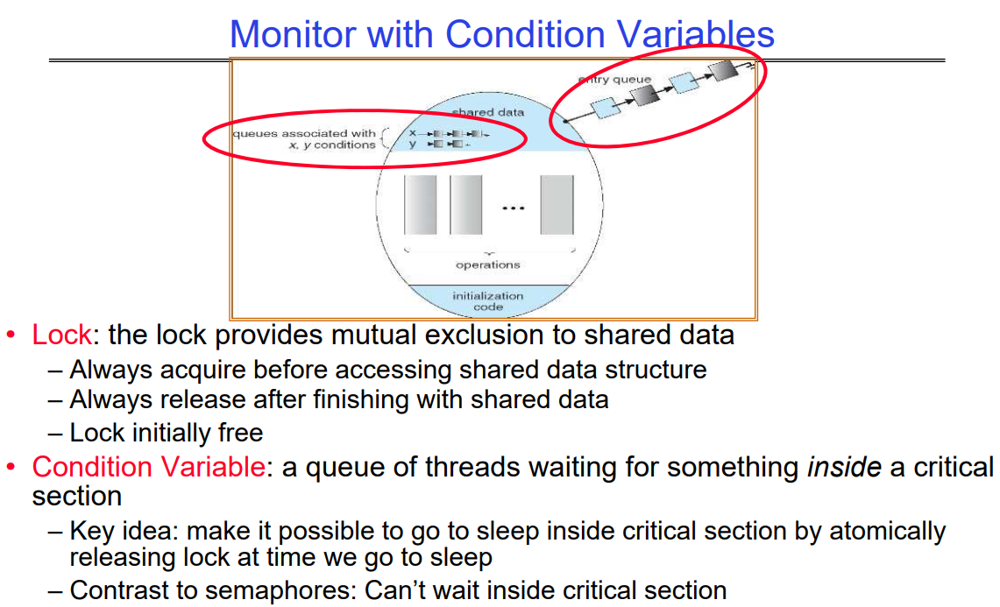

## Mesa vs. Hoare monitors

需要对signal和wait的精确定义非常小心。考虑我们的出队(dequeue)代码片段：

```c
while (isEmpty(&queue)) { // 当被某个生产者唤醒后，他需要再一次确认当前队列中是否真的有待处理的元素
    cond_wait(&buf_CV, &buf_lock); // 如果队列为空，就休眠
}
item = dequeue(&queue); // 获取下一个项
```

为什么我们没有这样做？

```c
if (isEmpty(&queue)) {
    cond_wait(&buf_CV, &buf_lock); // 如果队列为空，就休眠
}
item = dequeue(&queue); // 获取下一个项
```

答案取决于调度类型：

`Mesa-style`：以施乐帕克 Mesa 操作系统命名，即上面使用while方式进行操作的consumer。

- 大多数操作系统使用 Mesa 调度！

`Hoare-style`：以英国逻辑学家托尼·霍尔(Tony Hoare)命名，即上面使用if操作调度的consumer。

**注意，上面两种cond_signal()和cond_wait()的内部实现方式是不一样的，接下来会讲他们俩的区别。**

### Hoare monitors（bad implementation）

从下图中很容易看出Hoare-Style的condition variables实现风格。

1. 当有线程调用cond_signal()时，调用者会放弃lock与CPU，将资源传递给waiter，之后这个waiter会马上开始运行，直到触发条件2。

2. 当该waiter退出critical section或者再次cond_waits()后，waiter会放弃lock和cpu，将之还给当初的调用者。

乍一看，语义是不错的，waiter可以马上运行，并且条件变量仍然是正确的。

但是在多数教科书中都在诟病Hoare调度方式：

- 很难实现，并且没有必要这么搞。
- 这会强制实行大量的上下文切换，非常低效。

### 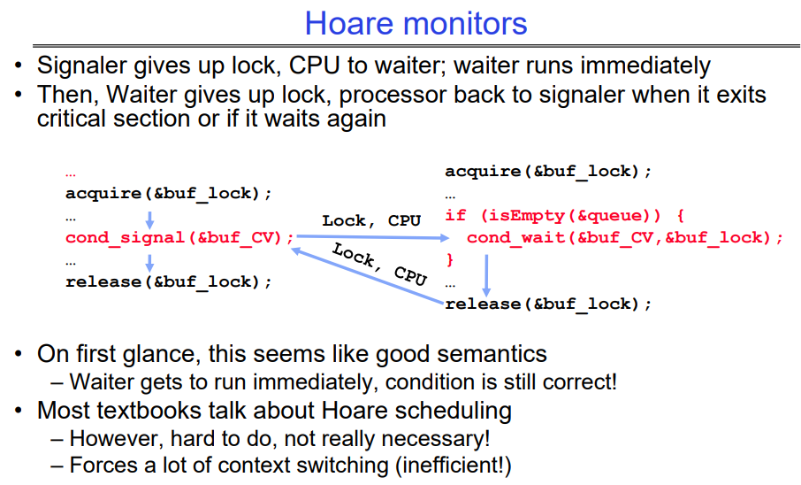Mesa monitors(good implementation)

下面我们看看Mesa方式实现的cond_signal()和cond_wait()：

1. 调用cond_signal()的调用者只是将某个当前在wait queue中的thread放到了read queue上，该thread遵守调度算法，没有任何特别的优先级。并且调用者仍然持有lock和CPU。
2. 等待定时器中断，之后由调度算法定时的调度程序执行，可能在之后的某一刻该程序被调度执行。

实际上，在等待后需要重新检查条件：

- 因为等待者被调度执行时，条件可能再次为假。在下例中，意味着可能先有别的线程使用了queue中的元素，所以需要使用"while"循环再次检查。

大多数真实的操作系统都这样做！

- 更有效率，更容易实现。
- 信号量的缓存状态等仍然有效。


##  Circular Buffer（Monitors，pthread-like）

下图是利用Mesa-Monitor实现的生产者消费者模型，可见非常工整，且性能也不错。

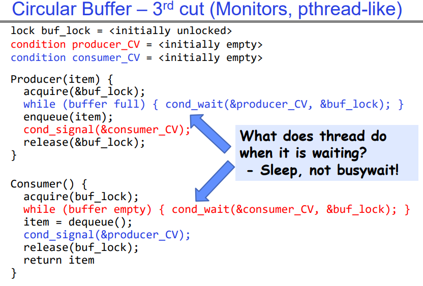

## Again: why use while Loop?

MESA语义：

对于大多数操作系统，当一个线程被signal()唤醒时，它只是被放入就绪队列。

它可能会立即重新获取锁，也可能不会！
- 另一个线程可能会先被调度，并且"溜进"空队列。
- 需要在唤醒时重新检查条件的循环。

# Readers/Writers Problem

动机：考虑一个共享数据库

两类用户：
- 读者 - 只读数据库并且从不修改数据库
- 写者 - 读取和修改数据库

仅使用一个锁来锁住整个数据库是否足够？
- 希望同时有多个读者
- 一次只有一个写者

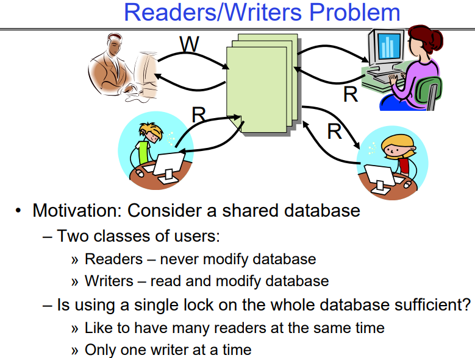

## Basic Readers/Writers Solution

正确性约束：

- 在一个数据库中，读的次数比写操作多，这里我们采用写操作有优先策略，当然也可以自行更换优先级。
- 当没有写者时，读者可以访问数据库。
- 当没有读者或写者时，写者可以访问数据库。
- 一次只有一个线程可以操作状态变量。

因此很明显，Reader只有等到没有任何状态的Writers的时候才可以开始操作。而Writer需要等到没有活跃的Readers和writers的时候可以开始操作。

下面先基于元数据的方式给出一个初阶的解法，这里的lock的作用不再是针对DB的上锁，而是用来保护元数据的，确保每次只有一个线程在修改相关元数据。<u>下节课中我们会使用条件变量给出一个更好的解法。</u>

int AR：活跃读者的数量；初始值为0。int WR：等待读者的数量；初始值为0

int AW：活跃写者的数量；初始值为0。int WW：等待写者的数量；初始值为0

条件 okToRead = NIL。条件 okToWrite = NIL。

### code for a Reader

```c
Reader() {
    // First check self into system
    acquire(&lock);
    while ((AW + WW) > 0) { // Is it safe to read?
        WR++; // No. Writers exist
        cond_wait(&okToRead,&lock);// Sleep on cond var
        WR--; // No longer waiting
    }
    AR++; // Now we are active!
    release(&lock);
    // Perform actual read-only access
    AccessDatabase(ReadOnly);
    // Now, check out of system
    acquire(&lock);
    AR--; // No longer active
    if (AR == 0 && WW > 0) // No other active readers
    	cond_signal(&okToWrite);// Wake up one writer
    release(&lock);
}
```

### code for  a writer

```c
Writer() {
    // First check self into system
    acquire(&lock);
    while ((AW + AR) > 0) { // Is it safe to write?
        WW++; // No. Active users exist
        cond_wait(&okToWrite,&lock); // Sleep on cond var
        WW--; // No longer waiting
    }
    AW++; // Now we are active!
    release(&lock);
    // Perform actual read/write access
    AccessDatabase(ReadWrite);
    // Now, check out of system
    acquire(&lock);
    AW--; // No longer active
    if (WW > 0){ // Give priority to writers
    	cond_signal(&okToWrite);// Wake up one writer
    } else if (WR > 0) { // Otherwise, wake reader
    	cond_broadcast(&okToRead); // Wake all readers
    }
    release(&lock);
}
```

# Summary

## semaphores and Monitors

上面反复提到的一个点是，semaphores在调用wait()时，是不允许在临界区等待的，很明显，在之前的生产者消费者问题中我们需要先确保满足限制之后，才能获取临界区的操作权限，否则会陷入死锁。

如果我们需要在临界区等待，应该使用Monitor机制。

当信号量的`wait()`操作被调用时，它不会主动释放锁：

1. **信号量（Semaphore）**的`wait()`操作：
   - `wait()`操作用于获取信号量资源。
   - 如果信号量计数器大于0，线程可以继续执行，同时信号量计数器减1。
   - 如果信号量计数器为0，线程将被阻塞，直到有其他线程释放资源（通过`signal()`或`post()`操作）。
2. **互斥量（Mutex）\**和\**信号量**之间的区别：
   - 互斥量用于避免多个线程同时访问共享资源，从而避免数据竞争。
   - 互斥量提供线程间的同步支持，但只能在同一线程内使用。
   - 信号量用于控制对共享资源的访问，可以限制同时访问资源的线程数量。
3. **信号量和互斥量的关系**：
   - 信号量和互斥量都是用于线程同步的工具，但用途不同。
   - 信号量不是临界区的保护工具，而是用于控制资源访问。
   - 如果你需要在临界区内等待，你应该使用互斥量和条件变量（condition_variable）来实现。

因此，信号量的`wait()`操作不会主动释放锁，它只是等待获取资源的过程中阻塞线程。如果你需要在临界区内等待，你应该使用互斥量和条件变量来实现。

## Summary1

重要概念：原子操作

- 一个操作要么全部执行完毕，要么完全不执行
- 这些是构建各种同步原语的基本操作

我们讨论了硬件原子性原语：

- Disabling of Interrupts, test&set, swap, compare&swap,  load-locked & store-conditional。

展示了几种锁的构造方法：

- 必须非常小心，不要浪费/占用机器资源
  - 不应长时间禁用中断
  - 不应长时间自旋等待
- 关键思想：使用硬件机制来保护对锁变量的修改，上述几种除了Disabling of interrupts之外，剩下的几种都是可以在用户态直接使用的，由硬件机制本身保证原子性。

展示了构造用户级锁的原始方法：

- 打包了睡眠功能

## Summary2

 `Semaphores`：类似于带有受限接口的整数
- 两种操作：
  - P(): 如果为零则等待；变为非零时递减
  - V(): 递增并唤醒正在等待的任务（如果存在）
  - 可以将值初始化为任何非负值
- 对于每个约束使用单独的信号量

 `Monitors`：一个锁加上一个或多个条件变量
- 在访问共享数据之前始终获取锁
- **使用条件变量在临界区内等待**
  - 三种操作：Wait()、Signal() 和 Broadcast()

监视器代表程序的逻辑
- 如果需要，等待
- 当更改某些内容时发出信号，以便任何等待的线程可以继续进行

下一次：继续读者/写者示例
