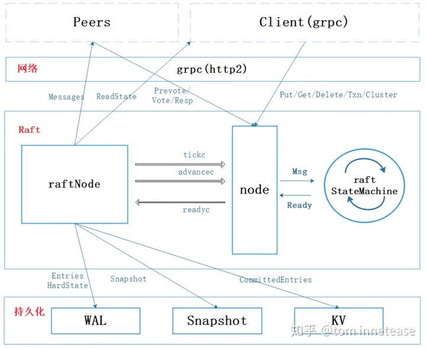
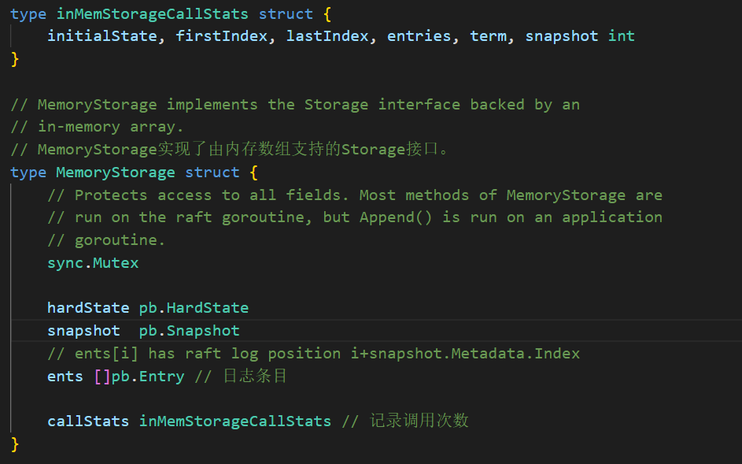
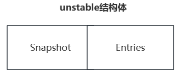
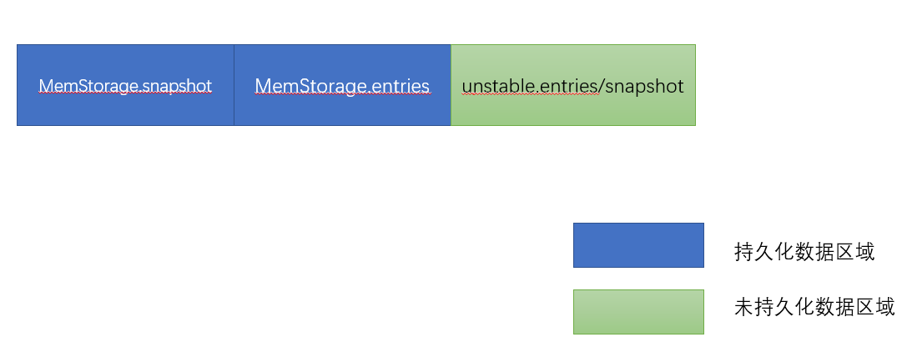

# Etcd-Raft库学习

Etcd Raft库地址：[etcd-io/raft: Raft library for maintaining a replicated state machine (github.com)](https://github.com/etcd-io/raft)

本文参考了文章[etcd Raft库解析 - codedump的网络日志](https://www.codedump.info/post/20180922-etcd-raft/#raftlog的实现)，结合最新版本的Etcd-Raft库，旨在加深自己对Raft算法工业应用的理解，并加深对Raft算法常见优化的理解。Etcd的Raft库实现是最接近于论文本身的，因此选择了Etcd。

etcd做为一个非常成熟的作品，其Raft库实现也非常精妙，屏蔽了网络、存储等模块，提供接口由上层应用程序来实现。此外，PingCAP的tinyKV教学项目也是参考了ETCD的实现。

# raft状态机架构概览

在已经写完MIT6.5840课程的所有lab后，不难理解，Raft作为一个库被提供，肯定会提供一系列的API供上层的状态机调用，作为一个一致性算法库，一般的使用场景应该是这样的，这里先不考虑如Lease Read或Read Index这些读请求优化。

1. 应用层收到新的请求(读或写)，将该请求propose到raft层。
2. raft层尝试提交该命令，若成功提交，则将该command通过某种方式返回给应用层。
3. 应用层收到后可以采取下一步行动，如应用命令等操作。

然而，Raft库却相对而言更复杂一些，因为还有以下的问题存在：

1. 写入的数据，可能是集群状态变更的数据，Raft库在执行写入这类数据之后，需要返回新的状态给应用层。
2. Raft库中的数据不可能一直以日志的形式存在，这样会导致数据越来越大，所以有可能被压缩成快照（snapshot）的数据形式，这种情况下也需要返回这部分快照数据。
3. raft层中需要持久化的状态是确定的，但是在应用层主动发起快照操作时，应用层需要决定将自己的哪些状态数据存到持久化数据中。
4. etcd的Raft库也不自己实现网络传输，所以同样需要返回哪些数据需要进行网络传输给集群中的其他节点。

首先，Node接口是raft层提供给应用程序的交互接口，应用程序通过调用Node提供的相关API使用Raft库，如propose请求，接收raft状态机已经提交的日志等等交互都是首先通过Node接口。

RawNode其实本质上可以归到Raft结构体中，但是为了使代码可读性更高，就将RawNode单独拎出来了，RawNode内部有一个raft对象，还有关于hardState和softState相关定义。

RawNode负责检查raft当前是否有新的状态、待持久化的日志、待应用的日志，若有，则打包到一个Ready中，Node会定期检查rawNode是否有这些内容，若有Node会将新的Ready传到应用层，当应用层应用完毕后，会相关API告知Node，之后Node会告知RawNode，从而更新状态并开始准备下一个Ready。

下图中的RaftNode可以看做是应用程序：



raft state machine中包含了RawNode结构体和Raft实例对象，rawnode负责向上传递最新的Ready信息，其实rawnode也属于raft算法库的一部分，只是为了干净利落而将其与raft lib模块分开定义了，让rawnode包含一个raft对象，raft对象负责实现raft算法的功能。Ready的相关字段定义如下：

| 成员名称         |         类型 |                             作用                             |
| :--------------- | -----------: | :----------------------------------------------------------: |
| SoftState        |    SoftState | 软状态，软状态易变且不需要保存在WAL日志中的状态数据，包括：集群leader、节点的当前状态。 |
| HardState        |    HardState | 硬状态，与软状态相反，需要写入持久化存储中，包括：节点当前Term、Vote、Commit。如果没有任何更新，该值可能是null。如果启用了`async storage writes`，则不需要立即对此字段进行操作。它将在Messages切片中的MsgStorageAppend消息中反映出来。 |
| ReadStates       | []ReadStates | 当节点的appliedIndex大于ReadState中的索引时，ReadStates可以用于节点本地提供线性一致性读请求。请注意，当raft接收到msgReadIndex时，将返回readState。返回值仅对读请求有效。 |
| Entries          |   []pb.Entry | 在Messages中的消息被发送出去之前之前需要先写入持久化存储的日志数据。如果启用了`async storage writes`，则不需要立即对此字段进行操作。它将在Messages切片中的`MsgStorageAppend`消息中反映出来。 |
| Snapshot         |  pb.Snapshot | 指定了要保存到稳定存储中的快照。如果启用了async storage writes，则不需要立即对此字段进行操作。它将在`Messages`切片中的`MsgStorageAppend`消息中反映出来。 |
| CommittedEntries |   []pb.Entry | CommittedEntries指定要提交到存储/状态机的条目，这些条目先前已附加到稳定存储中。如果启用了async storage writes，则不需要立即对此字段进行操作。它将在Messages切片中的MsgStorageApply消息中反映出来。 |
| Messages         | []pb.Message | Messages指定该节点需要发送的消息。如果未启用async storage writes，则这些消息必须在Entries附加到稳定存储之后发送。如果启用了async storage writes，则这些消息可以立即发送，因为当消息MsgStorage{Append,Apply}附加到Messages中时，则意味着该异步写入已完成。 |
| MustSync         |         bool | MustSync指示是否必须将HardState和Entries耐久地写入磁盘，或者是否允许非耐久性写入。（后面解释这里的意思） |

根据上面的分析，应用层在写入一段数据（向raft层提交一定数量的命令/消息）之后，Raft库将返回这样一个Ready结构体，其中可能某些字段是空的，毕竟不是每次改动都会导致Ready结构体中的成员都发生变化，此时应用层就需要根据情况，取出其中不为空的成员进行操作了。

Etcd的raft库实现了`async storage writes`机制，当该机制开启时，写入操作不必马上完成，可以异步完成，并且完成后通过某种类型的Messages来提醒当前节点。这里的写入操作可以包括对HardState、Entries、Snapshot、CommitedEntries等内容的写入，在下面的Node API定义中会了解到异步存储写入操作发挥作用的场景，并告诉我们在启用异步存储写入的情况下做出的反应与平常情况的不同之处。

## Node-Api

raft库对外提供一个Node的interface，其实现有raft/node.go中的node结构体实现，这个node就是上图中提到的RawNode，应用层通过node结构体与raft算法库进行交互，node接口中，需要实现如下几个函数：

| 函数               | 作用                                                         |
| :----------------- | :----------------------------------------------------------- |
| Tick               | 应用层每次tick时需要调用该函数，将会由这里驱动raft的一些操作比如选举等。至于tick的单位是多少由应用层自己决定，只要保证是恒定时间都会来调用一次就好了。<br />此外，选举超时时间和心跳超时时间的单位是时钟周期，即他们是以Tick数量为单位衡量的。 |
| Campaign           | Campaign方法导致节点转换为候选人状态，并开始竞选成为领导者。 |
| Propose            | Propose方法提议将数据附加到日志中。请注意，propose可能会在不通知应用层的情况下丢失，因此用户需要确保propose重试机制。 |
| ProposeConfChange  | ProposeConfChange提议配置更改。与任何提议一样，配置更改可能会被丢弃，也可能会返回错误。特别是，除非领导者确定其日志中没有未应用的配置更改，否则将丢弃配置更改。<br />该方法接受pb.ConfChange（已弃用）或pb.ConfChangeV2消息。后者允许通过联合共识进行任意配置更改，特别是包括替换投票者。仅当参与集群的所有节点运行的版本都知道V2 API时，才允许传递ConfChangeV2消息。有关用法详细信息和语义，请参见pb.ConfChangeV2。 |
| Step               | Step方法使用给定的消息推进状态机。如果错误，则返回ctx.Err()。 |
| Ready              | Ready返回一个Channel，该Channel返回当前的即时状态。节点的用户必须在检索Ready返回的状态后调用Advance（除非启用了async storage writes，在启用异步存储写入的情况下永远不应该调用Advance函数）。<br />注意：在上一个Ready的所有已提交条目和快照都完成之前，不得应用下一个Ready中的已提交条目。 |
| Advance            | Advance通知Node应用程序已将进度保存到最后一个Ready。因此，Node准备返回下一个可用的Ready。应用程序通常在应用最后一个Ready中的条目后调用Advance。<br />但是，作为优化，应用程序可以在应用命令时调用Advance。例如，当最后一个Ready包含快照时，应用程序可能需要很长时间来应用快照数据。为了继续接收Ready而不阻塞raft的进度，它可以在完成应用最后一个ready之前调用Advance。<br />注意：在使用AsyncStorageWrites时，不得调用Advance。local append和apply线程的响应Messages代替了Advance。 |
| ApplyConfChange    | ApplyConfChange将配置更改（先前传递给ProposeConfChange的命令）应用到节点。每当在Ready.CommittedEntries中观察到配置更改类型的日志时，都必须调用此方法，除非应用程序决定拒绝配置更改（即将其视为no-op操作），在这种情况下，不得调用此方法。<br />该方法返回 一个不透明的非nil的ConfState protobuf(grpc的一种序列化协议)，该protobuf必须记录在快照中。 |
| TransferLeadership | TransferLeadership尝试将领导权转移给给定的接收者。           |
| ForgetLeader       | follower调用该函数忘记当前领导者，将其更改为None。它在当前任期中仍然是一个无领导的跟随者，不会进行竞选。<br />这在PreVote+CheckQuorum中很有用，因为通常情况下，如果跟随者在过去的选举超时间隔内听到过领导者的消息，它们通常不会授予pre-votes给候选人。但是无领导的跟随者可以立即授予pre-votes，因此如果大多数跟随者有充分的理由相信领导者已经死亡（例如通过side-channel或外部故障检测器），并且忘记了它，那么它们可以立即选举新的领导者，而不必等待选举超时。如果它们再次听到领导者的消息，它们将恢复为正常的跟随者，或者在选举超时时转换为候选人。<br />下面举了一个关于ForgetLeader函数使用场景的例子。<br />该函数在ReadOnlyLeaseBased中无效，因为它会允许新的领导者在旧的领导者不知道的情况下被选举。 |
| ReadIndex          | ReadIndex请求一个read state。read state将设置在ready中。read state具有一个read index。一旦应用程序进度超过read index，那么在发出read请求之前的任何线性读请求都可以安全地处理（**盲猜指的应该是该ReadIndex请求之前的任何请求？**）。read state将附加相同的rctx。<br />请注意，请求可能会在没有通知的情况下丢失，因此用户需要确保read index重试。 |
| Status             | Status返回raft状态机的当前状态。                             |
| ReportUnreachable  | ReportUnreachable报告最后一次发送的给定目标节点不可达。      |
| ReportSnapshot     | ReportSnapshot报告发送的快照的状态。id是应该接收快照的跟随者的raft ID，status是SnapshotFinish或SnapshotFailure。使用SnapshotFinish调用ReportSnapshot是一个空操作。但是，应该将任何应用快照失败用SnapshotFailure参数（例如，从领导者流式传输到跟随者时）报告给领导者。<br />当领导者向某个跟随者发送快照时，它会暂停对该follower的raft日志推进，直到跟随者能够应用快照并推进其状态，leader才会继续给该follower发送新的日志。这意味着在当前follower应用快照之前，领导者不会向其发送任何新的日志条目。<br />这部分对后续理解raft日志中的Unstable部分十分重要，这也是Unstable中为什么entries和snapshot不会同时存在的原因。[unstable数据结构](#unstable结构体) |
| Stop               | // 它会暂停对当前follower的raft日志推进，直到跟随者能够应用快照并推进其状态。这意味着在当前follower应用快照之前，领导者不会向其发送任何新的日志条目。Stop执行节点的任何必要终止操作。 |

`ForgetLeader`使用场景举例：例如，考虑一个三节点集群，其中1是领导者，2+3刚刚收到了来自1的心跳。如果2和3相信领导者现在已经死亡（也许它们知道编排系统关闭了1的VM），我们可以指示2忘记领导者，3进行竞选。然后2将能够授予3的pre-vote，并立即选举3为领导者（在没有ForgetLeader API的情况下，2会拒绝投票，直到选举超时结束，因为它最近听到了领导者的消息）。但是，3不能单方面进行竞选，必须有大多数节点同意领导者已经死亡，这样可以避免在个别节点错误地认为领导者已经死亡时干扰领导者。

## etcd中的contrib/raftexample分析

在etcd项目中，提供了使用Raft库的demo例子，在`contrib/raftexample`目录中，这里简单的演示了一下如何根据这个raft库实现一个简单的KV存储服务器，下面根据这里的代码结合着上面的Ready结构体、和定义好的Node接口，来学习该kv server是如何使用Node API、如何对接Ready结构体的。

首先看main.go中的main函数，省略参数解析的部分，首先创建了两个channel：

- proposeC：用于propose普通指令的日志。
- confChangeC：用于propose配置变动的日志。

之后创建RaftNode实例，就是前面提到的RawNode，即Node.go中定义的应用层与raft算法库交互的媒介，主要关注在rc.startRaft()函数中，启动了rc.serveRaft()和rc.serveChannels()两个协程，这两个协程负责的工作大致如下所示：

- rc.serverRaft()协程主要是启动了一个HTTP服务器，用于接收用户的请求指令。最终这些指令会写入前面的proposeC或confChangeC channel中。
- rc.serverChannels()协程做了两个工作：其一是以协程方式启动了对proposeC和confChangeC两个channels的监听，其二是设置了ticker定时器和对node.Ready结构体的监听。

因此，将上面两个serve协程的工作结合到一起，就是如下的流程：

1. HTTP服务器负责监听来自client的请求，根据请求的类型将其封装并写入到proposeC或者confChangeC channel中。
2. 如果收到proposeC channel的消息，说明有数据提交，则调用Node.Propose函数进行数据的提交。
3. 如果收到confChangeC channel的消息，说明有配置变更，则调用Node.ProposeConfChange函数进行配置变更。
4. 此外，将ticker定时器、对Ready的监听、对ErrorC channel的监听、对stop指令的监听都放到了一个for循环中，使用select进行触发判断：每次当ticker该触发时，调用node.tick()函数驱动RaftNode；若raftNode有Ready结构体传上来，若发现该Ready中有数据变更，则根据不同数据类型进行相应的更新操作，完成对此次Ready的应用后，需要调用node.Advance函数推进RaftNode的进度，是为了告诉RaftNode可以准备下一次的Ready了。

在contrib/raftexample/httpapi.go中，ServeHTTP函数说明了HTTP server如何对用户请求进行分类，这里简要列出其伪代码：
```pseudocode
ServeHTTP(Request r) {
switch:
case http.MethodPut:
	propose请求到proposeC中
case http.MethodGet:
	获取数据，从store中查询
case http.MethodPost:
	将请求放入confChangeC中
case http.MethodDelete:
	// 也是配置变更类型，目前还不知道是干啥的
	将请求放入到confChange。
}
```

到此，我们已经知道raft如何在一个分布式数据库中发挥作用了，应用层通过RaftNode提供的一系列接口与raft算法库进行交互，涉及到数据库状态变更的核心数据结构就是Ready（目前还不确定是否包含集群成员变更的行为），应用层通过tick驱动RaftNode以及node下面的raft算法库，RaftNode定期从Raft算法层收集可能的新内容并将其封装到Ready结构体中向上传递给应用层，应用层应用完毕后调用node.Advance()推进RaftNode继续提供下一个Ready。

# Raft库代码结构以及核心数据结构

前面已经看到了raft/node.go文件中，提供出去的是Node接口及其实现node结构体，这是外界与raft库打交道的唯一接口，除此之外该路径下的其他文件并不直接与外界打交道。这里列出一个总纲，下面将分模块介绍Raft库中的重要结构体。

接下来回到raft库中，raft.go文件定义了raft算法的框架，其中包含两个核心数据结构：

1. Config：与raft算法相关的配置参数都包装在该结构体中，如心跳超时时间tick数、选举超时时间tick数等参数，在启动raft实例时赋给raft中对应的参数，具体请见raft.go中的定义。
2. raft：具体实现raft算法的结构体。

在raft算法库中，所有的结构体都是为了raft层服务的，下面列出一些出现频率高的结构体或参数：

| 结构体/接口 | 所在文件     | 作用                                                         |
| ----------- | :----------- | :----------------------------------------------------------- |
| Node接口    | node.go      | 提供raft库与外界交互的接口                                   |
| node        | node.go      | 实现Node接口                                                 |
| Config      | raft.go      | 封装raft算法相关配置参数                                     |
| raft        | raft.go      | raft算法的实现                                               |
| ReadState   | read_only.go | 线性一致性读相关                                             |
| readOnly    | read_only.go | 线性一致性读相关                                             |
| raftLog     | log.go       | 实现raft日志操作                                             |
| Progress    | progress.go  | 该数据结构用于在leader中保存每个follower的状态信息，leader将根据这些信息决定发送给节点的日志 |
| Storage     | storage.go   | 提供存储接口，应用层可以按照自己的需求实现该接口             |
| isLearner   | raft.go      | 当前节点的角色是否是Learner                                  |

## Learner角色（集群成员变更使用）

**Learner 节点**在新节点被添加到集群后，充当了一种过渡状态：

1. **新节点加入**：当您向 **etcd 集群**添加新节点时，您可以将其配置为 **learner 节点**。这些节点不参与 **Raft** 选举投票，因此不会影响 **quorum**。
2. **数据同步**：**Learner 节点**会从 **Leader 节点**同步数据。这使得它们能够跟上集群的最新状态。
3. **运维风险规避**：在确保新节点正常运行之后，您可以将 **learner 节点**提升为普通节点，从而规避运维风险。这样，您可以逐步引入新节点，而不会影响现有集群的正常运行。
4. **弹性和稳定性**：引入 **learner 节点**有助于提高 **Kubernetes 集群**的弹性和稳定性。它们不仅可以帮助处理配置错误，还可以确保集群不会因为新节点的加入而陷入无效状态。

总之，**learner 节点**是一个非常有用的概念，可以在集群扩展和维护过程中发挥重要作用。

# Raft库日志存储结构

首先声明，raftLog中无论在什么情况下都存在一个Dummy Entry，该Dummy Entry主要是为了存储当前snapshot的Index和Term。索引属于`FirstIndex-1`。

## storage结构体

Storage是应用程序可能实现的接口，用于从存储中检索日志条目。如果任何Storage方法返回错误，raft实例将变得无法操作，并拒绝参与选举；在这种情况下，应用程序负责清理和恢复。注意，这里的Storage并没有说是内存型还是磁盘型，这取决于具体应用程序的实现。

Storage接口，提供了存储持久化日志的相关接口操作，稳定存储中应该存储了最新的快照数据，以及自从最新快照以来的所有已经持久化到稳定存储的日志条目。下面介绍相关的API，这些API并没有进行具体实现，只是提供了一个function prototype：

| Function prototype                                  | comments                                                     |
| --------------------------------------------------- | ------------------------------------------------------------ |
| InitialState() (pb.HardState, pb.ConfState, error)  | IntialState返回保存的HardState和ConfState信息，配置信息（当前集群中的节点信息，Voters，Learners等信息） |
| Entries(lo, hi, maxSize uint64) ([]pb.Entry, error) | 返回[lo, hi)范围内的连续日志条目的切片，从lo开始。maxSize限制返回的日志条目的总大小，但是如果有的话，Entries返回至少一个条目。<br />一些相关的内容请见storage.go。 |
| Term(i uint64) (uint64, error)                      | 返回条目i的任期，它必须在[FirstIndex()-1, LastIndex()]范围内。即使该条目（指FirstIndex之前的条目）的其余部分可能不可用，也会保留FirstIndex之前的条目的任期以进行匹配。 |
| LastIndex()                                         | LastIndex返回日志中最后一个条目的索引。                      |
| FirstIndex() (uint64, error)                        | FirstIndex返回可能通过Entries获得的第一个日志条目的索引（较旧的条目已合并到最新的快照中；如果存储只包含虚拟条目（FirstIndex-1处的日志，只负责任期匹配），则第一个日志条目不可用）。 |
| Snapshot() (pb.Snapshot, error)                     | Snapshot返回最近的快照。如果快照暂时不可用，它应该返回ErrSnapshotTemporarilyUnavailable，这样raft状态机就可以知道Storage需要一些时间来准备快照，并稍后调用Snapshot。 |

Etcd-raft库本身只提供了一个内存型的Storage实现，即下面的MemoryStorage类，该类可以视作是Storage类的一个子类。

### MemoryStorage类

MemoryStorage实现了由**内存数组**支持的Storage接口。首先看一下它的成员变量：


他实现了Storage中声明的所有API，还有一些自己添加的API，下面做简要介绍：

| function prototype                                      | comments                                                     |
| ------------------------------------------------------- | ------------------------------------------------------------ |
| ApplySnapshot(snap pb.Snapshot)                         | ApplySnapshot使用给定快照的内容覆盖此Storage对象的内容。更新相关元数据，并更新DummyEntries的内容 ，DummyEntries存储的是快照的Index和Term。 |
| CreateSnapshot(i uint64, cs *pb.ConfState, data []byte) | CreateSnapshot创建一个快照，可以使用Snapshot()检索，并且可以用于重建该点的状态。如果自上次日志压缩以来进行了任何配置更改，则必须传递最后一次ApplyConfChange的结果。 |
| Compact(compactIndex uint64)                            | Compact丢弃compactIndex之前的所有日志条目。应用程序有责任不尝试压缩大于raftLog.applied的索引。 |
| Append(entries []pb.Entry)                              | Compact丢弃compactIndex之前的所有日志条目。                  |

## unstable结构体

unstable包含尚未写入存储的“unstable”日志条目和快照状态。该类型有两个作用。首先，它保存新的日志条目和可选快照，直到它们被交给Ready结构进行持久化。其次，它在将状态交给raftLog后继续保存这种状态，以便提供**raftLog对正在进行的日志条目和快照的视图**，直到它们的写入被稳定下来，并且可以保证在存储的查询中反映。在此之后，相应的日志条目和/或快照可以从unstable中清除。**注意，snapshot和entries不会同时存在。**



当启动一个Raft实例后，会有从InMemoryStorage中读取相关状态到unstable的步骤，如offset值会设置为`storage.LastIndex()+1`，+1是为了给dummy entry一个位置。

当涉及到 **etcd Raft** 中的 `unstable` 结构体时，首先了解一下其中各个参数的含义和关联：

1. `snapshot`：这个字段存储了最新的快照（snapshot）。快照是一个集群状态的持久化副本，用于在恢复时加速集群的启动。`snapshot` 只有在 **Leader 节点**将其应用到状态机后才会被删除。

2. `entries`：这个字段存储了未提交的日志条目。它包含了 **Leader 节点**已经接收但尚未提交给状态机的日志。这些日志条目可能包括配置更改、键值对的写入等操作。

3. `offset`：这个字段表示unstable中日志条目的偏移量。具体来说，`entries[i]` 对应着 **Raft 日志**中位置为 `i+offset` 的日志条目。初始化时，offset设置为storatge中的LastIndex+1。+1是为了给dummy entry一个位置。

4. `snapshotInProgress`：如果为 `true`，表示当前正在将快照写入存储。这通常发生在 **Leader 节点**将快照应用到状态机之前。

5. `offsetInProgress`：`entries[:offsetInProgress-offset]`正在被写入到稳定存储之中，这意味着`entries[offsetInProgress - u.offset:]`代表的这部分日志条目当前尚未被写入或当前不在被持久化的队列中。遵从不变式：`offset <= offsetInProgress`。

   > 同时`entries[offsetInProgress - u.offset:]`也是`nextEntries()`的返回值，在存在的情况下，`nextEntries()`返回当前尚未写入到存储且不在当前持久化队列中的的日志条目。

unstable.entries[i]具有raft日志位置i+unstable.offset。请注意，unstable.offset可能小于存储中的最高日志位置；这意味着下一次写入存储可能需要在持久化unstable.entries之前截断日志。

根据[Node API](#Node-Api)部分的`ReportSnapshot()`函数描述，当领导者向跟随者发送快照时，它会暂停对目标follower的raft日志指针探测，即Leader在follower应用该快照之前，它不会给该follower发送任何快照之后的日志，直到跟随者能够应用快照并推进其状态。

因此，可以得出结论，在`unstable`结构体中，snapshot和entries这两个变量，并不会同时有内容，同一时间只有一个部分存在。其中，快照数据仅当当前节点在接收从leader发送过来的快照数据时存在，在接收快照数据的时候，entries数组中是没有数据的；除了这种情况之外，就只会存在entries数组的数据了。因此，当接收完毕快照数据进入正常的接收日志流程时，快照数据将被置空。

理解了unstable中的数据分布情况，接下来了解一下里面的API：

- `maybeFirstIndex`：返回unstable状态中的第一条数据日志索引。因为快照数据在最前面，其后才是unstable log，因此只有当快照数据存在的时候才能知道第一条数据日志的索引，如果当前unstable中的存储的不是快照，则拿不到第一条数据日志的索引。

  > 在启动时，unstable从storage中初始化了一些状态(offset、offetInProgress、logger)，当然不包括快照。因此unstable在启动时是没有快照数据的，此时获取maybeFirstIndex数据总是0，而当有了新快照后，才会成功获取到这份数据，我还没能理解这个设计是为什么。**留下这个问题，看慢慢地能不能解决。**

- `maybeLastIndex`：返回最后一条数据的索引。因为是entries数据在后，而快照数据在前，所以取最后一条数据索引是从entries开始查，查不到的情况下才查快照数据。
- `maybeTerm`：这个函数根据传入的日志数据索引idx，得到这个日志对应的任期号。前面已经提过，unstable.offset是快照数据和entries数组的分界线，因为在这个函数中，会区分传入的参数与offset的大小关系。
  - 小于offset的情况下在快照数据中查询，如果当前unstable中快照的index正好等于传入参数idx，那么直接返回快照代表的term，否则返回0与false。
  - 如果大于等于offset，直接从entries中获取对应日志任期即可，idx要在当前日志范围内。
- `nextEntries`：返回当前尚未写入存储的不稳定条目，此外，如果这部分日志正在被写入，那么不会出现在下述返回值中，如上所述，这部分日志应该是`entries[offsetInProgress - u.offset:]`。
- `nextSnapshot`：返回当前还未写入到持久化存储的快照，此外，如果该快照正在被写入，那么返回nil，函数中有专门的状态标记该快照是否正在被写入。返回unstable.snapshot。
- `acceptInProgress`：acceptInProgress标记当前不稳定的所有条目和快照（如果有），已经开始写入存储的过程。当前不稳定的条目/快照将不再从nextEntries/nextSnapshot返回。但是，在调用acceptInProgress之后添加的新条目/快照将从这些方法返回，直到下一次调用acceptInProgress。
- `stableTo`：传入一个entryID条目，里面包含了一个index和一个Term。stableTo标记条目直到具有指定（index，term）的条目为成功写入稳定存储（包含该指定的条目）。仅当调用者可以证明条目不会被正在进行的日志附加覆盖时，才应调用该方法。请参见newStorageAppendRespMsg中的相关注释。调用后unstable中的日志会被截断，并更新offset和offsetInProgress。
- `shrinkEntriesArray()`：如果大部分数组空间没有被使用，shrinkEntriesArray丢弃该条目切片使用的底层数组。这样可以避免保留对一堆可能不再需要的大条目的引用。简单地清除条目是不安全的，因为客户端可能仍在使用它们。即在必要的时候主动缩小entries的capacity，用不了这么多。
- `stableSnapTo`：该函数传入一个索引i，用于告诉unstable，索引i对应的快照数据已经被应用层持久化了，如果这个索引与当前快照数据对应的上，那么快照数据就可以被置空了。
- `restore`：从快照数据中恢复，此时unstable将保存快照数据，同时将offset成员设置成这个快照数据索引的下一位。注意这个快照还没有被持久化到存储中。
- `truncateAndAppend`：传入日志条目数组，这段数据将添加到entries数组中。但是需要注意的是，传入的数据跟现有的entries数据可能有重合的部分，所以需要根据unstable.offset与传入数据的索引大小关系进行处理，有些数据可能会被截断。
- `slice`：slice：返回索引范围在[lo-u.offset : hi-u.offset]之间的数据。
- `mustCheckOutOfBounds`：检查传入的数据索引范围是否合理。需要满足恒等式：`u.offset <= lo <= hi <= u.offset+len(u.entries)`。

## raftLog实现

在学习完storage和unstable这两个数据结构的基础上，可以继续学习raftLog的实现，这个结构体负责处理raft日志相关的所有操作。raftLog由如下成员组成：

| 成员变量                              | 含义                                                         |
| :------------------------------------ | :----------------------------------------------------------- |
| storage Storage                       | 上面介绍的storage接口，存放已经持久化的快照和日志。          |
| unstable unstable                     | 上面介绍的unstable结构体，用于保存应用层还没有持久化的数据。 |
| committed uint64                      | committed是已知在大多数节点上的稳定存储中的最高日志位置。    |
| applying uint64                       | applying是应用程序被指示应用于其状态机的最高日志位置。其中一些条目可能正在应用过程中，尚未达到applied状态。<br />Use:在应用程序接受Ready结构时，该字段递增。<br />不变性：applied <= applying && applying <= committed |
| applied uint64                        | applied是应用程序成功应用于其状态机的最高日志位置。<br />Use:在Ready结构中的committed entries已应用（同步或异步）后，该字段递增。不变性：applied <= committed |
| maxApplyingEntsSize entryEncodingSize | maxApplyingEntsSize限制了从nextCommittedEnts调用返回的消息的未完成字节大小，这些消息还没有被调用appliedTo确认。 |
| applyingEntsSize entryEncodingSize    | applyingEntsSize是**当前**从nextCommittedEnts调用返回的消息的未完成字节大小，这些消息还没有被调用appliedTo确认。 |
| applyingEntsPaused bool               | 直到足够的进度被确认，entry application被暂停时，applyingEntsPaused为true。 |



需要注意的是，在raft初始化日志时，newLogWithSize()中，告诉了我们raftLog中的一些变量和unstable中的一些变量如何从Storage中获取，以及他们的关系也一目了然：

```go
func newLogWithSize(storage Storage, logger Logger, maxApplyingEntsSize entryEncodingSize) *raftLog {
	firstIndex, err := storage.FirstIndex()
	if err != nil {
		panic(err) // TODO(bdarnell)
	}
	lastIndex, err := storage.LastIndex()
	if err != nil {
		panic(err) // TODO(bdarnell)
	}
	return &raftLog{
		storage: storage,
		// unstale的entries中第一条数据的索引应该是storage中的最后一条数据的索引+1
		unstable: unstable{
			offset:           lastIndex + 1,
			offsetInProgress: lastIndex + 1,
			logger:           logger,
		},
		maxApplyingEntsSize: maxApplyingEntsSize,

		// Initialize our committed and applied pointers to the time of the last compaction.
		// 初始化committed、appling、applied三个指针为快照后面的第一条数据的索引，该数据是一条dummy数据
		// 用来存储快照的index和term
		committed: firstIndex - 1,
		applying:  firstIndex - 1,
		applied:   firstIndex - 1,

		logger: logger,
	}
}
```

至此，raftLog的设计已经学习完毕，etcd-raft库将raftLog分为持久化数据（Storage部分）和待持久化数据（unstable部分），二者的桥接点在于`unstable.offset=storage.LastIndex()+1`，这是持久化数据和未是持久化数据的分界点。

接下来学习Raft的Message结构体。见第二篇文章。看到这里后，可以先看一下etcd-raft库中的doc.go文档，里面提供了一个整体的设计概要，很有启发。
