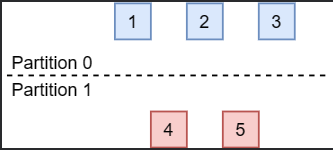
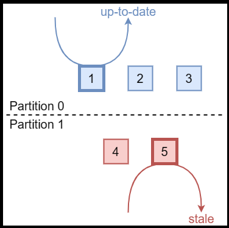
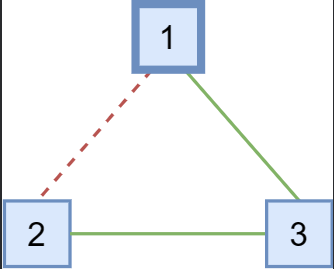
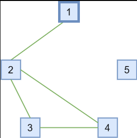
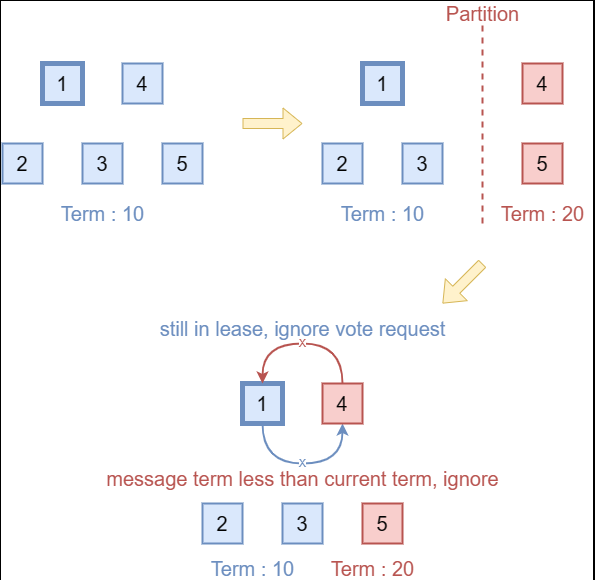
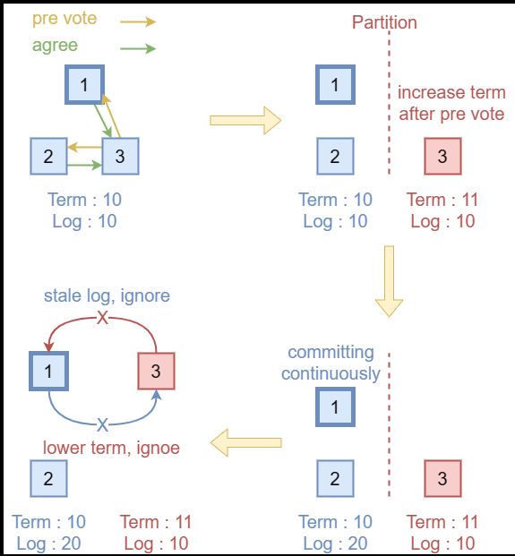

# 1. Etcd-raft选举优化

## 1.0 背景

在leader选举方面，etcd/raft对《In Search of an Understandable Consensus Algorithm (Extended Version)》中介绍的基本Raft算法做了三种优化。这三种优化都在Diego Ongaro的博士论文《CONSENSUS: BRIDGING THEORY AND PRACTICE》的*6.4 Processing read-only queries more efficiently*和*9.6 Preventing disruptions when a server rejoins the cluster*中有提到。

etcd/raft实现的与选举有关的优化有**Pre-Vote**、**Check Quorum**、和**Leader Lease**。在这三种优化中，只有**Pre-Vote**和**Leader Lease**最初是对选举过程的优化，**Check Quorum**起初是为了更高效地实现线性一致性读（Linearizable Read）而做出的优化。

除此之外，etcd/raft还实现了**Leader Transfer**，即主动地进行leader的交接。其实现方式比较简单，只需要让希望成为新leader节点主动发起投票请求即可（原Leader发送MsgTimeout消息）。需要注意的是，**Leader Transfer**不保证交接一定成功，只有目标节点能够得到数量达到quorum的选票时才能当选leader，**Leader Transfer**类型的投票不受**Pre-Vote**、**Check Quorum**、**Leader Lease**机制约束。

## 1.1 Pre-Vote

如下图所示，当Raft集群的网络发生分区时，会出现节点数达不到quorum（达成共识至少需要的节点数）的分区，如图中的*Partition 1*。



在节点数能够达到quorum的分区中，选举流程会正常进行，该分区中的所有节点的term最终会稳定为新选举出的leader节点的term。不幸的是，在节点数无法达到quorum的分区中，如果该分区中没有leader节点，因为节点总是无法收到数量达到quorum的投票而不会选举出新的leader，所以该分区中的节点在*election timeout*超时后，会增大term并发起下一轮选举，这导致该分区中的节点的term会不断增大。

如果网络一直没有恢复，这是没有问题的。但是，如果网络分区恢复，此时，达不到quorum的分区中的节点的term值会远大于能够达到quorum的分区中的节点的term，这会导致能够达到quorum的分区的leader退位（step down）并增大自己的term到更大的term，使集群产生一轮不必要的选举。

**Pre-Vote**机制就是为了解决这一问题而设计的，其解决的思路在于不允许达不到quorum的分区正常进入投票流程，也就避免了其term号的增大。为此，**Pre-Vote**引入了“预投票”，也就是说，当节点*election timeout*超时时，它们不会立即增大自身的term并请求投票，而是先发起一轮预投票，投票请求的term是r.term+1，但注意节点本身的term并不会增加。

收到预投票请求的节点不会退位。只有当节点收到了达到quorum的预投票响应时，节点才能增大自身term号并发起投票请求。这样，达不到quorum的分区中的节点永远无法增大term，也就不会在分区恢复后引起不必要的一轮投票。

## 1.2 Check Quorum

在Raft算法中，保证线性一致性读取的最简单的方式，就是讲读请求同样当做一条Raft提议，通过与其它日志相同的方式执行，因此这种方式也叫作*Log Read*。显然，*Log Read*的性能很差。而在很多系统中，读多写少的负载是很常见的场景。因此，为了提高读取的性能，就要试图绕过日志机制。

但是，直接绕过日志机制从leader读取，可能会读到陈旧的数据，也就是说存在*stale read*的问题。在下图的场景中，假设网络分区前，*Node 5*是整个集群的leader。在网络发生分区后，*Partition 0*分区中选举出了新leader，也就是图中的*Node 1*。



但是，由于网络分区，*Node 5*无法收到*Partition 0*中节点的消息，*Node 5*不会意识到集群中出现了新的leader。此时，虽然它不能成功地完成日志提交，但是如果读取时绕过了日志，它还是能够提供读取服务的。这会导致连接到*Node 5*的client读取到陈旧的数据。

**Check Quorum**可以减轻这一问题带来的影响，其机制也非常简单：让leader每隔一段时间主动地检查follower是否活跃。如果活跃的follower数量达不到quorum，那么说明该leader可能是分区前的旧leader，所以此时该leader会主动退位转为follower。

需要注意的是，**Check Quorum**并不能完全避免*stale read*的发生，只能减小其发生时间，降低影响。如果需要严格的线性一致性，需要通过其它机制实现。

- ReadIndex机制可以完全避免stale read，但是由于每次都需要Leader广播一轮心跳，因此性能会有些许损耗。
- LeaseRead机制仅仅依靠CheckQuorum机制，这种方法有一定的风险，属于牺牲一定正确性换取性能。

## 1.3 Leader Lease

分布式系统中的网络环境十分复杂，有时可能出现网络不完全分区的情况，即整个整个网络拓补图是一个连通图，但是可能并非任意的两个节点都能互相访问。



这种现象不止会出现在网络故障中，还会出现在成员变更中。在通过`ConfChange`移除节点时，不同节点应用该`ConfChange`的时间可能不同，这也可能导致这一现象发生。

在上图的场景下，*Node 1*与*Node 2*之间无法通信。如果它们之间的通信中断前，*Node 1*是集群的leader，在通信中断后，*Node 2*无法再收到来自*Node 1*的心跳。因此，*Node 2*会开始选举。如果在*Node 2*发起选举前，*Node 1*和*Node 3*中都没有新的日志，那么*Node 2*仍可以收到能达到quorum的投票（来自*Node 2*本身的投票和来自*Node 3*的投票），并成为leader。

**Leader Lease**机制对投票引入了一条新的约束以解决这一问题：当节点在*election timeout*超时前，如果收到了leader的消息，那么它不会为其它发起投票或预投票请求的节点投票。也就是说，**Leader Lease**机制会阻止了正常工作的集群中的节点给其它节点投票。

**Leader Lease**需要依赖**Check Quorum**机制才能正常工作。接下来笔者通过一个例子说明其原因。

假如在一个5个节点组成的Raft集群中，出现了下图中的分区情况：*Node 1*与*Node 2*互通，*Node 2*、*Node 3*、*Node 4*之间两两互通、*Node 5*与任一节点不通。在网络分区前，*Node 1*是集群的leader。



在既没有**Leader Lease**也没有**Check Quorum**的情况下，*Node 3*、*Node 4*会因收不到leader的心跳而发起投票，因为*Node 2*、*Node 3*、*Node 4*互通，该分区节点数能达到quorum，因此它们可以选举出新的leader。

而在使用了**Leader Lease**而不使用**Check Quorum**的情况下，由于*Node 2*仍能够收到原leader *Node 1*的心跳，受**Leader Lease**机制的约束，它不会为其它节点投票。这会导致即使整个集群中存在可用节点数达到quorum的分区，但是集群仍无法正常工作。

而如果同时使用了**Leader Lease**和**Check Quorum**，那么在上图的情况下，*Node 1*会在*election timeout*超时后因检测不到数量达到quorum的活跃节点而退位为follower。这样，*Node 2*、*Node 3*、*Node 4*之间的选举可以正常进行。

## 1.4 引入的新问题与解决方案

引入**Pre-Vote**和**Check Quorum**（etcd/raft的实现中，开启**Check Quorum**会自动开启**Leader Lease**）会为Raft算法引入一些新的问题。

当一个节点收到了term比自己低的消息时，原本的逻辑是直接忽略该消息，因为term比自己低的消息仅可能是因网络延迟的迟到的旧消息。然而，开启了这些机制后，在如下的场景中会出现问题：



**场景1：** 如上图所示，在开启了**Check Quorum / Leader Lease**后（假设没有开启**Pre-Vote**，**Pre-Vote**的问题在下一场景中讨论），数量达不到quorum的分区中的leader会退位，且该分区中的节点永远都无法选举出leader，因此该分区的节点的term会不断增大。当该分区与整个集群的网络恢复后，由于开启了**Check Quorum / Leader Lease**，即使该分区中的节点有更大的term，由于原分区的节点工作正常，它们的选举请求会被丢弃。同时，由于该节点的term比原分区的leader节点的term大，因此它会丢弃原分区的leader的请求。这样，该节点永远都无法重新加入集群，也无法当选新leader。（详见[issue #5451](https://github.com/etcd-io/etcd/pull/5451)、[issue #5468](https://github.com/etcd-io/etcd/pull/5468)）。



**场景2：** **Pre-Vote**机制也有类似的问题。如上图所示，假如发起预投票的节点，在预投票通过后正要发起正式投票的请求时出现网络分区。此时，该节点的term会高于原集群的term。而原集群因没有收到真正的投票请求，不会更新term，继续正常运行。在网络分区恢复后，原集群的term低于分区节点的term，但是日志比分区节点更新。此时，该节点发起的预投票请求因没有日志落后会被丢弃，而原集群leader发给该节点的请求会因term比该节点小而被丢弃。同样，该节点永远都无法重新加入集群，也无法当选新leader。（详见[issue #8501](https://github.com/etcd-io/etcd/issues/8501)、[issue #8525](https://github.com/etcd-io/etcd/pull/8525)）。

**场景3：** 在更复杂的情况中，比如，在变更配置时，开启了原本没有开启的**Pre-Vote**机制。此时可能会出现与上一条类似的情况，即可能因term更高但是log更旧的节点的存在导致整个集群的死锁，所有节点都无法预投票成功。这种情况比上一种情况更危险，上一种情况只有之前分区的节点无法加入集群，在这种情况下，整个集群都会不可用。（详见[issue #8501](https://github.com/etcd-io/etcd/issues/8501)、[issue #8525](https://github.com/etcd-io/etcd/pull/8525)）。

为了解决以上问题，节点在收到term比自己低的请求时，需要做特殊的处理。处理逻辑也很简单：

1. 如果收到了term比当前节点term低的leader的消息，且集群开启了**Check Quorum / Leader Lease**或**Pre-Vote**，那么发送一条term为当前term的消息，令term低的节点成为follower。（针对**场景1**、**场景2**）
2. 对于term比当前节点term低的预投票请求，无论是否开启了**Check Quorum / Leader Lease**或**Pre-Vote**，都要通过一条term为当前term的消息，迫使其转为follower并更新term。（针对**场景3**）

# 2. Etcd-raft ReadIndex优化

Raft算法的目标是实现Linearizability语义，需要注意的是，线性一致性的实现不仅与Raft算法本身有关，还与其上层的状态机有关。

即使Raft算法本身保证了其日志的故障容错有序共识，但是在通过Raft算法实现系统时，仍会存在有关消息服务质量（Quality of Service，QoS；如至多一次、至少一次、恰好一次等语义问题）。如果状态机模块什么都不做，那么Raft算法会提供至少一次语义，即一个命令不会丢失，但是可能会多次提交或应用，因此上层状态机必须做点什么来确保Linearizability语义。

此外，这同样需要客户端的配合，客户端也需要做一些事情，从而确保状态机可以即时的丢弃一些无用的信息，可以更好的提供服务。

下面简要的提一下状态机和客户端应该做什么，但是我们的重点是在raft算法中应该做什么来实现ReadIndex优化。

## 2.0 状态机/客户端的工作（来自raft论文）

为了在 Raft 中实现线性可读写，服务器必须过滤掉重复的请求。基本思想是服务器保存客户端操作的结果，并使用它们来跳过多次执行相同请求。为了实现这一点，给每个客户端分配一个唯一标识符，并让客户端为每个命令分配唯一的序列号。每个服务器的状态机为每个客户端维护一个会话。该会话跟踪对于特定客户端而言已处理的最新序列号，以及相关的响应。如果服务器收到一个序列号已经执行过的命令，它会立即响应，而不会重新执行请求。

在对重复请求进行过滤的情况下，Raft 提供了线性可读写。Raft 日志提供了一个命令在每个服务器上应用的串行顺序。根据命令首次出现在 Raft 日志中的时间，命令根据其首次出现在 Raft 日志中的时间立即且仅生效一次，因为如上所述，任何在后续出现的重复命令都会被状态机过滤掉。

> 这就意味着每个不同的proposal可以被commit多次，在log中出现多次，但永远只会被apply一次。

这种方法还推广到允许来自单个客户端的并发请求**。客户端的会话不仅跟踪客户端的最新序列号和响应，还包括一组序列号和响应对。**在每个请求中，客户端包含它尚未收到响应的最低序列号，然后状态机丢弃所有更低的序列号（相比于客户端维护的尚未收到响应的最低序列号更低）的响应。

## 2.1 Log Read（朴素方法）

通过Raft算法实现线性一致性读最简单的方法就是让读请求也走日志机制。即将读请求也作为一条普通的Raft日志，在应用该日志时将读取的状态返回给客户端。这种方法被称为**Log Read**。

**Log Read**的实现非常简单，其仅依赖Raft算法已有的机制。但显然，**Log Read**算法的延迟、吞吐量都很低。因为其既有达成一轮共识所需的开销，又有将这条Raft日志落盘的开销。因此，为了优化只读请求的性能，就要想办法绕过Raft算法完整的日志机制。然而，直接绕过日志机制存在一致性问题，因为Raft算法是基于quorum确认的算法，因此即使日志被提交，也无法保证所有节点都能反映该应用了该日志后的结果。

在Raft算法中，所有的日志写入操作都需要通过leader节点进行。只有leader确认一条日志复制到了quorum数量的节点上，才能确认日志被提交。因此，只要仅通过leader读取数据，那么一定是能保证只读操作的线性一致性的。

然而，在一些情况下，leader可能无法及时发现其已经不是合法的leader。这一问题在介绍Raft选举算法的**Check Quorum**优化是讨论过这一问题。当网络分区出现时，处于小分区的leader可能无法得知集群中已经选举出了新的leader。如果此时原leader还在为客户端提供只读请求的服务，可能会出现*stale read*的问题。为了解决这一问题，《CONSENSUS: BRIDGING THEORY AND PRACTICE》给出了两个方案：**Read Index**和**Lease Read**。

## 2.2 ReadIndex

显然，只读请求并没有需要写入的数据，因此并不需要将其写入Raft日志，而只需要关注收到请求时leader的*commit index*。只要在该*commit index*被应用到状态机后执行读操作，就能保证其线性一致性。因此使用了**ReadIndex**的leader在收到只读请求时，会按如下方式处理：

1. 记录当前的*commit index*，作为*read index*。
2. 向集群中的所有节点广播一次心跳，如果收到了数量达到quorum的心跳响应，leader可以得知当收到该只读请求时，其一定是集群的合法leader。
3. 继续执行，直到leader本地的*apply index*大于等于之前记录的*read index*。此时可以保证只读操作的线性一致性。
4. 让状态机执行只读操作，并将结果返回给客户端。

可以看出，**ReadIndex**的方法只需要一轮心跳广播，既不需要落盘，且其网络开销也很小。**ReadIndex**方法对吞吐量的提升十分显著，但由于其仍需要一轮心跳广播，其对延迟的优化并不明显。

需要注意的是，实现**ReadIndex**时需要注意一个特殊情况。当新leader刚刚当选时，其*commit index*可能并不是此时集群的*commit index*。因此，需要等到新leader至少提交了一条日志时，才能保证其*commit index*能反映集群此时的*commit index*。幸运的是，新leader当选时为了提交非本term的日志，会提交一条空日志。因此，leader只需要等待该日志提交就能开始提供**ReadIndex**服务，而无需再提交额外的空日志。

通过**ReadIndex**机制，还能实现*follower read*。当follower收到只读请求后，可以给leader发送一条获取*read index*的消息，当leader通过心跳广播确认自己是合法的leader后，将其记录的*read index*返回给follower，follower等到自己的*apply index*大于等于其收到的*read index*后，即可以安全地提供满足线性一致性的只读服务。

## 2.3 Lease Read

**ReadIndex**虽然提升了只读请求的吞吐量，但是由于其还需要一轮心跳广播，因此只读请求延迟的优化并不明显。**而Lease Read在损失了一定的安全性的前提下，进一步地优化了延迟。**

**Lease Read**同样是为了确认当前的leader为合法的leader，但是这种方法中，leader是通过心跳与时钟来检查自身合法性的。leader并不会专门的为ReadIndex请求向集群中广播一次心跳。

当leader的*heartbeat timeout*超时时，其需要向所有节点广播心跳消息。设心跳广播前的时间戳为start，当leader收到了至少quorum数量的节点的响应时，该leader可以认为其lease的有效期为[start,start+election timeout/clock drift bound]。
$$
LeaseInvalidTime = [start, start+election timeout/clock drift bound]
$$
因为如果在start时发送的心跳获得了至少quorum数量节点的响应，那么至少要在*election timeout*后，集群才会选举出新的leader。但是，由于不同节点的cpu时钟可能有不同程度的漂移，这会导致在一个很小的时间窗口内，即使leader认为其持有lease，但集群已经选举出了新的leader。这与Raft选举优化*Leader Lease*存在同样的问题。因此，一些系统在实现**Lease Read**时缩小了leader持有lease的时间，选择了一个略小于*election timeout*的时间，以减小时钟漂移带来的影响。

当leader持有lease时，leader认为此时其为合法的leader，因此可以直接将其*commit index*作为*read index*。后续的处理流程与**ReadIndex**相同。

需要注意的是，与**Leader Lease**相同，**Lease Read**机制同样需要在选举时开启**Check Quorum**机制。其原因与**Leader Lease**相同，详见[深入浅出etcd/raft —— 0x03 Raft选举 - 叉鸽 MrCroxx 的博客](http://blog.mrcroxx.com/posts/code-reading/etcdraft-made-simple/3-election/)，这里不再赘述。

> 有些文章中常常将实现线性一致性只读请求优化**Lease Read**机制和选举优化**Leader Lease**混淆。
>
> **Leader Lease**是保证follower在能收到合法的leader的消息时拒绝其它candidate，以避免不必要的选举的机制。
>
> **Lease Read**是leader为确认自己是合法leader，以保证只通过leader为只读请求提供服务时，满足线性一致性的机制。

# 3. etcd-raft中只读请求的实现

## 3.1 etcd/raft中ReadIndex方法的使用

在etcd/raft中，使用**ReadIndex**还是**Lease Read**方法由通过`raft`的配置`Config`的`ReadOnlyOption`字段决定的，对应于我们上面的介绍，该字段的取值有两种：`ReadOnlySafe`与`ReadOnlyLeaseBased`，分别对应**ReadIndex**方法与**Lease Read**方法：

```go
// ReadOnlyOption specifies how the read only request is processed.
// ReadOnlyOption指定如何处理只读请求。
//
// ReadOnlySafe guarantees the linearizability of the read only request by
// communicating with the quorum. It is the default and suggested option.
// ReadOnlySafe通过与法定人数通信，保证了只读请求的线性化。这是默认和建议的选项。
//
// ReadOnlyLeaseBased ensures linearizability of the read only request by
// relying on the leader lease. It can be affected by clock drift.
// If the clock drift is unbounded, leader might keep the lease longer than it
// should (clock can move backward/pause without any bound). ReadIndex is not safe
// in that case.
// CheckQuorum MUST be enabled if ReadOnlyOption is ReadOnlyLeaseBased.
// ReadOnlyLeaseBased通过依赖领导者租约来保证只读请求的线性化。它可能会受到时钟漂移的影响。
// 如果时钟漂移是无界的，领导者可能会保留比规定时间来说更长的租约（时钟可以在没有任何限制的情况下向后移动/暂停）。
// 在这种情况下，ReadIndex是不安全的。
// 如果ReadOnlyOption是ReadOnlyLeaseBased，则必须启用CheckQuorum。
ReadOnlyOption ReadOnlyOption
```

无论是ReadIndex方法还是Lease Read方法，都需要获取read index。`Node`节点的的`ReadIndex()`方法就是用来获取*read index*的方法，这是Node提供的必须要定义的接口：

```go
// ReadIndex request a read state. The read state will be set in the ready.
// Read state has a read index. Once the application advances further than the read
// index, any linearizable read requests issued before the read request can be
// processed safely. The read state will have the same rctx attached.
// Note that request can be lost without notice, therefore it is user's job
// to ensure read index retries.
//
// ReadIndex请求一个read state。read state将设置在ready中。read state具有一个read index。
// 一旦应用程序进度超过read index，那么在发出read请求之前的任何线性读请求都可以安全地处理。
// read state将附加相同的rctx。
// 
// 请注意，请求可能会在没有通知的情况下丢失，因此用户需要确保read index重试。
ReadIndex(ctx context.Context, rctx []byte) error
```

当etcd/raft模块的调用者需要获取*read index*时，需要调用`ReadIndex`方法。`ReadIndex`方法不会直接返回*read index*，而是会在后续的`Ready`结构体的`ReadStates`字段中返回多次`ReadIndex`调用对应的`ReadState`。

该字段定义在Ready结构体中：

```go
// ReadStates can be used for node to serve linearizable read requests locally
// when its applied index is greater than the index in ReadState.
// Note that the readState will be returned when raft receives msgReadIndex.
// The returned is only valid for the request that requested to read.
// 当节点的appliedIndex大于ReadState中的索引时，ReadStates可以用于节点本地提供线性读请求。
// 请注意，当raft接收到msgReadIndex时，将返回readState。返回值仅对请求读取的请求有效。
ReadStates []ReadState
```

ReadState结构体内部是这样的：

```go
// ReadState provides state for read only query.
// It's caller's responsibility to call ReadIndex first before getting
// this state from ready, it's also caller's duty to differentiate if this
// state is what it requests through RequestCtx, eg. given a unique id as
// RequestCtx
// ReadState为只读查询提供状态。
// 在从ready中获取此状态之前，调用者有责任首先调用ReadIndex，调用者还有责任区分此状态是否是通过RequestCtx请求的，
// 例如，通过RequestCtx给定唯一ID
type ReadState struct {
	Index      uint64 // 当前raft状态机的提交索引
	RequestCtx []byte
}
```

为了让调用者能够区分`ReadState`是哪次调用的结果，`ReadIndex`方法需要传入一个唯一的`rctx`字段进行标识，之后相应的`ReadState`的`RequestCtx`字段会透传`rctx`的值，以便调用者区分多次调用的结果。

当调用者应用的日志的index大于等于`ReadState`的`Index`字段的值时，就可以安全地执行相应的只读请求并返回结果。

## 3.2 etcd/raft中获取read index的实现

### 3.2.1 readOnly结构体

在分析etcd/raft中获取*read index*的实现使用了`raft`结构体中的两个字段：`readState`与`readOnly`。`readStates`字段是已经获取的*read index*，etcd/raft返回的下一个`Ready`结构体的`ReadStates`字段会获取`readStates`字段中的全量数据并清空该字段。而`readOnly`字段就是一个`readOnly`结构体的指针。`readOnly`结构体是leader仅使用**ReadIndex**时，用来记录等待心跳确认的*read index*的结构体，其声明如下：

```go
// pendingReadIndex和readIndexQueue字段只有在ReadOnlySafe模式下才会使用
// 在ReadOnlySafe状态下，每个ReadIndex请求都需要Leader广播一轮心跳消息，等待大多数节点的确认
type readOnly struct {
	// 处理ReadOnly请求的选项：ReadOnlySafe、ReadOnlyLeaseBased
	option ReadOnlyOption
	// pendingReadIndex记录了所有的只读请求，key是请求的上下文，value是请求的状态
	pendingReadIndex map[string]*readIndexStatus
	// readIndexQueue记录了所有的只读请求的上下文(requestCtx)，按照请求的顺序排列
	readIndexQueue []string
}
```

`readOnly`结构体的`option`字段记录了etcd/raft配置中实现*read index*的方法。

`readIndexQueue`是多次调用`ReadIndex`方法时产生的`rctx`参数队列，其反映了`ReadIndex`的调用顺序。

`pendingReadIndex`是`rctx`到其相应的状态`readIndexStatus`的映射，是按照`readIndexQueue`中的内容为key，记录的相应的`readIndexStatus`。

`readIndexStatus`结构体的`req`字段记录了该`rctx`对应的原消息（在发送该消息的响应时需要用到），`index`字段记录了待确认的*read index*的值，`ack`字段记录了已收到的确认该*read index*的心跳响应。

```go
type readIndexStatus struct {
	// req是readOnly结构体中的requestCtx对应的原始只读请求消息
	req pb.Message
	// index是待处理的只读请求的索引，需要等到appliedIndex大于等于index时才能处理
	index uint64
	// NB: this never records 'false', but it's more convenient to use this
	// instead of a map[uint64]struct{} due to the API of quorum.VoteResult. If
	// this becomes performance sensitive enough (doubtful), quorum.VoteResult
	// can change to an API that is closer to that of CommittedIndex.
	//
	// NB: 这里永远不会记录'false'，但是由于quorum.VoteResult的API，使用map[uint64]struct{}比较方便。
	// 如果这变得足够重要（不太可能），quorum.VoteResult可以更改为接近CommittedIndex的API。
	// 只有ReadOnlySafe模式下才会使用这个字段，因为每个ReadIndex请求都需要等待大多数节点的确认
	acks map[uint64]bool
}
```

如果`readOnly`的`option`字段的值为`ReadOnlyLeaseBased`，说明*read index*的实现使用了**Lease Read**，不需要在获取*read index*前广播心跳，因此不会用到`pendingReadIndex`与`readIndexQueue`字段。

`readOnly`还封装了如下方法：

|                         方法                         | 描述                                                         |
| :--------------------------------------------------: | :----------------------------------------------------------- |
|       `addRequest(index uint64, m pb.Message)`       | 在广播用来确认*read index*的心跳消息前，需要调用该方法将该*read index*加入待确认队列。(ReadOnlySafe模式下使用此方法) |
| `recvAck(id uint64, context []byte) map[uint64]bool` | 当收到确认*read index*的心跳响应时，需要调用该方法更新该*read index*的确认状态，该方法会返回收到的确认心跳响应的发送者的id集合。(ReadOnlySafe模式下使用此方法) |
|      `advance(m pb.Message) []*readIndexStatus`      | 当有*read index*得到了达到quorum数量节点的ack时，调用该方法返回相应的`ReadState`，并从待确认的队列中移除相应的*read index*及其状态。该方法支持批量与流水线操作，因为如果队列中靠后的*read index*被确认，则其之前的*read index*也可以确认，因此该方法会返回所有已确认的`ReadState`。 |
|           `lastPendingRequestCtx() string`           | 该方法用来获取待确认的最后一条*read index*对应的`rctx`。在*heartbeat timeout*超时构造心跳消息时，其携带的*read index*标识为最后一条待确认的*read index*的标识，因为如果队列中靠后的*read index*被确认，则其之前的*read index*也可以确认，该方法是为支持批量与流水线操作而设计的。 |

### 3.2.2 获取read index流程与实现

`Node`接口的`ReadIndex`方法会为Raft状态机应用一条`MsgReadIndex`消息。etcd/raft实现了**Follower Read**（[1.2节](http://blog.mrcroxx.com/posts/code-reading/etcdraft-made-simple/6-readonly/#12-readindex)介绍了**Follower Read**的简单实现），即follower需要将获取*read index*的请求转发给leader，leader确认自己是合法的leader后将*read index*返回给follower，然后follower根据其自己的*apply index*与*read index*确定什么时候可以执行只读请求。因此，如果应用`MsgReadIndex`消息的节点是follower，其会将该请求转发给leader：

```go
// stepFollower
// ... ...
case pb.MsgReadIndex:
    if r.lead == None {
        r.logger.Infof("%x no leader at term %d; dropping index reading msg", r.id, r.Term)
        return nil
    }
    m.To = r.lead
    r.send(m)
```

当leader处理`MsgReadIndex`请求时（可能来自本地节点，也可能来自follower），其会执行如下逻辑：

```go
case pb.MsgReadIndex:
    // only one voting member (the leader) in the cluster
    // 集群中只有一个投票成员（领导者）
    // 那么直接返回ReadIndexResp消息，即直接处理该ReadIndex消息
    if r.trk.IsSingleton() {
        if resp := r.responseToReadIndexReq(m, r.raftLog.committed); resp.To != None {
            r.send(resp)
        }
        return nil
    }

    // Postpone read only request when this leader has not committed
    // any log entry at its term.
    // 当该leader在其term中没有提交任何日志条目时，推迟只读请求
    if !r.committedEntryInCurrentTerm() {
        r.pendingReadIndexMessages = append(r.pendingReadIndexMessages, m)
        return nil
    }
    sendMsgReadIndexResponse(r, m)

    return nil
```

`sendMsgReadIndexResponse(r, m)`的内部实现：

```go
func sendMsgReadIndexResponse(r *raft, m pb.Message) {
	// thinking: use an internally defined context instead of the user given context.
	// We can express this in terms of the term and index instead of a user-supplied value.
	// This would allow multiple reads to piggyback on the same message.
	// 思考：使用内部定义的上下文，而不是用户给定的上下文。
	// 我们可以根据任期和索引来表达这一点，而不是用户提供的值。
	// 这将允许多个读取附加在同一消息上。
	switch r.readOnly.option {
	// If more than the local vote is needed, go through a full broadcast.
	// 如果需要的不仅仅是本地的投票，那么就需要进行全广播。
	case ReadOnlySafe:
		r.readOnly.addRequest(r.raftLog.committed, m)
		// The local node automatically acks the request.
		r.readOnly.recvAck(r.id, m.Entries[0].Data)
		r.bcastHeartbeatWithCtx(m.Entries[0].Data)
	case ReadOnlyLeaseBased:
		if resp := r.responseToReadIndexReq(m, r.raftLog.committed); resp.To != None {
			r.send(resp)
		}
	}
}
```

首先，leader检查当前是否是以单节点模式运行的（即voter集合是否只有一个节点，但可以有任意数量的learner），如果是，那么该leader一定是合法的leader，因此可以直接返回相应的`ReadState`。

返回`ReadState`的方法为`responseToReadIndexReq`方法：

- 该方法会判断获取*read index*的请求是来自leader本地还是来自follower，如果来自本地则直接将相应的`ReadState`追加到当前`raft`结构体的`readStates`字段中，并返回空消息；
- 如果请求时来自follower，该方法会返回一条用来发送给相应follower的`MsgReadIndexResp`消息。因此，如果`responseToReadIndexReq`方法返回的请求的`To`字段为0，不需要做额外的处理；如果`To`字段非0，则需要将该消息放入信箱等待发送。

接着，leader需要判断当前的term是否提交过日志，这是为了解决[1.2节](http://blog.mrcroxx.com/posts/code-reading/etcdraft-made-simple/6-readonly/#12-readindex)中提到的新leader当选时*commit index*落后的问题。如果leader在当前term还没提交过消息，则其会将该ReadIndex消息放到`pendingReadIndexMessages`结构体中：

```go
// raft 结构体
// ...

// pendingReadIndexMessages is used to store messages of type MsgReadIndex
// that can't be answered as new leader didn't committed any log in
// current term. Those will be handled as fast as first log is committed in
// current term.
// pendingReadIndexMessages用于存储MsgReadIndex类型的消息，
// 因为新领导者在当前任期中没有提交任何日志，所以无法回答这些消息。
// 这些消息将在当前任期中提交第一条日志时尽快处理。
pendingReadIndexMessages []pb.Message
```

然后，leader会根据这条ReadIndex消息中获取*read index*的方法执行不同的逻辑：

- 当使用**Lease Read**时，leader可以直接返回相应的`ReadState`，因为etcd/raft的**Lease Read**是通过**Check Quorum**实现的。即只要leader没有退位，说明其仍持有lease；而当leader无法为lease续约时，**Check Quorum**机制会让leader退位为follower，其也就不会通过`stepLeader`方法处理`MsgReadIndex`请求。

- 当仅使用**ReadIndex**时：
  - leader会将当前的*commit index*作为*read index*并通过`readOnly`的`addRequest`方法将其加入到待确认的队列中。
  - 然后leader节点自己先确认该*read index*，然后广播心跳等待其它节点确认该*read index*。
  - leader在主动请求确认*read index*时，发送的心跳消息携带的`rctx`就是该*read index*相应的`rctx`；而当leader因*heartbeat timeout*超时而广播心跳消息时，携带的是待确认的最后一条*read index*相应的`rctx`，以批量确认所有待确认的*read index*。

承接上面的广播心跳时携带的不同RequestCtx消息的机制，我们来看一下bcastHeartbeat()和bcastHeartbeatWithCtx(ctx []byte)两个消息：

```go
// bcastHeartbeat sends RPC, without entries to all the peers.
// bcastHeartbeat向所有对等节点发送RPC，不包含任何entries，
func (r *raft) bcastHeartbeat() {
	lastCtx := r.readOnly.lastPendingRequestCtx()
	if len(lastCtx) == 0 {
		r.bcastHeartbeatWithCtx(nil)
	} else { // 若存在，携带最后一个readIndex请求的ctx
		r.bcastHeartbeatWithCtx([]byte(lastCtx))
	}
}

func (r *raft) bcastHeartbeatWithCtx(ctx []byte) {
	r.trk.Visit(func(id uint64, _ *tracker.Progress) {
		if id == r.id {
			return
		}
		r.sendHeartbeat(id, ctx)
	})
}
```

此时Leader向集群中所有的节点发送了携带ReadIndex的RequestCtx的消息，当Leader收到pb.MsgHeartbeatResp类型的消息时，会判断是否收到了大多数节点的回复：

```go
// stepLeader
// ...
case pb.MsgHeartbeatResp:
    // 若readOnly的机制不为ReadOnlySafe，说明ReadIndex请求不需要每次都CheckQuorum，直接返回
    // 消息的Context为空，意味着未携带ReadIndex请求，则直接返回
    if r.readOnly.option != ReadOnlySafe || len(m.Context) == 0 {
        return nil
    }

    // 若当前leader收到心跳响应后未达到Quorum，则直接返回
    if r.trk.Voters.VoteResult(r.readOnly.recvAck(m.From, m.Context)) != quorum.VoteWon {
        return nil
    }

    // 首先获取所有符合条件的ReadIndex消息
    // 一个RequestCtx唯一对应一个ReadIndex消息，当某条ReadIndex消息的Quorum达到时，说明之前的ReadIndex也可以被处理
    rss := r.readOnly.advance(m)
    for _, rs := range rss {
        if resp := r.responseToReadIndexReq(rs.req, rs.index); resp.To != None {
            r.send(resp)
        }
    }
```

当仅使用**ReadIndex**时，leader在收到心跳响应时会更新待确认的*read index*的状态。如果*read index*收到了达到quorum数量的相应，则可以确认该*read index*及其之前的所有*read index*，返回相应的`ReadState`。

## 3.3 总结

本文介绍了etcd/raft中只读请求算法优化与实现。etcd/raft中只读请求优化几乎完全是按照论文实现的。在其它的一些基于Raft算法的系统中，其实现的方式可能稍有不同，如：不是通过**Check Quorum**实现leader的lease，而是通过日志复制消息为lease续约，且lease的时间也小于*election timeout*，以减小时钟漂移对一致性的影响。
